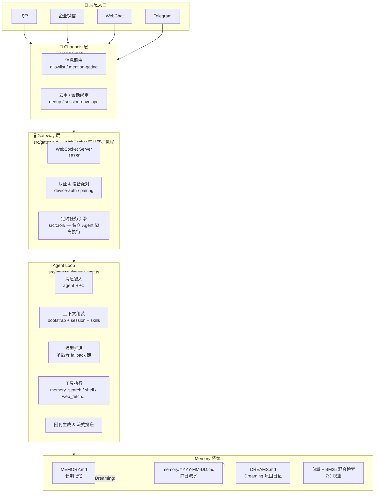
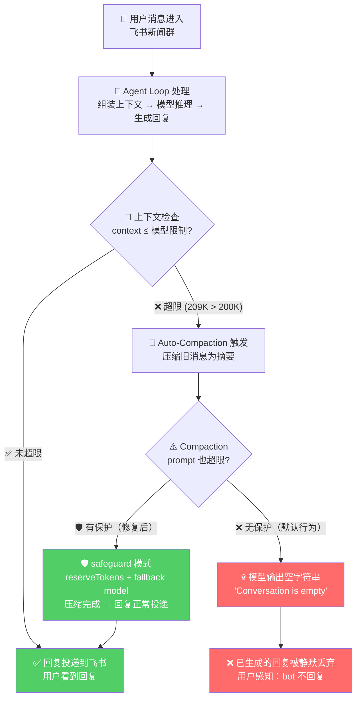
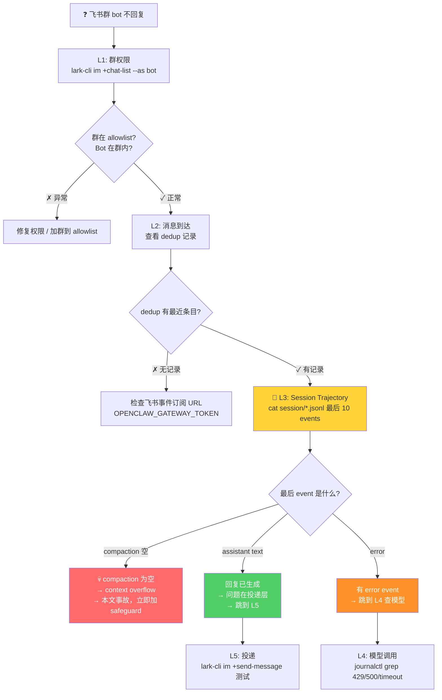
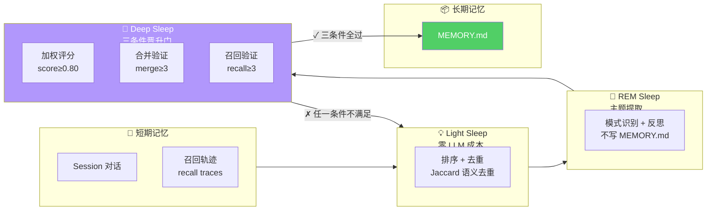

## 为什么是 OpenClaw

> 编程 Agent 的能力跃迁不只是"更强"--每次代际跃迁改变的是**验证循环的归属权**。Gen 1 补全时代（Copilot, 2021）：人类写、AI 补、人类验证--验证完全在人手里。Gen 2 对话时代（Cursor, 2023）：AI 生成代码块、人类审查 diff--验证仍以人为主，但 AI 开始做 lint/fix 的轻量自检。Gen 3 自治时代（Claude Code / Codex CLI / OpenClaw, 2025）：AI 写代码、AI 跑测试、AI 看报错、AI 修--验证循环从人转移到 harness。**整个 Outer Loop（模型外的一切：上下文管理、工具调用、验证、记忆巩固）开始比模型推理本身更决定系统质量**。OpenClaw 是这个趋势里记忆侧最激进、但 harness 稳定性最不足的一个。
>
> 同一代内还有一条关键分岔：**Vibe Coding**（Bolt.new、Lovable、Replit）把验证也扔给用户--"生成即交付"；**Engineering Rigor**（Claude Code、Aider、OpenClaw）则把验证编码进 harness--测试跑不过就重试。两者的差距不在模型，在 outer loop 的设计哲学。

先看一眼 OpenClaw 的整体架构——下面这张图会让你对它的运行方式有个直观印象，后面所有踩坑都跟这些组件有关：



OpenClaw 是 Gen 3 自治编程 Agent，跨模型 CLI，支持 DeepSeek / Anthropic / OpenAI 多后端。它最吸引我的一点是**记忆系统**——在当前所有生产可用的编程 Agent 中，它的记忆架构是最激进的：

- **PPO 认知权重自适应**：唯一的在生产工具中用强化学习调整记忆检索权重的系统。检索信号五维加权（recency 0.35 + frequency 0.25 + semantic 0.25 + saliency 0.15 + procedural 按需），随时间动态衰减
- **三重睡眠巩固**：Light Sleep（Jaccard 去重，零 LLM 成本）→ REM Sleep（置信度评分）→ Deep Sleep（三条件晋升门：score≥0.80 + merge≥3 + recall≥3），自动将短期经验固化为长期记忆
- **向量 + BM25 混合检索**（7:3）：比纯向量检索更鲁棒

但拉上生产环境跑了三周后，我的结论是：**记忆系统有多先进，踩的坑就有多深**。下面按时间线记录从部署到稳定全过程中真正折腾过的问题。

## 第一坑：启动失败三重奏

第一次在 VPS 上启动 OpenClaw Gateway，连续三种报错，每种原因都不一样。

**`gateway token missing`** — 最容易被忽略。OpenClaw 的 Gateway 模式需要独立的 `OPENCLAW_GATEWAY_TOKEN` 环境变量，不是飞书的 App Secret。systemd unit 文件里漏写一个 `Environment=` 就直接 401。

**`No credentials for provider`** — `auth-profiles.json` 里的 `keyRef` 必须和环境变量名精确匹配。一个字符对不上就报这个错，而且错误信息不会告诉你是哪个 keyRef 没匹配到，只能肉眼对。

**`400 InvalidParameter` / 模型不存在** — Omniroute 的模型名必须是 `<provider>/<model>` 格式。写成 `gpt-5.5` 会报 400，必须写 `codex/gpt-5.5`。再加上 OpenClaw 自己的 provider 前缀，最终是 `omniroute/codex/gpt-5.5`。三层前缀嵌套，少一层都不行。

```bash
# 排查时这三步最省时间
systemctl cat openclaw-gateway.service | grep Environment  # 检查环境变量
python3 -c "import json; json.load(open('/home/openclaw/.openclaw/openclaw.json'))"  # JSON 语法
journalctl -u openclaw-gateway.service -n 50 --no-pager | grep -iE "error|unauth"  # 看错误
```

## 第二坑：日志去哪了

OpenClaw 运行时日志**全部走 journald**，不写文件。`/tmp/openclaw/openclaw-*.log` 只在启动阶段有几行，运行时的错误全在 journald 里。我被这个坑了半小时——盯着文件日志 tail 了半天，什么都没看到，最后才意识到：

```bash
# 这才是正确的看日志方式
journalctl -u openclaw-gateway.service -f
```

## 第三坑（最严重）：Compaction 静默吞回复

这是这三周里最严重的一次事故。在说具体时间线之前，先看图理解 Compaction 在 Agent Loop 中的位置和失败路径：



一条正常的用户消息，Agent 已经生成了完整回复，但**用户什么都没收到**，bot 像死了一样安静。

### 时间线

- `01:43:40` 飞书新闻群用户发消息："失败请求占用到我们账户的请求资源的，麻烦方便的时候检修下程序中错误的请求参数"
- `01:43:57` Agent 生成了完整文本回复（session trajectory 里能看到 `message` event with assistant response）
- `01:44:00` Auto-compaction 触发：session context 已经到了 209K tokens，超过 primary model 的 200K 限制
- `01:44:00` **回复消失**：compaction 输出空摘要 `"Conversation is empty"`，session 结束，回复未投递到飞书
- 用户侧完全感知为"bot 不回复"

### 根因

Compaction 是一个**隐式中间层**。正常情况下它压缩上下文；但当上下文本身已经超过模型限制（209K > 200K），compaction prompt 也装不下完整上下文时，**模型输出空字符串**。OpenClaw 默认没有对此做保护——不报错、不降级、不通知，只是悄悄地把已生成的回复扔掉了。

这是 `middleware-semantic-leak` 的教科书级案例：中间层在极端情况下从"压缩上下文"变成了"丢弃回复"，语义完全翻转，且没有任何信号。

### 修复

两步，缺一不可：

```json
// openclaw.json
"compaction": {
  "mode": "safeguard",
  "reserveTokens": 20000,
  "keepRecentTokens": 16000
},
"model": {
  "fallbacks": ["deepseek/deepseek-v4-flash"]
}
```

`safeguard` 模式为 compaction 后的总结保留 token 预算，防止占用满窗口。而 fallback 到 `deepseek-v4-flash`（1M context window）则保证了即使主模型窗口不够，compaction 任务本身永不会超限。

### 通用教训

这不是 OpenClaw 专属的问题。任何带自动上下文压缩的 Agent 系统，都面临同样的风险：**compaction 的失败模式是静默的**。如果你的 Agent 突然不回复了，第三个要检查的就是 compaction——在 session trajectory 里找 compaction event 的 content 是否为空。

## 飞书消息不响应：五层排查法

这次事故之后，我沉淀了一套从外到内、按概率排序的排查链路。下次 bot 不回复，按这个顺序查：

| 层 | 检查点 | 怎么看 |
|---|---|---|
| L1 飞书应用层 | Bot 是否收到消息 | `lark-cli im +chat-list --as bot` 确认群在 allowlist |
| L2 事件接收层 | 消息是否到达 Gateway | 检查 dedup 记录是否有最近条目 |
| **L3 Session 层** | Agent 是否处理了消息 | **看 session trajectory 的最后 event**——这步最关键 |
| L4 模型调用层 | 模型是否正常响应 | journalctl grep 429/401/500/timeout |
| L5 投递层 | 飞书发送是否成功 | 用 CLI 直接发一条测试消息验证权限 |

以后再遇到消息不响应，按下面这个决策树走，先看 trajectory 的最后 10 行——八成问题在第三步就能定位：



## Outer Loop：为什么框架比模型更决定成败

有一个反直觉的数据点：OpenClaw + DeepSeek-R1-0528 在 Terminal-Bench 2.0 排名第一。不是最强的模型（当时 Claude Opus 推理更强），也不是最成熟的框架（Claude Code 的 harness 更稳定），但**组合反而是最优**。

这不是偶然。2025 年行业里一个收敛的认知是：**"Structure around the model matters more than cleverness inside the model."** 模型只负责生成，而**生成是便宜的**——真正决定系统质量的是 Outer Loop 里的三件事：

| Outer Loop 组件 | 做什么 | 失败时发生什么 |
|---|---|---|
| **验证（Verification）** | 编译器、测试套件、linter 检查输出 | AI 生成错误代码没人发现 |
| **上下文管理（Context Engineering）** | Compaction、pruning、memory flush | 就是本文的事故——静默丢回复 |
| **工具定义（ACI）** | Tool schema、参数约束、防呆设计 | 参数传错、文件写错路径、静默重试 |

这三层都**不在模型里面**——它们是你部署和维护的系统。Compaction 事故的根因不是模型不够聪明，是你没告诉 harness "当压缩失败时，不要扔回复，要报错"。

这也解释了为什么 Anthropic 观察到"最成功的 Agent 实现很少用复杂框架"——框架是别人写的 Outer Loop，你没法控制它的失败模式。OpenClaw 的多后端支持看起来是优势，但每个模型的 context window 不同、reasoning profile 不同、API 行为不同——**每多一个模型，compaction 的边界条件就多一组组合**，outer loop 的测试矩阵指数增长。

这引向一个更根本的结构性问题——记忆系统的路线分歧。

## OpenClaw vs Claude Code：记忆系统的路线分歧

OpenClaw 记忆系统最独特的机制是 **Dreaming 后台巩固**——它不是简单的"记下来"，而是有一个三阶段自动流水线：



跑了一段时间后，两个系统可以并排对比：

| 维度 | OpenClaw | Claude Code |
|---|---|---|
| 检索机制 | 向量+BM25 混合 (7:3) | LLM 语义判断 (Sonnet) |
| 权重进化 | **PPO 自适应** | 人工固定分类 |
| 巩固机制 | 三重睡眠 | 三门四阶段 AutoDream |
| 模型锁定 | 多模型 | 仅 Claude |
| 记忆分类 | 按时间（长期蒸馏/短期流水） | 按类型（user/feedback/project/reference） |
| 生产成熟度 | 早期 | 百万级 Agent 验证 |

OpenClaw 的记忆架构更"学术正确"——PPO 自适应权重、三重睡眠、混合检索，每一层都接近记忆系统前沿论文。Claude Code 看上去"更土"：记忆就是四类 Markdown 文件（user/feedback/project/reference），检索靠 Sonnet 语义判断，没有 PPO 也没有 BM25。

但这里有一个反直觉的结构事实：**文件记忆 > 向量记忆**。不是量化的"好一点"，是质的差异。工业界从 Claude Code、Codex CLI 到 Cursor，全部选择 Markdown 文件作为主记忆介质，向量只做辅助索引。为什么？因为编程场景下**确定性 > 概率检索**——你不能让 PPO 权重决定"要不要记住 API key 泄漏过"。

更大的问题在于：**记忆系统的先进程度和 Outer Loop 的稳定性是乘积关系，不是加法**。你的记忆检索算法再精准，如果 compaction 中间层悄悄把回复扔了，用户感知的不是"记忆不够好"，是"bot 死了"。OpenClaw 把 80% 的创新预算花在记忆侧（PPO、Dreaming、混合检索），但 Outer Loop 的防御侧（compaction safeguard、故障信号、降级路径）投入不足。Claude Code 反过来——记忆侧保守，但 harness 花了几百万 Agent 的实战验证。

这是选型时需要警惕的陷阱：**看 benchmark 时看的是模型+记忆的能力上限，但生产系统活在 Outer Loop 的下限里**。

## 总结：三个比踩坑更底层的判断

**1. Outer Loop 是新的护城河，不是模型。** 2025 年后，模型能力在快速趋同——Gemini 2.5 Pro 有 1M context、DeepSeek-V4 有 1M、GPT-5.5 有 200K。模型之间的差距在收敛，但 harness 质量（compaction safeguard、验证循环、降级路径、故障信号）的差距在拉大。本文的 compaction 事故就是证据——它不是"模型不够好"的问题，是 harness 少了一行配置。Claude Code 2026年1月 ARR 到 ~$2B，不是因为它用的 Claude 模型比别人聪明，是它的 outer loop 经过了百万级 Agent 的实战验证。

**2. 确定性优于概率性——在记忆、在路由、在故障处理。** OpenClaw 的 PPO 自适应权重和混合检索在论文上是对的，但当 compaction 静默失败时，用户不关心你的检索 recall 提高了多少。在系统边界上（compaction、fallback、错误处理），**确定性规则（rule-based）比概率规则（RL-based）更安全**。Claude Code 选"土"的分类法不是因为它不会做 PPO，是因为手工规则在"不丢东西"这件事上更可预期。

**3. 2025-2026 的行业趋势是 BYOK 和 harness 开源化。** 大量用户从 Cursor 迁移到 Claude Code CLI、Aider、OpenCode——不是因为这些工具功能更多，是因为 BYOK（Bring Your Own Key）让你**掌控 outer loop**。SaaS 工具的 compaction 策略、缓存策略、重试策略全是黑盒，出问题你只能等厂商修。而 OpenClaw 的 `openclaw.json` 里每一行配置你都能看到、能改、能版本控制。这也是 OpenClaw 真正的长期价值——不是记忆系统多先进，而是 **harness 完全透明**。
