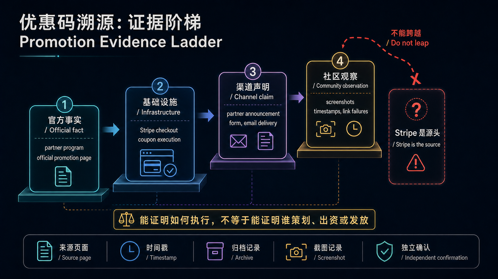
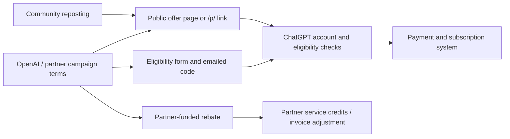

> [!WARNING]
> **Correction — July 29, 2026**
>
> The first version of this article combined three observations—a company name inside a promo code, a Stripe-hosted checkout, and community reposts—into a story that was too certain: Stripe's partner network issued the codes and employees of those companies leaked them. The available evidence does not establish that chain.
>
> The corrected finding is narrower: **OpenAI partner or channel campaigns are the best-supported upstream source. Stripe is payment and promotion-code infrastructure, not a proven campaign owner. Public links, eligibility-screened codes delivered by email, and partner-funded rebates coexist. There is also no evidence that OpenAI has globally retired company-level `/p/...` links.**

This revision keeps only claims supported by primary pages or reproducible timestamps, and separates:

- official facts;
- statements published by partners;
- community observations;
- unverified inference.

The diagram below defines the article's **evidentiary boundary**. It separates official facts, infrastructure capabilities, channel claims, and community observations. Its most important job is to prevent a leap from “Stripe can execute a discount” to “Stripe designed and distributed the campaign.”



## The short answer

1. **A real partner channel exists.** OpenAI publicly operates the [OpenAI Partner Network](https://openai.com/business/partners/) for co-selling, building, and delivering solutions. CodeStone announced that it joined the OpenAI SMB Channel Partner Programme, while First Focus announced an OpenAI Services Partner Agreement.
2. **There is no evidence that Stripe was the source.** Stripe supports subscription promotion codes, customer eligibility, first-order restrictions, expiration dates, and redemption limits. That explains how a discount can be enforced at checkout, not who designed, funded, or distributed the campaign.
3. **Public does not automatically mean leaked.** OpenAI itself hosts a public [Dropbox × ChatGPT Business offer](https://openai.com/business/partners/dropbox/). Think Technologies has also publicly promoted `chatgpt.com/p/THINK26` in company LinkedIn posts.
4. **Distribution has diversified, not uniformly switched.** AI Build now uses a work-email form, eligibility review, and email delivery. Public `/p/...` links still exist at the same time.
5. **linux.do recorded several different changes.** The end of an older first-month trial in late April, the failure of console-generated “Stripe long links” on June 4, and the status of partner promo links are separate events.

A reader's note that the current UK AI Build flow sends a code after review is therefore correct **for that specific channel**. The broader claim that OpenAI canceled all company-level shared links and converted every offer to a personal code is not supported. AI Build's page itself does not say that each code is bound to one person or that OpenAI globally retired public links.

## What the original article got wrong

| Original claim | Finding after review | Correction |
|---|---|---|
| “The real source is Stripe's enterprise partner network” | No primary evidence | “OpenAI partner/channel campaigns” is better supported; Stripe is only proven to be a technical layer |
| “Employees leaked internal codes” | Unverifiable, with public-marketing counterexamples | We can document community redistribution, not the identity or authorization of the first sharer |
| “Codes die by quota, never by date” | Stripe supports expiry, redemption limits, customer restrictions, and first-order restrictions | An “unable to use” message cannot identify the cause |
| “Every code represents OpenAI partner subsidy” | Directly contradicted by First Focus's current terms | Some benefits are funded by the partner and must be assessed campaign by campaign |
| “A matching region and code are enough” | Oversimplified | Account status, billing country, payment method, tax, and campaign eligibility may all matter |
| “Act immediately” | Poor advice | Verify audience, renewal price, seat count, and final checkout total first |

## How far can the source be traced?

### 1. Confirmed: OpenAI has a formal partner channel

The [OpenAI Partner Network](https://openai.com/business/partners/) describes co-selling, technical enablement, delivery, and a partner portal. That establishes a formal B2B channel.

Several branded code names also match companies that publish partner claims:

- [CodeStone's announcement](https://www.codestone.com/news/codestone-is-now-an-official-openai-partner/) says it joined the OpenAI SMB Channel Partner Programme and describes a formal commercial and technical relationship;
- [First Focus's announcement](https://www.firstfocus.com.au/insights/first-focus-becomes-an-openai-services-partner/) says it entered an OpenAI Services Partner Agreement for Australia and New Zealand;
- [AI Build's current offer page](https://www.ai-build.ltd/chatgpt-business/get-offer) describes the company as a UK OpenAI SMB Channel Partner and says its team reviews UK and Ireland eligibility.

This supports an association between branded codes and partner campaigns. A string inside a code still cannot prove that a particular public post was authorized, much less that an employee leaked it.

### 2. Confirmed: Stripe can execute a discount, but that does not make Stripe the campaign owner

[Stripe's official documentation](https://docs.stripe.com/billing/subscriptions/coupons) says merchants can create customer-facing promotion codes and restrict them by:

- customer;
- first-time order;
- expiration date;
- maximum redemptions;
- minimum order value.

[Stripe's Payment Links documentation](https://docs.stripe.com/payment-links/promotions) also describes prefilled promotion codes in shared links.

This explains why users encountered Stripe-hosted checkout and why the same code might work for one account but not another. It does not show that Stripe chose OpenAI's partners, funded the offer, or controlled distribution. The original article confused infrastructure with commercial origin.

### 3. Confirmed: a public link need not be a leak

OpenAI's own [Dropbox partner page](https://openai.com/business/partners/dropbox/) publicly advertises a limited-time ChatGPT Business offer: eligible Dropbox and ChatGPT users can use a promotional link to receive two Business seats and $50 in credits at no cost for 30 days.

A [Think Technologies company post](https://www.linkedin.com/posts/think-technologies_chatgpt-activity-7464703850562785281-TvQV) also publicly promotes a buy-one-get-one offer and provides `chatgpt.com/p/THINK26`.

As of July 29, 2026, opening:

```text
https://chatgpt.com/p/THINK26
```

still redirects to:

```text
https://chatgpt.com/?promoCode=THINK26
```

That confirms `/p/{slug}` remains a live redirect format. It **does not guarantee that a logged-in account qualifies or that inventory remains**, but it is enough to disprove the claim that OpenAI globally removed the link format.

## What did linux.do actually show was canceled?

Community records are useful evidence of what users saw at a particular time, but they are not OpenAI policy documents. Placing the reports side by side reveals several distinct events:

| Date | Reproducible record | What it supports |
|---|---|---|
| Apr 29 | Users report that a Team/Business first-month trial no longer appeared | One older trial ended; later partner campaigns are a separate question |
| May 8–10 | Company-branded 48-month codes spread widely; a May 9 thread preserves the `THINKTECHNOLOGIESUS` link | The community heavily amplified partner-branded codes |
| Jun 4 | Users report that a browser-console method for generating “Stripe long links” stopped working | A nonstandard checkout-link workflow changed or was restricted |
| Jun 11–14 | New-offer discussions continued, with uncertainty about long-link generation | Promo eligibility and long-link tooling did not share one state |
| Jun 30–Jul 1 | A public `penguinaius` link was posted and several users reported redemption outcomes | Public `?promoCode=` links continued circulating after June 4 |
| July | Think publicly promoted `/p/THINK26`, while AI Build used reviewed email delivery | Public links and targeted delivery coexisted |

The underlying community records are:

- [April 29: first-month trial reported gone](https://linux.do/t/topic/2079203)
- [May 9: 48-month offer discussion and preserved earlier link](https://linux.do/t/topic/2141860?page=2)
- [June 4: console-generated Stripe long links reported broken](https://linux.do/t/topic/2302827)
- [June 11: newer offers and uncertainty over long links](https://linux.do/t/topic/2380243)
- [June 30: public `penguinaius` link and user reports](https://linux.do/t/topic/2502020)

So “canceled” always needs an object. A specific batch of codes may have failed, one partner may have moved to reviewed email delivery, or a long-link technique may have stopped working. Those observations cannot be merged into a single global OpenAI policy.

## There is more than one distribution model



At least four patterns are visible:

1. **An official OpenAI public campaign.** The Dropbox page provides a public redemption entry point and lists eligibility such as new customers or former customers who canceled at least 90 days earlier.
2. **A public partner link.** Think Technologies publicly distributes `/p/THINK26`.
3. **A screened partner code.** AI Build asks for a work email and team size, reviews eligibility, and says it usually emails a code within one business day.
4. **A partner-funded rebate.** [First Focus's current offer](https://www.firstfocus.com.au/services/core/chatgpt/) explicitly says customers buy licenses directly from OpenAI while First Focus funds a rebate of up to 50% for the first six months through service credits or invoice adjustments. It is not an OpenAI discount.

The fourth pattern is particularly important: a “ChatGPT Business discount” is not necessarily a promotion code at checkout, much less a subsidy from OpenAI or Stripe.

## Price, duration, and failure conditions

The old article's £11, AU$25, US$20, and 48-month figures were observations tied to particular dates, regions, and accounts. They should not be presented as currently purchasable prices.

OpenAI's current [Business billing documentation](https://help.openai.com/en/articles/8792536-managing-billing-and-seats-in-chatgpt-business) gives the US self-serve baseline as:

- $25 per user per month on monthly billing;
- $20 per user per month on annual billing, billed annually;
- a minimum purchase of two standard ChatGPT seats;
- regional and local-currency variation.

“Unable to use this offer” can have several causes:

- the campaign expired or was deactivated;
- the maximum redemption count was reached;
- it is restricted to a customer or a first purchase;
- the account, region, or billing information is ineligible;
- it applies only to a new Business workspace;
- the checkout flow or product configuration changed.

Without campaign configuration or authoritative terms, an error message cannot prove that quota exhaustion was the cause. Before purchase, the issuer's latest terms and ChatGPT's final checkout page should control; verify renewal price, tax, seat count, and cancellation conditions.

## The corrected propagation claim

linux.do was clearly an important Chinese-language aggregation hub in May 2026. It preserved codes, screenshots, timestamps, and redemption reports, and it accelerated distribution. The evidence supports this:

> Partner-related campaigns reached public communities through intentional marketing, targeted distribution, or an unknown route, then forums and blogs amplified them.

It does not support this:

> Stripe issued codes to companies, employees leaked them, and linux.do reposted them.

The first statement stays within the evidence. The second remains an unverified story.

## A checklist for future investigations

1. Find the OpenAI or campaign issuer's original page before treating a forum screenshot as terms.
2. Separate `/p/...` short links, `?promoCode=...`, Stripe Checkout Sessions, and partner rebates.
3. Record page update time, country, account eligibility, seats, promotional period, and renewal price.
4. Keep “one code failed,” “one checkout trick failed,” and “the entire channel was canceled” separate.
5. Do not bypass eligibility or payment controls with region spoofing, console scripts, or dubious payment tools.
6. Mark first appearance, leaker identity, and funding source as unknown unless primary evidence establishes them.

## Final assessment

The original article got one broad pattern right: the branded codes were related to B2B partner channels, and linux.do was an efficient distribution node in the Chinese community.

The accurate version is:

**ChatGPT Business benefits come through multiple OpenAI or partner campaigns. Stripe supplies some of the payment and promotion-code machinery but is not a proven campaign source. Some partners moved to reviewed email delivery, while public offer pages and `/p/...` links still existed in July 2026. Audience, funding, expiration, and renewal rules must be verified for each campaign.**

*Research checked through July 29, 2026. OpenAI and partners can change offers at any time; the issuer's latest terms and the final checkout page govern.*
