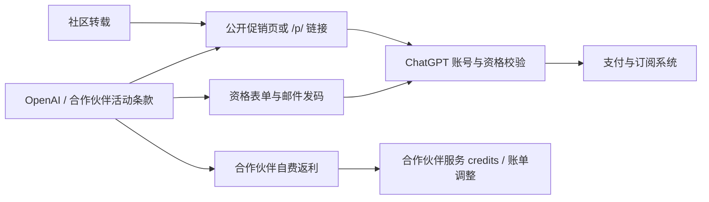

> [!WARNING]
> **更正说明（2026-07-29）**
>
> 本文初版把“公司名出现在优惠码中”“结账页由 Stripe 承载”和社区里的传播记录拼成了一条过于确定的故事：代码由 Stripe 合作伙伴网络发放，再由合作企业员工泄露。现有证据不足以支持这条因果链。
>
> 修订后的结论是：**这些活动更可靠的上游是 OpenAI 的合作伙伴/渠道活动；Stripe 是支付与促销码基础设施，而不是已被证实的活动发起方。公开链接、表单审核后邮件发码、合作伙伴自费返利等不同机制同时存在，也没有证据证明 OpenAI 已在全球统一取消公司级 `/p/...` 链接。**

这次重查只保留能够由一手页面或可复核时间戳支持的部分，并明确区分：

- 官方事实；
- 合作伙伴自己的声明；
- 社区用户的观察；
- 无法验证的推断。

下面这张图是全文的**证据边界**：它把官方事实、基础设施能力、渠道声明和社区观察分层，重点不是证明某个猜想，而是阻止我们从“Stripe 能执行优惠”跳到“Stripe 策划并发放优惠”。


## 先给结论

1. **合作伙伴渠道是真实存在的。** OpenAI 已公开建立 [OpenAI Partner Network](https://openai.com/business/partners/)，允许合作伙伴与 OpenAI 联合销售、构建和交付解决方案。CodeStone 也在 4 月宣布加入 OpenAI SMB Channel Partner Programme；First Focus 在 3 月宣布签署 OpenAI Services Partner Agreement。
2. **“Stripe 是源头”没有证据。** Stripe 确实支持订阅促销码、指定客户、首次购买、到期日和最大兑换次数等能力，但这只能说明结账系统如何执行优惠，不能说明谁策划、出资或发放了活动。
3. **“公开出现＝员工泄露”不成立。** OpenAI 自己有公开的 [Dropbox × ChatGPT Business 优惠页](https://openai.com/business/partners/dropbox/)。Think Technologies 也在公司 LinkedIn 内容中公开传播 `chatgpt.com/p/THINK26`。至少一部分链接显然是有意公开营销，而非泄露。
4. **发放方式正在分化，而不是被统一替换。** AI Build 当前采用“填写工作邮箱和团队规模—审核资格—邮件发码”的流程；与此同时，公开 `/p/...` 链接仍然存在。
5. **linux.do 证明了不同阶段发生过不同变化。** 4 月底的首月试用停止、6 月 4 日的控制台“Stripe 长链接”生成方式失效，与合作伙伴促销链接是否存在，是三个不同问题。

所以，对读者提醒“英国现在改为审核后邮件发码”，我认为**就 AI Build 这个渠道而言是对的**；但把它扩展成“OpenAI 已取消所有公司级共享链接，全部改为个人码”，目前并不成立。AI Build 的落地页本身也没有写“每个码仅绑定一人”或“OpenAI 已全局取消公开链接”。

## 旧文错在哪里

| 初版说法 | 复核结果 | 更正 |
|---|---|---|
| “真正源头是 Stripe 企业合作伙伴网络” | 无一手证据 | 更可靠的表述是“OpenAI 合作伙伴/渠道活动”；Stripe 只被证实为支付技术层 |
| “合作企业员工把内部码泄露出来” | 无法验证，且有公开营销反例 | 只能说公开社区进行了二次传播，不能推断首次发布者身份与授权状态 |
| “每个码都按固定配额关门，与日期无关” | Stripe 同时支持到期日、兑换上限、客户与首次购买限制 | 单凭“无法使用”无法判断具体失效原因 |
| “每个码都代表 OpenAI 的合作补贴” | 被 First Focus 当前条款直接反驳 | 有的优惠可能由合作伙伴自行出资，必须逐活动判断 |
| “英国 IP + 对应码即可” | 过度简化且会误导跨区尝试 | 资格、账单国家、付款方式、税费和账号状态均可能参与校验 |
| “蹲到就立刻上车” | 不负责任 | 应先确认受众、续费价、席位数和结账页最终金额 |

## 能把“源头”追到哪一层

### 1. 可以确认：OpenAI 有正式合作伙伴渠道

[OpenAI Partner Network](https://openai.com/business/partners/) 的公开说明包含联合销售、技术支持、交付和合作伙伴门户。这足以证明 OpenAI 存在正式 B2B 渠道体系。

带公司名的代码也与部分公司的公开身份相吻合：

- [CodeStone 的公告](https://www.codestone.com/news/codestone-is-now-an-official-openai-partner/)称其加入了 OpenAI SMB Channel Partner Programme，并把关系描述为正式的商业与技术合作；
- [First Focus 的公告](https://www.firstfocus.com.au/insights/first-focus-becomes-an-openai-services-partner/)称其已签署 OpenAI Services Partner Agreement，面向澳大利亚与新西兰帮助企业采用 ChatGPT Business；
- [AI Build 当前落地页](https://www.ai-build.ltd/chatgpt-business/get-offer)自称英国 OpenAI SMB Channel Partner，并说明由其团队审核英国、爱尔兰企业的资格。

这支持“代码与合作伙伴活动有关”，但仍然**不能单靠代码字符串**证明某次公开传播是获授权的，更不能证明是某位员工泄露。

### 2. 可以确认：Stripe 能执行优惠，但不能据此认定它发起优惠

[Stripe 官方文档](https://docs.stripe.com/billing/subscriptions/coupons)说明，商家可以创建面向客户的 promotion code，并设置：

- 指定客户；
- 首次购买资格；
- 到期时间；
- 最大兑换次数；
- 最低订单金额。

[Stripe Payment Links 文档](https://docs.stripe.com/payment-links/promotions)还说明，链接可以预填促销码。

这能解释为什么社区用户会看到 Stripe 托管的结账页，也能解释同一个代码为何可能因账号、时间或次数而失效。但 Stripe 提供工具，不等于 Stripe 决定了 OpenAI 的渠道名单、优惠预算或传播方式。旧文把“基础设施”误写成“商业源头”，这是最关键的错误。

### 3. 可以确认：公开链接不必然是泄露

OpenAI 官方的 [Dropbox 合作伙伴页面](https://openai.com/business/partners/dropbox/)明确公开了一个限时 ChatGPT Business 活动：符合资格的 Dropbox 和 ChatGPT 用户可通过促销链接兑换两个 Business 席位及 50 美元 credits，免费使用 30 天。

Think Technologies 的[公司 LinkedIn 帖文](https://www.linkedin.com/posts/think-technologies_chatgpt-activity-7464703850562785281-TvQV)也公开宣传 ChatGPT Business “买一送一”，并直接给出 `chatgpt.com/p/THINK26`。

截至 2026 年 7 月 29 日，直接访问：

```text
https://chatgpt.com/p/THINK26
```

仍会跳转到：

```text
https://chatgpt.com/?promoCode=THINK26
```

这说明 `/p/{slug}` 至少仍是有效的跳转格式。它**不保证登录后的账号一定符合资格，也不保证活动尚有名额**，但足以反驳“这类链接格式已被 OpenAI 全局撤销”的说法。

## linux.do 时间线：到底取消了什么

社区记录很有价值，但它记录的是用户当时“看见了什么”，不是 OpenAI 的正式政策。把几条时间线并排后，变化会清楚很多：

| 日期 | 可复核记录 | 能说明什么 |
|---|---|---|
| 4 月 29 日 | linux.do 用户报告 Team/Business 首月免费试用不再出现 | 一类旧试用活动停止；不等于后来合作伙伴促销也停止 |
| 5 月 8–10 日 | 大量品牌化 48 个月代码传播；5 月 9 日帖子保留了 `THINKTECHNOLOGIESUS` 的引用 | 社区在这一阶段集中扩散合作伙伴代码 |
| 6 月 4 日 | 用户报告通过浏览器 Console 生成“Stripe 长链接”的方法失效 | 一种非标准结账链接生成方式被改变或限制 |
| 6 月 11–14 日 | 仍有新优惠讨论，用户对“长链接”是否还能生成意见不一 | 代码、优惠资格和长链接工具并不是同一个状态 |
| 6 月 30 日–7 月 1 日 | `penguinaius` 公开链接被分享，多名用户报告兑换结果 | 6 月 4 日之后，公开 `?promoCode=` 形式仍在传播并被报告可用 |
| 7 月 | Think 公开宣传 `/p/THINK26`；AI Build 则改用审核后邮件发码 | 公开链接与定向发码并存 |

相关社区原始记录：

- [4 月 29 日：首月试用停止](https://linux.do/t/topic/2079203)
- [5 月 9 日：48 个月优惠讨论与旧帖引用](https://linux.do/t/topic/2141860?page=2)
- [6 月 4 日：Console 生成 Stripe 长链接失效](https://linux.do/t/topic/2302827)
- [6 月 11 日：新代码与长链接状态讨论](https://linux.do/t/topic/2380243)
- [6 月 30 日：公开 `penguinaius` 链接及用户回报](https://linux.do/t/topic/2502020)

因此，“取消了”必须带宾语：**可以说某一批旧码失效了、某个合作伙伴改成审核后发码了，或某种长链接生成办法失效了；不能把它们合并成 OpenAI 的一项全球政策。**

## 当前发放机制并不只有一种



目前至少能看到四种模式：

1. **OpenAI 官方公开活动。** Dropbox 页面公开提供兑换入口，并在 FAQ 中列明新客户或取消至少 90 天的旧客户等资格。
2. **合作伙伴公开链接。** Think Technologies 公开传播 `/p/THINK26`。
3. **合作伙伴先审核再邮件发码。** AI Build 要求提交工作邮箱和团队规模，并称通常在一个工作日内发码。
4. **合作伙伴自费返利。** [First Focus 当前活动](https://www.firstfocus.com.au/services/core/chatgpt/)明确写明：客户直接向 OpenAI 购买许可证，前六个月最高 50% 的返利由 First Focus 出资，以服务 credits 或账单调整交付，并非 OpenAI 折扣。

第四种模式尤其重要：它证明“优惠”甚至不一定是 ChatGPT 结账页里的 promotion code，更不能一概解释为 OpenAI 或 Stripe 在补贴。

## 价格、期限和“失效原因”应怎样写

旧文保存的 £11、AU$25、US$20 与 48 个月，是特定时间、地区和账号下的社区观察，不应继续作为可购买的当前报价。

OpenAI 当前[官方计费说明](https://help.openai.com/en/articles/8792536-managing-billing-and-seats-in-chatgpt-business)给出的美国自助 Business 基准价是：

- 月付：每用户每月 25 美元；
- 年付：每用户每月 20 美元，按年计费；
- 标准 ChatGPT 席位至少购买 2 个；
- 实际价格会随地区和本地货币变化。

一个优惠码显示“无法使用”，可能来自多种原因：

- 活动已到期或被停用；
- 达到最大兑换次数；
- 仅限指定客户或首次购买；
- 账号、地区或账单资料不符合资格；
- 活动只适用于新建 Business workspace；
- 结账流程或产品配置发生变化。

除非拿到该活动的后台配置或正式条款，否则无法仅凭报错断言“肯定是配额用完”。结账前应以发行方最新条款和 ChatGPT 最终结账页为准，同时核对续费价格、税费、席位数和取消条件。

## 修订后的传播判断

linux.do 确实是 2026 年 5 月中文圈的重要集散地：它保存了代码、截图、时间戳和用户回报，也让信息迅速扩散。但现有证据最多支持：

> 合作伙伴相关活动通过公开营销、定向发放或不明渠道进入社区，再被论坛和博客放大。

它不支持：

> Stripe 把代码发给企业，企业员工泄露，linux.do 再转发。

前一句是证据范围内的描述；后一句仍是一个未经证实的故事。

## 给以后调查同类活动的检查清单

1. 先找 OpenAI 或活动发行方的原始页面，不把论坛截图当正式条款。
2. 区分 `/p/...` 短链接、`?promoCode=...`、Stripe Checkout Session 和合作伙伴返利。
3. 记录页面更新时间、适用国家、账号资格、席位数、优惠期和续费价。
4. 把“某个码失效”“某种结账技巧失效”和“整个渠道被取消”分开。
5. 不通过跨区伪装、控制台脚本或来路不明的支付工具绕过资格与风控。
6. 对缺少一手证据的“首发”“泄露者”“资金来源”明确标注为未知。

## 最终结论

原文抓对了一个大方向：这些品牌化代码与 B2B 合作伙伴渠道有关，linux.do 则是中文社区的高效传播节点。

但更准确的表述应当是：

**ChatGPT Business 优惠来自多种 OpenAI 或合作伙伴活动；Stripe 提供了其中一部分支付与促销码能力，却不是已被证实的活动源头。部分合作伙伴转向资格审核后邮件发码，但公开优惠页和 `/p/...` 链接截至 2026 年 7 月仍然存在。每个活动的受众、资金来源、失效条件和续费规则都必须逐项核对。**

*本文复核截至 2026-07-29。OpenAI 与合作伙伴可以随时改变活动，最终以发行方最新条款和结账页为准。*
