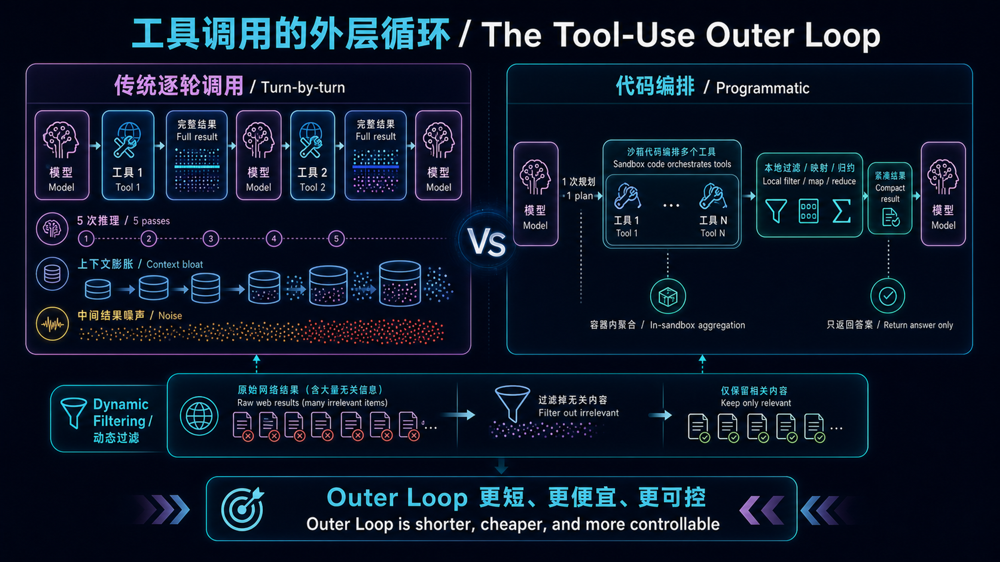
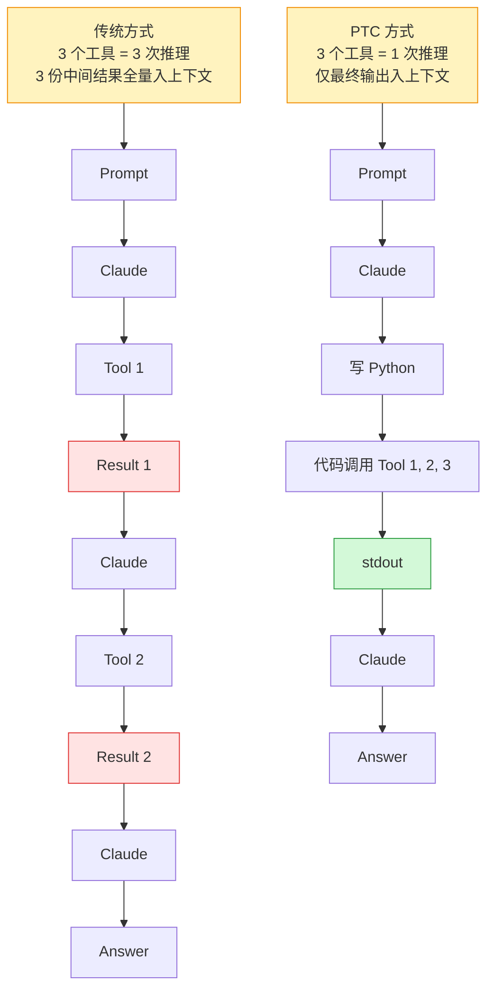
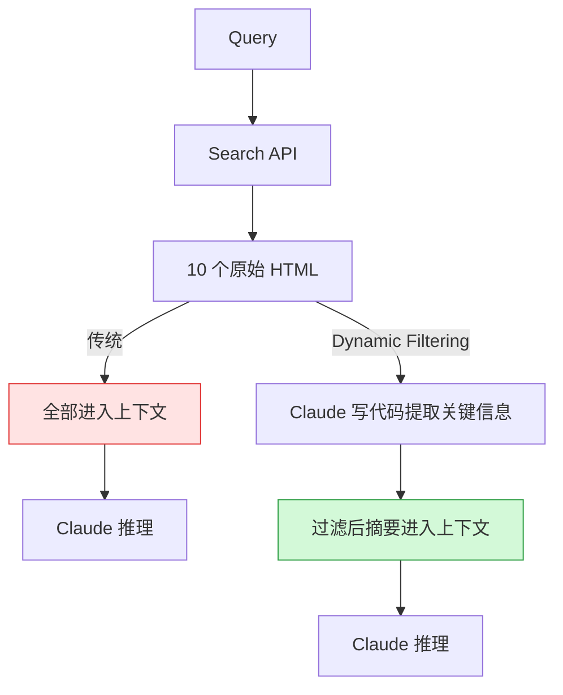

## 背景：Agent 工具调用的成本困境

在传统 Agent 工具调用模型中，每调用一个工具都需要完成一次"模型推理 → 工具执行 → 结果返回 → 模型再推理"的完整回合。这个看似自然的循环，在工具调用变多时会暴露出三个致命问题：

1. **上下文污染**：每个工具的结果都被原封不动地注入上下文窗口。查 20 个员工的报销记录，2000+ 条费用明细全部进入 context，即使你只需要知道"哪 3 个人超预算了"。
2. **推理开销**：每个工具调用都需要一次完整的模型推理。5 个工具调用 = 5 次推理 pass，每次几百毫秒到几秒不等。
3. **噪声导致准确率下降**：当上下文窗口塞满了中间结果，模型不得不在大量噪声中寻找信号。[Context Rot 研究](https://arxiv.org/abs/2509) 表明，LLM 在复杂任务上的性能会随上下文增长而下降 50-70%。

正如 Bruno 在 [Claude Code Architecture Guide](https://cc.bruniaux.com/guide/architecture/) 中所指出的：**"Outer Loop（模型外的一切：上下文管理、工具调用、验证、记忆巩固）开始比模型推理本身更决定系统质量。"**

Anthropic 在 2025 年 11 月到 2026 年 2 月间陆续推出的一系列工具使用增强功能，本质上都是为了解决 Outer Loop 的效率问题。其中 **Programmatic Tool Calling (PTC)** 和 **Dynamic Filtering** 是最具范式转移意义的两项。

下面这张图先建立全文的**成本模型**。左侧是每调一次工具就重新推理、重新注入完整结果的传统循环；右侧把编排、过滤和聚合留在沙箱中，只把最终答案送回模型。后文的性能数据与使用边界都可以映射回这条路径差异。



---

## Programmatic Tool Calling：用代码编排取代自然语言编排

### 核心范式转移

Michael Ridland 在 [Team 400 博客](https://team400.ai/blog/2026-03-claude-programmatic-tool-calling-ai-agents) 中一针见血地指出了传统工具调用的瓶颈：

> "每次 Agent 需要调用工具——查询数据库、检查 API、读取文件——都必须完成一个完整的模型往返。模型生成工具调用，你的代码执行它，结果返回模型，模型处理结果，然后可能生成下一个工具调用。重复。"

而 Programmatic Tool Calling 的范式转移在于：**Claude 不再一个一个地请求工具并等待结果回到上下文，而是写一段 Python 代码来编排所有工具调用，只把最终 `stdout` 注入到上下文窗口。**



这个概念看似简单，但它的含义深远——**它把编排逻辑从模型的"推理链"转移到了"代码执行环境"中。** 循环、条件判断、数据处理、错误处理都变成了显式的代码而非隐式的模型推理。Claude Lab 的 Masaki Hirokawa 在[生产实践指南](https://claudelab.net/en/articles/api-sdk/claude-api-programmatic-tool-calling-production-guide)中总结道：

> "Claude 写代码的能力极强。让它用 Python 表达编排逻辑而不是用自然语言，你获得的是更可靠、更精确的控制流。"

### 工作原理：容器内的代码编排

PTC 依赖 Code Execution 工具（沙箱容器）来运行：

1. **标记工具**：通过 `allowed_callers` 字段指定哪些工具可从代码中调用
2. **Claude 生成编排代码**：Claude 写出包含多步工具调用、数据处理、控制流的 Python 脚本
3. **容器执行并暂停**：当代码调用工具时，容器暂停，API 返回 `tool_use` block
4. **你提供工具结果**：结果返回给代码（而非模型上下文），代码继续执行
5. **仅最终输出回到 Claude**：所有中间结果被过滤，Claude 只看到 `stdout` 的最终输出

```json
{
  "tools": [
    {"type": "code_execution_20260120", "name": "code_execution"},
    {
      "name": "query_database",
      "description": "Execute SQL. Returns rows as JSON: id (str), name (str), revenue (float).",
      "input_schema": {...},
      "allowed_callers": ["code_execution_20260120"]
    }
  ]
}
```

关键在于 `allowed_callers` 字段，它有三个可选值：

| `allowed_callers` 值 | 含义 |
|---|---|
| 省略 / `["direct"]` | 仅传统方式调用 |
| `["code_execution_20260120"]` | 仅可从沙箱代码调用 |
| `["direct", "code_execution_20260120"]` | 两种方式均可（**不推荐**——会让 Claude 困惑） |

Bruno 在架构指南中强调了一个重要的安全提示：**`allowed_callers` 不是硬安全边界。** 它是一个强指导（Claude 被训练为尊重它），但你的客户端仍应为任何工具准备处理直接的 `tool_use` 请求。

### 容器生命周期

容器有 4.5 分钟的空闲超时和 30 天的最大生命周期。每次收到响应时都要检查 `expires_at` 字段。如果容器过期，Claude 会将工具调用视为超时并重试。

### 实际的性能数据

Claude Lab 提供了详细的基准测试对比：

```
基准: 10-URL 网络研究任务

传统工具调用:
  往返次数: 10 (1 次搜索 + 9 次页面抓取)
  推理次数: 11
  平均延迟: 45 秒
  Token 消耗: ~120,000 tokens

PTC:
  往返次数: 2 (1 次代码生成 + 1 次结果返回)
  推理次数: 2
  平均延迟: 8 秒 (并行抓取)
  Token 消耗: ~25,000 tokens
```

Anthropic 官方数据同样验证了这一点：

- 在复杂研究任务上，输入 token 消耗平均下降 **37%**（从 43,588 降至 27,297）
- 在 BrowseComp 测试上，准确率从 42% 提升至 **71%**（PTC 是关键解锁因素）
- 在含 75 个工具的项目管理 Agent 基准上，启用 PTC 后计费 token 减少约 **38%**，且任务准确率未下降

社区分析师 Shayan Tabe 的报告进一步证实了约 37% 的总体 token 削减，尽管这个数字尚未被 Anthropic 官方确认。

### 生产模式：四种 PTC 编程范式

PTC 真正的威力体现在四种具体的编程模式上，这些模式都可以在单次推理中完成：

#### 1. 批量处理 (Batch Processing)

```python
regions = ["West", "East", "Central", "North", "South"]
results = {}
for region in regions:
    data = await query_database(f"SELECT * FROM sales WHERE region = '{region}'")
    results[region] = sum(row["revenue"] for row in data)
top_region = max(results.items(), key=lambda x: x[1])
print(f"Top region: {top_region[0]} with ${top_region[1]:,}")
```

#### 2. 提前终止 (Early Termination)

```python
for endpoint in ["us-east", "eu-west", "apac"]:
    status = await check_health(endpoint)
    if status == "healthy":
        print(f"Found healthy endpoint: {endpoint}")
        break  # 不检查剩余 endpoint
```

#### 3. 条件工具选择 (Conditional Tool Selection)

```python
file_info = await get_file_info(path)
if file_info["size"] < 10000:
    content = await read_full_file(path)
else:
    content = await read_file_summary(path)
print(content)
```

#### 4. 数据过滤 (Data Filtering)

```python
logs = await fetch_logs(server_id)
errors = [log for log in logs if "ERROR" in log]
print(f"Found {len(errors)} errors")
for error in errors[-10:]:  # 只返回最后 10 条
    print(error)
```

这些模式的关键点在 Team 400 的 Michael Ridland 那里得到了强调：

> "如果 20 次数据库查询返回了 5000 行数据，但只有 3 个员工超预算，模型只会看到那 3 个员工。这可能是 100 倍的 token 削减。"

### 适用场景判断（含反模式警示）

Claude Lab 和 Anthropic 官方文档合起来给出了清晰的决策矩阵：

**强适用场景：**
- 处理大数据集且只需要聚合或摘要结果
- 运行 3 个或以上依赖工具调用的多步工作流
- 在 Claude 看到结果之前需要过滤、排序或转换工具结果
- 中间数据不应影响 Claude 推理的任务
- 跨多个项目运行并行操作（例如检查 50 个端点）

**弱适用场景：**
- 严格顺序的工作流，每一步都依赖 Claude 对上一结果的推理
- 少量工具调用且响应很小
- 需要用户在调用间立即反馈的工具

Anthropic 在 τ²-bench 上的内部评估揭示了 PTC 的盲区：在每轮只做 1-2 次顺序工具调用的航空/零售/电信领域测试中，PTC 没有改善分数，反而增加了约 8% 的成本。**顺序单调用工作流不会受益于 PTC。**

### 约束与陷阱

PTC 不是银弹，以下约束需要在架构阶段考虑：

| 约束 | 说明 |
|---|---|
| **不支持 ZDR** | 需要 Zero Data Retention 合规的场景无法使用 |
| **不兼容 MCP 工具** | 通过 MCP 连接器提供的工具不能以编程方式调用 |
| **不兼容 `strict: true`** | 结构化输出 (`strict: true`) 不能与 PTC 同时使用 |
| **不支持强制特定工具** | 不能通过 `tool_choice` 强制以编程方式调用特定工具 |
| **容器超时** | 如果工具执行太慢导致容器超时，Claude 会重试，可能产生重复调用 |
| **调试难度增加** | 出问题时需要检查代码执行输出而非逐步追踪 |

Michael Ridland 特别警告了调试问题：

> "当 PTC 出问题时，逻辑存在于生成的代码中。你需要检查代码执行输出来理解发生了什么。在你的系统中构建日志记录。"

---

## Dynamic Filtering：Web Search 的上下文瘦身革命

### 问题本质

Web 搜索是 token 消耗最大的任务之一。传统流程是：发起查询 → 获取搜索结果 → 抓取多个网页的完整 HTML → 在上下文中推理所有内容。但搜索到的上下文往往大量无关——导航栏、广告、页脚、推荐内容……

Anthropic 在[官方博客](https://claude.com/blog/improved-web-search-with-dynamic-filtering)中描述了解决方案：

> "Claude 的 web search 和 web fetch 工具现在会自动编写和执行代码来后处理查询结果。Claude 不再在完整 HTML 文件上推理，而是在加载到上下文之前动态过滤搜索结果，只保留相关的内容，丢弃其余部分。"

### 工作原理

Dynamic Filtering 本质上是 PTC 理念在 Web Search 场景的原生实现——让 Claude 写 Python 代码预处理搜索结果：



### 基准测试数据

Anthropic 在两个严格的基准测试上评估了 Dynamic Filtering：

**BrowseComp 数据集：**

| 模型 | 无过滤 | 有过滤 | 提升 |
|---|---|---|---|
| Sonnet 4.6 | 33.3% | 46.6% | **+13.3 pp** |
| Opus 4.6 | 45.3% | 61.6% | **+16.3 pp** |

**DeepSearchQA：** 测试 Agent 是否能系统地规划和执行多步搜索而不遗漏任何答案。

| 模型 | 无过滤 | 有过滤 | 提升 |
|---|---|---|---|
| Sonnet 4.6 (F1) | 52.6% | 59.4% | +6.8 pp |
| Opus 4.6 (F1) | 69.8% | 77.3% | +7.5 pp |

整体上，Dynamic Filtering 平均提高了 **11% 的准确率**，同时减少了 **24% 的输入 token**。

Poe by Quora 的内部团队验证了这些数据：

> "Opus 4.6 + Dynamic Filtering 在我们内部评估中取得了最高准确率。"—— Gareth Jones, Product and Research Lead at Quora
>
> "模型的行为像一个真正的研究者，编写 Python 来解析、过滤和交叉引用结果，而不是在上下文中推理原始 HTML。"

### 配置示例

```json
{
  "model": "claude-opus-4-6",
  "max_tokens": 4096,
  "tools": [
    {"type": "web_search_20260209", "name": "web_search"},
    {"type": "web_fetch_20260209", "name": "web_fetch"}
  ],
  "messages": [
    {
      "role": "user",
      "content": "Search for the current prices of AAPL and GOOGL, then calculate which has a better P/E ratio."
    }
  ]
}
```

注意：使用 `web_search_20260209` / `web_fetch_20260209` 版本时，Dynamic Filtering 在 Sonnet 4.6 和 Opus 4.6 上**默认开启**。如果不需要（比如为了 ZDR 合规），可以通过 `"allowed_callers": ["direct"]` 关闭。

**重要限制：** 基本版 `web_search_20250305` 有 ZDR 资格，但 Dynamic Filtering 版本因为依赖内部代码执行，默认不支持 ZDR。

---

## 三位一体：PTC + Tool Search + Tool Use Examples

Anthropic 的 Advanced Tool Use 实际上是三个互补功能的组合：

| 功能 | 解决的问题 | 使用场景 |
|---|---|---|
| **Tool Search Tool** | 工具定义太多导致上下文膨胀 | 50+ 个 MCP 工具的场景 |
| **Programmatic Tool Calling** | 中间结果污染上下文 | 3+ 步工具调用工作流 |
| **Tool Use Examples** | Schema 无法表达使用模式 | 复杂嵌套参数的工具 |

Bruno 在架构指南中给出了清晰的优先级建议：

> "先解决你最大的瓶颈：上下文被工具定义撑爆？→ Tool Search。大量中间结果污染上下文？→ PTC。参数错误频发？→ Tool Use Examples。"

### Tool Search：按需发现

一个真实的案例：在连接 5 个 MCP 服务器（GitHub 35 工具 + Slack 11 工具 + Sentry 5 工具 + Grafana 5 工具 + Splunk 2 工具）时，传统方式需要将全部 58 个工具定义预加载到上下文，消耗约 **55K tokens**。启用 Tool Search 后，只有 ~500 tokens 的搜索工具常驻上下文，匹配到的 3-5 个相关工具（~3K tokens）按需加载。**85% 的 token 开销被消除。**

内部测试显示：
- Opus 4 的工具选择准确率从 49% 提升至 **74%**
- Opus 4.5 从 79.5% 提升至 **88.1%**

### Tool Use Examples：教会 Claude 怎么用你的工具

JSON Schema 能定义结构，但无法表达：什么时候填入可选参数？哪些参数组合是合理的？你的 API 有什么约定？

```json
{
  "name": "create_ticket",
  "input_schema": { /* ... */ },
  "input_examples": [
    {
      "title": "Login page returns 500 error",
      "priority": "critical",
      "labels": ["bug", "authentication", "production"],
      "reporter": {
        "id": "USR-12345",
        "name": "Jane Smith",
        "contact": {"email": "jane@acme.com", "phone": "+1-555-0123"}
      },
      "due_date": "2026-06-13"
    },
    {
      "title": "Add dark mode support",
      "labels": ["feature-request", "ui"],
      "reporter": {"id": "USR-67890", "name": "Alex Chen"}
    },
    {
      "title": "Update API documentation"
    }
  ]
}
```

三个例子教会 Claude：
- 日期用 YYYY-MM-DD 格式，用户 ID 用 USR-XXXXX，标签用 kebab-case
- 严重 bug 需要完整联系信息 + 升级配置；功能请求有 reporter 但不需要 escalation；内部任务只需标题

Anthropic 内部测试：复杂参数处理的准确率从 **72% 提升至 90%**。

---

## 架构决策：何时部署，何时绕过

综合多篇文章的实践智慧，应该这样看待这套工具集的架构定位：

### 正确理解外层循环 (Outer Loop)

Bruno 在架构指南中提出了一个核心观点——**"Less scaffolding, more model"**（更少的脚手架，更多的模型信任）。这个哲学在 Claude Code 中体现为：

> "没有意图分类器。没有任务路由器。没有 RAG 管道。没有 DAG 编排器。没有 Planner/Executor 分离。模型本身决定何时调用工具、调用哪些工具、何时完成。"

PTC 和 Dynamic Filtering 延续了这个理念——它们不是添加新的抽象层，而是**减少不必要的抽象**：不需要把中间结果传给模型再等它"想"下一步，直接用代码完成编排。

### 模型兼容性

PTC 需要 `code_execution_20260120`，当前支持：

- Claude Opus 4.5+
- Claude Sonnet 4.5+
- Claude Fable 5 / Mythos 5

Dynamic Filtering 需要 `web_search_20260209`，在 Opus 4.6 / Sonnet 4.6 上默认开启。

### 部署检查清单

Team 400 给出了实用的四步部署法：

1. 在 API 调用中启用代码执行工具
2. 为应从代码调用的工具添加 `allowed_callers`
3. 用需要多次工具调用的提示进行测试
4. 对比传统方法和 PTC 方法的延迟、token 使用和输出质量

Bruno 特别强调了一个容易踩的坑：**不要给同一个工具同时设 `["direct", "code_execution_20260120"]`**。选一个——这会给 Claude 提供关于最佳使用方式的更清晰指导。

---

## 总结

Programmatic Tool Calling 和 Dynamic Filtering 代表了 Agent 架构中一个重要的范式转移：**从"一切经过模型推理"转向"代码编排 + 按需过滤"**。

这不是 Anthropic 凭空创造的概念——它是对一个已经被实践反复验证的原则的系统化落地：**让模型做它最擅长的事（推理和决策），让代码做代码最擅长的事（循环、过滤、并行执行）。**

两者的本质差异：

| 维度 | 传统工具调用 | PTC / Dynamic Filtering |
|---|---|---|
| 编排逻辑位置 | 模型的推理链 | Python 代码 |
| 中间结果去向 | 全部进入上下文 | 被代码过滤，不入上下文 |
| N 次工具调用的推理次数 | N+1 | 1~2 |
| Token 消耗 | 随调用数线性增长 | 大幅削减（37%~80%） |
| 调试方式 | 逐步追踪每个回合 | 检查代码执行输出日志 |
| 适合任务 | 简单查找、需人对中间结果决策 | 批量处理、数据聚合、多步研究 |

这篇文章综合了以下来源（均非 AI 生成，为人类工程师的分析和官方文档）：

- [Anthropic Engineering: Introducing advanced tool use](https://www.anthropic.com/engineering/advanced-tool-use)（官方博客，2025.11）
- [Claude Blog: Improved Web Search with Dynamic Filtering](https://claude.com/blog/improved-web-search-with-dynamic-filtering)（官方博客，2026.02）
- [Claude API Docs: Programmatic tool calling](https://platform.claude.com/docs/en/agents-and-tools/tool-use/programmatic-tool-calling)（官方文档）
- [How Claude Code Works: Architecture & Internals](https://cc.bruniaux.com/guide/architecture/)（Florian Bruniaux 技术分析，2026.02）
- [Claude Lab: PTC Production Guide](https://claudelab.net/en/articles/api-sdk/claude-api-programmatic-tool-calling-production-guide)（Masaki Hirokawa 生产实践，2026.03）
- [Team 400: Why PTC Matters for AI Agent Performance](https://team400.ai/blog/2026-03-claude-programmatic-tool-calling-ai-agents)（Michael Ridland 实战分析，2026.03）
