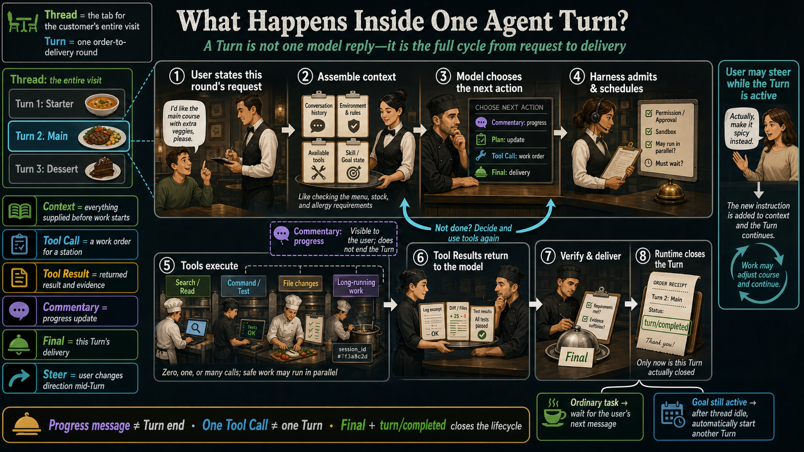
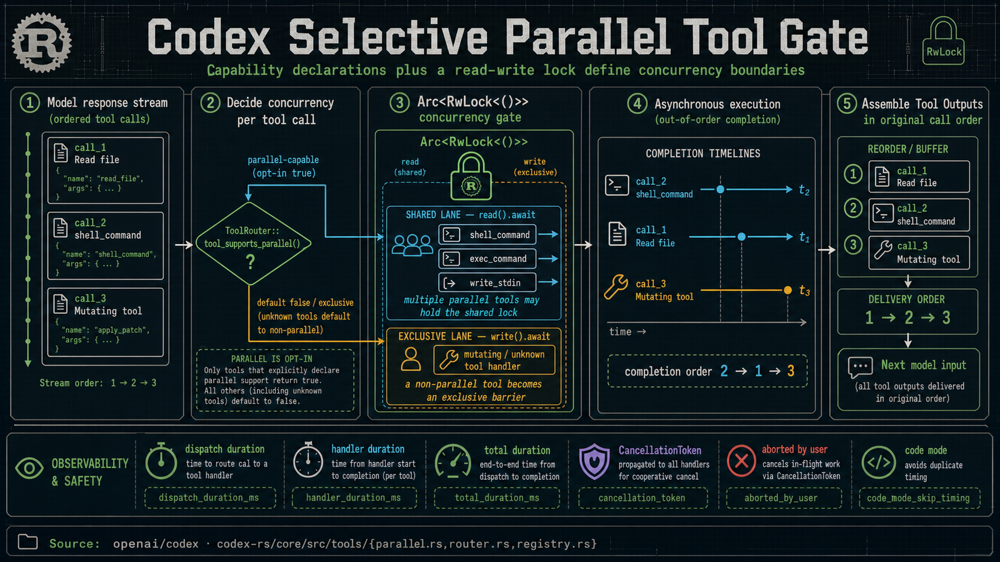
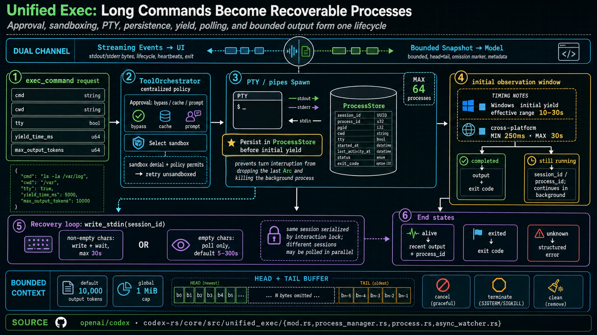
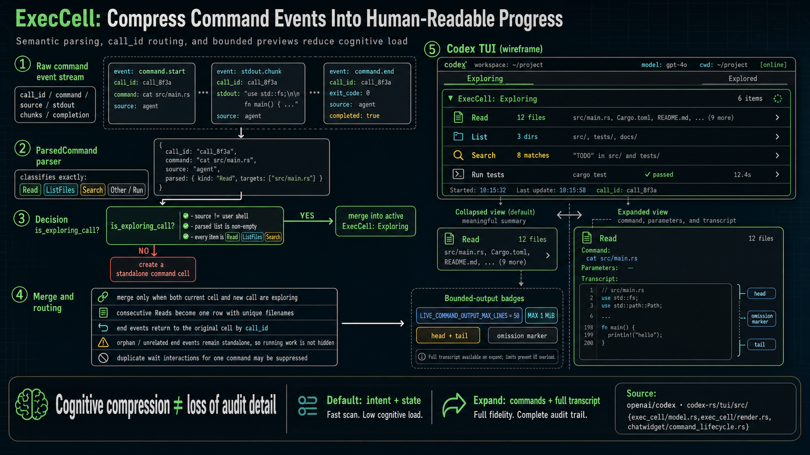
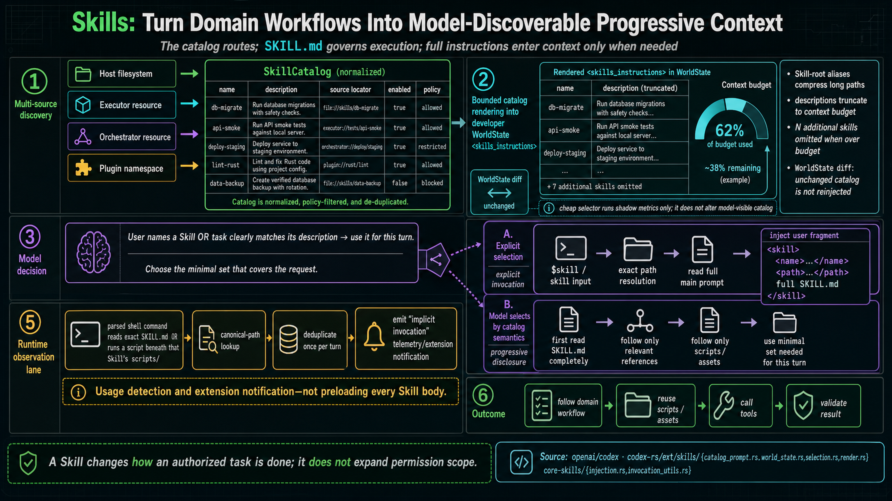
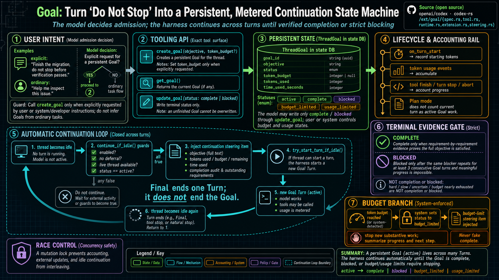
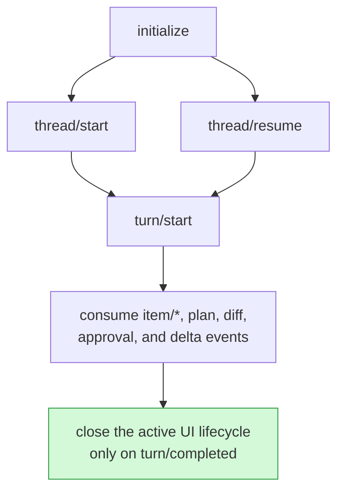

Many agent tutorials reduce the loop to this:

```python
while True:
    response = model(messages, tools)
    if response.tool_calls:
        messages += execute(response.tool_calls)
    else:
        return response.text
```

The loop is valid, but it omits the hard product questions. Can several work orders start together? Who keeps custody of a test that runs for ten minutes? Should every status check interrupt the user? Could “still inspecting” be mistaken for delivery? Can the system find the right manual when the user does not know its name? When the user explicitly says “do not stop,” how does the job survive multiple shifts?

For this article I read the official [openai/codex](https://github.com/openai/codex) Rust implementation at commit [`bb5054f`](https://github.com/openai/codex/commit/bb5054fe47abe73ecbbd454751066a28c89f4bb9). The component names, branches, and constants below come from that source rather than guesses from the UI. The product will continue to evolve, but the code already answers a durable engineering question: **what should an enterprise agent harness take off the model's shoulders?**

### Start Here: What Actually Happens Inside One Agent Turn?

Treat one complete restaurant visit as a Thread—the tab for the entire case. Starter, main course, and dessert can be separate Turns. Each Turn is the complete cycle from “the user requests this round of work” to “the result of this round is actually delivered.”



Following the diagram, a Turn usually contains six parts:

1. The user states the request while the runtime assembles conversation history, environment rules, available tools, and Skill/Goal state.
2. The model chooses a next action: progress commentary, a plan update, a Tool Call, or a direct Final.
3. Before a tool runs, the harness checks permission, isolation, parallel admission, and waiting rules, then dispatches the appropriate station.
4. Tool Results return evidence to the model. If work remains, the model decides again and may call more tools. One Turn can therefore contain zero, one, or many Tool Calls.
5. The user may steer an active Turn. Commentary is visible progress, but it does not close the lifecycle.
6. After verifying requirements and evidence, the model produces Final and the runtime emits `turn/completed`. Only then is this Turn closed. If a Goal remains active, thread idle may automatically begin another Turn.

You do not need to memorize the Rust names that follow. First place each term in the picture—as context, work order, station, returned evidence, progress update, or delivery—and the source becomes much easier to follow.

## 1. Parallel Work Uses a Library-Style Access Gate

Imagine a library. Many readers can enter the reading room together because they are only looking at books. If a librarian must move shelves and renumber the collection, everyone else briefly waits; otherwise a book could move while somebody is using it.

Codex uses the same idea. One model response may contain several tool calls—several work orders—but the runtime does not blindly `spawn`, or start, all of them. [`ToolCallRuntime`](https://github.com/openai/codex/blob/bb5054fe47abe73ecbbd454751066a28c89f4bb9/codex-rs/core/src/tools/parallel.rs) is the attendant at the door. `Arc<RwLock<()>>` is the shared access gate. The Rust spelling is unimportant; it offers two kinds of admission:

- “Reader admission”: proven parallel-safe stations share the room and work together.
- “Librarian admission”: a station that may affect shared state gets the only key, making everyone else wait.
- A new handler—the station doing the work—has no parallel pass by default; safety must be declared explicitly.
- `shell_command`, `exec_command`, and `write_stdin` are source examples that explicitly request the parallel pass.



The kitchen may finish ticket three before ticket one, but the waiter still returns results to the model in original ticket order. Tests explicitly verify this stable delivery.

The timers along the bottom also have ordinary meanings. `dispatch duration` is queueing and assignment time. `handler duration` is time spent doing the actual work. `total duration` covers the entire trip from receipt to completion. A `CancellationToken` is a site-wide stop-work announcement; some stations are allowed to clean up before reporting `aborted by user`.

The transferable design is not specifically Rust's `RwLock`. It is the contract:

1. Parallelism is a declared tool capability, not a privilege inferred from confidence.
2. The default is conservative; only proven-safe handlers opt in.
3. Execution may be asynchronous, while model context remains stable, ordered, and replayable.

A prompt that says “parallelize when possible” cannot provide those guarantees. The model identifies potentially independent work; the harness owns the actual boundary.

## 2. Long Commands Work Like Taking a Number at a Service Desk

At a public service counter, a quick request can finish while you wait. A request needing thirty minutes is first registered, then you receive a claim number. You can leave the counter and check later without losing the case or blocking everybody behind you.

Codex [`unified_exec`](https://github.com/openai/codex/tree/bb5054fe47abe73ecbbd454751066a28c89f4bb9/codex-rs/core/src/unified_exec) turns long commands into that kind of registered case rather than a one-shot `command → stdout` exchange:

1. `ToolOrchestrator` is the intake desk: it checks approval and chooses an isolated work area, or sandbox.
2. A PTY or plain pipes are the communication line used to receive output or send characters.
3. `ProcessStore` is the case ledger. **Codex registers the process before yielding the counter**, so an interrupted turn cannot make the background job disappear.
4. A quick job returns its result. A long one returns a `session_id/process_id`—the claim number.
5. `write_stdin` means returning with that number. It can add input or ask “is it done?” with an empty poll. One case accepts one interaction at a time; different cases can be checked together.

The desk also has a sensible checking schedule rather than asking every second. The source defines an initial observation window of 250–30,000ms, with a ten-second floor on Windows. A write waits at most thirty seconds; a status-only poll can quietly wait 5–300 seconds.

If output is enormous, the model does not receive the entire paper roll. It gets about 10,000 tokens by default under a 1MiB cap. A head-tail buffer works like an incident summary that preserves “how it began” and “how it ended” while clearly marking the omitted middle.



Observability still does not mean handing the user every line from the printer. Codex TUI [`ExecCell`](https://github.com/openai/codex/blob/bb5054fe47abe73ecbbd454751066a28c89f4bb9/codex-rs/tui/src/exec_cell/model.rs) behaves more like a parcel-tracking app: many scanner events can collapse into one understandable “in transit” card.

The source groups only viewing operations—`Read`, `ListFiles`, and `Search`—under `Exploring`. Other commands stay separate. A `call_id` is the parcel tracking number: a completion event must return to its original card. An event without a matching number remains standalone rather than being attached to the wrong job and hiding unfinished work.



Consecutive reads become one row with unique filenames, repeated wait records may be suppressed, and live preview is capped at 50 lines and 1MiB with beginning and ending retained. Users see where the agent looked and what state it reached; they expand the full transcript only for diagnosis.

Commentary follows the same rule. “Plumbing is complete; tiling has started” is a construction update, not the handover of the building. App Server [`AgentMessage.phase`](https://github.com/openai/codex/blob/bb5054fe47abe73ecbbd454751066a28c89f4bb9/codex-rs/app-server-protocol/src/protocol/v2/item.rs) separates progress from final answer, and `turn/completed` confirms that one round is actually closed. **Text can reassure the user without forcing the agent to stop.**

## 3. Skills Work Like a Menu Plus an Operating Manual

A restaurant menu tells you what dishes exist and what they are like; it does not print every complete recipe. The chef opens a recipe only after a dish is selected.

Codex uses the same split. `SkillCatalog` is the menu. `SKILL.md` is the operating manual. The [`skills` extension](https://github.com/openai/codex/tree/bb5054fe47abe73ecbbd454751066a28c89f4bb9/codex-rs/ext/skills/src) combines Host, Executor, Orchestrator, and Plugin sources, then posts only names, descriptions, and manual locations on the model's noticeboard—called WorldState in the source.

The noticeboard is finite. Long addresses receive aliases, long descriptions are shortened, and an overfull catalog explicitly says `N additional skills omitted`. A WorldState diff resembles posting only a changed notice instead of replacing the entire board every morning. The cheap-selector experiments in source currently measure in shadow; they do not secretly alter the model's menu.



[`catalog_prompt.rs`](https://github.com/openai/codex/blob/bb5054fe47abe73ecbbd454751066a28c89f4bb9/codex-rs/ext/skills/src/catalog_prompt.rs) tells the model: if the user names a manual **or the task clearly matches a menu description**, use it for this turn. Read `SKILL.md` completely, then retrieve only the references, scripts, or templates that manual says are relevant.

An explicit Skill selection delivers the complete manual at its exact address. If the model opens a `SKILL.md` itself or runs one of its scripts, [`invocation_utils.rs`](https://github.com/openai/codex/blob/bb5054fe47abe73ecbbd454751066a28c89f4bb9/codex-rs/core-skills/src/invocation_utils.rs) works like a library checkout scanner: it recognizes which manual was actually used, deduplicates that implicit invocation within the turn, and records it. Detection does not mean every manual was preloaded.

This is useful enterprise context engineering: users state outcomes, a low-cost directory helps the model discover the workflow, and domain rules consume context only when needed. The boundary remains explicit: **a Skill can change how an authorized task is performed; it does not expand permission scope.**

## 4. Goal Is a Project Order That Survives Shift Changes

Imagine a repair project passed across three shifts. If the objective exists only on the first technician's sticky note, the next shift may conclude, “I fixed one part, so I am done.” A durable project order instead records the objective, budget, time spent, and acceptance criteria in one central file.

“Finish the migration and do not stop before verification passes” asks for that kind of handoff. Leaving it only in chat history makes it vulnerable to long execution, retries, and compaction.

The Codex [`goal` extension](https://github.com/openai/codex/tree/bb5054fe47abe73ecbbd454751066a28c89f4bb9/codex-rs/ext/goal/src) creates a persisted `ThreadGoal` project order containing objective, status, budget, usage, and time. `create_goal` opens the order, `get_goal` checks it, and `update_goal` records a terminal state. The rules prevent every small request from becoming an endless project:

- Create a Goal only when the user or system/developer instructions explicitly request one; do not infer it from ordinary work.
- Set `token_budget` only when explicitly requested.
- Through `update_goal`, the model can write only `complete` or `blocked`.
- Complete requires requirement-by-requirement evidence that the full objective is achieved.
- Blocked requires the same blocker across at least three consecutive Goal turns and no remaining path to meaningful progress.



The model does not continue by repeatedly remembering the phrase “do not stop.” When one shift ends and the thread becomes idle, [`on_thread_idle`](https://github.com/openai/codex/blob/bb5054fe47abe73ecbbd454751066a28c89f4bb9/codex-rs/ext/goal/src/extension.rs) invokes `continue_if_idle()`. Think of it as the shift supervisor's checklist: is the project enabled, not deferred, still attached to a live worksite, and still active? If yes, the system hands the full objective, remaining budget, and acceptance checklist to the next shift, then `try_start_turn_if_idle()` opens another Goal turn.

Final is therefore an end-of-shift report, not automatic project completion. Tool completion, turn stop, abort, and token events update the ledger. Reaching the budget resembles exhausting prepaid labor: the system sets `budget_limited`, stops new substantive work, and requests a status and next step rather than fake acceptance. A mutation lock is the rule that only one clerk edits the master ledger at a time, preventing accounting, outside changes, and automatic handoff from overwriting one another.

This is the clean boundary between model intelligence and harness design. The model interprets an explicit persistent objective and constructs its structured form; the runtime ensures that state, continuation, metering, and termination evidence do not depend on model memory alone.

## 5. Enterprise Adoption Starts With “Who Decides, Who Enforces?”

The implementation can be summarized as a division of responsibility:

| Question | Model owns | Harness owns |
| --- | --- | --- |
| Which work may be independent? | Judge semantic dependencies | Issue parallel passes, close the gate when necessary, return stable result order |
| When should long work be checked? | Choose meaningful checkpoints | Keep process custody, issue claim numbers, support cancellation, bound output |
| What should the user see? | Write concise progress | Fold events into readable cards while retaining the full record |
| When should domain rules load? | Select a Skill from catalog meaning | Bound the menu and supply the complete manual after selection |
| Should work persist until an outcome? | Recognize explicit Goal intent | Preserve the project order, hand off shifts, meter budget, verify acceptance |

To embed the same runtime in an IDE or enterprise product, think of [Codex App Server](https://learn.chatgpt.com/docs/app-server) as a standardized front desk. Your product need not rebuild the entire workshop; it submits work through standard forms and receives progress, approval requests, and results. Technically those forms use bidirectional JSON-RPC and expose Threads (whole cases), Turns (rounds of work), Items (events or artifacts), Skills, Goals, and approvals.



Clients can use `skills/list` to build a capability picker or send a structured `skill` item in `turn/start`. They can manage Goals through `thread/goal/*` and correct active work with `turn/steer`. The remote WebSocket transport remains experimental; production clients should pin the Codex version and generate TypeScript types or JSON Schema from that exact build.

The durable conclusion is simple:

> Let the model make semantic judgments. Turn concurrency, time, state, permission, observability, and termination evidence into protocols the harness can enforce.

That will improve reliability and user experience more than merely adding tools. Before shipping, an enterprise agent team should be able to answer: Where is concurrency admitted? Who persists long processes? How is duplicate polling suppressed? What separates progress from Final? How do domain rules enter context only when needed? How does “do not stop” survive turns? Which evidence supports completion?

## Source Index

- [Selective parallelism: parallel.rs](https://github.com/openai/codex/blob/bb5054fe47abe73ecbbd454751066a28c89f4bb9/codex-rs/core/src/tools/parallel.rs), [router.rs](https://github.com/openai/codex/blob/bb5054fe47abe73ecbbd454751066a28c89f4bb9/codex-rs/core/src/tools/router.rs), and [registry.rs](https://github.com/openai/codex/blob/bb5054fe47abe73ecbbd454751066a28c89f4bb9/codex-rs/core/src/tools/registry.rs)
- [Unified Exec](https://github.com/openai/codex/tree/bb5054fe47abe73ecbbd454751066a28c89f4bb9/codex-rs/core/src/unified_exec)
- [TUI ExecCell](https://github.com/openai/codex/tree/bb5054fe47abe73ecbbd454751066a28c89f4bb9/codex-rs/tui/src/exec_cell) and [command_lifecycle.rs](https://github.com/openai/codex/blob/bb5054fe47abe73ecbbd454751066a28c89f4bb9/codex-rs/tui/src/chatwidget/command_lifecycle.rs)
- [Skills extension](https://github.com/openai/codex/tree/bb5054fe47abe73ecbbd454751066a28c89f4bb9/codex-rs/ext/skills/src) and [core-skills](https://github.com/openai/codex/tree/bb5054fe47abe73ecbbd454751066a28c89f4bb9/codex-rs/core-skills/src)
- [Goal extension](https://github.com/openai/codex/tree/bb5054fe47abe73ecbbd454751066a28c89f4bb9/codex-rs/ext/goal/src)
- [Codex App Server](https://learn.chatgpt.com/docs/app-server)

> Source and documentation checked on 2026-08-03. This article explains the public implementation at the pinned commit, not a permanent API guarantee for every future release.
