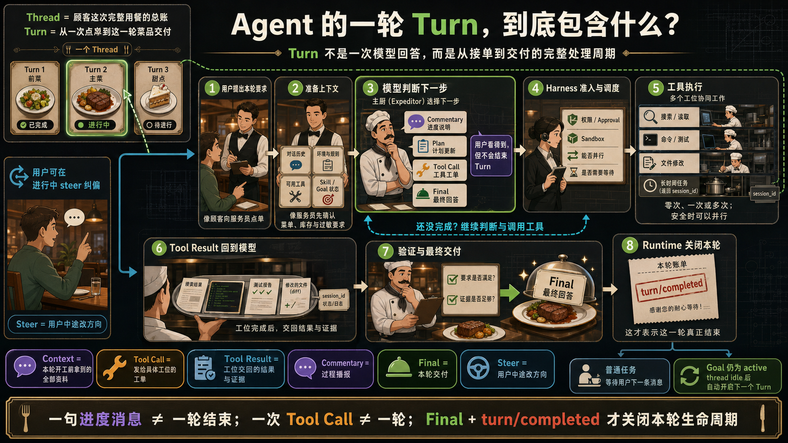
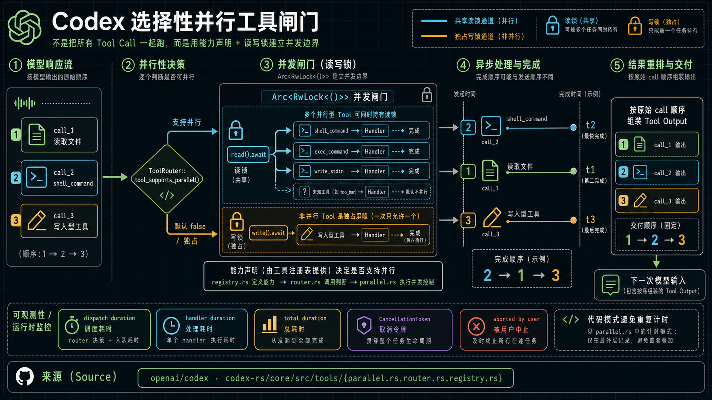
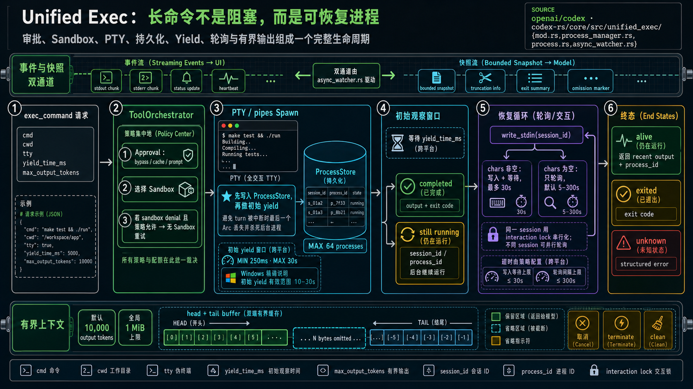
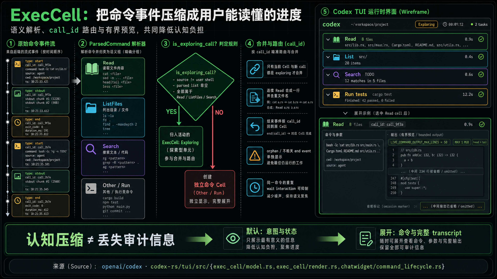
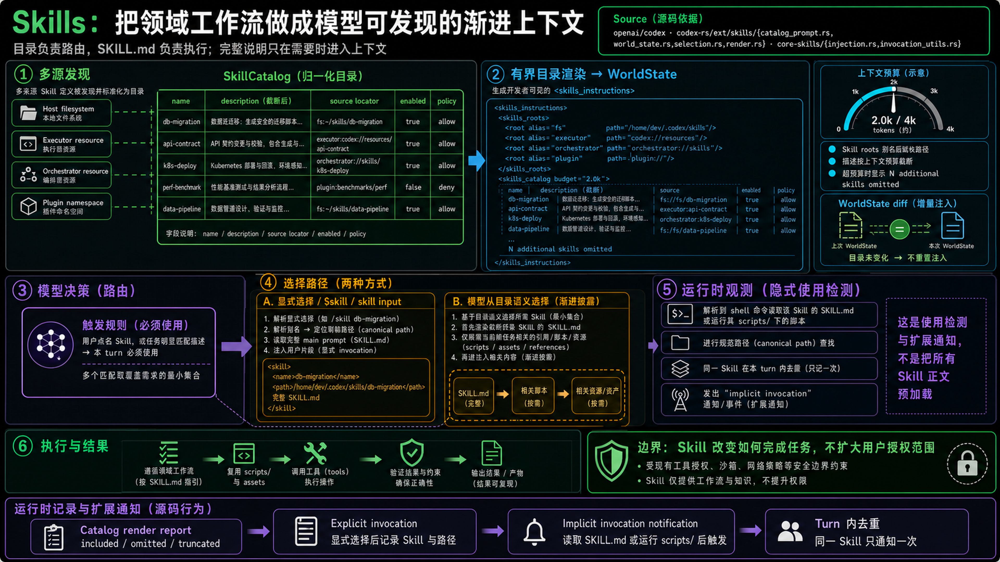
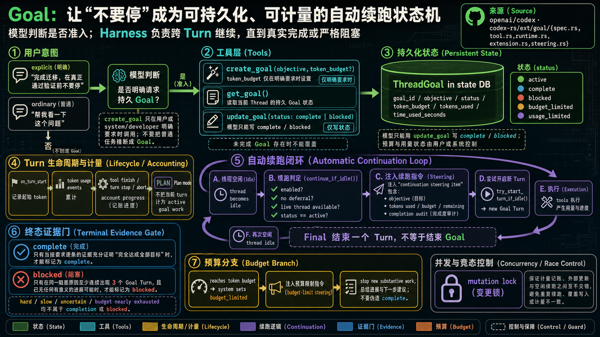
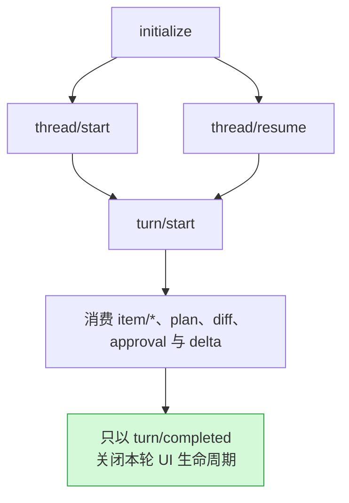

很多 Agent 教程只有这样一个循环：

```python
while True:
    response = model(messages, tools)
    if response.tool_calls:
        messages += execute(response.tool_calls)
    else:
        return response.text
```

它没有错，只是省略了真正困难的部分：几张工单能否同时开工？测试十分钟不退出时由谁保管现场？每次查看进度是否都要打扰用户？一句“还在检查”会不会被误认为已经交付？用户不知道操作手册叫什么时，系统能否主动找到？用户明确说“不要停”后，任务怎样跨越多轮处理仍不丢失？

这次我没有再从界面现象反推实现，而是阅读了官方 [openai/codex](https://github.com/openai/codex) 仓库在 commit [`bb5054f`](https://github.com/openai/codex/commit/bb5054fe47abe73ecbbd454751066a28c89f4bb9) 的 Rust 源码。下文的组件名、状态分支和数值都能在对应源码中找到；产品未来仍可能演进，但这些设计已经足够回答一个问题：**企业 Agent Harness 应该替模型承担什么？**

### 先看懂：Agent 的一轮 Turn 到底做了什么

把一次完整用餐看成一个 Thread：它是整件事情的总账。前菜、主菜和甜点可以是不同 Turn；每个 Turn 都是从“用户提出这一轮要求”到“这一轮结果真正交付”的完整周期。



顺着图走，一轮通常包含六件事：

1. 用户提出本轮要求，Runtime 同时准备对话历史、环境规则、可用工具以及 Skill/Goal 状态；
2. 模型判断下一步，可以播报进度、更新计划、开出 Tool Call（工具工单），也可以直接给 Final；
3. 若调用工具，Harness 先检查权限、隔离环境、并行与等待规则，再让相应工位执行；
4. Tool Result（工具结果和证据）返回模型。事情没做完时，模型会继续判断并再次调用工具，所以一次 Turn 可以包含零次、一次或多次 Tool Call；
5. 用户在进行中可以 steer（纠偏）；Commentary（进度播报）用户看得到，但不会关闭 Turn；
6. 模型验证要求和证据后给出 Final，Runtime 再发出 `turn/completed`，这一轮才真正结束。若 Goal 仍是 active，线程空闲后还会自动开启下一个 Turn。

后面遇到英文源码名时，不必记住拼写。只要先判断它对应图里的“资料、工单、工位、结果、播报还是交付”，理解就会容易很多。

## 1. 像图书馆门禁一样管理并行任务

先想象一座图书馆：许多读者可以同时进阅览室，因为大家都只是看书；但管理员要移动书架、重新编号时，其他人就得暂时等一下，否则有人读到一半，书的位置却变了。

Codex 的并行控制就是这个思路。模型一次可能开出多张 Tool Call（工单），但 Runtime 不会不加判断地把它们全部 `spawn`——也就是“一声令下，同时开工”。[`ToolCallRuntime`](https://github.com/openai/codex/blob/bb5054fe47abe73ecbbd454751066a28c89f4bb9/codex-rs/core/src/tools/parallel.rs) 像门口的值班员，`Arc<RwLock<()>>` 则是那套共享门禁。无需理解这串 Rust 类型，只要记住它有两种通行方式：

- “只读通行”：已证明可以并行的工位拿共享钥匙，许多任务能同时进入；
- “独占通行”：可能改变共享状态的工位拿唯一钥匙，其他任务必须在门外等候；
- 新 Handler（接单工位）默认没有并行通行证，只有主动声明安全才开放；
- `shell_command`、`exec_command` 与 `write_stdin` 是源码里明确申请了并行通行证的例子。



并行之后还有一个小心思：后厨可以先做完第三张单，但服务员仍按原工单顺序把结果放回模型，避免上下文忽前忽后。源码测试专门验证了这一点。

图底部的几块“秒表”也可以这样理解：`dispatch duration` 是排队和派单时间，`handler duration` 是工位真正干活的时间，`total duration` 是从收到工单到彻底结束的总时间。`CancellationToken` 则像全场停工广播；收到取消后，某些工位可以先收拾现场，再报告 `aborted by user`（已被用户中止）。

企业里最值得复制的不是 `RwLock` 这个具体类型，而是三条规则：

1. 并行是工具能力声明，不是模型凭感觉决定的特权；
2. 默认保守，只有证明安全的工具才 opt in；
3. 执行可以乱序，提交给模型的上下文必须稳定、有序、可重放。

这比在 Prompt 里写“能并行时尽量并行”可靠得多。模型负责找出可能独立的工作，Harness 负责守住实际并发边界。

## 2. 长命令像取号办事：窗口可以让开，事情不能丢

去办证大厅时，小业务可以站在窗口前等；需要审核半小时的业务，工作人员会先登记材料，再给你一张取号单。你可以离开窗口，稍后凭号码回来查询，而不是一直堵住队伍。

Codex 的 [`unified_exec`](https://github.com/openai/codex/tree/bb5054fe47abe73ecbbd454751066a28c89f4bb9/codex-rs/core/src/unified_exec) 就把长命令设计成这样的“取号业务”，而不是只有 `command → stdout` 的一次性问答：

1. `ToolOrchestrator` 是受理柜台：检查是否得到批准（Approval），并决定把命令放进哪块隔离工作区（Sandbox）；
2. PTY 或 pipes 是与命令保持联系的“电话线”，让系统继续接收输出或输入字符；
3. `ProcessStore` 是业务登记簿。**Codex 先登记进程，再让当前窗口结束等待（yield）**，这样即使这一轮 Turn 被打断，后台任务也不会因为无人保管而消失；
4. 命令很快结束就直接交结果；还没结束就给模型一张 `session_id/process_id` 取号单；
5. `write_stdin` 相当于凭号回来：既能补充输入，也能什么都不写、只问“办好了吗？”同一号码一次只接待一个查询，不同号码可以同时查询。

等待多久也不是随意猜的。源码把观察窗口写进工具说明：初次最多观察 250–30,000ms，Windows 至少观察 10 秒；补充输入后最多等 30 秒，只查询状态时可以安静等待 5–300 秒。这样 Agent 不必每秒追问一次。

命令输出太长时，系统也不会把整本流水账塞给模型。默认最多返回约 10,000 tokens，并受 1MiB 上限保护；`head-tail buffer` 就像一份事故报告只保留“开头发生了什么”和“最后结果怎样”，中间省略多少会明确标出来。



但“用户看得到进度”不等于“把打印机吐出的每一行纸都递给用户”。Codex TUI 的 [`ExecCell`](https://github.com/openai/codex/blob/bb5054fe47abe73ecbbd454751066a28c89f4bb9/codex-rs/tui/src/exec_cell/model.rs) 更像快递 App：十几个扫描事件不会变成十几张卡片，而会被压缩成“正在运输”。

源码只会把 `Read / ListFiles / Search` 这类查看、列目录和搜索操作归入 `Exploring`，其他命令单独显示。`call_id` 就像快递单号：结束事件必须回到原来的那张卡片；没有对应单号的事件宁可单独显示，也不能误塞进别的任务，藏住尚未完成的工作。



连续读取会合成一行并去重文件名，重复的等待记录可以不再显示；实时预览最多 50 行、1MiB，并保留开头与结尾。用户默认看到的是“查了哪些地方、现在什么状态”，需要排错时才展开完整命令记录（transcript）。

阶段性 commentary 也可以用装修来理解：“水电已完成，正在贴砖”是进度播报，不是交房。App Server 的 [`AgentMessage.phase`](https://github.com/openai/codex/blob/bb5054fe47abe73ecbbd454751066a28c89f4bb9/codex-rs/app-server-protocol/src/protocol/v2/item.rs) 能区分进度和 final answer（最终交付），客户端再用 `turn/completed` 确认这一轮真的关单。**一段文字可以让用户安心，却不必迫使 Agent 停工。**

## 3. Skills 像“菜单 + 操作手册”，不用把整座图书馆搬进脑子

进餐厅时，菜单只告诉你“有哪些菜、各自大概是什么”，不会把每道菜的完整配方都印上去。等你点了菜，厨师才拿对应操作手册。

Codex Skills 也是这个结构：`SkillCatalog` 是菜单，`SKILL.md` 是完整操作手册。[`skills` extension](https://github.com/openai/codex/tree/bb5054fe47abe73ecbbd454751066a28c89f4bb9/codex-rs/ext/skills/src) 从本机、执行环境、编排器和 Plugin 等来源汇总目录，先只把名称、简介和“手册放在哪里”贴到模型能看到的公告栏——源码称它为 WorldState。

公告栏空间有限，所以长地址会用别名缩短，过长简介会截短，放不下时还会明确写“另外省略了 N 个 Skill”。WorldState diff 就像物业只张贴“本次发生变化的通知”，目录没变便不用重复贴一遍。源码中的 cheap selector 目前只是暗中做效果统计，不会偷偷改变模型看到的菜单。



[`catalog_prompt.rs`](https://github.com/openai/codex/blob/bb5054fe47abe73ecbbd454751066a28c89f4bb9/codex-rs/ext/skills/src/catalog_prompt.rs) 给模型的规则很直接：用户点名某本手册，**或者当前任务明显符合菜单描述**，这一轮就必须使用它。选中后先完整读 `SKILL.md`，再按手册指引只取真正需要的参考资料、脚本或模板，避免无关知识占满上下文。

用户显式选择 Skill 时，Runtime 会按准确地址把完整手册交给模型。模型若主动打开某个 `SKILL.md`，或运行它附带的脚本，[`invocation_utils.rs`](https://github.com/openai/codex/blob/bb5054fe47abe73ecbbd454751066a28c89f4bb9/codex-rs/core-skills/src/invocation_utils.rs) 还能像图书馆借阅机一样识别“哪本手册真的被使用了”，并在同一 Turn 去重后记录一次 implicit invocation（隐式使用）。这只是使用记录，不代表预先加载了所有手册。

这套设计的企业价值是：用户只需描述目标，Harness 用一个低成本目录让模型发现工作流，领域规则在真正需要时才占用上下文。同时边界仍然清楚：**Skill 可以改变如何完成已授权任务，不能扩大用户的授权范围。**

## 4. Goal 像跨班次项目工单：员工下班了，项目不会失忆

想象一个需要三班人接力的维修项目。如果目标只写在第一班员工的便签上，换班后很容易变成“我修了一部分，先到这里”。更可靠的做法是把目标、预算、已用时间和验收条件写进中央项目工单，每一班都从同一张工单继续。

用户说“把迁移真正做完，在验证通过前不要停”，表达的正是这种跨班次要求。只把这句话留在聊天记录里，经过多次工具调用、上下文压缩或进程恢复后很容易失真。

Codex 的 [`goal` extension](https://github.com/openai/codex/tree/bb5054fe47abe73ecbbd454751066a28c89f4bb9/codex-rs/ext/goal/src) 会建立一张持久 `ThreadGoal` 工单，记录目标、状态、预算、已用 token 和耗时。`create_goal` 是建单，`get_goal` 是查单，`update_goal` 是填写最终状态。为了防止任何小事都变成无限项目，工具说明设置了严格规则：

- 只有用户或 system/developer 明确要求持久 Goal 时才能创建，普通任务不能被擅自推断成 Goal；
- `token_budget` 也只有用户明确要求时才设置；
- 模型通过 `update_goal` 只能写 `complete` 或 `blocked`；
- complete 必须有逐项证据证明目标全部达成；
- blocked 必须是同一阻碍连续出现至少 3 个 Goal Turn，而且已无法继续产生有意义的进展。



真正让项目接班的不是模型反复背诵“不要停”，而是 [`on_thread_idle`](https://github.com/openai/codex/blob/bb5054fe47abe73ecbbd454751066a28c89f4bb9/codex-rs/ext/goal/src/extension.rs) 在一班工作结束、线程空闲时调用 `continue_if_idle()`。可以把它理解成值班主管的交接检查：项目仍启用吗？有没有要求暂缓？工作现场还在吗？工单是否仍是 active？全部通过后，系统把完整目标、剩余预算和验收清单交给下一班，并用 `try_start_turn_if_idle()` 开启新的 Goal Turn。

因此 Final 只是“一班下班报告”，不会自动把整个项目标成完工。每次工具完成、Turn 结束或中止，系统都会记账；达到预算就像预付工时用完，系统把状态改为 `budget_limited`，要求停止新工作、汇报现状和下一步，而不是假装已经验收。mutation lock 则像只能由一名文员同时修改总账，避免记账、外部改工单和自动接班互相覆盖。

这正是模型智能与 Harness 设计的分界：模型从自然语言判断“这是一个明确的持久目标”并构造 objective；Runtime 保证状态、续跑、预算和终止证据不会只靠模型记忆。

## 5. 企业落地：先设计“谁做决定，谁守规矩”

这些实现可以浓缩成一个职责表：

| 问题 | 模型负责 | Harness 负责 |
| --- | --- | --- |
| 哪些工作可能独立 | 判断任务之间有没有依赖 | 发并行通行证、必要时封场，并稳定排列结果 |
| 长任务何时再看 | 选择有意义的检查点 | 保存后台进程、发取号单、支持取消并限制输出长度 |
| 用户看到什么 | 写简洁的阶段说明 | 把零散事件折叠成进度卡，同时保留完整记录 |
| 何时加载领域规则 | 根据目录选择合适 Skill | 控制菜单长度，在选中后提供完整操作手册 |
| 是否持续到目标完成 | 识别明确的长期 Goal 意图 | 保存中央工单、自动接班、计量预算并检查验收证据 |

如果要把同一套 Codex Runtime 嵌入 IDE 或企业产品，可以把 [Codex App Server](https://learn.chatgpt.com/docs/app-server) 理解成一个“标准化前台”：你的产品不必自己重写后厨，只需按统一表单送入任务，再持续接收进度、审批请求和最终结果。技术上这套表单是双向 JSON-RPC；它暴露 Thread（整件事）、Turn（一轮处理）、Item（一个事件或产物）、Skill、Goal 与 Approval 等对象。



App Server 客户端可用 `skills/list` 取得“菜单”，也可在 `turn/start` 时直接指定操作手册；Goal 可通过 `thread/goal/*` 管理，运行中可用 `turn/steer` 像给施工队发变更单一样纠偏。远程 WebSocket transport 目前仍是实验性能力，生产客户端应固定 Codex 版本，并从对应版本生成 TypeScript 类型或 JSON Schema。

真正值得复制的设计结论只有一句：

> 让模型做语义判断；把并发、时间、状态、权限、可观察性和终止证据做成 Harness 能强制执行的协议。

这比继续增加 Tool 数量更能改善 Agent 的可靠性和用户体验。一个企业 Agent 团队在上线前，至少应该能回答：并行准入在哪里？长进程由谁保存？重复轮询如何抑制？进度与 Final 如何区分？领域规则如何按需进入上下文？“不要停”如何持久化？完成声明由什么证据支持？

## 源码索引

- [选择性并行：parallel.rs](https://github.com/openai/codex/blob/bb5054fe47abe73ecbbd454751066a28c89f4bb9/codex-rs/core/src/tools/parallel.rs)、[router.rs](https://github.com/openai/codex/blob/bb5054fe47abe73ecbbd454751066a28c89f4bb9/codex-rs/core/src/tools/router.rs)、[registry.rs](https://github.com/openai/codex/blob/bb5054fe47abe73ecbbd454751066a28c89f4bb9/codex-rs/core/src/tools/registry.rs)
- [Unified Exec](https://github.com/openai/codex/tree/bb5054fe47abe73ecbbd454751066a28c89f4bb9/codex-rs/core/src/unified_exec)
- [TUI ExecCell](https://github.com/openai/codex/tree/bb5054fe47abe73ecbbd454751066a28c89f4bb9/codex-rs/tui/src/exec_cell) 与 [command_lifecycle.rs](https://github.com/openai/codex/blob/bb5054fe47abe73ecbbd454751066a28c89f4bb9/codex-rs/tui/src/chatwidget/command_lifecycle.rs)
- [Skills extension](https://github.com/openai/codex/tree/bb5054fe47abe73ecbbd454751066a28c89f4bb9/codex-rs/ext/skills/src) 与 [core-skills](https://github.com/openai/codex/tree/bb5054fe47abe73ecbbd454751066a28c89f4bb9/codex-rs/core-skills/src)
- [Goal extension](https://github.com/openai/codex/tree/bb5054fe47abe73ecbbd454751066a28c89f4bb9/codex-rs/ext/goal/src)
- [Codex App Server](https://learn.chatgpt.com/docs/app-server)

> 源码与文档核对日期：2026-08-03。本文解释的是上述 commit 的公开实现，不把当前行为描述为所有未来版本的永久 API 保证。
