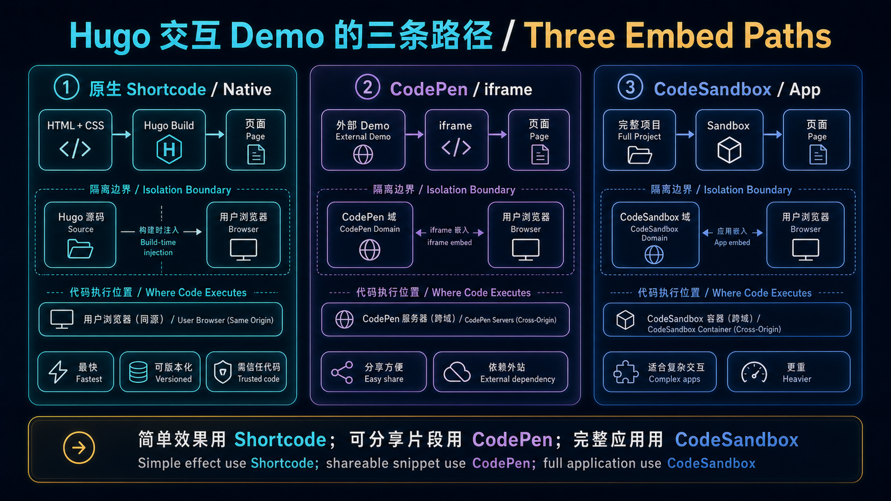

先用一张图确定边界：原生 shortcode、CodePen iframe 和 CodeSandbox 分别适合不同复杂度，也把代码放在不同的执行与隔离位置。



## 1. 内联 CSS demo（无需外部服务）

直接在文章里跑一个旋转加载动画：

```html demo height=200 caption="纯 CSS 旋转加载器"
<style>
  .loader {
    width: 48px;
    height: 48px;
    border: 4px solid #e8e4de;
    border-top-color: #c44020;
    border-radius: 50%;
    animation: spin 0.8s linear infinite;
  }
  @keyframes spin {
    to { transform: rotate(360deg); }
  }
</style>
<div class="loader"></div>
```

一个渐变色文字动画：

```html demo height=160 caption="CSS 渐变文字"
<style>
  .gradient-text {
    font-size: 2rem;
    font-weight: 700;
    font-family: system-ui, sans-serif;
    background: linear-gradient(135deg, #c44020, #e8803a, #c44020);
    background-size: 200% auto;
    -webkit-background-clip: text;
    -webkit-text-fill-color: transparent;
    background-clip: text;
    animation: shimmer 2s linear infinite;
  }
  @keyframes shimmer {
    to { background-position: 200% center; }
  }
</style>
<div class="gradient-text">ZhuoQi Dev</div>
```

## 2. 嵌入 CodePen

如果已有 CodePen 作品，用一行 shortcode 嵌入：

```

```

## 3. 嵌入 CodeSandbox

React / Vue 组件用 CodeSandbox：

```

```

---

这三个 shortcode 覆盖了大多数代码展示场景，写博客基本不需要其他工具了。
