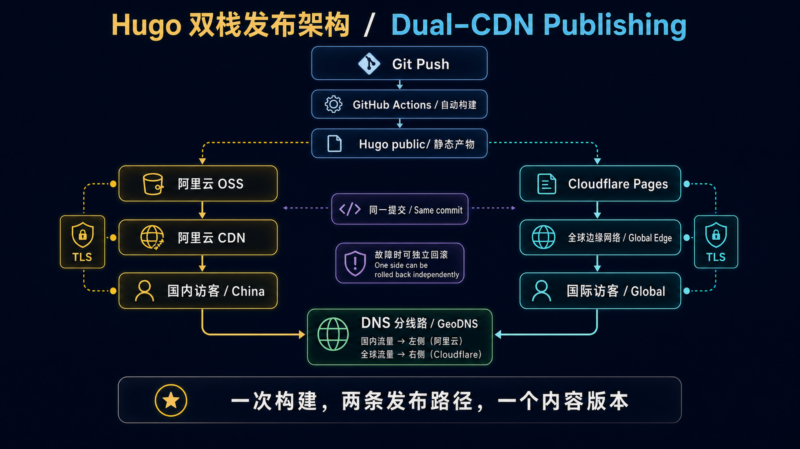

## Why Hugo

When picking a framework for a personal blog, my top criterion was **low maintenance cost** — I didn't want to abandon writing three months later because of npm dependency hell.

Hugo is a single binary, requires no Node.js, builds thousands of posts in 1-2 seconds, and the Blowfish theme comes with dark mode, full-text search, multilingual support, RSS, Open Graph, and reading time estimates out of the box. Day-to-day writing only requires touching Markdown files.

## Architecture

The diagram contains two distinct flows. Read downward from Git Push for the **publishing path**; read from GeoDNS toward the two CDNs for the **request path**. Both destinations must come from the same build to prevent content-version drift.

Annual cost: approximately ¥212 (~$30 USD):
- Domain `zhuoqidev.com`: ¥85/yr (bought 3 years)
- Function Compute resource pack (ICP filing): ¥101/yr (¥126 annual pack with 20% ongoing discount)
- Alibaba CDN 100GB traffic pack: ¥20/yr
- OSS storage: ~¥6/yr
- Cloudflare Pages: ¥0

## ICP Filing Without a Server

Websites served to mainland China visitors need an ICP filing, which requires a "filing carrier" (a server IP). Instead of buying a full server, Alibaba Cloud's **Function Compute resource pack** (¥101/yr) works as a filing carrier and provides a filing service code.

Timeline: Alibaba Cloud initial review 1-5 working days + MIIT review 10-20 business days, about 3-6 weeks total. Plenty of time to finish the site while waiting.

## Geo-DNS Routing

Alibaba Cloud DNS free tier supports "domestic / international" split routing:
- Domestic → Alibaba CDN CNAME
- International (default) → Cloudflare Pages CNAME

Domestic visitors get the ICP-compliant Alibaba CDN; international visitors get Cloudflare's free global CDN — one domain, two acceleration paths.

## Deployment

Push to GitHub → Actions runs `hugo build` → uploads in parallel to OSS and Cloudflare Pages. The whole process takes 2-3 minutes. Publishing a post is nearly instant.

## A Later Addition: an Image Viewer for 4K Architecture Diagrams

Architecture diagrams in technical posts often contain small labels. Blowfish's built-in `medium-zoom` only enlarges an image to fit the screen and closes it on the next click. Even when the source is 4K, readers cannot keep zooming by percentage or pan across the details, so I replaced it with a site-wide image viewer.

The implementation adds no new frontend dependency. The built-in zoom is disabled in `hugo.yaml`, while `assets/js/image-viewer.js` and its CSS are added to the Hugo Pipes asset pipeline. Hugo minifies and fingerprints them during the build, then the same static artifact is published to both CDNs. The script only attaches to `.article-content img:not(.nozoom)`, so article illustrations open in the viewer without hijacking avatars, icons, or card thumbnails.

On open, the viewer calculates a fit-to-screen scale from the viewport and the image's natural dimensions. Wheel and button zooming preserve the point under the cursor, so the detail being inspected stays in place. A zoomed image can be dragged within bounded edges. Pointer Events track two contacts for pinch zoom on touch devices, while the keyboard supports `+`, `-`, arrow keys, `0` for fit, `1` for actual size, and `Esc`. A click on either the image or the surrounding empty space also closes the viewer, while movement beyond the drag threshold prevents accidental dismissal. The toolbar reports the live percentage and switches its labels with the article language.

You can try it by clicking any 4K diagram in the [Codex Agent design deep dive](/en/posts/codex-agent-design/). It is also a useful property of a static site: richer interaction remains cacheable JavaScript and CSS, so the dual-CDN publishing topology does not need to change.

---

Upcoming posts will dive into Agent architecture design, memory layer selection, and multi-agent orchestration.
