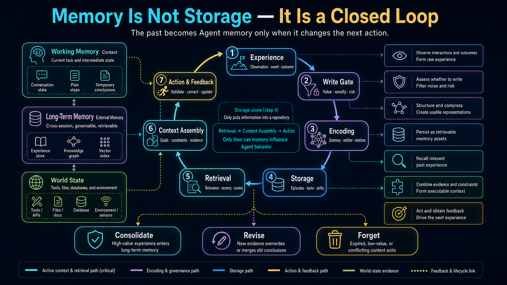
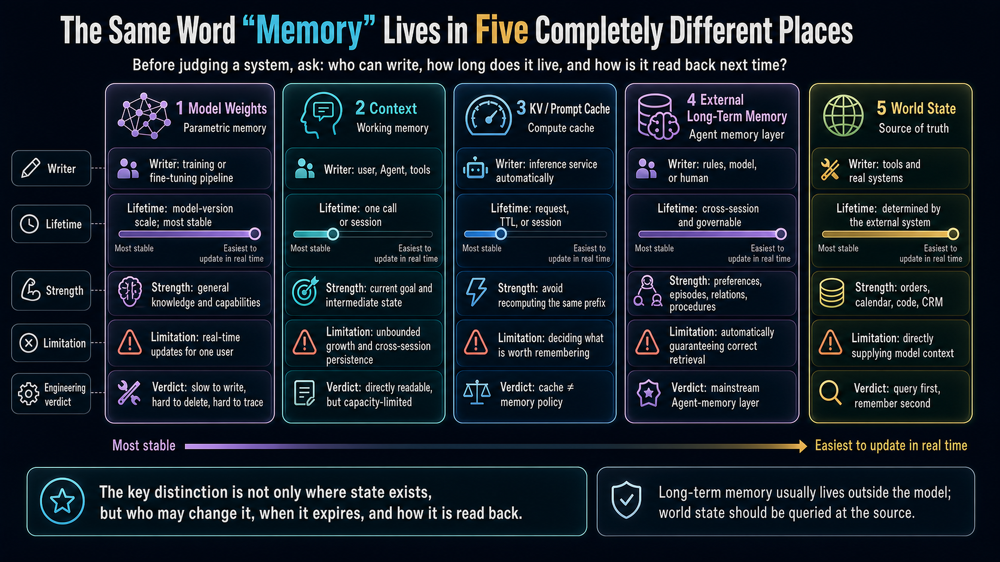
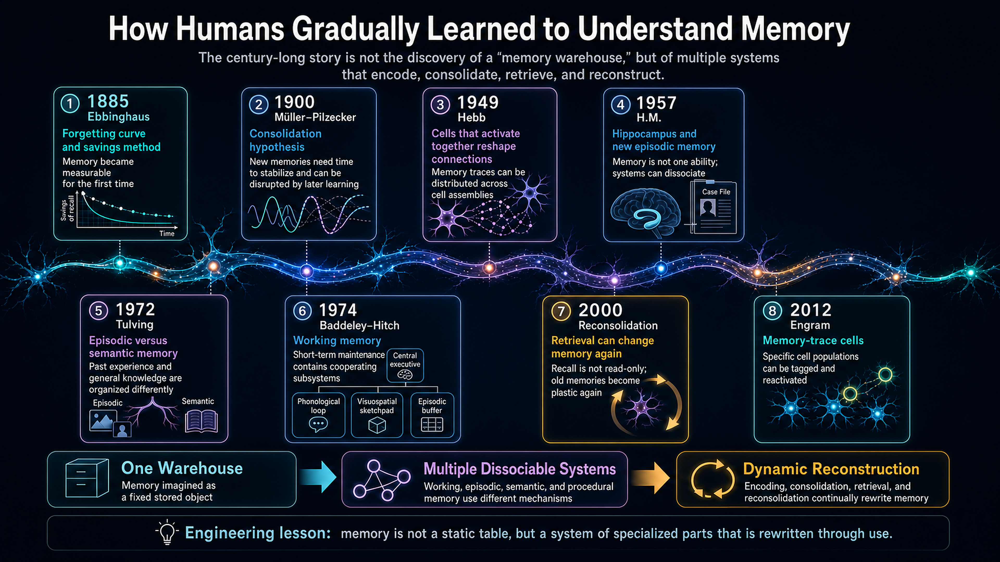
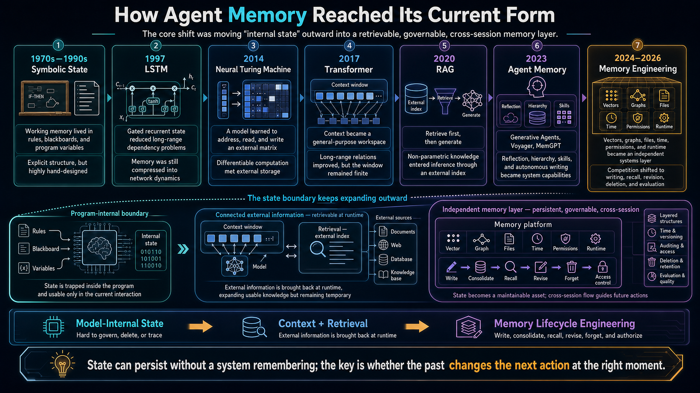
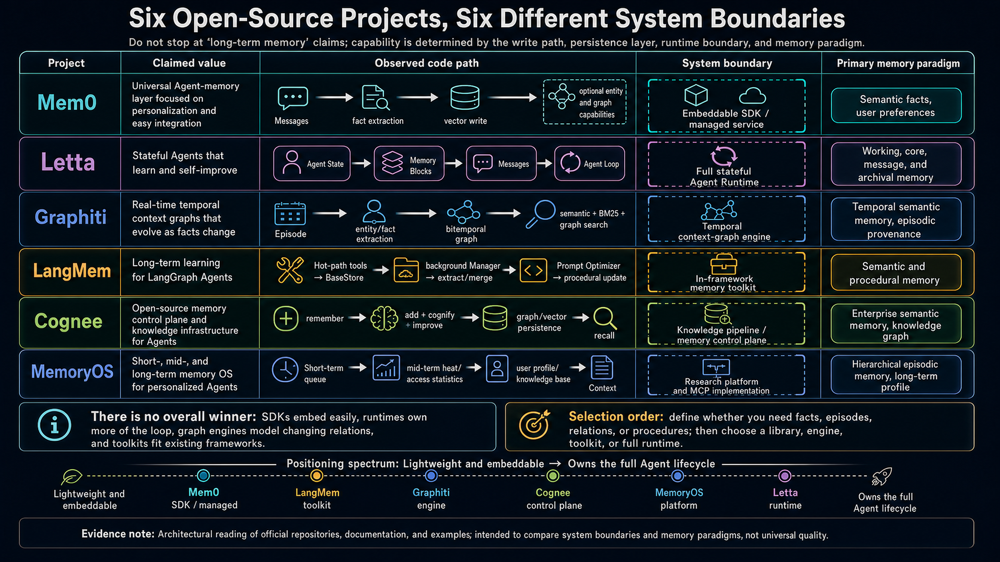
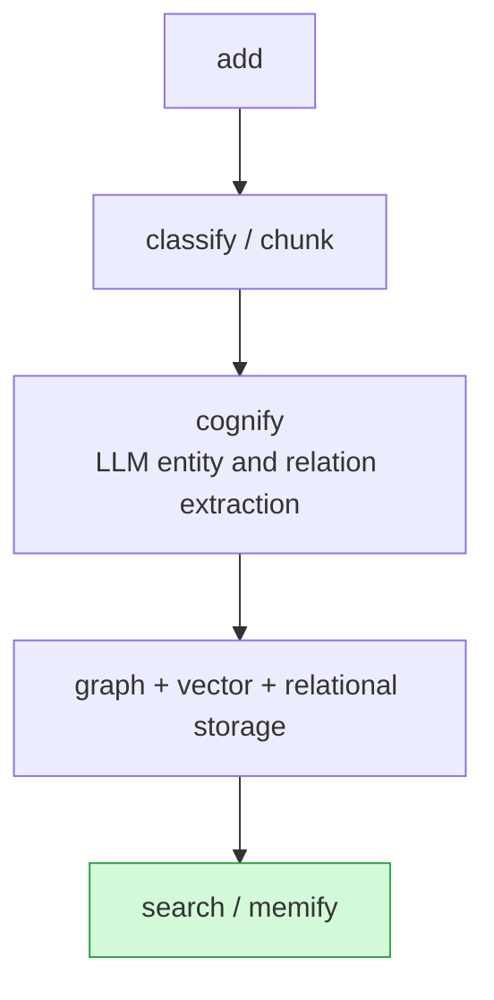
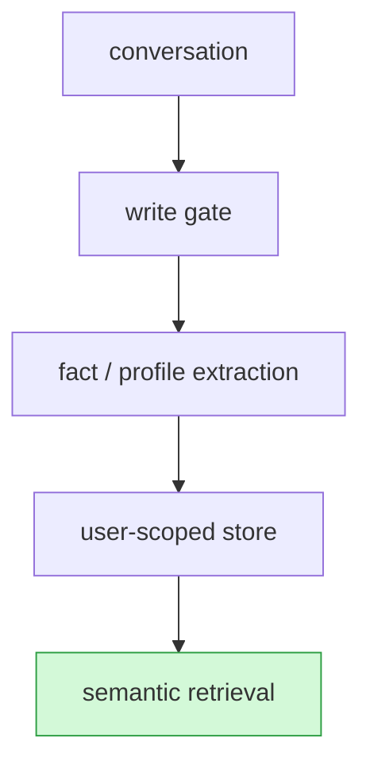
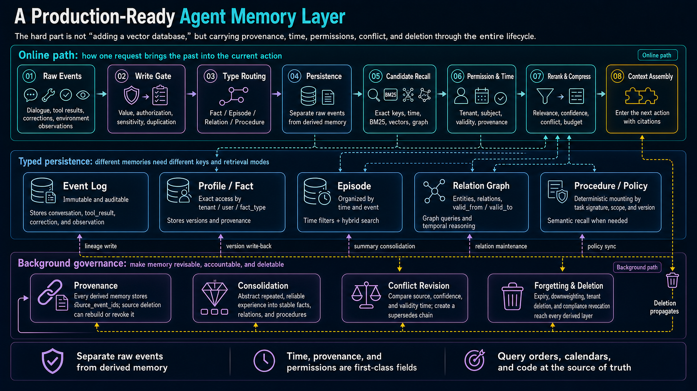
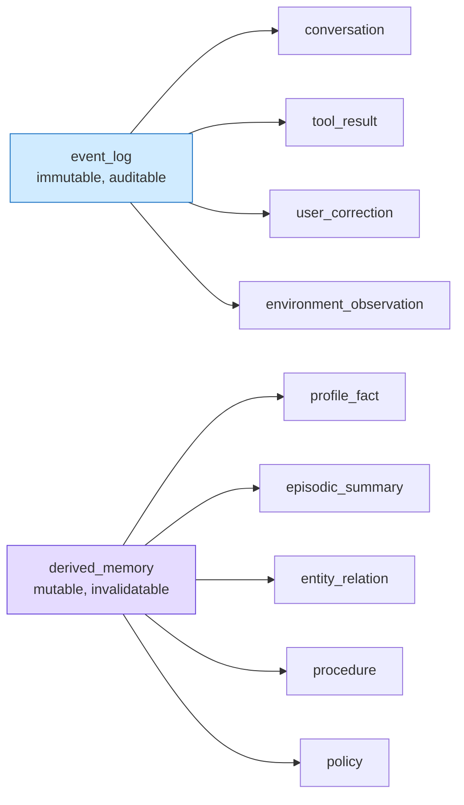
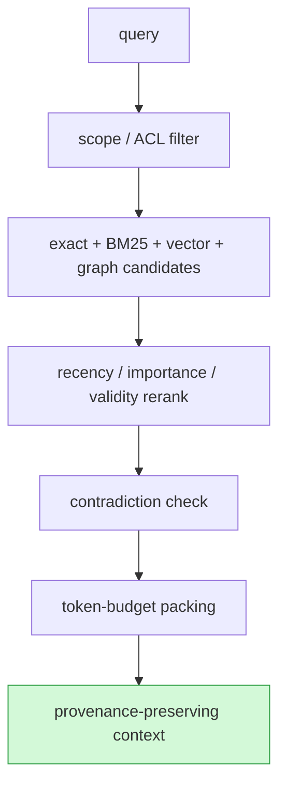

Almost every agent project now claims to provide “long-term memory.”

For one project, that means embedding chat history. For another, it means maintaining a user profile. A third lets the model edit Markdown files. A fourth builds a bitemporal knowledge graph. All four use the word *memory*, but they are not the same system and should not be placed on one undifferentiated leaderboard.


To decide whether a system genuinely remembers, I would rather ask three questions:

1. **After an experience, which state in the system actually changes?**
2. **Where does that state live, who may modify it, and when does it expire?**
3. **Before the next action, how is it brought back accurately and with the right permissions?**

This article starts from those questions. The first half places the history of human memory science beside the evolution of agent memory. The second half reads the code behind Mem0, Letta, Graphiti, LangMem, Cognee, and MemoryOS, comparing their claims, actual data paths, system boundaries, and memory paradigms.

> [!TIP]
> **The short version:** mainstream agents have not acquired a single, brain-like “memory organ.” What works in engineering is a lifecycle: **experience → write gate → representation → storage → retrieval → context assembly → action and feedback → consolidation / revision / forgetting**. Open-source projects differ mainly in which parts of this loop they choose to own.

The first diagram is not the component architecture of a particular product. It is the **shared coordinate system** for the rest of the article. Its question is not merely “where is data stored?” but “how does a past experience alter a future action?” First follow the seven-step loop in the center from experience to action. Then use the three carriers on the left to distinguish the current task, cross-session memory, and real-world state. The cards on the right explain each transformation, while the bottom row shows consolidation, revision, and forgetting over the system’s lifetime. This prevents databases, context, caches, and source-of-truth state from all being mislabeled as “memory.”



---

## 1. Separate the Five Things Most Often Called “Memory”

An LLM system contains at least five physically distinct state carriers. They differ in location, write speed, lifetime, governance, and retrieval semantics.

This diagram exists to **disambiguate the vocabulary**. Read across to compare the five carriers, then down through writer, lifetime, strengths, and limitations. The goal is not to pick one universal winner. It is to prevent architectural category errors: treating a compute cache as durable memory, treating context as persistence, or copying real business state into a natural-language recollection that can go stale.



### 1.1 Parametric memory: model weights

Pretraining and fine-tuning write statistical regularities into parameters. This layer has enormous capacity and strong generalization, but writes are slow, precise deletion is difficult, and provenance is weak: the system usually cannot answer which experience produced a particular piece of knowledge.

Weights are appropriate for language ability, general world knowledge, and stable skills. They are a poor fit for per-user updates after every conversation. Continually fine-tuning user preferences into weights is not only expensive; it also creates catastrophic-forgetting, tenant-isolation, deletion, and audit problems.

### 1.2 Working memory: the context window

The current system prompt, conversation, tool results, scratchpad, and retrieved passages all live here. The model can attend to them directly, making context the strongest workspace available at inference time.

But context does not persist across calls by itself. A longer window is only a larger desk for the current call. It does not automatically decide what deserves to survive, nor does it build a stable user model.

### 1.3 Compute cache: KV cache and prompt cache

The KV cache stores attention keys and values that have already been computed. Prompt caching reuses prefill work for an identical prefix. Both reduce repeated computation, but neither decides what information matters or produces editable, retrievable memory records.

Therefore:

- A cache hit may mean nothing was “remembered”; the service merely avoided recomputation.
- Cache expiry does not imply that long-term memory was lost.
- Updating a memory inside the prompt prefix may itself cause a cache miss.

**Caching is a performance mechanism. Memory is a state-governance mechanism.**

### 1.4 External long-term memory: files, SQL, vectors, and graphs

This is where most agent memory engineering happens today. External stores can isolate users, preserve provenance, support deletion, and retrieve state into the next context.

But “put it in a vector database” is not equivalent to “build a memory system.” Vector search provides approximate similarity. It does not inherently solve factual conflict, temporal truth, importance, authorization, bad writes, or forgetting.

### 1.5 Environmental memory: Git, CRM, calendars, and real world state

Much information should never be copied into a natural-language memory record. Whether code was deployed, an invoice was paid, or a meeting was rescheduled should normally be queried from its source of truth.

A reliable agent distinguishes:

- **What should be recalled:** preferences, prior decisions, successful experience.
- **What should be queried:** orders, permissions, inventory, calendars, code state.
- **What should be recomputed:** prices, aggregates, and derived metrics.

This is why “embed everything” often produces a system with plenty of information but unreliable facts.

---

## 2. How Human Memory Became a Systems Problem

Comparing a vector database to the hippocampus or context to working memory can be pedagogically useful. It is not structural equivalence. The most important lesson from more than a century of memory research is precisely that **memory is neither one location nor an immutable file written once.**

The historical diagram is not background decoration. It explains why this article rejects the model “memory = storage.” You do not need to memorize every date. Follow the three conceptual shifts at the bottom: from one warehouse, to separable systems, to a dynamic process reconstructed during retrieval. The later discussion of episodes, facts, procedures, consolidation, and revision follows directly from that progression.



### 1885: Ebbinghaus made memory measurable

Hermann Ebbinghaus repeatedly learned nonsense syllables and used the *savings method* to measure forgetting. Even when direct recall failed, relearning was faster. Memory moved from philosophical speculation to an experimental object that could be plotted and compared across intervals and repetitions.

Many current agent-memory evaluations use a rougher measure than Ebbinghaus: final question accuracy. A useful evaluation should also ask:

- How soon after writing is a memory available?
- Does repeated successful retrieval stabilize it?
- When a fact is superseded, does the old version still reappear?
- When evidence is insufficient, can the system abstain?

Primary source: [Ebbinghaus, *Memory: A Contribution to Experimental Psychology* (1885/1913)](https://psychclassics.yorku.ca/Ebbinghaus/)

### 1900: memory requires consolidation

Georg Elias Müller and Alfons Pilzecker found that material learned immediately after a new item increased interference. They proposed that memory traces require time to stabilize, helping establish *consolidation* as a central concept.

For agents, the lesson is not simply “run a nightly cron job.” It is to separate:

- **Raw experience:** complete, traceable, and preferably append-only.
- **Consolidated products:** profiles, facts, rules, and summaries that may be revised or overturned.

If only the second layer survives, one faulty model summary can rewrite history. If only raw events survive, retrieval drowns in low-value detail.

Primary source: [Müller & Pilzecker, *Experimentelle Beiträge zur Lehre vom Gedächtniss* (1900)](https://books.google.com/books?id=5RdCAQAAMAAJ)

### 1949: Hebb located persistence in changing connections

Donald Hebb proposed cell assemblies and changes in connection efficiency driven by co-activation. The familiar phrase “fire together, wire together” is not a verbatim quotation, but it captures the direction: experience leaves a trace through network plasticity.

This helps distinguish three changes in an agent system:

- Putting an experience into context changes **activation state**.
- Writing it to persistent storage changes **system state**.
- Updating model weights changes **parameters**, a slower and less governable process.

### 1957: H.M. showed that memory is not one faculty

Scoville and Milner reported that patient H.M. developed severe anterograde amnesia after bilateral medial temporal-lobe surgery, while short-term retention and some forms of skill learning were not impaired in the same way. The case broke the intuition that memory was a single capacity.

The architectural lesson remains powerful: do not make one collection carry current task state, historical episodes, user facts, and executable skills at the same time.

Primary paper: [Scoville & Milner, “Loss of Recent Memory after Bilateral Hippocampal Lesions” (1957)](https://pmc.ncbi.nlm.nih.gov/articles/PMC497229/)

### The 1970s: episodic, semantic, procedural, and working memory diverged

Endel Tulving distinguished:

- **Episodic memory:** what happened to me, where, and when.
- **Semantic memory:** what I know independent of a particular episode.

Baddeley and Hitch replaced a single short-term store with a multicomponent working-memory model. In parallel, the separation between skill learning and declarative knowledge helped establish procedural memory as another category.

This classification remains more useful for agent architecture than “short-term versus long-term”:

| Human category | Agent analogue | Typical storage | Typical read path |
|---|---|---|---|
| Working memory | Current goal, plan, intermediate state, tool output | Context / graph state / scratchpad | Direct injection at every step |
| Episodic memory | Conversations, actions, failures, observations | Event log + temporal index | Joint retrieval by time, entity, and similarity |
| Semantic memory | Preferences, stable facts, concepts, relations | Profile / KV / vector / knowledge graph | Exact key, semantic, or graph query |
| Procedural memory | Prompts, rules, skills, successful trajectories | Files / version control / skill registry | Task routing or explicit mounting |

**Short-term versus long-term describes lifetime. Episodic, semantic, and procedural describes content and function.** These dimensions are not substitutes.

Primary sources: [Tulving, “Episodic and Semantic Memory” (1972)](https://cir.nii.ac.jp/crid/1574231874408386176?lang=en); [Baddeley & Hitch, “Working Memory” (1974)](https://doi.org/10.1016/S0079-7421%2808%2960452-1)

### 1971–2012: from spatial representation to manipulable engrams

O'Keefe discovered hippocampal place cells. Later work on grid cells and related systems exposed neural mechanisms of spatial representation. In 2012, Liu, Ramirez, Tonegawa, and colleagues used optogenetics to reactivate hippocampal cells tagged during fear-memory formation and elicited behavior associated with memory recall.

This did not reveal one address containing an entire memory. Modern engram research points instead to distributed, reactivatable cell assemblies whose content still depends on cross-region networks and retrieval conditions.

Sources: [2014 Nobel Prize scientific background](https://www.nobelprize.org/prizes/medicine/2014/advanced-information/); [Liu et al., “Optogenetic stimulation of a hippocampal engram activates fear memory recall” (2012)](https://pmc.ncbi.nlm.nih.gov/articles/PMC3331914/)

### 2000: retrieval is not read-only

Experiments by Nader, Schafe, and LeDoux showed that a consolidated fear memory becomes plastic after reactivation and again requires protein synthesis to stabilize. This result helped launch modern research on reconsolidation.

For agent systems, the useful analogy is that **every recall can become an update.**

If a user says, “I no longer drink coffee,” the system should not leave two contradictory preferences beside each other in a vector store. At minimum it should represent:

```text
old_fact: user likes coffee
validity: 2025-03 → 2026-07

new_fact: user avoids coffee
source: conversation/event/...
relation: new_fact supersedes old_fact
```

Primary paper: [Nader, Schafe & LeDoux, “Fear memories require protein synthesis in the amygdala for reconsolidation after retrieval” (2000)](https://pubmed.ncbi.nlm.nih.gov/10963596/)

### Four principles worth borrowing from memory science

1. **Memory is a collection of systems, not one vector store.**
2. **Consolidation transforms events into stable representations; it is not merely text compression.**
3. **Retrieval is reconstructive, so provenance and versions must survive.**
4. **Forgetting is not only failure; it also reduces interference, controls cost, and protects privacy.**

The analogy must stop there. The hippocampus is not Redis. Vector similarity is not a complete model of associative recall. An LLM summary is not sleep-dependent consolidation. Neuroscience analogies should generate engineering questions, not replace evidence.

---

## 3. How Agent Memory Evolved

The human-memory timeline explains why we ask these questions. The agent timeline explains why current systems have their present shape. The important feature is not the list of model names but the migration of the state boundary: from programs and network dynamics, to context, to retrieved external data, and finally to a dedicated memory layer that owns writing, time, permissions, and deletion.



### Stage 1: state lived in programs

Early symbolic AI and cognitive architectures already had working memory, production rules, and long-term knowledge. Programmers defined both state and representation. These systems addressed how a reasoning process maintains state, not natural-language personalization.

### Stage 2: neural networks learned to preserve and address state

LSTM used gated recurrence to reduce long-range dependency problems. The 2014 Neural Turing Machine connected a network to a differentiable memory matrix with learned read and write heads. The goal was to learn algorithms such as copying, sorting, and associative recall end to end.

Primary paper: [Neural Turing Machines (2014)](https://arxiv.org/abs/1410.5401)

This line of work put memory inside model architecture, but training difficulty, scale, and weak governance limited its use as a general per-user agent memory layer.

### Stage 3: Transformer context became a universal workspace

Transformers allowed every token position to interact directly with every other position. Prompting became a uniform interface: rules, examples, documents, and tool results could all be supplied at inference time without modifying weights.

The cost was that every API call still began from a new context by default. “LLMs are stateless” is better stated as: **the model API makes no cross-call state guarantee on behalf of the application.**

### Stage 4: RAG connected non-parametric memory to generation

RAG combined parametric generation with a retrievable non-parametric corpus. It was designed for knowledge-intensive tasks and updatable sources, not personal memory, but retrieve-then-generate quickly became the default read path for long-term agent memory.

Primary paper: [Lewis et al., “Retrieval-Augmented Generation for Knowledge-Intensive NLP Tasks” (2020)](https://arxiv.org/abs/2005.11401)

One boundary matters: **RAG is a read mechanism, not a complete memory system.** If data never enters through experience-driven writing, updating, conflict resolution, or forgetting, it is closer to an external knowledge base.

### Stage 5: 2023 combined writing, reflection, hierarchy, and skills

Several 2023 systems filled different gaps:

- **Generative Agents:** an event stream, recency/relevance/importance retrieval, and reflection that consolidates episodes into higher-level beliefs.
- **Voyager:** successful code becomes a reusable skill library, emphasizing procedural memory.
- **MemGPT:** an operating-system analogy treats context as a working set and lets the agent move information between memory tiers through tools.
- **CoALA:** a cognitive architecture connecting working, episodic, semantic, and procedural memory to an agent decision loop.

Primary papers: [Generative Agents](https://arxiv.org/abs/2304.03442) · [Voyager](https://arxiv.org/abs/2305.16291) · [MemGPT](https://arxiv.org/abs/2310.08560) · [CoALA](https://arxiv.org/abs/2309.02427)

### Stage 6: from 2024 onward, governance became the differentiator

The dividing line is no longer whether a project supports vector search. It is:

- Who decides to write?
- Is memory represented as events, facts, documents, graph edges, prompts, or executable skills?
- Are conflicts overwritten, coexisting, or invalidated over time?
- Is provenance preserved?
- Does consolidation happen in the background?
- Can state be isolated by user, agent, run, and tenant?
- Can users inspect, edit, export, and delete it?
- Can operators observe memory failures?

Those questions define the code audit below.

---

## 4. How to Read an Open-Source “Agent Memory” Project

I did not rank projects by their home-page benchmark. Scores depend on the base model, answer prompt, judge model, retrieval budget, and data cleaning. A high memory-QA score says little about permissions, deletion, stability, cost, or whether the architecture fits production.

This audit is anchored to repository states visible on 2026-07-30 and examines seven dimensions:

1. **Write path:** trigger, gating, deduplication, and structured extraction.
2. **Representation:** events, facts, profiles, graphs, prompts, or skills.
3. **Storage abstraction:** files, SQL, vectors, graphs, and replaceability.
4. **Read path:** exact search, vector search, BM25, graph traversal, reranking.
5. **Time and conflict:** overwrite, invalidation, versioning, or bitemporal modeling.
6. **System boundary:** library, engine, toolkit, or full runtime with API and tenancy.
7. **Loop completeness:** consolidation, feedback, forgetting, deletion, and observability.

The next diagram is a **selection map**, not a logo wall or an overall score. Read each row from left to right: public claim, observed code path, system boundary, and memory paradigm. That makes it possible to distinguish an SDK, runtime, temporal graph engine, framework toolkit, knowledge pipeline, and research implementation before committing to the detailed audit.



### Summary: claims, code paths, and memory paradigms

| Project | Public positioning | Observed core code path | Closest memory paradigm | Architecture type | Main boundary |
|---|---|---|---|---|---|
| **Mem0** | Universal memory layer, personalization, cross-session learning | History + vector recall → LLM incremental fact extraction → batch embeddings → vector store; SQLite for messages/history | Primarily semantic facts with user/agent scopes | Pluggable memory SDK | Runtime, task state, and full governance sit outside the core |
| **Letta** | Stateful, self-improving agents with advanced memory | AgentState + memory blocks + messages/passages + context calculator + agent loop/tools | Working + episodic + semantic; model-managed | Full stateful agent runtime | Adopting it often means adopting its runtime model |
| **Graphiti** | Real-time temporal context graph and historical truth | Episode → entity/fact extraction → bitemporal edges → semantic/BM25/graph hybrid search | Temporal semantic memory with episodic provenance | Temporal graph engine | User, session, and agent services are separate |
| **LangMem** | Continuous learning, hot-path tools, background memory | Manage/search tools + background manager + LangGraph BaseStore + prompt optimizer | Semantic/episodic templates + procedural memory | Framework toolkit | Persistence, deployment, and permissions inherit from LangGraph or custom code |
| **Cognee** | Turn data into AI memory and replace traditional RAG | Add → cognify pipeline → graph/vector/relational storage → search/memify | Enterprise semantic memory and knowledge graph | Knowledge pipeline / infrastructure | Personal conversation memory is not the sole center |
| **MemoryOS** | OS-style short-, mid-, and long-term hierarchy | Short-term QA queue → mid-term segment/heat → profile and knowledge extraction → JSON/embedding retrieval | Hierarchical episodic-to-semantic consolidation | Research reference implementation | Production tenancy, transactions, and governance need additional work |

---

## 5. Six Systems: What Exists Between Marketing and Code

### 5.1 Mem0: a fact-distillation and retrieval pipeline, not a brain

Mem0 has a clear role: add a unified long-term memory API to an existing application. Its surface centers on `add / search / get / update / delete`, with providers for LLMs, embeddings, vector stores, and rerankers.

The current OSS Python v3 write path is visible in [`mem0/memory/main.py`](https://github.com/mem0ai/mem0/blob/9c2d6222ce86bf6a73ae7ca97464a8e1a55ab3ca/mem0/memory/main.py):

1. Establish scope from `user_id / agent_id / run_id`.
2. Read recent messages from SQLite.
3. Recall existing memories from the vector store using the current conversation.
4. Give old memories, new messages, and recent context to an LLM for incremental extraction.
5. Batch-embed the extracted memory texts.
6. Write them back and record history.

The core operation is not raw chat storage. It is **LLM-driven distillation of conversation into shorter retrievable facts**.

**Where the claim holds:**

- Low integration cost.
- Mature provider abstraction.
- Practical scope, metadata, history, async, and reranking interfaces.
- A strong fit for preferences, identity facts, and previous decisions.

**Where the claim can mislead:**

- “Universal” does not mean optimal for every memory type.
- The default center is semantic facts, not full working memory or a skill system.
- LLM extraction can omit, misattribute, or overgeneralize at write time.
- Vector similarity does not answer complex historical-truth questions by itself.

> [!NOTE]
> **Paradigm:** an external memory layer centered on semantic memory.

### 5.2 Letta: memory as the state model of an agent runtime

Letta grew out of MemGPT. Its largest difference from Mem0 is not retrieval quality but system boundary.

[`AgentState`](https://github.com/letta-ai/letta/blob/b76da9092518cbaa2d09042e52fdcbde69243e18/letta/schemas/agent.py), [`Memory`](https://github.com/letta-ai/letta/blob/b76da9092518cbaa2d09042e52fdcbde69243e18/letta/schemas/memory.py), [`Passage`](https://github.com/letta-ai/letta/blob/b76da9092518cbaa2d09042e52fdcbde69243e18/letta/schemas/passage.py), and [`agent_loop.py`](https://github.com/letta-ai/letta/blob/b76da9092518cbaa2d09042e52fdcbde69243e18/letta/agents/agent_loop.py) show that:

- Memory blocks are part of agent state.
- Messages, passages, tools, model configuration, and agent identity persist together.
- A context-window calculator decides which state enters each turn.
- The agent may modify its own memory through tools.
- Server, API, ORM, and multi-agent groups live inside one runtime model.

**Where the claim holds:**

- It is genuinely a stateful agent platform, not a vector wrapper.
- Memory, agent loop, tools, and context budgeting are integrated.
- It fits long-running agents that actively maintain their own state.

**The trade-off:**

- You adopt an agent runtime, not only a memory library.
- Model-managed writing expands the surface for prompt injection, bad writes, and permission errors.
- A complete runtime can be more system than a narrow application needs.

> [!NOTE]
> **Paradigm:** OS-style hierarchical and model-managed memory spanning working, episodic, and semantic state; tools, files, and skills carry more of the procedural layer.

### 5.3 Graphiti: time and provenance are the product, not merely “a graph”

Many knowledge-graph projects store `subject - predicate - object`. Graphiti differentiates itself through episode provenance and bitemporal relations.

[`graphiti_core/edges.py`](https://github.com/getzep/graphiti/blob/2645dee20fd71797a61e1c6177a93cccd5584574/graphiti_core/edges.py) and [`graphiti.py`](https://github.com/getzep/graphiti/blob/2645dee20fd71797a61e1c6177a93cccd5584574/graphiti_core/graphiti.py) show:

- Episodes preserve source input and provenance.
- Entity nodes represent people, objects, organizations, and concepts.
- Entity edges represent facts and relations.
- `valid_at / invalid_at` describe when a fact is true in the world.
- `created_at / expired_at` describe when the system learned and invalidated it.
- Search recipes combine semantic search, BM25, graph traversal, and reranking.

The model can therefore answer different questions:

- What is true now?
- What was true in March 2025?
- When did the system learn that it changed?
- Which episode produced this edge?

**Where the claim holds:**

- Time and provenance exist in the data model, not only in a prompt instruction.
- The design is valuable for changing relations, multihop queries, and auditability.
- Graph backends and search recipes have explicit abstractions.

**Boundary:**

- Open-source Graphiti is an engine, not a complete user/session/agent product.
- Graph construction still relies on LLM extraction, so schema and model quality directly affect write correctness.

> [!NOTE]
> **Paradigm:** temporal semantic memory with episodic provenance.

### 5.4 LangMem: composable primitives rather than a memory server

LangMem packages common memory operations into composable tools:

- `manage_memory` and `search_memory` in the hot path.
- A background manager for extraction, merging, and updates.
- Profile and collection forms of semantic memory.
- Procedural memory through prompt optimization from successful and failed trajectories.
- Persistence through LangGraph `BaseStore`.

The core implementation is visible in [`knowledge/extraction.py`](https://github.com/langchain-ai/langmem/blob/56d85939d80bb731bd5e237567148d817d7bfd16/src/langmem/knowledge/extraction.py) and [`prompts/optimization.py`](https://github.com/langchain-ai/langmem/blob/56d85939d80bb731bd5e237567148d817d7bfd16/src/langmem/prompts/optimization.py).

**Where the claim holds:**

- It supports both in-the-loop and background writing.
- Procedural memory has a real prompt optimizer behind it.
- Projects already using LangGraph get high composability.

**Boundary:**

- It is not an independent production database, user system, or agent server.
- `InMemoryStore` examples disappear on restart; production needs Postgres or another durable `BaseStore`.
- Consistency, permissions, deletion, and observability depend on the surrounding platform or custom implementation.

> [!NOTE]
> **Paradigm:** memory primitives centered on semantic and procedural memory.

### 5.5 Cognee: knowledge infrastructure rather than preference memory

Cognee describes its product as converting raw data into AI memory. The mature code path resembles an ECL knowledge pipeline:



[`cognify.py`](https://github.com/topoteretes/cognee/blob/88aa09b4e3289e3dbf12c0c090080920816e2fb7/cognee/api/v1/cognify/cognify.py) orchestrates the pipeline. The storage layer exposes graph and vector interfaces, while upper layers include datasets, users, roles, and ACLs.

**Where the claim holds:**

- Data ingestion, pipelines, and graph/vector/relational adapters are substantial.
- It supports multiple search types, ontology work, and multi-tenant permissions.
- It is attractive for durable knowledge built from documents, code, and enterprise data.

**What to calibrate:**

- Its strongest paradigm is semantic knowledge infrastructure.
- A full cognify pipeline may be excessive for “remember that this user dislikes cilantro.”
- It is more appropriate than a chat-memory SDK when sources are heterogeneous, relations matter, and access control is central.

> [!NOTE]
> **Paradigm:** graph-structured semantic or organizational knowledge memory.

### 5.6 MemoryOS: the clearest cognitive analogy, still a research-oriented implementation

MemoryOS makes short-, mid-, and long-term tiers explicit:

- Short-term memory stores recent question-answer pairs.
- Capacity pressure migrates content into mid-term session segments.
- Segments carry heat.
- High heat triggers LLM updates to the user profile, user knowledge, and assistant knowledge.
- A retriever searches mid-term pages and long-term knowledge before assembling the generation prompt.

The path is readable in [`memoryos-pypi/memoryos.py`](https://github.com/BAI-LAB/MemoryOS/blob/587ed7755c7aed179965792830ff1b5ad9a6fa92/memoryos-pypi/memoryos.py).

**Where the claim holds:**

- Hierarchy, migration, heat, and consolidation are explicitly implemented.
- It is useful for reproducing experiments on episodic-to-semantic consolidation.
- The code is direct enough for researchers to modify strategies.

**Code-level reality:**

- The default implementation relies heavily on local JSON, SentenceTransformer, and LLM calls.
- Similar modules remain across `memoryos-pypi`, `memoryos-playground`, `memoryos-chromadb`, and `memoryos-mcp`.
- Transactions, concurrency, tenant isolation, unified schemas, migrations, monitoring, and fine-grained deletion require application work.

That does not make the project “bad.” It means the deliverable is a research reference, not the same product category as a full platform.

> [!NOTE]
> **Paradigm:** hierarchical episodic memory consolidated into profiles and semantic knowledge.

---

## 6. A Fair Comparison Uses Capability Surfaces, Not One Score

| Capability | Mem0 | Letta | Graphiti | LangMem | Cognee | MemoryOS |
|---|---|---|---|---|---|---|
| Current task state | External runtime | **Core capability** | Not central | LangGraph | Not central | Partially covered by short-term tier |
| Episodic events | Application may retain them; core favors distilled facts | Messages / passages | **Episodes are first-class** | Schema-based extraction | Can ingest | **Core short/mid-term layer** |
| Semantic facts / profile | **Core capability** | Memory blocks | Entity/fact graph | **Core capability** | **Core capability** | Long-term layer |
| Procedural memory | Agent/procedural paths exist but are not the center | Tools / files / skills | Not central | **Prompt optimizer** | Extensible through rules / memify | Not central |
| Temporal conflict | Extraction and metadata policy | Agent/application policy | **Native bitemporal model** | Schema/manager policy | Temporal search depends on model | Profile merging and heat migration |
| Replaceable storage | **Strong** | Platform persistence model | Replaceable graph backend | Replaceable `BaseStore` | **Strong graph/vector/relational adapters** | Multiple distributions |
| Full agent runtime | No | **Yes** | No | No | No | Research runtime with generation |
| Natural use | Add memory APIs to an existing app | Build a long-lived stateful agent | Add time-aware graphs for changing relations | Compose memory policy in LangGraph | Build organizational knowledge memory | Research and reproduce experiments |

Bold indicates where a project concentrates complexity, not universal superiority.

### Why benchmarks cannot replace architecture

Benchmarks such as LoCoMo and LongMemEval are valuable, but they mostly test whether an answer uses conversation history. Production systems also face:

- **Bad writes:** an LLM stores an inference as a user fact.
- **Memory inflation:** every turn produces repeated low-value records.
- **Stale resurrection:** an expired but semantically similar fact ranks highly.
- **Cross-user leakage:** a scope or filter is missing.
- **Memory poisoning:** external content persuades an agent to persist malicious instructions.
- **Incomplete deletion:** summaries, vectors, graph edges, and caches survive source deletion.
- **Weak explainability:** the answer cannot identify which memory influenced it.
- **Runaway cost:** extraction, embeddings, reranking, and graph construction accumulate every turn.

A system can win LoCoMo and still be unsuitable for healthcare, finance, or multi-tenant SaaS.

---

## 7. Choosing a Memory Paradigm

### Scenario A: coding agents, personal tools, and a few hundred stable rules

Start with:

```text
Markdown / JSON
  + explicit namespaces
  + Git history
  + BM25 or simple full-text search
```

Files are readable, diffable, and reviewable. File memory is not an outdated vector database. For small datasets with exact terminology and rules that must load deterministically, it is often more reliable.

Add embeddings only when cross-language paraphrase or thousands of records make lexical retrieval insufficient.

### Scenario B: chat assistants, support, and light personalization

Start with a Mem0- or LangMem-style path:



The vector database is not the first design choice. Decide:

- What must never be written?
- Can the user inspect and delete it?
- How do new preferences supersede old ones?
- When uncertain, should the system preserve only the raw episode?

### Scenario C: long-lived autonomy and model-managed state

Use a Letta-style runtime when agent identity, memory blocks, message persistence, context budgeting, tool permissions, and the agent loop must work as one system.

### Scenario D: changing facts and historical-state questions

Use a Graphiti-style temporal graph when questions include:

- Which contract version applied previously?
- When did a person move from Team A to Team B?
- Which version of a fact was known when a decision was made?

Increasing top-k from 5 to 20 does not solve temporal truth.

### Scenario E: enterprise documents, heterogeneous sources, relations, and permissions

Use a Cognee-style knowledge pipeline, or build a graph + vector + SQL layer on an existing data platform.

Here memory means continuously updated, searchable, permissioned organizational knowledge—not merely conversational recall.

### Scenario F: research on hierarchy, heat, consolidation, and forgetting

MemoryOS is a readable experimental baseline. A paper-oriented reference implementation should not be treated as a high-concurrency multi-tenant service without substantial engineering.

---

## 8. A Production-Ready Agent Memory Layer

The earlier figures define concepts and compare projects. This one is the **implementation blueprint**. Read it from top to bottom: the top row is the online read/write path for one request; the middle row separates persistence by memory type; the bottom row covers source lineage, consolidation, conflict revision, and deletion. It is not a mandatory component list. Its job is to make sure a production design assigns every critical lifecycle responsibility.



### 8.1 Separate raw events from derived memory



Every derived record should retain `source_event_ids`. When source data is deleted, the system can identify which summaries, embeddings, and graph edges must be rebuilt or revoked.

### 8.2 Put the write gate before embedding

At minimum, the gate decides:

- Is this relevant to a future task?
- Is it an explicit fact or a model inference?
- Does it contain sensitive data?
- Did the user authorize persistence?
- Does it already exist?
- Should it become an episode, fact, relation, procedure, or policy?

**Every stored memory is a tax on every future retrieval.**

### 8.3 Use different keys and retrieval for different memory types

| Type | Recommended key | Primary retrieval |
|---|---|---|
| Profile fact | `tenant/user/fact_type` | Exact key + version |
| Episode | `tenant/user/time/event_id` | Temporal filter + hybrid search |
| Relation | Entity IDs + relation type + validity | Graph query + time |
| Procedure | Task signature + version | Routing + semantic recall |
| Policy | Scope + priority + version | Deterministic mounting |

One embedding collection is not a substitute for schema design.

### 8.4 Make time and provenance first-class fields

A minimal record should include:

```yaml
id:
tenant_id:
subject_id:
memory_type:
content:
source_event_ids:
confidence:
valid_from:
valid_to:
created_at:
expired_at:
supersedes:
access_scope:
```

Use a Graphiti-style bitemporal model when facts change frequently. For simpler facts, at least retain `valid_from / valid_to / supersedes`.

### 8.5 Read through candidate generation, filtering, and assembly

A robust read path looks like:



Similarity is only one signal.

### 8.6 Run consolidation and forgetting in the background

Background jobs can:

- Cluster similar episodes.
- Extract stable facts.
- Update profiles.
- Generate procedures.
- Mark superseded facts.
- Decay low-value material.
- Apply TTL and user deletion.
- Rebuild affected indexes.

The online path should perform only essential fast writes rather than paying the full LLM cost on every turn.

### 8.7 Evaluate task outcomes, not only memory QA

Track at least:

- **Write precision:** how many records were genuinely worth keeping?
- **Stale recall rate:** how many retrieved records were no longer valid?
- **Provenance coverage:** how many memory-influenced answers identify source events?
- **Cross-tenant leakage:** this must be zero.
- **Deletion completeness:** does derived state remain after deletion?
- **Task success delta:** did memory improve actual completion?
- **Token, latency, and cost:** what is the marginal cost of one useful memory?

---

## 9. Where Agent Memory Is Heading

No single “most brain-like” project is likely to dominate soon. A more plausible convergence has three layers:

1. **Runtime:** current task, agent identity, tool permissions, and context.
2. **Memory service:** events, facts, relations, skills, time, provenance, and deletion.
3. **Model:** longer context, stronger test-time learning, and possibly architectural memory modules.

Today most agents remember in exactly one way: drop a sentence into a vector database and fetch a few that mean something similar (`vector_db.search(text)`). That is an assistant who can only flip through an old notebook looking for similar sentences. The interface that eventually settles will look more like a dependable secretary, one who can do at least five things:

| What the secretary does | Roughly the interface | In plain words |
|---|---|---|
| **Note it down** | `remember(event, policy)` | Something happened; decide by the rules whether it is worth keeping and for how long, instead of copying everything into the notebook |
| **Recall it** | `recall(query, scope, time, budget)` | Look things up only for the right person, project, and period, and only as much as fits — don't hand the model someone else's, stale, or far too many notes |
| **Correct it** | `revise(memory, evidence)` | When new evidence arrives, update the old memory: "stopped drinking coffee" replaces "likes coffee" instead of sitting next to it |
| **Forget it** | `forget(subject, reason)` | When a user says "forget my address", delete it along with the summaries and indexes derived from it, and record why |
| **Cite the source** | `explain(memory_id)` | Answer "why do you remember that?": which conversation it came from, when, and whether it still holds |

**Today's memory can only "find something similar". Tomorrow's has to note down, recall, correct, forget, and cite its source.**

Human memory science spent more than a century moving from “where is memory stored?” to “how do multiple systems reconstruct the past during retrieval?” Agent memory engineering is undergoing the same conceptual upgrade:

> [!TIP]
> **The useful question is no longer whether an agent has memory. It is what change the agent preserves, why it preserves it, when it recalls it, how it revises it, and who has the authority to make it forget.**

---

## Primary Sources and Pinned Code Entrypoints

### Human memory science

- [Ebbinghaus — *Memory: A Contribution to Experimental Psychology*](https://psychclassics.yorku.ca/Ebbinghaus/)
- [Müller & Pilzecker — *Experimentelle Beiträge zur Lehre vom Gedächtniss*](https://books.google.com/books?id=5RdCAQAAMAAJ)
- [Scoville & Milner — the H.M. case](https://pmc.ncbi.nlm.nih.gov/articles/PMC497229/)
- [Baddeley & Hitch — Working Memory](https://doi.org/10.1016/S0079-7421%2808%2960452-1)
- [2014 Nobel Prize — place cells and grid cells](https://www.nobelprize.org/prizes/medicine/2014/advanced-information/)
- [Nader, Schafe & LeDoux — Reconsolidation](https://pubmed.ncbi.nlm.nih.gov/10963596/)
- [Liu et al. — Optogenetic activation of a hippocampal engram](https://pmc.ncbi.nlm.nih.gov/articles/PMC3331914/)

### Agent-memory papers

- [Neural Turing Machines](https://arxiv.org/abs/1410.5401)
- [Retrieval-Augmented Generation](https://arxiv.org/abs/2005.11401)
- [Generative Agents](https://arxiv.org/abs/2304.03442)
- [Voyager](https://arxiv.org/abs/2305.16291)
- [CoALA](https://arxiv.org/abs/2309.02427)
- [MemGPT](https://arxiv.org/abs/2310.08560)
- [Lost in the Middle](https://arxiv.org/abs/2307.03172)

### Pinned code-audit entrypoints

- [Mem0 `memory/main.py` @ `9c2d622`](https://github.com/mem0ai/mem0/blob/9c2d6222ce86bf6a73ae7ca97464a8e1a55ab3ca/mem0/memory/main.py)
- [Letta `schemas/memory.py` @ `b76da90`](https://github.com/letta-ai/letta/blob/b76da9092518cbaa2d09042e52fdcbde69243e18/letta/schemas/memory.py)
- [Graphiti `graphiti_core/edges.py` @ `2645dee`](https://github.com/getzep/graphiti/blob/2645dee20fd71797a61e1c6177a93cccd5584574/graphiti_core/edges.py)
- [LangMem `knowledge/extraction.py` @ `56d8593`](https://github.com/langchain-ai/langmem/blob/56d85939d80bb731bd5e237567148d817d7bfd16/src/langmem/knowledge/extraction.py)
- [Cognee `cognify.py` @ `88aa09b`](https://github.com/topoteretes/cognee/blob/88aa09b4e3289e3dbf12c0c090080920816e2fb7/cognee/api/v1/cognify/cognify.py)
- [MemoryOS `memoryos.py` @ `587ed77`](https://github.com/BAI-LAB/MemoryOS/blob/587ed7755c7aed179965792830ff1b5ad9a6fa92/memoryos-pypi/memoryos.py)

---

*Audit date: 2026-07-30. Open-source repositories change quickly, so architectural claims link to pinned commits. Project marketing is used only to describe self-positioning, not as evidence about implementation.*
