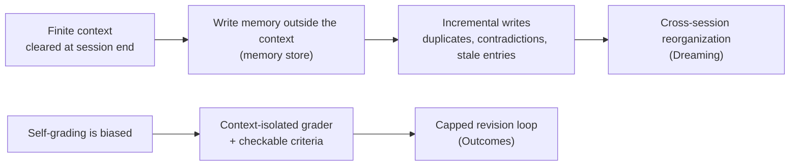
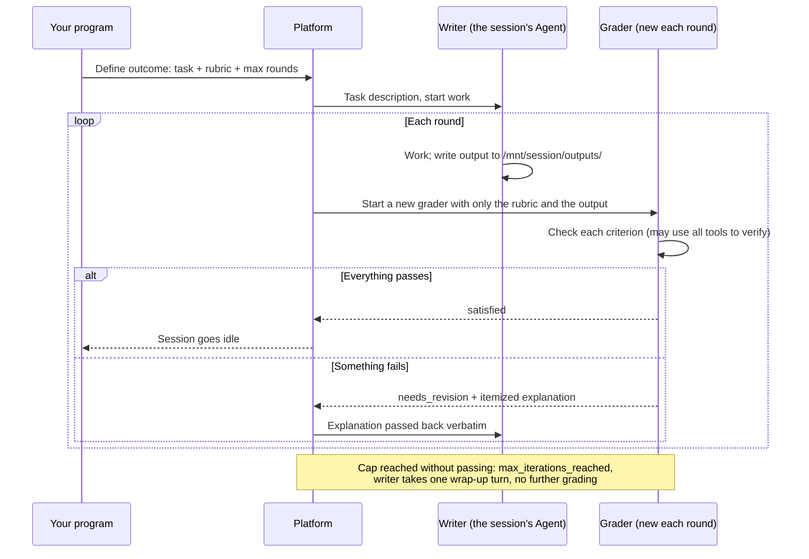

**Version scope**: this article follows the official documentation as checked on 2026-10-06. Outcomes and memory stores are in public beta; Dreaming is a research preview that requires requesting access. Both were announced at Code with Claude on 2026-05-06. Fields and limits can change during beta, so check the current docs before integrating.

> [!NOTE]
> **The single most important caveat: how well Outcomes works depends almost entirely on how you write the rubric.** A vague rubric makes the grader approve everything, the loop ends after one round, and you pay for a check that never happened.

---

## Who this is for

The default reader is an engineer who knows LLMs, context windows, and basic tool calling, has built or configured an Agent, usually works in Python, TypeScript, Go, or similar, but has not used Claude Managed Agents.

You **do not** need to know:

- the Managed Agents API layout or SDK calls;
- the terms "grader," "rubric," or "memory store"; each is explained on first use;
- any Anthropic internals. Anthropic has not published the internal code for either mechanism, so every "how it is implemented" passage below is marked as documented behavior, my inference, or illustrative pseudocode.

---

## Three plain sentences to remember

1. **Outcomes answers "is this delivery good enough?"** You write down what passing looks like. The platform starts a separate grader that cannot see the working Agent's reasoning and checks the output against your criteria one by one. If anything fails, the itemized feedback goes back for revision, until it passes or the round limit runs out.
2. **Dreaming answers "will the next run go better?"** Outside any session, it reads an old memory store plus up to 100 past sessions and produces a **new**, reorganized store: duplicates merged, stale entries replaced with the latest value, and patterns no single session could see added. The old store is not changed at all.
3. **Both sit on the same foundation: the memory store.** It is a set of text files mounted into the Agent's sandbox. The Agent uses its ordinary file tools on it, and every write leaves an immutable version.

| | Memory store | Dreaming | Outcomes |
|---|---|---|---|
| When it runs | During a session, as the Agent reads and writes | Between sessions, offline and asynchronous | Within one session |
| Problem solved | Sessions forget everything by default | Incremental writes pile up into a mess | "Looks done" is not "done right" |
| Input | The Agent's file reads and writes | One existing store + 1 to 100 session transcripts | Task description + rubric + max rounds |
| Output | Memory files and their version history | A new memory store | One of five results + the grader's itemized explanation |
| Status (2026-10-06) | Public beta | Research preview, access required | Public beta |

---

## Deriving both mechanisms from constraints

Set the API aside and start from constraints no Agent can avoid.

**Constraint 1: context is finite and cleared when a session ends.** A Managed Agents session starts with a fresh context by default, and whatever it built up is gone when it ends. To keep user preferences, project conventions, and past mistakes, you have to write them outside the context. That is the memory store.

**Constraint 2: incremental writes make memory messier over time.** Each session only sees what is in front of it, so it appends "run migrations before deploying," and a later session appends something nearly identical; a setting changes and nobody deletes the old entry. The official docs say a store accumulates duplicates, contradictions, and stale entries over many sessions. Memory does not tidy itself, so **something that can see many sessions at once has to reorganize it periodically**. That is Dreaming.

**Constraint 3: a model grading itself is unreliable.** A writer checking its own output inside its own context sees the reasoning it just produced. It declares success when it believes it succeeded, does not reopen a link it already cited, and does not notice that the quote it remembers differs from the page by a few words. Reliable checking requires **a checker that cannot see the writer's reasoning and holds only the criteria and the output**. That is the independent grader in Outcomes.

**Constraint 4: the loop needs an exit.** A grader can always find something to criticize, so revision needs a cap, and a self-contradictory rubric must be able to end in failure instead of spinning.

Chained together, the minimal causal chain is:



*Figure: a conceptual sketch of causes, not Anthropic's internal architecture.*

What you must keep and what you can swap:

| Must keep (the design) | Can swap (the choices) |
|---|---|
| The grader's context is isolated from the writer | Which model grades, and whether it matches the writer |
| Criteria are written as items that can be checked one by one | Whether the rubric is markdown or JSON |
| Revision is capped, and an inapplicable rubric can end in failure | Whether the cap is 3 or 5 |
| Reorganizing memory never edits the original, and results are reviewed before use | Whether the original lives at Anthropic, in Git, or in a database |
| Every memory write leaves a version | Whether versions come from a managed service or from Git |

---

## The only five things you need to know

| Plain name | Official name | What it is | Layer |
|---|---|---|---|
| Session | session | One complete run of an Agent, with its own sandbox and event stream | Runtime |
| Memory store | memory store | A set of text files mounted as a sandbox directory, kept across sessions | Managed storage |
| Rubric | rubric | A markdown document stating, item by item, what passing looks like and how to verify it | Your input |
| Grader | grader | Another Agent the platform starts automatically, with its own context, checking only against the rubric | Runtime |
| Dream | dream | An asynchronous job that reads old memory and past sessions and writes a new store | Managed job |

The prose below uses the plain names on the left; official names appear only in request examples and sources.

---

## The foundation: how a memory store works

**Where it sits**: when you create a session you attach the store as a resource. The platform mounts it as a directory under `/mnt/memory/` in the sandbox and automatically adds a note to the system prompt saying what the directory is called, what it holds, and whether it is writable. The Agent reads and writes it with the same tools it uses for every other file; there is no special "memory tool."

Documented rules:

- **Every change creates an immutable version**, so you can audit, roll back to a point in time, or redact sensitive content from history.
- **Limits**: 100 kB per memory (about 25k tokens), 10,000 memories per store, 8 stores per session. The docs recommend many small files over a few large ones.
- **Stores can only be attached at session creation**, not added or removed while a session runs.
- **Access is read-write or read-only**, defaulting to read-write and enforced at the filesystem level.
- Memory store endpoints use the beta header `agent-memory-2026-07-22`, which **must not** be combined with the session header `managed-agents-2026-04-01`; sending both returns 400. Attaching a store to a session still uses the session header.

The complete minimal request to create a session with a store attached (from the official docs):

```bash
curl -s https://api.anthropic.com/v1/sessions \
  -H "x-api-key: $ANTHROPIC_API_KEY" \
  -H "anthropic-version: 2023-06-01" \
  -H "anthropic-beta: managed-agents-2026-04-01" \
  -H "content-type: application/json" \
  --data @- <<EOF
{
  "agent": "$agent_id",
  "environment_id": "$environment_id",
  "resources": [
    {
      "type": "memory_store",
      "memory_store_id": "$store_id",
      "access": "read_write",
      "instructions": "User preferences and project context. Check before starting any task."
    }
  ]
}
EOF
```

> [!CAUTION]
> **The default read-write access is an injection channel.** The official docs say so directly: if the Agent processes untrusted input (user-supplied prompts, fetched web pages, third-party tool output), a successful prompt injection can write malicious content into the store, and **later sessions read that content as trusted memory**. Attach reference material, shared lookups, and any store the Agent does not need to modify as read-only.

---

## Outcomes: a writer-and-grader loop inside one session

### What happens in one loop

In product terms:

1. Instead of a normal user message, you send a "define outcome" event with three things: a **task description** for the writer, a **rubric** for the grader, and a **maximum number of rounds**. The Agent starts on receipt; no other message is needed.
2. After the writer finishes a round, the platform starts a **brand-new grader**. It uses the same model and the same tools as the writer, but its context is separate: it cannot see the writer's reasoning or know what shortcuts were taken, and holds only the rubric and the output.
3. The grader returns a verdict per criterion. If everything passes, the session ends. If anything fails, the grader's explanation goes back to the writer verbatim; after the revision, the platform starts another new grader that checks everything again from scratch.
4. If the cap is reached without passing, the writer takes one final wrap-up turn with no further grading, and the session ends.



*Figure: a simplified sequence drawn from the documented behavior; the grader's internal reasoning is not exposed.*

### The complete request and events

The define-outcome event (from the official docs; `max_iterations` is optional, default 3, maximum 20):

```json
{
  "events": [
    {
      "type": "user.define_outcome",
      "description": "Build a DCF model for Costco in .xlsx",
      "rubric": { "type": "text", "content": "# DCF Model Rubric\n..." },
      "max_iterations": 5
    }
  ]
}
```

This goes to `POST /v1/sessions/{session_id}/events`. You can also upload the rubric through the Files API first and pass `{"type": "file", "file_id": "..."}`, which makes it reusable across sessions and reviewable like code. Or put this event in `initial_events` when creating the session to create it and start work in one call.

The event stream then shows three kinds of grading events:

```json
{ "type": "span.outcome_evaluation_start",   "outcome_id": "outc_01a...", "iteration": 0 }
{ "type": "span.outcome_evaluation_ongoing", "outcome_id": "outc_01a...", "iteration": 0 }
{
  "type": "span.outcome_evaluation_end",
  "outcome_id": "outc_01a...",
  "result": "satisfied",
  "explanation": "All 12 criteria met: revenue projections use 5 years of historical data, ...",
  "iteration": 0,
  "usage": { "input_tokens": 2400, "output_tokens": 350, "cache_creation_input_tokens": 0, "cache_read_input_tokens": 1800 }
}
```

*For readability, `id`, `processed_at`, and similar fields are removed from the three events above; the values are the examples from the official docs.*

`iteration` counts from 0: 0 is the first grading, 1 is the grading after the first revision. The `ongoing` event is only a heartbeat. **You cannot see what the grader is thinking**, only its final `explanation`.

The `result` on the end event decides what happens next:

| Result | Next |
|---|---|
| `satisfied` | The session goes idle |
| `needs_revision` | The writer starts a new round |
| `max_iterations_reached` | The writer takes one wrap-up turn with no further grading, then goes idle |
| `failed` | The session goes idle. Returned when the rubric does not apply to the deliverables, for example when the description and rubric contradict each other |
| `interrupted` | You interrupted the session (with `user.interrupt`) while the outcome was active |

Only one outcome runs at a time, but you can chain them by sending another define-outcome event after the previous one ends. The session stays conversational afterward and keeps its history. Deliverables are written to `/mnt/session/outputs/` in the sandbox; list and download them through the Files API by session ID.

### A real three-round revision

Anthropic's cookbook includes a full run: the writer drafts a one-page brief on the unit economics of US public DC fast charging, citing at most 6 sources, each with a verbatim quote. The rubric has two parts:

- **A 7-item coverage checklist**, each item more specific than the task description. For example, the "named operator" item requires the GAAP net income or net loss from a public charging operator's most recent 10-K or 10-Q, **and the citation must be the SEC filing itself on sec.gov, not a press release, earnings-call recap, or news article**.
- **A 3-step citation check**: every URL must open directly with the web-fetch tool (no mirrors, reposts, or search snippets as substitutes); the quoted string must be found on the page; and the quote must actually support the claim it is attached to.

What the grader actually reported over three rounds:

| Round | Grader verdict | Problem caught | What the writer changed |
|---|---|---|---|
| Round 0 | Coverage 5/7 | Demand charges described only qualitatively, with no $/kW figure; EVgo's net loss cited to a third-party news site | Added $20/kW; went to sec.gov for EVgo's FY2024 figure |
| Round 1 | Coverage 6/7, citations 6/6 | The new citation is **8-K Exhibit 99.1**, an earnings press release filed with the SEC, not a 10-K | Found the actual 10-K on EDGAR |
| Round 2 | `satisfied`, 7/7 | None | 3 rounds in total, 12 min 56 s |

Round 1 is the one to study. Exhibit 99.1 also lives on sec.gov, so a grader that only checked "is the link on sec.gov" would have passed it. It was caught because the rubric said "must be a 10-K or 10-Q, not a press release," which forced the grader to open the document and confirm what it actually was.

### Writing a rubric that works

The cookbook lists several principles; here they are regrouped in my own words into four:

| Principle | Bad | Good |
|---|---|---|
| **Make the grader produce evidence** | "Check that the brief covers demand charges": the grader skims, sees a paragraph, ticks the box, and never opens a source | "Find the demand-charges section and confirm it gives a $/kW figure or a % of operating cost" |
| **Be more specific than the task** | The task says "operator economics," and so does the rubric | Pin down the metric (GAAP net loss), the document type (10-K / 10-Q), and the source domain |
| **Describe the goal, not the steps** | Require a specific command; when it is unavailable, the check silently never runs | Define what counts as proof; the grader has the writer's full toolset and will find a way |
| **Block the writer's shortcuts and fix the feedback format** | Without "no mirrors," a dead link gets swapped for a scraped copy and passes | State the forbidden substitutes; require a one-line score first, then one bullet per failure saying what is wrong and what to do, plus a list of things not to flag (style nits, out-of-scope issues) |

If you have no rubric yet, the docs suggest giving Claude a known-good example of the deliverable, asking it to analyze what makes it good, and turning that analysis into criteria. This works better than starting from a blank page.

> [!NOTE]
> **Why not just put the rubric in the writer's system prompt?** It helps the writer aim, but the writer is still grading itself. It declares success when it believes it succeeded, does not refetch a link it already cited, and does not notice a remembered quote that differs from the page. The independent grader starts with only the rubric and the output, and the platform does not let the loop continue until it has a verdict on every criterion. No single prompt gives you that separation.

### When to use it, and when not to

**Good fit**:

- Tasks where "good" can be written as checkable items: complete coverage, accurate detail, verifiable citations;
- Subjective quality also works, such as matching a brand voice, as long as the rubric pins the voice down to something checkable;
- Deliverables are files the grader can open and verify with tools.

**Avoid, or think twice**:

- **You cannot write checkable criteria.** With a vague rubric the grader approves everything; you pay for grader tokens and check nothing.
- **Every run hits the cap, and the grader keeps flagging the same kind of issue.** The writer cannot act on the feedback, for example because it lacks a tool, a permission, or the data. More rounds only pay for a loop that does not converge.
- **Latency matters.** Every round re-grades the whole artifact; the example took 13 minutes for 3 rounds.
- **The grader and writer may share blind spots.** This is my inference, not something the docs say: by default the grader uses the same model and tools as the writer, so what the writer cannot judge, the grader may not judge either. Context isolation fixes "being led by the writer's reasoning," not "neither side knows." High-stakes conclusions still need a human or deterministic checks such as tests and validation scripts.

The official numbers: up to 10 points higher task success than a standard prompting loop, with the largest gains on the hardest problems; +8.4% task success on docx generation and +10.1% on pptx. **These are internal vendor benchmarks and deserve skepticism**; for your own task, run a comparison on your own samples.

---

## Dreaming: reorganizing memory between sessions

### What happens in one dream

A dream is an **asynchronous job** with two inputs:

- one **existing memory store**: the thing to verify, deduplicate, and reorganize;
- **1 to 100 sessions**: complete past transcripts to mine for patterns to fold into the new memory.

It produces **another memory store**, separate from the input. Once the job is running, the platform first clones the input store, and the new store's ID then appears in the job's `outputs[]`. The docs are explicit: **a dream never deletes or modifies its inputs.**

If you have only transcripts and no existing memory, create an empty store first and pass it as the input.

### The complete request and response

Dream endpoints need two beta headers; the session header alone is not enough. The complete minimal request (from the official docs):

```bash
curl -s https://api.anthropic.com/v1/dreams \
  -H "x-api-key: $ANTHROPIC_API_KEY" \
  -H "anthropic-version: 2023-06-01" \
  -H "anthropic-beta: managed-agents-2026-04-01,dreaming-2026-04-21" \
  -H "content-type: application/json" \
  --data @- <<EOF
{
  "inputs": [
    { "type": "memory_store", "memory_store_id": "$store_id" },
    { "type": "sessions", "session_ids": ["$session_a", "$session_b"] }
  ],
  "model": "claude-opus-4-8",
  "instructions": "Focus on coding-style preferences; ignore one-off debugging notes."
}
EOF
```

The immediate response is a queued job object (also from the docs):

```json
{
  "type": "dream",
  "id": "drm_01AbCDefGhIjKlMnOpQrStUv",
  "status": "pending",
  "inputs": [
    { "type": "memory_store", "memory_store_id": "memstore_01Hx..." },
    { "type": "sessions", "session_ids": ["sesn_01...", "sesn_02..."] }
  ],
  "outputs": [],
  "model": { "id": "claude-opus-4-8" },
  "instructions": "Focus on coding-style preferences; ignore one-off debugging notes.",
  "session_id": null,
  "created_at": "2026-04-29T17:04:10Z",
  "ended_at": null,
  "archived_at": null,
  "usage": { "input_tokens": 0, "output_tokens": 0, "cache_read_input_tokens": 0, "cache_creation_input_tokens": 0 },
  "error": null
}
```

Models supported during the research preview: `claude-opus-5`, `claude-fable-5`, `claude-opus-4-8`, `claude-opus-4-7`, `claude-sonnet-5`, `claude-sonnet-4-6`.

### Status, observation, and wrap-up

| Status | Meaning |
|---|---|
| `pending` | Created and queued |
| `running` | Processing; `usage` updates as work progresses |
| `completed` | Succeeded; `outputs[]` holds the new store |
| `failed` | Errored. The new store keeps whatever was written before the failure |
| `canceled` | Canceled. The new store is likewise kept |

A dream typically takes minutes to a few hours, driven mostly by the number of input sessions. While it runs, its `session_id` points at the underlying session doing the work, and **you can stream that session's events to watch what it reads and writes in real time**; when the dream ends, that session is archived rather than deleted, so the record remains.

With the result in hand you have two paths:

- **Adopt**: attach the new store to future sessions, replacing the old one or alongside it;
- **Discard**: delete or archive the new store.

If you delete or archive an input store, or delete an input session, while the dream is running, the dream fails (`input_memory_store_unavailable` / `input_session_unavailable`).

### Steering with `instructions`: what it can and cannot do

The optional `instructions` field (up to 4,096 characters) is applied throughout the job: what to read closely, what to merge or drop, and how to structure the output. Use it for high-level direction such as "focus on coding-style preferences," "keep this section unchanged," or "use this file structure throughout."

**It is a synthesis pass, not a line editor.** Directives such as "change sentence X to Y" or "fix the count in section Z" generally produce no change. For targeted edits, use the memory store API on the new store directly.

### Cost and scheduling

Dreams are billed at the standard token rates of the chosen model, and the `usage` field reports exact totals. The docs say cost scales roughly linearly with the number and length of input sessions and recommend starting with a small batch before scaling up.

The official blog describes Dreaming as a scheduled process that can update memory automatically or let you review changes first. As of 2026-10-06, I found only the manual create endpoint in the docs, with no scheduling setting; if you integrate it yourself, call the endpoint from a scheduled job and put the review step before adopting the new store.

On customer results, the official blog says Harvey saw task completion rise about 6x in its tests with Dreaming; with memory stores alone (no Dreaming), Rakuten saw 97% fewer first-pass errors, 27% lower cost, and 34% lower latency. **These are customer figures reported by the vendor, with no public methodology, and deserve skepticism.**

---

## Risk: memory is a long-lived injection channel

As quoted above, the docs warn that one injection into a read-write store can plant malicious content that every later session trusts. Dreaming adds another layer to that risk.

**What follows is my inference; the docs do not discuss it**: a dream reads complete transcripts from up to 100 sessions. If one of them read an injected web page or tool output, the dream may treat the injected content as "a pattern that recurs across sessions" and write it into the new store, phrased even more convincingly than the original.

Defenses:

- **Split stores by trust level.** Give Agents that handle untrusted input only read-only reference stores; attach writable stores only to Agents that never touch external input. This follows the same idea as Meta's [Rule of Two](https://ai.meta.com/blog/practical-ai-agent-security/): of "processing untrusted input," "accessing sensitive data or systems," and "changing state or communicating externally," a session should hold at most two; when it needs all three, it should not run autonomously and needs at least human approval or another reliable means of validation.
- **Review dream output before adopting it.** Dreaming does not overwrite the original by default, and the review step is your line of defense. Where untrusted input is involved, do not configure automatic adoption.
- **Choose which sessions feed a dream.** Sessions that read a lot of external content should either be left out or be paired with `instructions` that limit extraction to a specific kind of information.

---

## Rebuilding on your own stack: two contracts

Outcomes and Dreaming are managed features, but the designs have nothing to do with Anthropic and work with any model and any language. Here they are as inputs, outputs, state, and invariants.

### Contract 1: a capped, independent review loop

| | Content |
|---|---|
| Input | Task description (for the writer), rubric (for the grader), output location, max rounds |
| State | Current round, each round's verdict |
| Output | Passed / needs revision / cap reached / rubric does not apply / interrupted, plus an itemized explanation |
| Invariants | Every grading round uses a fresh context; the grader gets only the rubric, the output, and tools, never the writer's reasoning; the loop always terminates |

Illustrative pseudocode (Python style, not any SDK's real API):

```python
def run_outcome(task, rubric, max_iterations=3):
    workspace = new_workspace()            # outputs live here; writer and grader can both read them
    feedback = None
    for iteration in range(max_iterations):
        writer_turn(workspace, task, feedback)       # writer: same session, continues with last round's feedback
        verdict = grade_in_fresh_context(rubric, workspace)  # grader: new context, only rubric and output
        if verdict.result in ("satisfied", "failed"):
            return verdict
        feedback = verdict.explanation               # itemized feedback goes back to the writer verbatim
    writer_turn(workspace, task, feedback, final=True)   # one wrap-up turn, no more grading
    return Verdict("max_iterations_reached", feedback)
```

The key is `grade_in_fresh_context`: it must not reuse the writer's conversation history. It is a brand-new request whose system prompt holds only the rubric, and it reads the output through tools. The same holds in Go, TypeScript, or with another provider's model. If you use a workflow engine like Temporal (which I covered in [why we moved from Celery to Temporal](/en/posts/why-temporal-not-celery/)), it becomes a capped loop workflow with the writer and grader as separate activities, and rounds and verdicts land in workflow history for free.

### Contract 2: memory consolidation that never edits the original

| | Content |
|---|---|
| Input | A snapshot of current memory, some session transcripts, a focus direction |
| Output | A new memory |
| Invariants | Never modify the input; the new memory can be diffed item by item against the old; there is a review gate before adoption; every memory can be traced back to the session it came from |

Illustrative pseudocode (Anthropic has not published the pipeline's internals; this only expresses the contract):

```python
def consolidate(store, transcripts, focus=None):
    draft = clone(store)                     # clone first; the docs say the official job also clones the input store
    for t in transcripts:
        draft = synthesize(draft, t, focus)  # merge duplicates, replace stale entries, add cross-session patterns
    return draft                             # a human reviews diff(store, draft) before swapping it in
```

In my [LLM memory research](/en/posts/llm-memory-research/) I broke Agent memory into a loop: experience, writing, storage, retrieval, context assembly, action feedback, and finally consolidation, revision, and forgetting. Dreaming pulls the "consolidation and revision" step out on its own and turns it into an offline, reviewable batch job.

---

## My manual version: "Dreaming" with a Git repository

My own Agent work memory is a private Git repository, and in hindsight it is almost a manual Dreaming:

| Managed Agents | My work memory repository |
|---|---|
| Memory store: many small files | A `memory/` directory: one fact per file with frontmatter, plus an index file loaded automatically every session and capped at 200 lines |
| An immutable version per write | Git commit history |
| Dream input: past sessions | Daily journals: raw material recording "what happened" |
| Dream: merge duplicates, replace stale entries, add patterns | Periodic cleanup: merge duplicate entries, delete ones proven wrong, promote key lessons buried in journals into standalone memories |
| Review the new store before use | Read `git diff` before committing |

The differences are just as clear:

- **I edit in place; it writes a separate copy.** I rely on Git to roll back; it never touches the original by design, which is safer. The idea worth borrowing is to reorganize on a branch and merge only after reviewing the diff, which amounts to "leave the original untouched."
- **It reads raw session transcripts; I read only journals.** Journals are already filtered by me, so patterns I missed within a single session are invisible to my cleanup.
- **My review relies on a rule.** I gave my Agent a rule: never write "merged" or "deployed" before doing it, and treat machine evidence such as PR state, CI, and deploy logs as the source of truth. That is the same idea as an Outcomes rubric: **make the checker produce evidence instead of trusting the worker's claim that it is done.**

---

## Six takeaways

1. **Outcomes fixes self-grading bias.** The point is not "one more Agent"; it is a grader whose context is isolated from the writer and who holds only the criteria and the output.
2. **The rubric decides everything.** Make it more specific than the task, and make every item force the grader to produce evidence, or it will approve anything.
3. **The loop has to converge.** If every run hits the cap with the same kind of issue, the writer cannot fix it, and more rounds will not help.
4. **Dreaming fixes memory entropy.** It reads many sessions offline and writes a separate, reorganized store, leaving the original untouched for review before use.
5. **Memory is a long-lived injection channel.** Default read-write stores, plus a job that reads raw transcripts, both call for splitting by trust level and keeping a review gate.
6. **Both can be rebuilt without Anthropic.** One is a capped, independent review loop; the other is consolidation that never edits the original. Both hold for any model and any language.

**The rule: never let the worker grade its own work, and never let memory only grow.**

---

## Sources

- [Define outcomes (official docs)](https://platform.claude.com/docs/en/managed-agents/define-outcomes): the define-outcome event, three grading events, five results, rubric guidance
- [Dreams (official docs)](https://platform.claude.com/docs/en/managed-agents/dreams): dream inputs and outputs, statuses, limits of `instructions`, billing and limits
- [Using agent memory (official docs)](https://platform.claude.com/docs/en/managed-agents/memory): mounting, versions, limits, read-only access and the injection warning, beta headers
- [Outcomes: agents that verify their own work (Claude Cookbook, 2026-05-03)](https://platform.claude.com/cookbook/managed-agents-cma-verify-with-outcome-grader): the three-round EV fast-charging brief and rubric principles
- [New in Claude Managed Agents: dreaming, outcomes, and multiagent orchestration (Anthropic blog)](https://claude.com/blog/new-in-claude-managed-agents): release status, +10 / +8.4% / +10.1%, Harvey ~6x
- [Memory for Claude Managed Agents (Anthropic blog, 2026-04-23)](https://claude.com/blog/claude-managed-agents-memory): memory stores in public beta, Rakuten figures
- [ZDNET: Your Claude agents can 'dream' now (2026-05-06)](https://www.zdnet.com/article/your-claude-agents-can-dream-now-how-anthropics-new-feature-works/), [SiliconANGLE (2026-05-06)](https://siliconangle.com/2026/05/06/anthropic-letting-claude-agents-dream-dont-sleep-job/), [Simon Willison's Code w/ Claude 2026 live blog](https://simonwillison.net/2026/May/6/code-w-claude-2026/): release date and third-party coverage
- [Meta: Agents Rule of Two: A Practical Approach to AI Agent Security (2025-10-31)](https://ai.meta.com/blog/practical-ai-agent-security/)

> Checked on 2026-10-06. Outcomes and memory stores are in public beta and Dreaming is a research preview, so fields, limits, and supported models may change. All request examples come from the official documentation above; the pseudocode expresses design contracts only and does not represent Anthropic's internal implementation.
