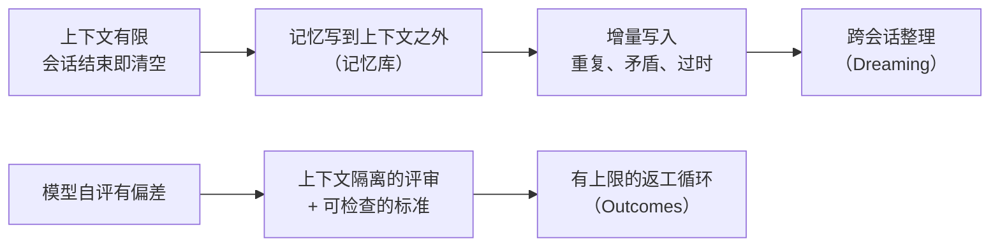
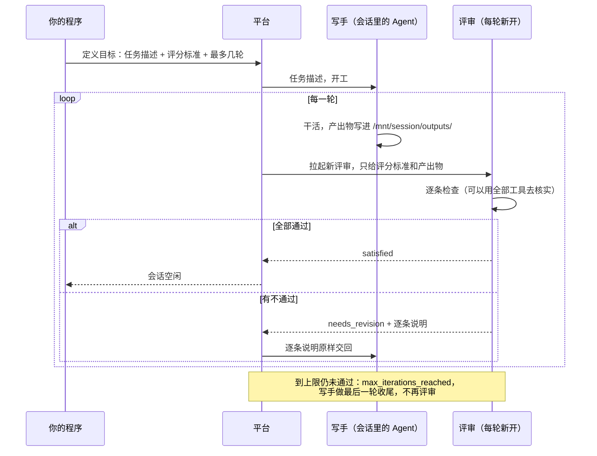

**版本范围**：本文依据 2026-10-06 核对的官方文档，2026-10-09 补充了 Claude Code 2.1.294 上的核对和实测。Outcomes 和记忆库处于公开 beta；Dreaming 是研究预览，要先申请才能用。两者都在 2026-05-06 的 Code with Claude 大会上发布。beta 阶段字段和限额都可能变，接入前以当时的文档为准。

> [!WARNING]
> **先说清哪些是实测、哪些只是读文档。** Outcomes 和 Dreaming 是 Claude 开发者平台上 Managed Agents 的接口，要用 API 余额付费，**Claude Code 里没有这两个功能**。这两部分我没有亲自跑：Outcomes 需要充值 API 余额，这次没花这笔钱；Dreaming 的研究预览没开给我的账号。所以前半篇的请求、事件和三轮返工案例全部来自官方文档和 cookbook。我实测的是 Claude Code 里的近亲：`/goal` 用同一个任务跑了 12 次，用一套写手和评审都看不到的隐藏测试打分；auto-dream 则核对了它为什么在我的账号上从没运行过。见「[Claude Code 里能看到什么](#claude-code-里能看到什么)」和「[实测：/goal 的评审到底起了多大作用](#实测goal-的评审到底起了多大作用)」。

> [!NOTE]
> **最重要的一句提醒：Outcomes 的效果几乎完全取决于评分标准怎么写。** 标准写得含糊，评审会什么都放行，循环一轮就结束，你付了钱却什么都没检查。

---

## 这篇文章写给谁

默认读者是这样的工程师：知道 LLM、上下文窗口和基础的工具调用，做过或配置过 Agent，平时用 Python、TypeScript、Go 之类的语言，但没用过 Claude Managed Agents。

你**不需要**事先知道：

- Managed Agents 的 API 结构和 SDK 写法；
- 「grader」「rubric」「memory store」这些名字，下文第一次出现时都会解释；
- 任何 Anthropic 内部实现。Anthropic 没有公开这两个机制的内部代码，本文所有「怎样实现」的部分都标明了是官方文档写明的行为，还是我的推断，还是示意伪代码。

---

## 先只记住三句大白话

1. **Outcomes 解决「这一次交付合不合格」。** 你写下合格的标准，平台另起一个评审，它看不到干活那个 Agent 的思路，只拿着标准逐条检查产出物；不合格就把逐条意见交回去返工，直到合格或者用完次数。
2. **Dreaming 解决「下一次能不能做得更好」。** 它在会话之外读一份旧记忆和最多 100 段历史会话，产出一份**新的**整理过的记忆库：重复的合并、过时的换成最新值、补上单次会话看不出的规律。旧记忆库一个字都不改。
3. **两者共用一个底座：记忆库。** 它就是一组文本文件，挂进 Agent 的沙箱，Agent 用普通的读写文件工具来用它，每次写入都留一个不可改的版本。

| | 记忆库 | Dreaming | Outcomes |
|---|---|---|---|
| 什么时候运行 | 会话进行中，Agent 随手读写 | 两次会话之间，离线异步 | 一次会话之内 |
| 解决什么 | 会话之间默认失忆 | 增量写入越积越乱 | 「看起来做完了」不等于做对了 |
| 输入 | Agent 的文件读写 | 一份旧记忆库 + 1 到 100 段会话记录 | 任务描述 + 评分标准 + 最大轮数 |
| 输出 | 记忆文件和它们的历史版本 | 一份新的记忆库 | 五种结果之一 + 评审的逐条说明 |
| 发布状态（2026-10-06） | 公开 beta | 研究预览，需申请 | 公开 beta |

---

## 从约束推出这两个机制

先别看 API，从 Agent 躲不开的几条约束往下推。

**约束一：上下文有限，而且会话结束就清空。** Managed Agents 的会话默认从空白上下文开始，结束时攒下的东西全部丢掉。想让 Agent 记住用户偏好、项目约定、上次踩过的坑，就只能把它们写到上下文之外，这就是记忆库。

**约束二：增量写入会让记忆越来越乱。** 每次会话只看得到眼前的事，于是它往记忆里追加一条「部署前要先跑迁移」，下一次又追加一条意思差不多的；某个配置改了，旧条目没人删。官方文档原话是，多次会话后记忆库会积累重复、矛盾和过时的条目。记忆本身不会变整齐，**需要一个能同时看到很多次会话的角色定期整理**，这就是 Dreaming。

**约束三：模型给自己打分不可靠。** 写手在自己的上下文里检查自己的产出，看到的是自己刚写下的思路。它会在「自认为」完成时宣布完成，不会回头重新打开一个已经引用过的链接，也不会发现自己记住的引文和原文差了几个字。要可靠地检查，**检查者必须看不到写手的思路，手里只有标准和产出物**，这就是 Outcomes 的独立评审。

**约束四：循环必须有出口。** 评审永远能挑出毛病，所以返工必须有上限，标准自相矛盾时还要能直接判失败，不能空转。

把四条串起来，最小的因果链是：



*图：概念示意，表达因果关系，不是 Anthropic 的内部架构。*

哪些是必须保留的、哪些可以替换：

| 必须保留（设计本身） | 可以替换（具体选择） |
|---|---|
| 评审的上下文和写手隔离 | 评审用哪个模型、用不用同一个模型 |
| 标准写成可逐条检查的条目 | 标准用 markdown 还是 JSON |
| 返工次数有上限，标准不适用时能判失败 | 上限具体是 3 还是 5 |
| 整理记忆时不改原件，结果先审后用 | 原件存在 Anthropic、Git 还是数据库 |
| 每次写入记忆都留版本 | 版本靠托管服务还是靠 Git |

---

## 全文只需要认识五样东西

| 大白话名字 | 官方名字 | 是什么 | 属于哪一层 |
|---|---|---|---|
| 会话 | session | Agent 一次干活的完整过程，有自己的沙箱和事件流 | 运行时 |
| 记忆库 | memory store | 一组文本文件，挂进沙箱的一个目录，跨会话保留 | 托管存储 |
| 评分标准 | rubric | 一份 markdown，逐条写明合格的样子和怎样验证 | 你写的输入 |
| 评审 | grader | 平台自动拉起的另一个 Agent，独立上下文，只按评分标准检查 | 运行时 |
| 整理任务 | dream | 一个异步任务：读旧记忆和历史会话，写出新记忆库 | 托管任务 |

下文正文尽量用左边的大白话，官方名字只出现在请求示例和来源里。

---

## 底座：记忆库怎样工作

**它在系统里的位置**：建会话时把记忆库作为一个资源挂上去，平台把它挂到沙箱里 `/mnt/memory/` 下的一个目录，并自动在系统提示里加一段说明，告诉 Agent 这个目录叫什么、放的是什么、能不能写。Agent 用和读写其他文件完全一样的工具读写它，没有专门的「记忆工具」。

几条官方写明的规则：

- **每次改动都生成一个不可改的版本**，可以审计、回滚到某个时间点，也可以从历史里抹掉敏感内容。
- **限额**：单条记忆最大 100 kB（约 2.5 万 token），一个记忆库最多 1 万条，一个会话最多挂 8 个记忆库。官方建议拆成很多小文件，而不是几个大文件。
- **只能在建会话时挂**，会话跑起来以后不能增删。
- **权限分读写和只读**，默认是读写，在文件系统层面强制执行。
- 记忆库相关接口用 `agent-memory-2026-07-22` 这个 beta 头，**不能**和会话接口的 `managed-agents-2026-04-01` 同时发，同时发会报 400；挂到会话上这一步仍然用会话接口的头。

建会话并挂上一个记忆库，完整的最小请求（取自官方文档）：

```bash
curl -s https://api.anthropic.com/v1/sessions \
  -H "x-api-key: $ANTHROPIC_API_KEY" \
  -H "anthropic-version: 2023-06-01" \
  -H "anthropic-beta: managed-agents-2026-04-01" \
  -H "content-type: application/json" \
  --data @- <<EOF
{
  "agent": "$agent_id",
  "environment_id": "$environment_id",
  "resources": [
    {
      "type": "memory_store",
      "memory_store_id": "$store_id",
      "access": "read_write",
      "instructions": "User preferences and project context. Check before starting any task."
    }
  ]
}
EOF
```

> [!CAUTION]
> **默认的读写权限是一个注入通道。** 官方文档自己写明：如果 Agent 处理不可信的输入（用户给的提示词、抓来的网页、第三方工具的输出），一次成功的提示词注入就可能把恶意内容写进记忆库，**之后的会话会把它当作可信的记忆来读**。参考资料、共享查询表这类不需要改的记忆库，一律挂成只读。

---

## Outcomes：会话内的「写手 + 评审」循环

### 一次循环发生了什么

用产品语言说一遍：

1. 你不发普通的用户消息，而是发一个「定义目标」事件，里面有三样东西：给写手看的**任务描述**、给评审看的**评分标准**、**最多返工几轮**。Agent 收到就开工，不需要再发别的消息。
2. 写手干完一轮，平台拉起一个**全新的评审**。它和写手用同一个模型、同一套工具，但上下文是独立的：看不到写手的思路，不知道写手走了哪些捷径，手里只有评分标准和产出物。
3. 评审逐条给结论。全部通过，会话结束；有不通过的，评审的说明原样交回写手，写手改完，平台再拉起一个新的评审从头查一遍。
4. 到达轮数上限还没通过，写手再做最后一轮收尾，不再评审，会话结束。



*图：依据官方文档描述的行为绘制的简化时序；评审的内部推理不对外公开。*

### 完整的请求和事件

定义目标的事件（取自官方文档，`max_iterations` 可省略，默认 3，最大 20）：

```json
{
  "events": [
    {
      "type": "user.define_outcome",
      "description": "Build a DCF model for Costco in .xlsx",
      "rubric": { "type": "text", "content": "# DCF Model Rubric\n..." },
      "max_iterations": 5
    }
  ]
}
```

这个请求发到 `POST /v1/sessions/{session_id}/events`。评分标准也可以先通过文件接口上传，然后写成 `{"type": "file", "file_id": "..."}`，方便多个会话复用、像代码一样评审。也可以在建会话时直接把这个事件放进 `initial_events`，一次请求建会话并开工。

之后从事件流里能看到三种评审事件：

```json
{ "type": "span.outcome_evaluation_start",   "outcome_id": "outc_01a...", "iteration": 0 }
{ "type": "span.outcome_evaluation_ongoing", "outcome_id": "outc_01a...", "iteration": 0 }
{
  "type": "span.outcome_evaluation_end",
  "outcome_id": "outc_01a...",
  "result": "satisfied",
  "explanation": "All 12 criteria met: revenue projections use 5 years of historical data, ...",
  "iteration": 0,
  "usage": { "input_tokens": 2400, "output_tokens": 350, "cache_creation_input_tokens": 0, "cache_read_input_tokens": 1800 }
}
```

*上面三条为便于阅读删去了 `id`、`processed_at` 等字段，字段值是官方文档里的示例值。*

`iteration` 从 0 开始数：0 是第一次评审，1 是第一次返工后的评审。中间的 `ongoing` 只是心跳，**评审在想什么你看不到**，只能看到最后的 `explanation`。

结束事件里的 `result` 决定接下来发生什么：

| 结果 | 接下来 |
|---|---|
| `satisfied` | 会话进入空闲 |
| `needs_revision` | 写手开始新一轮 |
| `max_iterations_reached` | 写手再做一轮收尾，不再评审，然后空闲 |
| `failed` | 会话进入空闲。评分标准和产出物对不上时返回，比如任务描述和评分标准互相矛盾 |
| `interrupted` | 目标进行中被你中断（发 `user.interrupt`） |

同一时间只能有一个目标，但可以串起来：上一个目标结束后再发一个「定义目标」事件。目标结束后会话照样能继续对话，历史都在。产出物写在沙箱的 `/mnt/session/outputs/`，用文件接口按会话 ID 列出来下载。

### 官方 cookbook 里的三轮返工

下面这个例子是 Anthropic 在 cookbook 里跑过并公开记录的，不是我跑的。他们让写手写一页美国直流快充站单位经济的研究简报，最多引 6 个来源，每个来源附一句原文引文。评分标准有两部分：

- **覆盖清单 7 项**，每项都比任务描述更具体。比如「运营商财务」一项要求：必须是某家上市充电运营商最近一份 10-K 或 10-Q 里的 GAAP 净利润或净亏损，**引用必须是 sec.gov 上的申报文件本身，不能是新闻稿、业绩会纪要或新闻报道**。
- **引用核查 3 步**：每个链接必须真的能用网页抓取工具直接打开（不许拿镜像、转载或搜索摘要代替）；在页面里搜引文原文；判断引文是否真的支撑它被引用的那句话。

评审实际跑出来的三轮：

| 轮次 | 评审结论 | 抓到的问题 | 写手怎么改 |
|---|---|---|---|
| 第 0 轮 | 覆盖 5/7 | 需求电费只有定性描述，没有 $/kW 数字；EVgo 的净亏损引自一个第三方新闻网站 | 补上 $20/kW；去 sec.gov 找 EVgo 2024 财年的数字 |
| 第 1 轮 | 覆盖 6/7，引用 6/6 | 新引用是 **8-K 的附件 99.1**，也就是一份提交给 SEC 的业绩新闻稿，不是 10-K | 去 EDGAR 找到真正的 10-K |
| 第 2 轮 | `satisfied`，7/7 | 无 | 共 3 轮，耗时 12 分 56 秒 |

第 1 轮最值得看。8-K 附件 99.1 也在 sec.gov 上，一个只检查「链接是不是 sec.gov」的评审会放过它。它被抓住，是因为评分标准写的是「必须是 10-K 或 10-Q，不能是新闻稿」，评审只能打开文件去确认它到底是什么。

### 评分标准怎样写才有用

cookbook 总结的原则，我按自己的理解重新归纳成四条：

| 原则 | 反例 | 正例 |
|---|---|---|
| **逼评审拿出证据** | 「检查简报是否覆盖了需求电费」：评审扫一眼看到相关段落就打勾，一个来源都不用打开 | 「找到需求电费那一节，确认它给出了 $/kW 数字或占运营成本的百分比」 |
| **比任务描述更具体** | 任务写「运营商财务」，标准也只写「运营商财务」 | 指定数据口径（GAAP 净亏损）、文件类型（10-K / 10-Q）、来源域名 |
| **写目标，不写步骤** | 规定评审必须跑某条命令；那条命令不可用时，这项检查就悄悄没做 | 定义「什么算证据」，评审有写手的全部工具，自己会找办法 |
| **堵住写手的捷径、规定反馈格式** | 不写「不许用镜像」，死链会被换成抄来的页面并通过 | 写明禁止的替代做法；要求先给一行总分，再每个失败项一条「错在哪、怎么改」，并列出不要挑的毛病（文风、范围外的问题） |

如果手里没有现成的标准，官方建议拿一份公认合格的产出物给 Claude，让它分析好在哪，再把分析改写成逐条标准。这比从空白页开始写效果好。

> [!NOTE]
> **为什么不直接把评分标准写进写手的系统提示？** 写进去能让写手瞄得更准，但它仍然是在给自己打分。它会在自认为通过时宣布通过，不会重新抓一遍已经引用过的链接，也不会发现记住的引文和原文差了几个字。独立评审开局只有标准和产出物，平台不拿到它对每一条的结论就不让循环继续，这种隔离靠一段提示词做不到。

### 什么时候用、什么时候别用

**适合用**：

- 能把「好」写成可检查条目的任务：要求覆盖完整、细节准确、引用可核实；
- 主观质量也可以，比如文案是否符合品牌口吻，前提是标准把口吻钉死到可检查的程度；
- 产出物是文件，评审能用工具打开核实。

**别用，或者先想清楚**：

- **写不出可检查的标准。** 标准含糊，评审就什么都放行，你多付了评审的 token，却什么都没检查到。
- **每轮都撞上限，而且评审指出的是同一类问题。** 这说明写手根本改不了，比如缺工具、缺权限、拿不到数据。继续加轮数只是在为不收敛付钱。
- **对延迟敏感。** 每一轮都要整份重新评审，例子里 3 轮花了 13 分钟。
- **评审和写手的盲区可能重合。** 这一条是我的推断，官方没有说：评审默认和写手用同一个模型、同一套工具，写手判断不出来的东西，评审也可能判断不出来。上下文隔离解决的是「被写手的思路带偏」，解决不了「两边都不懂」。高风险的结论仍然需要人或者确定性的检查（测试、校验脚本）。

官方给的效果数字：比标准提示词循环的任务成功率最高高 10 个百分点，难题上提升最大；生成 docx 成功率高 8.4%，pptx 高 10.1%。**这些都是厂商内部基准，需要辩证看待**，具体到你的任务，最好自己拿一批样本跑对照。

---

## Dreaming：会话之间的记忆整理

### 一次整理任务发生了什么

整理任务是一个**异步任务**，输入两样东西：

- 一份**已有的记忆库**：要核对、去重、重新组织的对象；
- **1 到 100 段会话**：过去的完整记录，从里面找规律，折进新记忆。

它产出**另一份记忆库**，和输入分开。任务开始运行后，平台先把输入的记忆库复制一份，新库的 ID 随后出现在任务的 `outputs[]` 里。官方明确写了：**整理任务从不删除、从不修改它的输入。**

一份旧记忆都没有、只有会话记录时，先建一个空记忆库当输入。

### 完整的请求和响应

整理任务的接口需要两个 beta 头，只有会话接口那个不够。完整的最小请求（取自官方文档）：

```bash
curl -s https://api.anthropic.com/v1/dreams \
  -H "x-api-key: $ANTHROPIC_API_KEY" \
  -H "anthropic-version: 2023-06-01" \
  -H "anthropic-beta: managed-agents-2026-04-01,dreaming-2026-04-21" \
  -H "content-type: application/json" \
  --data @- <<EOF
{
  "inputs": [
    { "type": "memory_store", "memory_store_id": "$store_id" },
    { "type": "sessions", "session_ids": ["$session_a", "$session_b"] }
  ],
  "model": "claude-opus-4-8",
  "instructions": "Focus on coding-style preferences; ignore one-off debugging notes."
}
EOF
```

立刻返回的是一个处于排队状态的任务对象（同样取自文档）：

```json
{
  "type": "dream",
  "id": "drm_01AbCDefGhIjKlMnOpQrStUv",
  "status": "pending",
  "inputs": [
    { "type": "memory_store", "memory_store_id": "memstore_01Hx..." },
    { "type": "sessions", "session_ids": ["sesn_01...", "sesn_02..."] }
  ],
  "outputs": [],
  "model": { "id": "claude-opus-4-8" },
  "instructions": "Focus on coding-style preferences; ignore one-off debugging notes.",
  "session_id": null,
  "created_at": "2026-04-29T17:04:10Z",
  "ended_at": null,
  "archived_at": null,
  "usage": { "input_tokens": 0, "output_tokens": 0, "cache_read_input_tokens": 0, "cache_creation_input_tokens": 0 },
  "error": null
}
```

研究预览阶段支持的模型：`claude-opus-5`、`claude-fable-5`、`claude-opus-4-8`、`claude-opus-4-7`、`claude-sonnet-5`、`claude-sonnet-4-6`。

### 状态、观察和收尾

| 状态 | 含义 |
|---|---|
| `pending` | 已创建，排队中 |
| `running` | 正在处理，`usage` 随进度更新 |
| `completed` | 成功，`outputs[]` 里就是新记忆库 |
| `failed` | 出错。新记忆库保留出错前写进去的内容 |
| `canceled` | 被取消。新记忆库同样保留 |

一次任务通常几分钟到几小时，主要取决于输入的会话有多少。任务运行时，它的 `session_id` 指向底层执行整理的那个会话，**你可以订阅这个会话的事件流，实时看它读了什么、写了什么**；任务结束后这个会话被归档而不是删除，记录还能查。

拿到结果后有两条路：

- **采用**：把新记忆库挂到以后的会话上，替换旧库或者和旧库一起挂；
- **丢弃**：删除或归档新记忆库。

任务运行期间如果你删除或归档了输入的记忆库、删了输入的会话，任务会失败（`input_memory_store_unavailable` / `input_session_unavailable`）。

### 引导整理方向：`instructions` 能做什么、不能做什么

可选的 `instructions`（最长 4,096 字符）会贯穿整个整理过程：读什么要细看、什么该合并或丢掉、输出怎样组织。适合写高层方向，比如「重点关注代码风格偏好」「这部分内容原样保留」「统一用某种文件结构」。

**它是一次综合重写，不是逐行编辑器。** 「把第 X 句改成 Y」「修正 Z 节里的计数」这类指令通常不会产生任何变化。要精确改某一条，直接用记忆库接口改新库。

### 成本和定时

整理任务按所选模型的标准 token 价计费，`usage` 字段给出准确总数。官方说成本大致随输入会话的数量和长度线性增长，建议先拿一小批会话试，满意了再加量。

官方博客把 Dreaming 描述成「定时运行的流程」，可以自动更新记忆，也可以先审后用。截至 2026-10-06，我在文档里只看到手动创建任务的接口，没有找到定时配置项；自己接入时，可以用定时任务去调这个接口，审核步骤放在采用新库之前。

客户案例方面，官方博客说 Harvey 用了 Dreaming 后测试中的任务完成率提升约 6 倍；只用记忆库（不含 Dreaming）时，Rakuten 第一遍出错少 97%、成本降 27%、延迟降 34%。**这些都是厂商转述的客户数据，没有公开的测试方法，需要辩证看待。**

---

## Claude Code 里能看到什么

先把位置说清楚：Outcomes 和 Dreaming 是 **Claude 开发者平台**上 Managed Agents 的功能，要自己写代码调接口、按 token 付费。平时在终端或桌面版里用的 **Claude Code 里没有这两个名字**。它们各有一个近亲，名字和用途都像，关键设计却不一样。本节结论来自 2026-10-09 在 Claude Code 2.1.294 上的核对：官方文档、本机的程序与配置，以及下一节的实际运行。

### Outcomes 的近亲：`/goal`

`/goal <条件>` 给当前会话设一个完成条件。每轮结束后，Claude Code 把**条件和到目前为止的整段对话**交给一个小模型（默认 Haiku）判断，回答「未达成 / 达成 / 不可能」并附一句理由；未达成就把理由交回去，Claude 接着干。官方文档写明，它是一个「只在本会话生效、由提示词判断的 Stop 钩子」外面包了一层。

| | Outcomes（Managed Agents） | `/goal`（Claude Code） |
|---|---|---|
| 评审是谁 | 平台每轮新拉起一个评审，默认和写手同一个模型 | 配置的小模型，默认 Haiku |
| 评审看到什么 | 只有评分标准和产出物，**看不到写手的思路** | 条件 + **整段对话**：写手说了什么、跑了什么 |
| 评审能不能自己查证 | 能，有写手的全部工具，可以打开文件、跑代码 | **不能**，不调工具，只能根据对话里已经出现的内容判断 |
| 写手和标准的关系 | 任务描述给写手，评分标准给评审，两者分开写 | 条件本身就是给写手的指令，写手全看得到 |
| 轮数上限 | `max_iterations`，默认 3、最多 20，平台强制 | 没有硬上限；「最多 N 轮」只能写进条件让评审去判断，硬刹车是 `/goal clear` 或 `claude -p` 的 `--max-budget-usd` |
| 可能的结果 | 通过 / 需返工 / 到达上限 / 标准不适用 / 被中断 | 达成 / 未达成 / 不可能，外加出错自动清除、连续几轮不动手时停下 |
| 评审的花费 | 按评审所用模型的标准价计费，会话另收运行时长费 | 走小模型，官方说通常可以忽略 |

一句话：**Outcomes 的评审是另一个能动手核查的人，`/goal` 的评审是一个只读会议记录的人。** 前文说 Outcomes 的关键是评审和写手的上下文隔离，`/goal` 恰好没有这层隔离：写手在对话里跑出了什么、说了什么，评审就据此下结论。所以用 `/goal` 时，条件要写成「对话里能证明的东西」，比如「`npm test` 退出码为 0，汇总行显示 0 failed」，并要求写手把证据真的跑出来。

### Dreaming 的近亲：auto-dream

Claude Code 的 auto memory（Claude 自己往记忆目录里记笔记）还有一个后台整理功能，程序里叫 auto-dream：距上次整理满一定小时数、又攒够几次新会话后，后台派一个子 Agent 读最近的会话记录，合并、修正记忆目录里的文件。

| | Dreaming（Managed Agents） | auto-dream（Claude Code） |
|---|---|---|
| 怎么触发 | 你调接口建任务 | 自动触发。程序里的默认门槛是距上次至少 24 小时、至少 5 次新会话；我的账号拿到的远程配置是 24 小时、3 次 |
| 输入 | 一份记忆库 + 1 到 100 段会话 | 本项目的记忆目录 + 上次整理以来的会话记录 |
| 输出 | **另出一份**新记忆库，原库不动，先审后用 | **直接改**记忆目录里的文件 |
| 官方文档 | 有，研究预览，需申请 | 没有。设置项 `autoDreamEnabled` 不在官方设置参考里，只出现在程序内置的设置说明中 |
| 谁能用 | 申请通过的账号 | 服务端灰度开关决定 |

*auto-dream 一行的门槛和行为是我从 2.1.294 的程序和配置里读出来的，不是官方承诺，随时可能变。*

我这台机器上，两条路都不通：

- **API**：个人 key 调 `GET /v1/dreams` 返回 404，和请求一个根本不存在的路径一样；同一把 key 调会话、记忆库的列表接口都是 200。也就是 Managed Agents 能用，Dreaming 研究预览没开给这个账号。
- **Claude Code**：`~/.claude.json` 里缓存的灰度开关 `tengu_onyx_plover` 是 `{"enabled": false, "minHours": 24, "minSessions": 3, "remoteEnabled": false}`；整个 `~/.claude` 和记忆目录里都找不到 auto-dream 运行时会留下的锁文件 `.consolidate-lock` 或任何整理状态，说明它从没跑过。在设置里写 `"autoDreamEnabled": true` 也没用：程序先看灰度开关，开关关着就根本不读这个设置。官方仓库的 [issue #86209](https://github.com/anthropics/claude-code/issues/86209) 报过一模一样的现象，后来因为长期没人跟进被自动关闭，没有修。

所以，**在 Claude Code 里看不到 Dreaming，不是漏开了某个选项，而是账号没被放进灰度。** 能看到的「验收循环」只有 `/goal`，而它和 Outcomes 恰好差在最关键的那一点上。

---

## 实测：/goal 的评审到底起了多大作用

Outcomes 这次没跑（原因见开头），这里实测它在 Claude Code 里的近亲 `/goal`。要回答的问题是：**每轮之后多一个评审，产出有没有变好？变好是因为评审，还是因为把标准写清楚了？**

### 怎么测

- **任务**：写一个 Python 函数 `parse_duration`，把 "1h30m"、"45s" 这样的时长换算成秒，并附 pytest 测试。给写手的说明只有一句：

  ```text
  Write a Python module `duration.py` that exposes `parse_duration(text: str) -> int`, converting compact duration strings such as "1h30m" or "45s" into a whole number of seconds. Invalid input must raise an exception. Also write a pytest file `test_duration.py` for it. Put both files in the current directory.
  ```

- **严格标准**：23 个例子，分四类，外加「测试覆盖每条规则并通过」。数值 7 个（含「组件之间允许一个空格」「首尾空白忽略」两条）；必须报 `ValueError` 的写法 13 个（空串、只有数字、只有单位、未知单位、大写 "1H"、小数、正负号、单位顺序颠倒 "30m1h"、单位重复 "1h1h"、数字和单位之间有空格、两个空格）；必须报 `TypeError` 的类型 3 个（`None`、`90`、`b"1h"`）。
- **宽松标准**：只要求「常见格式能换算、非法输入抛异常、测试通过」。
- **隐藏测试**：用严格标准的 23 个例子写了一个打分脚本，写手和评审都看不到，全部跑完后统一给每次的产出打分。脚本先自检过：参考实现得 23/23，一个故意写得粗糙的实现得 13/23。
- **分组**：四组各跑 3 次，写手统一用 Claude Sonnet 5.5。每次都用 `claude -p` 在一个空目录里跑，不加载我的用户级设置和记忆。

| 组 | 写手拿到什么 | 评审 |
|---|---|---|
| A 一句话 | 上面那一句 | 无 |
| B 规则写进提示词 | 一句话 + 严格标准全文 | 无 |
| C `/goal` + 严格条件 | 和 B 完全相同的文字，前面加 `/goal` | Haiku，每轮结束后读对话判断 |
| D `/goal` + 宽松条件 | 一句话 + 宽松标准，前面加 `/goal` | 同上 |

C、D 两组的条件原文：

```text
C: /goal Write a Python module `duration.py` that exposes `parse_duration(text: str) -> int`, converting compact duration strings such as "1h30m" or "45s" into a whole number of seconds, plus a pytest file `test_duration.py`, both in the current directory. The goal is met only when all of the following hold, each shown in this conversation by actually running the examples and pytest: (1) "1h30m" -> 5400, "45s" -> 45, "2d" -> 172800, "0s" -> 0, "1d2h3m4s" -> 93784, units d=86400 h=3600 m=60 s=1, return type int; (2) one space between components is allowed ("1h 30m" -> 5400) and leading/trailing whitespace is ignored (" 45s " -> 45); (3) each of these raises ValueError: "", "   ", "90", "h", "5w", "1H", "1.5h", "-5m", "+5m", "30m1h", "1h1h", "1 h", "1h  30m"; (4) None, 90 and b"1h" raise TypeError; (5) test_duration.py covers every rule above and `python -m pytest` passes.

D: /goal Write a Python module `duration.py` that exposes `parse_duration(text: str) -> int`, converting compact duration strings such as "1h30m" or "45s" into a whole number of seconds, plus a pytest file `test_duration.py`, both in the current directory. The goal is met when parse_duration converts common duration strings such as "1h30m" and "45s" to seconds, invalid input raises an exception, and the tests in test_duration.py pass.
```

### 结果

2026-10-09 跑的 12 次：

| 组 | 隐藏测试得分（3 次，满分 23） | 评审判定 | 每次用时 | 每次花费（订阅额度折算） |
|---|---|---|---|---|
| A 一句话 | 22、20、19 | 无评审 | 14–15 秒 | 约 $0.05 |
| B 规则写进提示词 | 23、23、23 | 无评审 | 15–26 秒 | $0.05–0.08 |
| C `/goal` + 严格条件 | 23、23、23 | 3 次都在第一轮后判「达成」 | 24–27 秒 | 约 $0.07 |
| D `/goal` + 宽松条件 | 18、18、18 | 3 次都在第一轮后判「达成」 | 13–20 秒 | $0.04–0.07 |

评审每判一次耗时 1.6 到 8.2 秒。它的结论不在 `claude -p` 的输出流里，而是记在会话记录 `~/.claude/projects/<目录>/<会话 ID>.jsonl` 中一条 `goal_status` 记录里。D 组第 2 次的原样是：

```json
{"type": "goal_status", "met": true, "iterations": 1,
 "reason": "The transcript shows duration.py and test_duration.py were written with the Write tool to the current directory. The test file asserts ('45s', 45) and ('1h30m', 5400), and test_invalid covers inputs such as '' , 'abc' and '30m1h' with pytest.raises(ValueError). The Bash run returned '19 passed in 0.01s', so the tests pass."}
```

*为便于阅读删去了 `durationMs`、`tokens` 两个字段。*

三点观察：

1. **这次起作用的是把标准写清楚，不是评审。** B 组没有任何评审，3 次同样满分；C 组的评审 3 次都在第一轮后就判「达成」，一次也没让 Claude 多干一轮。A 组丢的分全在说明里没写的规则上：「组件之间允许一个空格」3 次都没猜中；有两次自己加了「周」这个单位，把 "5w" 当成 5 周接受；另外分别有一次接受了大写 "1H"、接受了颠倒的 "30m1h"、拒绝了带首尾空白的 " 45s "。写手不是能力不够，而是不知道你要什么。
2. **条件写松，评审照样放行。** D 组 3 次都判「达成」，隐藏测试却只有 18/23，而且 3 次错得一模一样：大写 "1H" 被当成 1 小时接受，`None`、`90`、`b"1h"` 抛的是 `ValueError` 而不是 `TypeError`，组件之间的空格被拒绝。评审的理由都是「pytest 通过了」（比如「19 passed」），而那份测试是写手按自己的理解写的。这就是开头那句提醒在 `/goal` 上的样子：标准含糊，评审就放行。D 组还比什么都不加的 A 组低，我的猜测是「非法输入抛异常」这句把写手引向了一律抛 `ValueError`，3 次样本不足以下结论。
3. **评审只看对话。** 6 次判定的理由引用的全是对话里出现过的东西：「Bash 运行打印了……」「Write 工具报告 File created successfully」「pytest 显示 22 passed」。它没有、也没法自己打开 `duration.py` 跑一遍。

**局限**：任务很小，Sonnet 5.5 一轮就做完，评审没有机会发挥 `/goal` 的本来用途，也就是把还没做完就想停下的 Claude 推回去接着干（长时间的迁移、清空待办这类任务）。每组只跑了 3 次。所以这组数据只能说明一件事：**在一轮就能做完的任务上，`/goal` 的评审不会替你补上没写进条件的要求。** Outcomes 的评审能用工具核查，换成 Outcomes 能不能抓住 D 组那几处错，仍然取决于评分标准里有没有写，这一点我没有实测，是按设计推断的。

---

## 风险：记忆是注入的长期通道

前面引过官方的警告：读写权限的记忆库，一次注入就能把恶意内容写进去，之后的会话都会信它。Dreaming 让这个风险多了一层。

**下面是我的推断，官方文档没有讨论**：整理任务会读最多 100 段会话的完整记录。如果其中一段会话读过被注入的网页或工具输出，整理任务可能把注入的内容当成「多次会话里反复出现的规律」，写进新记忆库，而且写得比原来更像一条正经的经验。

能做的防守：

- **按信任度拆记忆库。** 处理不可信输入的 Agent，只给它挂只读的参考记忆库；需要写的记忆库，只挂给不碰外部输入的 Agent。这和 Meta 提出的 [Rule of Two](https://ai.meta.com/blog/practical-ai-agent-security/) 是同一个思路：「处理不可信输入」「接触敏感数据或系统」「改变状态或对外通信」三者，一个会话最多同时占两样；三样都占，就不能让它自主运行，至少要有人审批或别的可靠验证手段。
- **整理结果先审后用。** Dreaming 默认不覆盖原库，审核这一步就是防线。处理不可信输入的场景，别配成自动采用。
- **挑选喂给整理任务的会话。** 读过大量外部内容的会话，要么不喂，要么在 `instructions` 里明确只提炼某类信息。

---

## 搬到自己的技术栈：两份契约

Outcomes 和 Dreaming 都是托管功能，但设计和 Anthropic 无关，任何模型、任何语言都能复刻。下面把它们翻译成输入、输出、状态和不变量。

### 契约一：有上限的独立验收循环

| | 内容 |
|---|---|
| 输入 | 任务描述（给写手）、评分标准（给评审）、产出物位置、最大轮数 |
| 状态 | 当前轮次、每轮评审结论 |
| 输出 | 通过 / 需返工 / 到达上限 / 标准不适用 / 被中断，加上逐条说明 |
| 不变量 | 每轮评审都是新上下文；评审只拿到评分标准、产出物和工具，拿不到写手的思路；循环一定会结束 |

示意伪代码（Python 写法，不是任何 SDK 的真实接口）：

```python
def run_outcome(task, rubric, max_iterations=3):
    workspace = new_workspace()            # 产出物放这里，写手和评审都能读
    feedback = None
    for iteration in range(max_iterations):
        writer_turn(workspace, task, feedback)       # 写手：同一个会话，带着上一轮意见接着干
        verdict = grade_in_fresh_context(rubric, workspace)  # 评审：新上下文，只有标准和产出物
        if verdict.result in ("satisfied", "failed"):
            return verdict
        feedback = verdict.explanation               # 逐条意见原样交回写手
    writer_turn(workspace, task, feedback, final=True)   # 收尾一轮，不再评审
    return Verdict("max_iterations_reached", feedback)
```

要点在 `grade_in_fresh_context`：它不能复用写手的对话历史，要用一个全新的请求，系统提示里只有评分标准，产出物通过工具去读。换成 Go、TypeScript 或者别家模型都一样。如果你用 Temporal 这类工作流引擎（我在[为什么从 Celery 迁移到 Temporal](/posts/why-temporal-not-celery/)里讲过），它就是一个有上限的循环工作流，写手和评审各是一个独立的 activity，轮次和结论天然落在工作流历史里。

### 契约二：不改原件的记忆整理

| | 内容 |
|---|---|
| 输入 | 当前记忆的快照、若干段会话记录、整理方向 |
| 输出 | 一份新记忆 |
| 不变量 | 永远不改输入；新记忆可以和旧的逐条比对（diff）；采用前有审核点；每条记忆能追溯来自哪次会话 |

示意伪代码（Anthropic 没有公开整理流水线的内部做法，这里只表达契约）：

```python
def consolidate(store, transcripts, focus=None):
    draft = clone(store)                     # 先复制；文档写明官方也是先复制输入记忆库
    for t in transcripts:
        draft = synthesize(draft, t, focus)  # 合并重复、用新值替换过时条目、补跨会话规律
    return draft                             # 交给人看 diff(store, draft)，通过再换上
```

我在[LLM 记忆调研](/posts/llm-memory-research/)里把 Agent 记忆拆成一条闭环：经历、写入、存储、检索、组装上下文、行动反馈，最后是巩固、修订和遗忘。Dreaming 就是把「巩固 / 修订」这一步单独拿出来，做成一个离线、可审核的批处理任务。

---

## 我的手动版：用 Git 仓库做「Dreaming」

我自己的 Agent 工作记忆是一个私有 Git 仓库，回头看，它几乎是 Dreaming 的手动版：

| Managed Agents | 我的工作记忆仓库 |
|---|---|
| 记忆库：很多小文件 | `memory/` 目录：一个文件只记一个事实，带 frontmatter；另有一个索引文件，每次会话自动载入，限制在 200 行以内 |
| 每次写入一个不可改的版本 | Git 提交历史 |
| 整理任务的输入：历史会话 | 每日日志：记录「发生了什么」的原始材料 |
| 整理任务：合并重复、替换过时、补规律 | 定期整理：合并重复条目、删掉被证伪的、把只埋在日志里的关键教训提升成独立的记忆条目 |
| 新记忆库先审后用 | 改动先看 `git diff`，确认了再提交 |

差别也很清楚：

- **我是原地改，它是另出一份。** 我靠 Git 回滚兜底，它从设计上就不碰原件，更安全。值得借鉴的做法是整理时先开一个分支，审过 diff 再合并，这就等于「原库不动」。
- **它会读会话原文，我只读日志。** 日志已经是我筛过一遍的东西，单次会话里没被我注意到的模式，我的整理看不到。
- **我的验收靠规则。** 我给 Agent 定过一条规矩：不能先写「已合并」「已部署」再去做，必须以 PR 状态、CI、部署日志这类机器证据为准。这和 Outcomes 的评分标准是同一个道理：**让检查者必须拿出证据，而不是相信干活的人说自己做完了。**

---

## 最值得带走的七点

1. **Outcomes 解决的是自评偏差。** 关键不是「多一个 Agent」，而是评审的上下文和写手隔离，手里只有标准和产出物。
2. **评分标准决定一切。** 标准要比任务描述更具体，每一条都要逼评审拿出证据，否则它会什么都放行。
3. **循环必须收敛。** 每轮都撞上限且问题同类，说明写手改不了，加轮数没用。
4. **Dreaming 解决的是记忆的熵增。** 它离线读很多次会话，另出一份整理好的记忆库，原库不动，先审后用。
5. **记忆是注入的长期通道。** 默认读写的记忆库、加上会读会话原文的整理任务，都要按信任度拆分并保留审核点。
6. **两者都能脱离 Anthropic 复刻。** 一个是有上限的独立验收循环，一个是不改原件的记忆整理，换任何模型和语言都成立。
7. **Claude Code 里只有 `/goal`，它的评审只读对话。** 实测里起作用的是把标准写清楚；条件写松，它照样判「达成」。auto-dream 还在灰度，没被放进去的账号设置了也没用。

**铁律：别让干活的人自己验收，也别让记忆只增不理。**

---

## 来源

- [Define outcomes（官方文档）](https://platform.claude.com/docs/en/managed-agents/define-outcomes)：定义目标事件、三种评审事件、五种结果、评分标准写法
- [Dreams（官方文档）](https://platform.claude.com/docs/en/managed-agents/dreams)：整理任务的输入输出、状态、`instructions` 的边界、计费与限额
- [Using agent memory（官方文档）](https://platform.claude.com/docs/en/managed-agents/memory)：挂载方式、版本、限额、只读与注入警告、beta 头
- [Outcomes: agents that verify their own work（Claude Cookbook，2026-05-03）](https://platform.claude.com/cookbook/managed-agents-cma-verify-with-outcome-grader)：EV 快充简报的三轮返工与评分标准原则
- [New in Claude Managed Agents: dreaming, outcomes, and multiagent orchestration（Anthropic 博客）](https://claude.com/blog/new-in-claude-managed-agents)：发布状态、+10 / +8.4% / +10.1%、Harvey 约 6 倍
- [Memory for Claude Managed Agents（Anthropic 博客，2026-04-23）](https://claude.com/blog/claude-managed-agents-memory)：记忆库公开 beta、Rakuten 数据
- [ZDNET：Your Claude agents can 'dream' now（2026-05-06）](https://www.zdnet.com/article/your-claude-agents-can-dream-now-how-anthropics-new-feature-works/)、[SiliconANGLE（2026-05-06）](https://siliconangle.com/2026/05/06/anthropic-letting-claude-agents-dream-dont-sleep-job/)、[Simon Willison 的 Code w/ Claude 2026 现场记录](https://simonwillison.net/2026/May/6/code-w-claude-2026/)：发布日期与第三方报道
- [Meta：Agents Rule of Two: A Practical Approach to AI Agent Security（2025-10-31）](https://ai.meta.com/blog/practical-ai-agent-security/)
- [Keep Claude working toward a goal（Claude Code 文档）](https://code.claude.com/docs/en/goal)：`/goal` 的评审方式、只读对话不调工具、评审 token 通常可忽略
- [All settings（Claude Code 文档）](https://code.claude.com/docs/en/settings-reference)：2026-10-09 核对，没有 `autoDreamEnabled` 这一项
- [anthropics/claude-code#86209](https://github.com/anthropics/claude-code/issues/86209)：灰度开关关着时 `autoDreamEnabled` 被静默忽略
- [Pricing（官方文档）](https://platform.claude.com/docs/en/about-claude/pricing)：Managed Agents 按 token 加会话运行时长（$0.08 / 小时）计费
- [为什么 Claude 订阅之外还要单独为 API 付费（Claude 帮助中心）](https://support.claude.com/en/articles/9876003-i-have-a-paid-claude-subscription-pro-max-team-or-enterprise-plans-why-do-i-have-to-pay-separately-to-use-the-claude-api-and-console)：订阅额度不含 API 用量

> 核对日期：2026-10-06；2026-10-09 补充 Claude Code 2.1.294 的核对与 `/goal` 实测。Outcomes 与记忆库为公开 beta，Dreaming 为研究预览，字段、限额和支持的模型都可能变化；本文 Outcomes、Dreaming 和记忆库的请求示例均取自上述官方文档，我没有实际运行；伪代码只表达设计契约，不代表 Anthropic 的内部实现。
