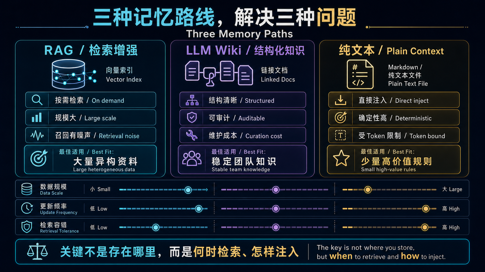

目前工业界有三条主流路线——RAG（向量检索）、LLM Wiki（结构化知识注入）、纯文本上下文记忆（CLAUDE.md / Cursor Rules 模式）。三条路各有拥趸，但**选错的代价很大**：RAG 做轻了是噪音生成器，纯文本做重了是 token 焚化炉。

这篇给出一个可以直接用的决策框架。

先看三条路线的系统边界。它们的核心差异不是数据库品牌，而是**检索发生在什么时候、多少内容进入 Context、写入和维护由谁负责**。



---

## 三种方案一句话定义

| 方案 | 核心机制 | 代表产品/模式 |
|------|---------|-------------|
| **RAG** | 向量检索 → top-k 片段 → 拼入 prompt | Mem0, Zep, LangChain RAG, Cursor Codebase Index |
| **LLM Wiki** | 结构化文档 → 全量或按需注入 system prompt | Claude Projects, GPTs Knowledge, Notion AI |
| **纯文本上下文** | Markdown/文本文件 → 直接拼入 system prompt | CLAUDE.md, Cursor Rules, AGENTS.md, Devin Knowledge |

关键区别不在于"存哪里"，而在于**检索方式**和**注入时机**。

---

## 决策矩阵

| 维度 | RAG | LLM Wiki | 纯文本上下文 |
|------|-----|----------|------------|
| **数据量** | 大（>100 篇文档） | 中（10–100 篇） | 小（<10 个文件，<200 行） |
| **更新频率** | 高频，实时或近实时 | 中频，周/天级 | 低频，项目级约定 |
| **检索精度要求** | 需要语义匹配（"找和这个问题最相关的段落"） | 需要结构化浏览（"看第三章第四节"） | 不需要检索，全量加载 |
| **延迟** | +50–500ms（embedding + 检索 + 重排） | 0（预加载） 或 +100ms（按需 fetch） | 0（全量在 prompt 里） |
| **token 成本** | 低（只注入相关片段） | 中（按章节注入） | 高（全量每次塞入） |
| **可维护性** | 低（chunk 策略、embedding 模型、检索参数都要调） | 中（文档结构需维护） | 高（就是 Markdown，改一下 commit 就行） |
| **可解释性** | 低（"为什么检索到这段？"难以回答） | 高（"因为你看了第三章"） | 最高（全部可见） |
| **幻觉风险** | 高（检索噪音 → 错误上下文 → 幻觉） | 低 | 低 |
| **适合场景** | 客服知识库、代码库搜索、大规模文档 QA | 项目文档、产品手册、合规知识库 | 项目约定、编码规范、个人偏好 |

---

## 什么时候选 RAG

RAG 不是银弹。**只有当数据量超过 prompt 容量上限时才值得上 RAG。** 如果你只有 20 篇文档，直接全塞进去都比 RAG 好——因为检索噪音引入的错误比省下的 token 钱贵得多。

**RAG 的正确使用场景：**

- 文档量 >100 篇，且用户每次只关心其中 1-3 篇
- 需要语义匹配而非关键词匹配（"报错了"要能匹配到 "error log"）
- 数据实时更新（比如接入了实时数据库）
- 你可以接受偶尔检索到不相关的内容

**RAG 的常见翻车姿势：**

- 把 10 篇文档建了个向量库——杀鸡用牛刀，检索噪音 > 信息增益
- Chunk size 乱设——太小丢上下文，太大检索不准
- 不看重排（rerank）——top-k 里混入无关片段，模型被带偏
- Embedding 模型和生成模型不匹配——用 OpenAI embedding 但用 Claude 生成，语义空间不一致

> 有一条经验法则：**先试着把所有相关内容直接塞进 prompt。如果塞不下，再上 RAG。** 这个顺序不能反过来——RAG 是不得已的选择，不是默认选择。

---

## 什么时候选 LLM Wiki

LLM Wiki 指的是结构化的、可供模型按需检索或全量加载的知识库。它不像 RAG 那样靠向量相似度，也不像纯文本那样全量堆进去——**它是"有目录的文档"**。

**适合 LLM Wiki 的场景：**

- 知识有清晰的层级结构（产品手册、API 文档、合规条例）
- 用户需要"翻到某一节"而不是"搜一个片段"
- 需要人工审核和版本管理（合规场景尤其重要）

Claude Projects 里的 Project Knowledge 就是典型的 LLM Wiki——你把文档传进去，模型在需要时引用。GPTs 的 Knowledge 功能同理。

**LLM Wiki vs RAG 的本质区别：**

RAG 是"我猜你想看这几段"，LLM Wiki 是"这是目录，你要看哪一章"。前者靠语义相似度，后者靠结构导航。前者可能猜错，后者不会——但后者要求用户或 Agent 知道该看哪一章。

---

## 什么时候选纯文本上下文记忆

这就是 CLAUDE.md / Cursor Rules / AGENTS.md 模式。一个 Markdown 文件，每次对话全量注入 system prompt。**听起来很笨，但在正确场景下是最优解。**

**为什么这个"笨办法"反而是最好的：**

1. **可审计**——每次改了啥，`git diff` 一目了然
2. **可版本管理**——记忆有了 git history，你可以回到三天前的状态
3. **零延迟**——不需要 embedding，不需要检索，直接拼进 prompt
4. **零噪音**——你写的每个字都在 prompt 里，不存在"检索到错误段落"
5. **不容易被 prompt injection**——内容是人工写的，不是 AI 自动生成的

Cursor 1.2 给 Memories 加 user approval、Devin Knowledge 默认走 suggestion——都是被 prompt injection 教训之后的设计共识。纯文本记忆不需要"信任 AI 自己记的东西"，因为每一条都是人写的。

**适合纯文本记忆的场景：**

- 项目级约定（"我们用的 Java 17，Spring Boot 3.x"）
- 编码规范（"不要用 Lombok，用 record"）
- 个人偏好（"回答用中文，代码注释用英文"）
- Agent 行为约束（"调用工具前先确认"）

**不适合的场景：**

- 数据量超过约 200 行——占用太多 context window，挤压真正有用的 token
- 需要动态更新的知识——每次改都要手动编辑文件
- 多项目共享的知识——容易拷贝粘贴导致不一致

---

## 实战决策树

```
你的知识数据有多大？
├── <10 个 Markdown 文件，总计 <200 行
│   └── 纯文本上下文（CLAUDE.md / Cursor Rules）
│       优势：零延迟、可 git、零噪音
│
├── 10–100 篇文档，有清晰结构
│   └── LLM Wiki（Claude Projects / GPTs Knowledge）
│       优势：结构化导航、按需加载、人工可审核
│
└── >100 篇文档，或需要语义搜索
    └── RAG（Mem0 / Zep / 自建向量库）
        前提：你已经验证过"全量塞 prompt"真的塞不下
        提醒：RAG 的维护成本是另外两种方案的 10 倍
```

---

## 一个常见的错误组合

很多团队一上来就同时用了三种：

```
CLAUDE.md（纯文本）
  + 向量库 RAG（一堆文档）
  + Wiki 知识库（产品文档）
```

三套系统同时往 prompt 里塞东西。结果：
- Token 成本爆炸
- 信息互相矛盾（纯文本说用 Go，Wiki 里的旧文档说用 Python）
- 排查问题变成"到底是哪段上下文导致的？"

**正确做法：选一种作为主记忆层，另外两种仅在必要时补充。** 大多数个人开发者和 10 人以下团队，纯文本 + 一个 LLM Wiki 就够了。RAG 是规模化之后的事。

---

## 和 LLM 记忆调研的关系

这篇文章是 [大模型为什么没有记忆](/posts/llm-memory-research/) 调研的工程落地篇。调研里讲的四层栈（裸 LLM → 架构内记忆 → 长上下文 → Agent 记忆层），本文聚焦在 **L4 Agent 记忆层的选型**。

调研中 Karpathy 的类比这里再引用一次，因为太好用了：

> **权重 = ROM**（训练时烧入，静态）
> **Context Window = RAM**（推理时直接寻址）
> **KV Cache = Working Memory**（test-time 形成）
> **外部存储 = Disk**（持久但需要 retrieve）

你选的方案决定了 Agent 的"硬盘"长什么样——是高速 SSD（纯文本）、按需挂载的文件系统（LLM Wiki）、还是带搜索引擎的数据库（RAG）。

---

## 总结

| 如果你... | 选这个 |
|-----------|--------|
| 数据少、变更低频、需要可审计 | **纯文本上下文** |
| 数据有清晰结构、需要按章节引用 | **LLM Wiki** |
| 数据多、需要语义搜索、能接受检索噪音 | **RAG** |

没有银弹。但有一个铁律：**能不用 RAG 就不用 RAG——等你真的需要它的时候，你会知道的。**
