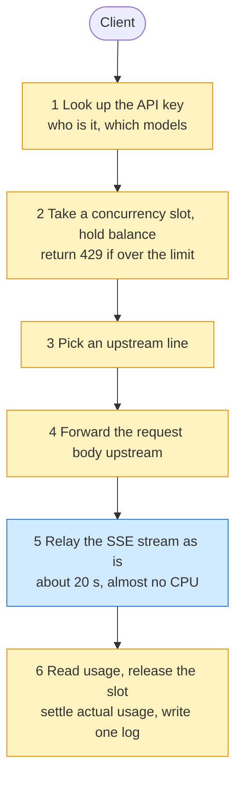
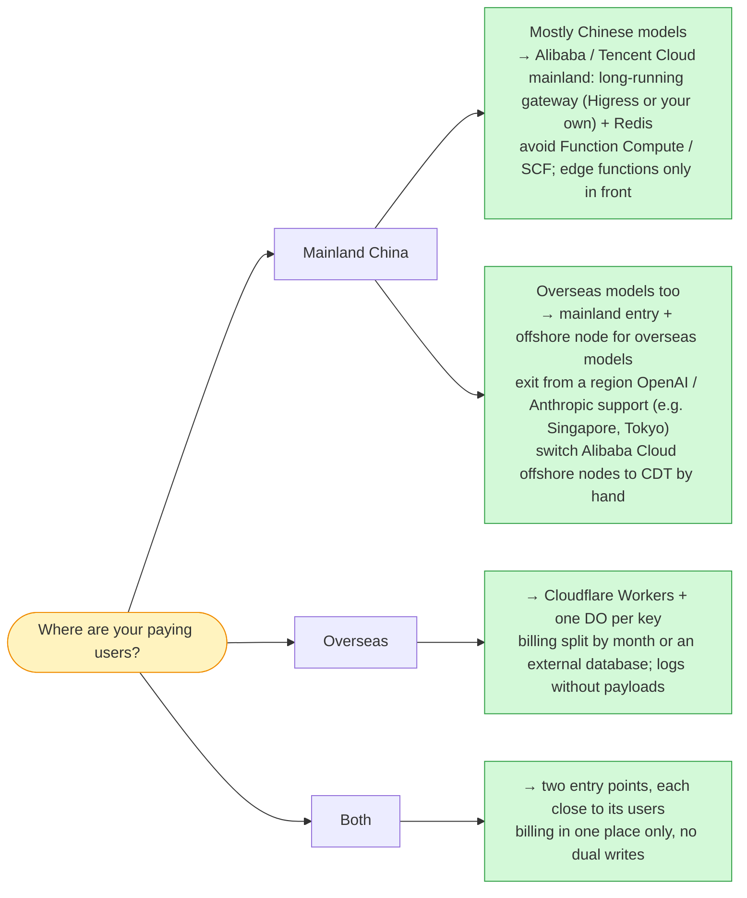

**Version scope**: prices are public list prices as of 2026-10-09, excluding negotiated discounts, new-customer deals and promotions. Alibaba Cloud prices come from the pricing APIs of aliyun CLI 3.5.1 (`DescribePrice`, `GetPayAsYouGoPrice`), and Tencent Cloud prices from tccli 3.1.180.1 (`InquiryPrice*`, `DescribeDBPrice`). Cloudflare has no pricing API (wrangler 4.148.0 has none either), so its numbers come from that day's pricing and limits pages on developers.cloudflare.com. Exchange rate: 1 USD = 6.7153 CNY (open.er-api.com, 2026-10-09).

> [!NOTE]
> **The most important caveat: the monthly bills rest on a set of illustrative assumptions.** Each request lasts 20 seconds, uses 10 ms of gateway CPU and sends out 50 KB, and the machine sizes were not load-tested. Change these numbers and the conclusion changes, above all the outbound bytes per request. Every table therefore comes with a sensitivity check so you can plug in your own numbers.

---

## The conclusion first

| Monthly cost (CNY, list price) | T1: 10M requests | T2: 100M | T3: 1B |
|---|---|---|---|
| Cloudflare (Workers + KV + Durable Objects + Queues + D1) | 140 | 2,756 | 32,574 |
| Cloudflare, optimized (usage summed inside the Durable Object, no Queues) | 67 | 2,115 | 25,139 |
| Alibaba Cloud self-hosted · Shenzhen (ALB + ECS + Redis + RDS + SLS) | 1,625 | 5,854 | 45,696 |
| Alibaba Cloud self-hosted · Hong Kong (reference for an offshore node) | 1,981 | 6,114 | 40,426 |
| Tencent Cloud self-hosted · Guangzhou (CLB + CVM + Redis + MySQL + CLS) | 1,422 | 5,359 | 45,179 |
| Alibaba Cloud AI Gateway (managed) | 5,428 | 10,195 | 60,518 |
| Alibaba Cloud Function Compute (100 concurrent requests per instance) | 1,419 | 7,703 | 68,877 |
| Tencent Cloud SCF (official docs: one instance serves one SSE stream at a time) | 3,756 | 32,543 | 321,865 |

Divide by 6.7153 for USD: Cloudflare at T3 is about $4,851, Alibaba Cloud Shenzhen about $6,805.

Five judgments:

1. **At small scale Cloudflare is an order of magnitude cheaper.** At 10 million requests a month Cloudflare costs ¥67–140, while the cheapest self-hosted setup on a Chinese cloud costs about ¥1,400. On a Chinese cloud you pay mostly for the floor: two machines, a database and a Redis instance cost the same with or without traffic.
2. **At scale the gap shrinks to 1.4–1.8×.** The big items are completely different on each side. On Cloudflare the money goes to **state**: every Durable Object read and write, every queue message and every KV read is billed separately, and at T3 these make up about 80% of the bill. On Alibaba Cloud the money goes to **egress**, 83% of the bill at T3.
3. **What really decides it is the outbound bytes per request.** At T3, if each request sends out less than about 24–34 KB, self-hosting on Alibaba Cloud beats Cloudflare. For coding agents, whose requests often carry hundreds of kilobytes, Cloudflare is more than 5× cheaper.
4. **Serverless billed by wall-clock time is the worst choice.** Function Compute and SCF both bill the full 20 seconds spent waiting for upstream tokens. The Chinese edge-function products (Alibaba Cloud ESA, Tencent Cloud EdgeOne) are cheap, but hard limits such as a 10-second first byte, a 120-second total duration or a 1 MB request body keep them from serving as a general LLM gateway.
5. **The other half is where your users are.** From China Telecom in Shenzhen, Cloudflare lands in Los Angeles at about 162 ms round trip; Alibaba Cloud and Tencent Cloud entry points in Shenzhen, Guangzhou and Hong Kong are 7–13 ms away. Cloudflare's mainland-China nodes (China Network) need the Enterprise plan plus ICP filing, and their product list leaves out Durable Objects, D1 and Queues. **If your users are mostly in mainland China, run on a Chinese cloud (with a separate offshore node for overseas models); if they are mostly overseas, run on Cloudflare.**

---

## Who this is for

- You know how to call an LLM API and that streamed output arrives piece by piece over SSE. You have written or configured a reverse proxy or an API gateway.
- You **do not** need to have used Cloudflare Workers or Alibaba Cloud load balancers; the glossary below explains every product the article relies on.
- The article **does not** cover model inference itself (GPUs, inference engines), and it touches compliance only where it shapes the architecture.

### Glossary

| Term | In one sentence |
|---|---|
| Wall-clock time | The real time from when a request arrives until it ends, including time spent waiting on others |
| CPU time | The time the program is actually computing; waiting on the network or a database does not count |
| SSE (server-sent events) | The format of streamed model output: one HTTP response stays open and a `data: …` line is pushed for each small piece generated |
| Workers | Cloudflare's edge functions; they run in data centers worldwide and are billed by requests and CPU time |
| Durable Object (DO) | Cloudflare's "named single-threaded mini-server": one name maps to exactly one instance worldwide, which suits per-API-key counters and balances |
| KV / Queues / D1 | Cloudflare's global key-value cache (eventually consistent) / message queue / SQLite database |
| LCU | A load balancer capacity unit, billed on the largest of four dimensions: new connections, concurrent connections, bytes processed and rule evaluations |
| CDT (Cloud Data Transfer) | Alibaba Cloud's way of pooling public egress across products and billing it in tiers |
| Edge functions | Alibaba Cloud ESA's "Functions and Pages" and Tencent Cloud EdgeOne's edge functions, the Chinese counterparts of Workers |
| ICP filing | The registration with China's Ministry of Industry and Information Technology that a site needs before serving from mainland servers or nodes |

---

## From first principles: what an LLM gateway request looks like

Stripped down, an LLM gateway does six things:



*Figure: the minimal causal chain of one LLM gateway request (illustrative, not any product's implementation). The yellow steps compute, but each takes only milliseconds; the blue step waits, for anything from ten-odd seconds to several minutes.*

These six steps make an LLM gateway differ from an ordinary API gateway in three ways:

| Trait | Value used here (illustrative) | Why it matters |
|---|---|---|
| Long wall-clock time | 20 s | Most of it is spent waiting for the upstream model to generate tokens; reasoning models take longer |
| Short CPU time | 10 ms | Authentication, routing, relaying SSE chunk by chunk, finding the usage. Cloudflare's limits page gives as reference about 2.2 ms for an average Worker and typically 10–20 ms for heavier work such as authentication or parsing large payloads |
| Heavy egress | 50 KB per request | 30 KB is the customer's prompt forwarded upstream and 20 KB is the SSE stream sent back to the client. **For a gateway, forwarding the prompt is outbound traffic too** |

10 ms out of 20 s is 0.05%. In other words, the gateway spends 99.95% of its time waiting.

That is what sets the three kinds of billing apart. Think of the gateway as a switchboard operator: connecting a call takes seconds, but the call itself lasts twenty.

- **Billed by CPU time (Workers)**: you pay only for the seconds the operator's hands are busy.
- **Billed by active instance time (Function Compute, SCF, DO)**: you pay for the whole call, including the operator sitting idle.
- **Billed by reserved capacity (cloud servers, load balancers)**: you pay for how many operators you hire, busy or not.

Add one more item where the providers differ completely: **traffic**. Cloudflare charges nothing for egress; Alibaba Cloud and Tencent Cloud charge ¥0.5–1 per GB.

The pseudocode below maps the six steps onto Workers, with comments marking which lines wait and which compute. It is illustrative, not any platform's real source:

```ts
// Pseudocode (illustrative): one request through a Workers-based LLM gateway
export default {
  async fetch(req, env, ctx) {
    const key = await env.KEYS.get(apiKeyOf(req), "json");         // 1 KV read: waits on the network, no CPU
    if (!key) return new Response("invalid key", { status: 401 });

    const limiter = env.LIMITER.get(env.LIMITER.idFromName(key.id)); // one DO per API key
    const slot = await limiter.acquire(estimateCost(req));           // 2 take a slot + hold balance (1 row written)
    if (!slot.ok) return new Response("too many requests", { status: 429 });

    const upstream = await fetch(pickLine(key), forward(req));       // 3, 4 wait for the upstream's first bytes, no CPU
    const { readable, writable } = new TransformStream();
    ctx.waitUntil(pipeAndFindUsage(upstream.body, writable, async (usage) => {
      await limiter.release(slot.id, usage);                         // 6 release the slot + settle (1 row written)
      await env.USAGE.send({ key: key.id, usage });                  // 6 usage message; a consumer sums per minute into D1
    }));
    return new Response(readable, upstream);                         // 5 a 20-second stream; CPU only for copying chunks
  },
};
```

On Alibaba Cloud or Tencent Cloud the same six steps become one long-running process (a Higress plugin or your own Go service) plus a Redis instance:

- Step 1, key lookup: an in-process cache, falling back to Redis on a miss;
- Step 2, concurrency slot and balance hold: Redis `INCR` / `DECR` plus a Lua script;
- Step 6, usage: batched in the process, then written to RDS in bulk or sent to a message queue.

**The architecture is the same; what differs is how each step is billed.**

---

## How the prices were queried

Both Chinese clouds have APIs that return prices directly. Below are a few representative commands; I kept the full command list and the raw output. Every call is a read-only pricing query, and no resource was created.

```bash
# Alibaba Cloud: ECS monthly price (40 GB ESSD PL0 system disk, no bandwidth)
aliyun ecs DescribePrice --RegionId cn-shenzhen --ResourceType instance \
  --InstanceType ecs.c9i.xlarge --PriceUnit Month --Period 1 \
  --SystemDisk.Category cloud_essd --SystemDisk.PerformanceLevel PL0 --SystemDisk.Size 40

# Alibaba Cloud: total price of 50,000 GB of public egress on CDT tiers
aliyun bssopenapi GetPayAsYouGoPrice --region cn-hangzhou --ProductCode cdt \
  --ProductType cdt_DataTransfer_public_cn --SubscriptionType PayAsYouGo --Region cn-shenzhen \
  --ModuleList.1.ModuleCode internet_traffic --ModuleList.1.PriceType Usage \
  --ModuleList.1.Config 'Region:cn-shenzhen,internet_traffic:50000,charge_type:PayByTraffic,isp:BGP'

# Alibaba Cloud: Redis (Tair) and RDS monthly prices
aliyun r-kvstore DescribePrice --RegionId cn-shenzhen --ZoneId cn-shenzhen-c \
  --InstanceClass redis.shard.large.ce --OrderType BUY --ChargeType PrePaid --Period 1 --NodeType MASTER_SLAVE
aliyun rds DescribePrice --RegionId cn-shenzhen --ZoneId cn-shenzhen-c --Engine MySQL --EngineVersion 8.0 \
  --DBInstanceClass mysql.n4.large.2c --DBInstanceStorage 100 --DBInstanceStorageType cloud_essd \
  --PayType Prepaid --UsedTime 1 --TimeType Month --Quantity 1 --OrderType BUY --CommodityCode rds

# Tencent Cloud: CVM monthly price (50 GB general-purpose SSD, bandwidth set to 0)
TENCENTCLOUD_REGION=ap-guangzhou tccli cvm InquiryPriceRunInstances --cli-unfold-argument \
  --Placement.Zone ap-guangzhou-6 --ImageId img-mmytdhbn --InstanceType SA9.LARGE8 \
  --InstanceChargeType PREPAID --InstanceChargePrepaid.Period 1 \
  --SystemDisk.DiskType CLOUD_BSSD --SystemDisk.DiskSize 50 \
  --InternetAccessible.InternetChargeType TRAFFIC_POSTPAID_BY_HOUR \
  --InternetAccessible.InternetMaxBandwidthOut 0 --InstanceCount 1
```

A few ground rules first:

- **List prices only.** Alibaba Cloud's pricing APIs also return account discounts; my account, for example, gets 15% off load balancers and NAT. Such discounts are left out.
- **Where no API works, the documented price is used and marked.** Alibaba Cloud's AI Gateway pricing API returned errors and Tencent Cloud's AI gateway has no pricing API, so both use documented prices.
- **All Cloudflare numbers come from the official pricing pages.** wrangler and the Cloudflare API only report your own account's usage; they cannot return a price list.

### Key unit prices

| | Cloudflare (USD) | Alibaba Cloud (Shenzhen, CNY) | Tencent Cloud (Guangzhou, CNY) |
|---|---|---|---|
| Compute | Workers $5/month including 10M requests and 30M CPU ms; then $0.30 per million requests and $0.02 per million CPU ms; **no charge for wall-clock duration** | ECS c9i monthly: 2c4g ¥205.91, 4c8g ¥391.82, 8c16g ¥763.64 (system disk included) | CVM SA9 monthly: 2c4g ¥156.2, 4c8g ¥287.4, 8c16g ¥549.8 (system disk included) |
| Load balancer | Not needed | ALB instance ¥0.049/hour + LCU ¥0.049 per LCU-hour | CLB shared ¥0.2/hour, **no LCU charge** |
| Egress | **Free** | CDT tiers: ¥0.80/GB up to 10 TB, ¥0.75 for 10–50 TB, ¥0.70 for 50–150 TB, ¥0.65 beyond; 20 GB free per month | ¥0.80/GB flat, no tiers and no free quota |
| Counters / balance | DO: requests $0.15 per million; SQLite writes $1.00 per million rows (50M rows included) | Tair, two replicas: 1 GB ¥76.98/month, 4 GB ¥360/month | Redis primary-replica: 1 GB ¥76/month, 4 GB ¥304/month |
| Key lookup | KV reads $0.50 per million (10M included) | The same Redis | The same Redis |
| Usage / billing database | Queues $0.40 per million operations (3 per message); D1 writes $1.00 per million rows, **10 GB max per database** | RDS MySQL high-availability: 2c4g ¥660/month, 4c16g ¥1,370/month | MySQL two-node: 2c4g ¥480/month, 4c16g ¥1,704/month |
| Logs | Workers Logs, **from 2026-12-01** $0.25/GB ingested + $0.10 per GB-month stored | SLS ¥0.4/GB (indexing and 30 days of storage included) | CLS billed by feature, about ¥0.83/GB |

---

## The bills for three tiers: where the money goes

Assumptions (all illustrative):

- **Three tiers**: 10 million / 100 million / 1 billion requests a month, with the peak at 3× the average; at T3 the peak is about 23,000 concurrent streams.
- **Calls per request**: one key lookup, two counter and balance calls (start and end), one usage message, one log line of about 1 KB.
- **Machines on the Chinese clouds**: T1 2 × 2 vCPU/4 GB, T2 2 × 4 vCPU/8 GB, T3 4 × 8 vCPU/16 GB across two zones, not load-tested; database and Redis sizes grow with the tier.

### The bill for one request

First, the marginal cost of a single request at T3 overage prices.

| Cloudflare per million requests | USD | Alibaba Cloud Shenzhen per million requests | CNY |
|---|---|---|---|
| Workers requests | 0.30 | Egress, 50 GB × ¥0.75 | 37.5 |
| Workers CPU (10 ms) | 0.20 | ALB LCU (50 GB processed) | 2.45 |
| 1 KV read | 0.50 | SLS logs, 1 GB | 0.40 |
| 2 DO requests | 0.30 | Machines + Redis + RDS spread per million requests | about 4.8 |
| **2 DO rows written** | **2.00** | | |
| 3 Queues operations | 1.20 | | |
| 1 KB of logs | about 0.27 | | |
| **Total** | **about 4.8 (≈ ¥32)** | **Total** | **about ¥45** |

**One request costs about ¥0.00003 on Cloudflare and about ¥0.000045 on Alibaba Cloud.** Compare that with the model bill (a rough estimate: a 30 KB prompt is about 7,500 tokens, the answer 300 tokens):

- At DeepSeek V4.1-Flash peak prices (¥2 input, ¥8 output per million tokens), one call costs about ¥0.017, and the gateway is only 0.2–0.3% of it;
- At Qwen qwen-flash prices (¥0.15 input, ¥1.5 output), one call costs about ¥0.0016, and the gateway is 2–3% of it.

Model prices come from the two vendors' official pricing pages (checked 2026-10-08). **The gateway's infrastructure is small change next to the model bill**, so the bill alone should not decide the platform; latency, reachability and stability matter at least as much.

### The largest items per tier

| | T1 | T2 | T3 |
|---|---|---|---|
| Cloudflare | Queues 55%, Workers subscription 24% | DO row writes 37%, Queues 29%, KV reads 11% | DO row writes 40%, Queues 25%, KV reads 10% |
| Alibaba Cloud self-hosted · Shenzhen | RDS 41%, ECS 25%, egress 24% | **Egress 68%**, ECS 13% | **Egress 83%**, ECS 7%, ALB 5% |
| Tencent Cloud self-hosted · Guangzhou | MySQL 34%, egress 28%, CVM 22% | **Egress 75%** | **Egress 89%** |

### Sensitivity 1: outbound bytes per request

Cloudflare's bill does not depend on bytes; the Chinese clouds' bills scale almost linearly with them. Here is the self-hosted Alibaba Cloud Shenzhen setup with outbound bytes per request varied from 5 KB to 500 KB:

| Outbound per request | T1 | T2 | T3 | For comparison: Cloudflare (plain / optimized) |
|---|---|---|---|---|
| 5 KB (short Q&A) | ¥1,243 | ¥2,033 | **¥9,478** | T3: ¥32,574 / ¥25,139 |
| 20 KB | ¥1,371 | ¥3,307 | ¥21,726 | Same |
| 50 KB (this article's assumption) | ¥1,625 | ¥5,854 | ¥45,696 | Same |
| 200 KB (agents with long context) | ¥2,899 | ¥18,102 | ¥155,788 | Same |
| 500 KB (common for coding agents) | ¥5,446 | ¥42,072 | **¥365,488** | Same |

Where the two break even:

- **T3**: about 24 KB per request (against optimized Cloudflare) to 34 KB (against plain Cloudflare) in Shenzhen, and about 24–37 KB in Hong Kong.
- **T2**: about 6–14 KB in Shenzhen.
- **T1**: the Chinese clouds' fixed floor already costs more than Cloudflare's whole bill, so there is no break-even point.

So "Cloudflare is cheaper" **holds only when traffic is heavy or scale is small**. If your business is a flood of short Q&A (about 5 KB out per request), at 1 billion requests a month self-hosting on a Chinese cloud is about 3× cheaper than Cloudflare.

There is also a lever only the Chinese clouds have: **if the upstream model lives on the same cloud's internal network** (calling Alibaba Cloud Model Studio from Alibaba Cloud, for example), the 30 KB of forwarded prompt need not cross the public internet. That requires a private connection, whose price I did not check.

### Sensitivity 2: gateway CPU time

Doubling Cloudflare CPU time from 5 ms to 20 ms moves the T3 bill from ¥31,902 to ¥33,917, a difference of only 6%. **When you are billed by CPU time, the 20 seconds spent waiting upstream cost almost nothing.** Self-hosting on a Chinese cloud is not sensitive to CPU either: even at 20 ms per request the T3 peak needs only about 23 vCPUs, which fits on four 8-vCPU machines.

---

## On Cloudflare: free egress, state billed per operation

**The savings come from two things, both stated on the official pricing pages.** First, under the Standard usage model wall-clock duration is neither billed nor capped, and the limits page states that time spent waiting on `fetch()`, KV or a database does not count as CPU time. Second, egress and bandwidth are free, and so are the subrequests a Worker makes. A 20-second stream costs the same as a 0.2-second one, and forwarding a 30 KB prompt upstream costs nothing.

**Where it gets expensive: every read and write of state is billed.**

1. **DO row writes are the single largest item** (about ¥13,095 a month at T3). Concurrency slots and balances must be written to the DO's built-in SQLite rather than kept only in memory: a DO idle for about 10 seconds may hibernate and lose its in-memory counts, while a stream lasts 20 seconds. You can optimize: sum usage inside the DO, flush it once a minute and drop Queues, which brings T3 down to about ¥25,139.
2. **A DO is single-threaded.** The official soft limit for one object is about 1,000 requests a second, and about 200–500 with storage writes. The official design rules page explicitly warns against using a single DO for global rate limiting. The right pattern is one DO per API key, with large customers' keys split into shards.
3. **KV is eventually consistent.** Other locations may take 60 seconds or more to see a change, so revoking a key or changing a balance cannot rely on KV alone. Pydantic's open-source AI gateway admits in its old README that with state cached in KV, spending limits can only be "soft".
4. **A D1 database is capped at 10 GB, and the cap cannot be raised.** A usage table summed per minute fills up in about 1.2 months at T3 and about 4.6 months at T2. So you summarize periodically, split databases by month (an account can have 50,000 of them) and archive cold data to R2.

**Two traps that multiply the bill tenfold:**

- **Keeping a DO active for the whole stream.** Route the stream through the DO, or arm a `setTimeout` in it as a lease timeout, and the DO is billed by wall-clock duration. At T3 that adds up to **$32,000 (about ¥215,000)** a month at most. Use `setAlarm` for lease timeouts.
- **AI Gateway logs the full prompt and response by default.** Accounts that create their first AI Gateway on or after 2026-09-24 pay for logs at Workers Logs prices; at the new prices from 12-01 that is about **$13,927 (about ¥94,000)** a month at T3. Turn off payload logging or logging altogether. Also, with Cloudflare's Unified Billing each gateway allows only 200 requests a minute, which T1's average rate already exceeds, so a reseller has to bring its own upstream keys (BYOK).

**One date to watch**: Workers Logs switches from per-event to per-GB pricing on 2026-12-01 (announced in Cloudflare's 2026-10-02 blog post). This article uses the new prices: about $260 of logs a month at T3, versus $588 under the old ones.

---

## On the Chinese clouds: state almost free, egress billed per byte

**The savings come from state being paid per instance.** A 1 GB two-replica Redis costs ¥77 a month and is rated at 100,000 operations a second; the T3 peak needs only about 4,600. Key lookups, counters and balances all sit on it, and **ten times the requests cost the same**.

**Where it gets expensive: egress.**

1. **Forwarding prompts counts as egress.** Of the 50 KB per request, 30 KB is the gateway sending the customer's prompt upstream; at T3 that line alone costs ¥37,997 a month in Alibaba Cloud Shenzhen.
2. **Offshore nodes have cheaper egress tiers, but CDT must be switched on by hand.** Taking Hong Kong as the example (Singapore and Tokyo were not checked), Alibaba Cloud Hong Kong charges ¥0.54/GB above 10 TB, below Shenzhen's ¥0.75. That is why at T3 Hong Kong (¥40,426) comes out cheaper than Shenzhen (¥45,696) even though Hong Kong ECS costs 1.9× as much. But since 2024-12-12, ECS and EIP **are no longer billed on CDT tiers automatically**; you must "upgrade to CDT billing" by hand (free, and irreversible). Without it Hong Kong egress is ¥1.00/GB, and T3 costs ¥21,470 more.
3. **Do not send upstream traffic through NAT.** Since 2025-09-26 Alibaba Cloud's NAT gateway bills processed traffic (1 CU = 1 GiB), so routing upstream requests through NAT adds about 23% on top of egress, ¥8,665 more at T3. A pay-by-traffic public IP on each ECS instance is cheaper.
4. **Long-lived connections do not make the load balancer expensive, but timeouts can cut them.** One ALB LCU covers 3,000 concurrent connections, so the 23,000-stream T3 peak comes to just 7.7 LCUs; what actually drives LCUs is bytes processed, about ¥0.049 per GB. Tencent Cloud's shared CLB charges no LCU at all. But **ALB's request timeout defaults to 60 seconds**, so raise it before long reasoning streams start returning 504.

**Managed AI gateway** (the AI Gateway in Alibaba Cloud's cloud-native API Gateway, built on the open-source Higress): it has multi-model routing, fallback, consumer API keys and token rate limits, and its billing items show no separate charge for those features, but the smallest size costs ¥3,997.5 a month (documented price). You still need your own Redis and RDS for per-customer balances and usage, so at T1 it costs more than three times as much as the whole self-hosted setup. It suits teams at T2 and above that do not want to write a gateway.

**Serverless is the worst choice:**

- **Alibaba Cloud Function Compute** bills active instance time. It bills the configured size, not actual use, so the vCPU is billed in full for the 20 seconds spent waiting upstream and never enters the "light sleep" state in which vCPU is free. The only saving is concurrency per instance: at 100 concurrent requests per instance the T3 compute charge is ¥28,750; at 1 it is about 95 times that.
- **Tencent Cloud SCF**'s SSE documentation states that one function instance handles only one SSE connection at a time. That puts T3 at ¥321,865 a month, and the T2 and T3 peaks both exceed the default concurrency quota per region.

**Chinese edge functions cannot serve as a general LLM gateway**, because of their limits rather than their price:

| | Cloudflare Workers | Alibaba Cloud ESA functions | Tencent Cloud EdgeOne edge functions |
|---|---|---|---|
| Billing | Requests + CPU time | Per invocation, ¥5 per million | Requests ¥1.7 per million + CPU ¥0.11 per million ms |
| Total duration per invocation | Unlimited (while the client stays connected) | **120 s** (waiting counts) | No limit documented; `fetch` timeout configurable up to 300 s |
| First byte | No limit documented | **504 if no data within 10 s** | No limit documented |
| Request body | 100 MB and up (depends on the zone's plan) | Not found | **1 MB** |
| CPU per invocation | 30 s by default, configurable up to 5 min | No figure documented | **200 ms** |
| Subrequests | 10,000 by default | **4** | 64 |
| Strongly consistent state | Durable Objects | None (KV is eventually consistent, up to 300 s) | KV in beta, Enterprise only, 1 million reads per namespace per day |
| Mainland China nodes | Only via China Network (Enterprise + ICP) | Yes, with ICP filing | Yes, with ICP filing |

Reasoning models often take more than 10 seconds to the first token and more than 120 seconds for long outputs, and agents' long-context requests easily exceed 1 MB. Neither product has strongly consistent state like a DO, so rate limits and balances still have to go back to a central region. **They can sit in front of a gateway for caching and authentication pre-checks; they cannot replace it.**

---

## Beyond the bill: latency and reachability

| 2026-10-09 10:49 (Beijing time), China Telecom home broadband in Shenzhen, 20 ICMP round trips | Median | P90 |
|---|---|---|
| Alibaba Cloud Shenzhen (ECS API endpoint) | 7 ms | 19 ms |
| Alibaba Cloud Hong Kong | 13 ms | 16 ms |
| Tencent Cloud Guangzhou (CVM API endpoint) | 8 ms | 9 ms |
| Tencent Cloud Hong Kong | 13 ms | 20 ms |
| Cloudflare anycast address (this blog's Pages / Functions endpoint) | 162–164 ms | 166–186 ms |

A few notes:

- **Method**: my local network transparently proxies every TCP connection, so any handshake takes 2–3 ms; that is why I used ping.
- **Route**: `mtr` shows packets to Cloudflare jumping from about 9 ms to about 160 ms on China Telecom's 163 backbone, which is where they leave China, and ending at a Cloudflare address in Los Angeles.
- **Limits**: this is one line at one time of day. Two evenings earlier, a TCP handshake test from the same network measured 193 ms.

**Effect on time to first token**: a new HTTPS connection needs at least three round trips (TCP, TLS 1.3, sending the request). At 162 ms per round trip that adds about 0.45 seconds before the first token; with a reused connection it adds about 0.15 seconds. Chat users will notice; long agent tasks barely will.

**Three more things:**

- **This architecture cannot move into China Network.** Cloudflare states that without China Network, users in mainland China connect to data centers outside the mainland. China Network needs the Enterprise plan, a separate subscription, an ICP filing or license for every apex domain, and content review by JD Cloud; its product list includes Workers, KV and R2 but **not DO, D1 or Queues**. And according to GreatFire's third-party monitoring, `*.workers.dev` is blocked in mainland China, so you must use your own domain.
- **For overseas models, the long hop cannot be avoided.** Neither OpenAI's nor Anthropic's list of supported API regions includes mainland China or Hong Kong ([OpenAI](https://developers.openai.com/api/docs/supported-countries), [Anthropic](https://www.anthropic.com/supported-countries), checked 2026-10-09). A gateway that calls them must exit from a supported region such as Singapore, Japan or the United States; a Hong Kong node can only relay. Seen from a mainland user, the long hop happens either on "user → Cloudflare Los Angeles" or on "offshore gateway → US upstream". So when calling overseas models, Cloudflare's latency handicap shrinks a lot, and the difference is mostly line quality.
- **Both sides have had major outages, of different shapes.** On 2025-06-12 a third-party cloud that KV depended on went down and AI Gateway's error rate peaked at 97%; on 2025-11-18 a core proxy failure made KV return many 5xx errors too. A gateway that reads KV or a DO synchronously on every request goes down with the whole world, with no other zone to fail over to. Alibaba Cloud Hong Kong Zone C was down for more than ten hours on 2022-12-18 after a cooling failure, but the failure was confined to one zone, so a multi-zone deployment had a way out.

---

## Who really runs an LLM gateway on Workers

I accepted only first-hand evidence: official blogs, official docs, deployment configs in repositories and articles signed by founders.

| Platform | Cloudflare components used | Evidence | Strength |
|---|---|---|---|
| **Cloudflare AI Gateway** | Workers; logs first in D1, then moved to R2, then to DOs sharded by account + gateway | [Official blog, 2024-10-24](https://blog.cloudflare.com/billions-and-billions-of-logs-scaling-ai-gateway-with-the-cloudflare/) | Confirmed |
| **Helicone** (hosted proxy and hosted AI Gateway) | Workers + DO (rate limiters, plus one wallet per organization that holds the worst-case cost at the start and settles actual usage at the end) + KV + Queues; request bodies over 20 MiB go to Containers; backend on AWS | [`worker/wrangler.toml`](https://github.com/Helicone/helicone/blob/main/worker/wrangler.toml), [wallet DO](https://github.com/Helicone/helicone/blob/main/worker/src/lib/durable-objects/Wallet.ts), [official docs](https://docs.helicone.ai/references/availability) | Confirmed (edge request path) |
| **OpenRouter** | Edge layer on Workers, caching user and API key data at the edge; when a balance runs low it checks the database more often and latency rises | [Official docs](https://openrouter.ai/docs/guides/best-practices/latency-and-performance) | Confirmed (edge layer only) |
| **Portkey** | The open-source gateway repo ships a production `wrangler.toml`, and the official docs say the hosted version runs on "edge workers" worldwide | [wrangler.toml](https://github.com/Portkey-AI/gateway/blob/main/wrangler.toml) | Indirect evidence |
| **Unkey** (moved away) | Used Workers + DO for API key verification and rate limiting; in 2025-08 moved to a stateful Go service on AWS | [Co-founder's post, 2025-08-01](https://www.unkey.com/blog/serverless-exit) | Confirmed |
| **Braintrust** (moved away) | Its AI Proxy ran on Workers in 2023; the hosted entry point is now a Gateway on AWS, for reasons not made public | [2023 blog post](https://www.braintrust.dev/blog/ai-proxy), [current docs](https://www.braintrust.dev/docs/deploy/gateway) | Confirmed that it moved |

Three things stand out:

1. **Apart from Cloudflare itself, none of them is "all Cloudflare".** The closest is Helicone: Workers, DO, KV and Queues on the request path are all on Cloudflare, while analytics and the billing backend are on AWS. This article's Cloudflare side keeps even billing in D1, which is more aggressive than what these companies actually do.
2. **Everyone's pain is in the state layer, not compute.** AI Gateway's log storage, Helicone's wallet holds, OpenRouter's database checks on low balances, the Pydantic gateway's soft KV limits.
3. **Unkey left for reasons specific to its workload.** Its reasons: cache reads had to go over the network, with p99 above 30 ms; to work around statelessness it stacked up DO, Queues, Workflows and more; exporting data was painful; customers could not self-host. After moving, latency fell to one sixth. But Unkey has to finish key verification within 10 ms per request, whereas an LLM gateway request lasts 20 seconds anyway, so tens of milliseconds of state reads weigh far less, and that conclusion does not carry over as is.

On the Chinese side the mainstream approach is **a long-running gateway process plus Redis**, not edge functions:

- **Higress**: the gateway open-sourced by Alibaba, accepted into the CNCF Sandbox on 2026-03-15, about 9,500 stars. The project says it powers the Qwen app, Model Studio's model API and PAI, but publishes no traffic figures. Its token rate limiting uses Redis for global counters, the same design point as the DO counters on the Cloudflare side.
- **Alibaba Cloud AI Gateway**: in an official customer case, all of China Pacific Property Insurance's LLM traffic goes through the AI Gateway, close to 100 million tokens a day.
- **Chinese edge functions**: I found no named LLM gateway customer.

---

## How to choose



*Figure: a decision tree for choosing by where users are (this article's judgment, not official advice).*

**When to choose Cloudflare:**

- Your users are mostly overseas, or they are developers calling overseas models;
- You are still small (tens of millions of requests a month or fewer) and want a near-zero floor with no machines to run;
- Your requests are large (agents, long context, multimodal), so egress would dominate a Chinese cloud bill;
- Your team can accept state-driven design work such as one DO per key and periodic D1 archiving.

**When not to use Cloudflare:**

- Your users are mostly in mainland China and sensitive to time to first token (chat products);
- You are at around 1 billion requests a month with short requests (under about 30 KB out per request), where self-hosting on a Chinese cloud is cheaper;
- You need strongly consistent global state (global concurrency, a credit pool across keys) and do not want to shard it yourself;
- You need nodes in mainland China but cannot afford Enterprise, or you rely on DO, D1 or Queues.

---

## Closing

An LLM gateway is not compute-bound. It is **bound by waiting, by carrying bytes and by state**. Comparing two clouds on CPU price compares the smallest line on the bill.

> **Rule: first ask three questions — who bills you for waiting, who bills you for carrying bytes, who bills you for state. Then look at which side your users are closer to.**

---

## Sources and check dates

All checked on 2026-10-09.

- Cloudflare pricing and limits:
  - [Workers pricing](https://developers.cloudflare.com/workers/platform/pricing/), [Workers limits](https://developers.cloudflare.com/workers/platform/limits/)
  - [Durable Objects pricing](https://developers.cloudflare.com/durable-objects/platform/pricing/), [Rules of Durable Objects](https://developers.cloudflare.com/durable-objects/best-practices/rules-of-durable-objects/)
  - [How KV works](https://developers.cloudflare.com/kv/concepts/how-kv-works/), [Queues pricing](https://developers.cloudflare.com/queues/platform/pricing/)
  - [D1 pricing](https://developers.cloudflare.com/d1/platform/pricing/), [D1 limits](https://developers.cloudflare.com/d1/platform/limits/)
  - [Observability pricing (from 2026-12-01)](https://developers.cloudflare.com/observability/pricing/)
  - [AI Gateway pricing](https://developers.cloudflare.com/ai-gateway/reference/pricing/), [AI Gateway limits](https://developers.cloudflare.com/ai-gateway/reference/limits/)
  - [China Network](https://developers.cloudflare.com/china-network/), [China Network available products](https://developers.cloudflare.com/china-network/reference/available-products/)
- Alibaba Cloud (prices from aliyun CLI pricing APIs, rules from the docs; pages in Chinese):
  - [CDT public egress](https://help.aliyun.com/zh/cdt/internet-data-transfers/), [Upgrade to CDT billing](https://help.aliyun.com/zh/cdt/user-guide/upgrade-to-cdt-billing)
  - [ALB billing rules](https://help.aliyun.com/zh/slb/application-load-balancer/product-overview/alb-billing-rules), [NAT Gateway billing](https://help.aliyun.com/zh/nat-gateway/nat-gateway-billing)
  - [Function Compute billing](https://help.aliyun.com/zh/functioncompute/fc/product-overview/billing-overview-of-fc), [Concurrency per instance](https://help.aliyun.com/zh/functioncompute/fc/configure-the-concurrency-of-a-single-instance)
  - [AI Gateway sizes and prices](https://help.aliyun.com/zh/api-gateway/ai-gateway/product-overview/free-product-templates)
  - [ESA Functions and Pages limits](https://help.aliyun.com/zh/edge-security-acceleration/esa/user-guide/what-is-functions-and-pages), [ESA function billing](https://help.aliyun.com/zh/edge-security-acceleration/esa/user-guide/functions-and-pages-billing)
- Tencent Cloud (prices from tccli pricing APIs, rules from the docs; pages in Chinese):
  - [Public egress prices](https://cloud.tencent.com/document/product/213/113026), [CLB LCU billing](https://cloud.tencent.com/document/product/214/58387)
  - [SCF billing](https://cloud.tencent.com/document/product/583/12281), [SCF SSE](https://cloud.tencent.com/document/product/583/90617)
  - [EdgeOne plans](https://cloud.tencent.com/document/product/1552/94158), [EdgeOne overage prices](https://cloud.tencent.com/document/product/1552/94159), [Edge function limits](https://cloud.tencent.com/document/product/1552/81344)
- Cases and outages:
  - Cloudflare post-mortems: [2025-06-12](https://blog.cloudflare.com/cloudflare-service-outage-june-12-2025/), [2025-11-18](https://blog.cloudflare.com/18-november-2025-outage/)
  - [Alibaba Cloud Hong Kong Zone C outage notice (2022-12)](https://www.alibabacloud.com/zh/notice/resolved_service_outage_in_zone_c_of_the_china_hong_kong_region_1ae)
  - [Higress](https://github.com/higress-group/higress), [Alibaba Cloud AI Gateway product page](https://www.aliyun.com/product/apigateway)
  - [GreatFire: workers.dev](https://en.greatfire.org/domain/workers.dev) (third-party monitoring)
- Model prices: [DeepSeek pricing](https://api-docs.deepseek.com/zh-cn/quick_start/pricing), [Qwen qwen-flash](https://help.aliyun.com/zh/model-studio/qwen-flash)
- Tool versions: aliyun CLI 3.5.1, tccli 3.1.180.1, wrangler 4.148.0 (latest on npm: 4.149.0).
