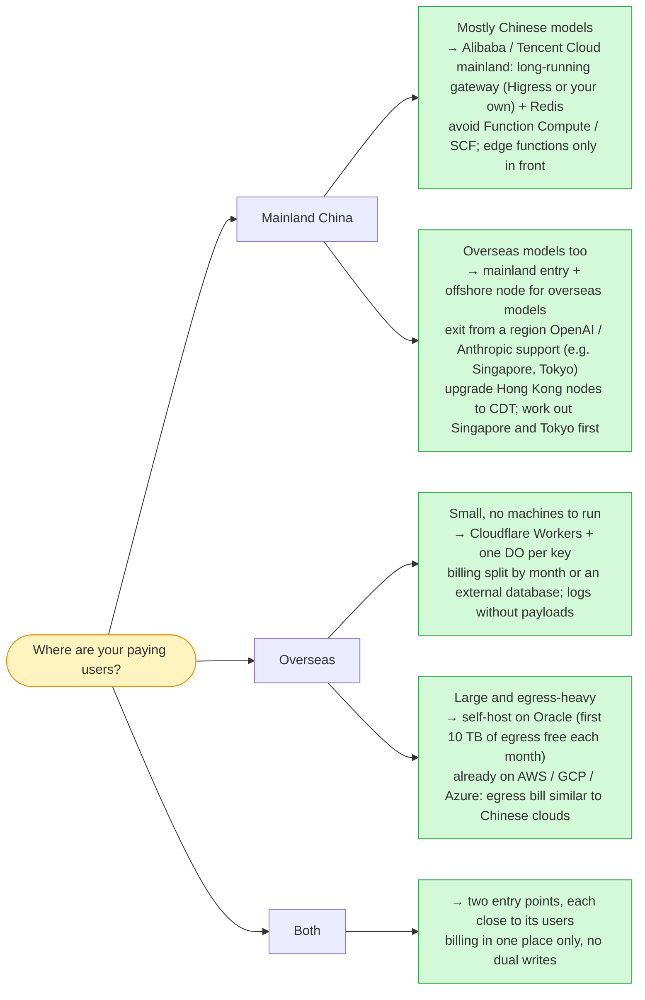

*This is for anyone putting their first app online. The first half covers how to choose and how to estimate the cost; the second half builds an LLM gateway from scratch and works out the bills of seven clouds line by line. Prices were checked on 2026-10-09; how they were queried and the full tables are in the [appendix](#appendix-how-the-prices-were-queried-and-the-full-numbers).[^scope]*

---

## The conclusion first (for the impatient)

1. **Start on free tiers.** A personal site on Cloudflare Pages or GitHub Pages costs nothing; Cloudflare Workers is free up to 100,000 requests a day; in China, Alibaba Cloud runs ¥99-a-year offers for both a server and a database. Most apps start on a few yuan to a few dozen yuan a month.
2. **Do not pay for waiting.** If your app spends most of its time waiting on others (calling an LLM, calling third-party APIs), avoid serverless billed by duration: it charges for every second you wait.
3. **At volume, watch the bytes you carry and the entries you write.** By then CPU is the cheapest line on the bill.
4. **If your users are in mainland China, use a Chinese cloud and get an ICP filing first.**

Every sentence above is explained below.

---

## Who this is for

- You have an app you want to put online: a personal website, a mini-program or app backend, an AI app that calls an LLM, or a small tool that processes images or video. You have never bought a server and cannot quite say how serverless differs from one.
- After the first half you will be able to read what cloud providers sell, split your app into three bills, pick a way to start, estimate the monthly cost, and know when to switch.
- The second half is for those who want the details: an LLM gateway as a worked example, assuming you know how to call an LLM API and that streamed output arrives piece by piece over SSE. You can skip it without losing the conclusions of the first half.
- The article **does not** cover model inference itself (GPUs, inference engines), and touches compliance only where it shapes the choice.

### Glossary

| Term | In one sentence |
|---|---|
| Request | One "question" a browser or app sends your service when a user opens a page or taps a button |
| Cloud server | A computer a cloud provider rents you, always on (ECS at Alibaba Cloud, CVM at Tencent Cloud, EC2 at AWS) |
| Serverless | You upload only code; the platform starts it when a request arrives and charges no machine while nothing runs (Function Compute, SCF, Lambda, Cloud Run) |
| Edge functions | Code that runs in many data centers worldwide, close to users; Cloudflare Workers is the best-known |
| Wall-clock time | The real time from when a request arrives until it ends, including time spent waiting on others |
| CPU time | The time the program is actually computing; waiting on the network or a database does not count |
| Egress | Data sent out of the cloud: pages, images, API replies; most clouds bill it per GB |
| Bookkeeping / state | Data you must write down and read again later, such as balances, call counts, login sessions |
| ICP filing | The registration with China's Ministry of Industry and Information Technology that a site needs before serving from mainland servers or nodes |

---

## What is on a cloud provider's shelf

The first visit to a cloud provider's site shows dozens of products. There are really only three places to put your code, plus a class of parts someone runs for you:

| On the shelf | What it is | Like | How it bills |
|---|---|---|---|
| Cloud server | A computer that is always on; you manage the system, software and security updates | Renting a whole flat | Monthly or yearly, empty or not |
| Serverless billed by duration | You upload code; the platform starts it per request | A hotel, by the night | Every second from request to response, including time spent waiting on others |
| Edge functions (Cloudflare Workers) | Code in data centers worldwide, close to users | A worker paid only for the minutes of actual work | By the milliseconds your code computes; waiting is free |
| Managed services | Databases, file storage, CDNs that someone else runs | A furnished flat | By size or by use |

Five characters keep turning up in this article; meet them first:

```comic cols=2
> An ordinary request
[User] Ask the LLM for me: do I need an umbrella tomorrow?
[Your service] Got it, passing it to the LLM now.
---
> Twenty seconds later
[LLM] Tomorrow... light... rain...
[Your service] I was busy for 10 ms. The other 20 seconds I waited for it to finish, word by word.
---
[Cloud!] Which raises the question: what do I bill you for?
[You] That is exactly what this article works out.
```

"Your service" in the comic is the program you put in the cloud. It works for about 10 ms, yet each request waits 20 seconds for the LLM to finish talking. A cloud provider has three ways to bill it, and the bills can be several times apart:

```comic
> Billed by CPU time (Cloudflare Workers)
[Cloud] I only charge for the 10 ms your service actually works. Waiting is free.
---
> Billed by duration (Lambda, Function Compute)
[Cloud] From the moment the request arrives until it ends: 20 seconds, every one of them.
[Your service] But I spend most of it staring at the wall!
---
> Billed per machine (cloud servers)
[Cloud] You pay for every machine you rent, busy or not.
```

Besides running code, two more bills are easy to miss: **egress** (data leaving the cloud; most clouds bill it per GB, Cloudflare does not) and **bookkeeping** (databases and caches; some are paid per instance, some per read and write).

---

## Learn to split the bill: your app in three parts

```comic cols=2
> Going live for the first time
[You] I want to launch a mini-program. Should I buy a server or go serverless?
[Cloud] Hold on to your wallet. What does your app do all day?
---
[Cloud] Does it wait on others, compute, or carry things around? Does it keep books?
[You!] So I have to take it apart first.
```

Splitting the bill takes three questions plus one constraint, and each has a way to find your own answer:

**1. Does its time go to waiting or to computing?**

Look at what your endpoints do:

- They call an LLM or third-party APIs (payments, maps, SMS), or run slow database queries, and a call waits for seconds → **a waiting app**.
- They process images and video, render PDFs, compress, or run a local model → **a computing app**.
- They read or write the database and return within tens of milliseconds → **a light app**: little waiting, little computing.

**2. How many bytes does each request move?**

Open your app in a browser, press F12 for the developer tools, switch to the Network panel and click a request to see its size. For images and video, look at file sizes; for an AI app, look at how long the prompt and answer are (a Chinese character is about 3 bytes, an English word about 5–6). A few KB is light; hundreds of KB or more is heavy.

**3. Does it keep books entry by entry?**

Does each request read or write the database? Does it deduct a balance, count calls or rate-limit in real time? If so, bookkeeping is a fixed cost for you, and providers bill it in very different ways.

**Plus one constraint: where are your users?** Mostly in mainland China means a Chinese cloud, and an ICP filing before the site serves anyone; overseas platforms such as Cloudflare have no mainland nodes and are slow from there. Mostly overseas, and you have many more options.

Then estimate the volume: **requests per month ≈ daily active users × requests per user per day × 30**. For example, 1,000 daily users tapping 50 times a day is 1.5 million requests a month.

With those numbers, the monthly bill is roughly four items added up:

| | Cloud server | Serverless billed by duration | Edge functions (Cloudflare) |
|---|---|---|---|
| Floor (paid with nobody using it) | **High**: machines and databases are always on | Low | Low (Workers Paid is $5 a month) |
| Waiting and computing | Almost nothing extra, but you buy enough machine for the peak | **Billed by wall-clock time**, waiting included | Only the milliseconds of computing |
| Egress | Per GB (some plans include unlimited traffic) | Per GB | Free |
| Bookkeeping | Your own database, per instance | An external database, per instance or per use | **Per read and write** |

Whichever column is cheaper depends on which row your app spends the most in.

---

## Find your place: how four common apps start

First, how the four apps start:

| App | Its three bills | Users mostly in China | Users mostly overseas |
|---|---|---|---|
| Personal website, blog, portfolio | Almost no compute; luggage depends on images; no bookkeeping | Object storage plus a CDN, paid by traffic, ICP filing needed | Cloudflare Pages or GitHub Pages, free |
| Mini-program or app backend | Light; light luggage; bookkeeping (user data) | One small server plus a database; WeChat mini-programs can also use Tencent CloudBase | Cloudflare Workers plus D1, starting on the free tier |
| AI app that calls an LLM | Waiting; medium luggage; bookkeeping (usage, balances) | One small always-on server, not duration-billed Function Compute | Cloudflare Workers, starting on the free tier |
| Image or video tool | Computing; heavy luggage; no bookkeeping | Function Compute when occasional, a server when it runs flat out; files in object storage | Lambda or Cloud Run when occasional, a server when sustained; files in R2 (free egress) |

To start, use the free tiers and new-customer prices first:[^free]

| Platform | Free tier or starting price | Watch out for |
|---|---|---|
| Cloudflare Pages | Free, unlimited static requests, 500 builds a month | |
| GitHub Pages | Free, site up to 1 GB, soft limit of 100 GB of traffic a month | Not for online business, e-commerce or SaaS |
| Vercel Hobby | Free, 100 GB of traffic a month | Non-commercial personal use only |
| Cloudflare Workers | 100,000 requests a day free; Paid is $5 a month with 10 million requests | The free plan allows 10 ms of CPU per request |
| Cloudflare D1 / KV / R2 | D1 5 million rows read and 100,000 written a day; KV 100,000 reads and 1,000 writes a day; R2 10 GB a month | R2 egress is free |
| Alibaba Cloud ECS 99 | 2 vCPU, 2 GB, 3 Mbps with unlimited traffic, ¥99 a year | One per person at a time; same-price renewal, offer runs to 2029-03-31 |
| Alibaba Cloud RDS 99 | MySQL basic edition, ¥99 a year | Can be held with ECS 99; offer runs to 2027-03-31; basic edition is a single node |
| Alibaba Cloud simple app server | The site says "from ¥68 a year" | The page gives no spec or conditions; offer machines renew at the regular price |
| Alibaba Cloud Function Compute | 150,000 CU a month for new users, for 3 months | No long-term free tier |
| Tencent Cloud Lighthouse | 4 vCPU, 4 GB, 3 Mbps, ¥109 for the first year for new users | Once per verified identity, offer runs to 2026-12-30, renews at list price |
| Tencent CloudBase (mini-programs) | Free trial with 3,000 resource points a month; Personal plan ¥19.9 a month (limited time) | Once the mini-program is published, the free environment expires after 15 days |
| AWS | $100 credit for new accounts, up to $100 more for using listed services; Lambda's 1 million requests a month stay free | The free plan lasts at most 6 months, and the account closes when it ends or the credit runs out |
| Google Cloud | $300 for new customers, within 90 days; Cloud Run 2 million requests a month free; one e2-micro always free | e2-micro only in three US regions |
| Oracle Cloud | Always free: Arm capacity of about 2 cores and 12 GB, 2 small AMD machines, 10 TB of egress a month | Idle machines may be reclaimed after 7 days |

When should you switch? Watch which of the three bills grows first: more requests and longer waits mean duration-billed serverless should give way to an always-on server or edge functions; more traffic means looking at egress prices (Cloudflare and Oracle are cheap); more bookkeeping means Cloudflare's per-operation billing keeps growing while your own database is paid per instance. The LLM gateway example in the second half works these three bills out from 10 million to 1 billion requests a month.

[^free]: All checked on official pages on 2026-10-09: [Cloudflare Workers](https://developers.cloudflare.com/workers/platform/pricing/), [Pages](https://developers.cloudflare.com/pages/platform/limits/), [D1](https://developers.cloudflare.com/d1/platform/pricing/), [R2](https://developers.cloudflare.com/r2/pricing/), [GitHub Pages](https://docs.github.com/en/pages/getting-started-with-github-pages/github-pages-limits), [Vercel Hobby](https://vercel.com/docs/plans/hobby), [Alibaba Cloud ECS 99](https://www.aliyun.com/daily-act/ecs/99program), [RDS 99](https://www.aliyun.com/activity/database/bestoffers), [Alibaba Cloud simple app server](https://www.aliyun.com/product/swas), [Function Compute trial](https://help.aliyun.com/zh/functioncompute/fc/product-overview/trial-quota-1), [Tencent Lighthouse](https://cloud.tencent.com/act/pro/lighthouse), [Tencent CloudBase](https://tcb.cloud.tencent.com/pricing), [AWS Free Tier](https://aws.amazon.com/free/), [Lambda](https://aws.amazon.com/lambda/pricing/), [Google Cloud](https://docs.cloud.google.com/free/docs/free-cloud-features), [Oracle Always Free](https://docs.oracle.com/en-us/iaas/Content/FreeTier/freetier_topic-Always_Free_Resources.htm). Offers change at any time; for the simple app servers of Alibaba Cloud and Tencent Cloud, the purchase page has the final spec and renewal price; the RDS 99 spec comes from the rules on the bundle page.

A few more common services, sorted the same way:

| Service | Time goes to | Bytes per request | Bookkeeping | Where it fits |
|---|---|---|---|---|
| Personal website, blog | Almost no compute | Depends on images | None | Static hosting plus a CDN |
| Mini-program or app backend | Light | Light | Yes (user data) | A small server plus a database, or a managed backend |
| AI app that calls an LLM | Waiting | Medium | Yes (usage, balances) | Edge functions or a long-running process, not duration-billed serverless |
| Real-time push and chat (SSE, WebSocket) | Waiting (long-lived connections) | Light | Presence, rooms | Workers + DO (no duration charges while a WebSocket hibernates), or a long-running process + Redis |
| Slow-API proxies, BFFs, webhook relays | Waiting | Light | None or little | Edge functions are cheapest; a long-running process also pays off at volume |
| Image, PDF and video processing | Computing | Heavy | None | Duration-billed serverless when occasional, machines when sustained |
| File and media downloads | Almost no compute | Very heavy | None | Object storage plus a CDN; for overseas users, Cloudflare R2 has free egress |
| High-frequency short requests (auth, counters, rate-limit services) | Very little | Light | Read on every request, within milliseconds | A long-running process with an in-memory cache (the reason Unkey left Workers, see below) |

*Table: common services sorted by the three questions (this article's judgment, not official advice).*

**For computing apps, what matters is the price of a CPU-hour:**

```chart
{
 "type": "bars",
 "fmt": {"pre": "¥", "digits": 2},
 "legend": [
   {"color": "seal", "label": "billed per CPU millisecond"},
   {"color": "gold", "label": "serverless billed by duration"},
   {"color": "gray", "label": "machines (fully used)"}
 ],
 "rows": [
   {"label": "Tencent Cloud CVM", "sub": "SA9, monthly", "value": 0.1, "color": "gray"},
   {"label": "Oracle", "sub": "E6.Flex, on demand", "value": 0.128, "color": "gray"},
   {"label": "Alibaba Cloud ECS", "sub": "c9i, monthly", "value": 0.136, "color": "gray"},
   {"label": "Google Cloud", "sub": "c4, on demand", "value": 0.286, "color": "gray"},
   {"label": "AWS EC2", "sub": "c8i, on demand", "value": 0.315, "color": "gray"},
   {"label": "Azure", "sub": "F4als_v7, on demand", "value": 0.406, "color": "gray"},
   {"label": "Cloudflare Workers", "sub": "per CPU millisecond", "value": 0.484, "color": "seal"},
   {"label": "AWS Lambda", "sub": "Arm, 1,769 MB ≈ 1 vCPU", "value": 0.57, "color": "gold"},
   {"label": "AWS Lambda", "sub": "x86", "value": 0.713, "color": "gold"}
 ],
 "caption": "Price per CPU-hour (CNY, 2026-10-09). Machines are their 4-vCPU monthly price per vCPU-hour, i.e. the price when fully used; at 30% average use, multiply by about three. Lambda counts 1,769 MB of memory as about one vCPU."
}
```

Workers' CPU costs about 3.6 times an Alibaba Cloud monthly machine and about 1.5 times an AWS on-demand machine per CPU-hour.[^cpu-price] Sounds steep? But machines are bought for the peak and sit idle much of the time: against Alibaba Cloud, if your machines average below about 30% use, paying per millisecond comes out cheaper. Duration-billed Lambda is the most expensive per CPU-hour, yet for computing apps that is perfectly fair, since every second it is up it is computing.

So **the same serverless product is a trap for waiting apps and a good deal for occasional computing**. Computing that runs flat out all day is still cheapest on machines. Mind the hard limits too: Workers allows at most 5 minutes of CPU and 128 MB of memory per request, too little for large image processing or long video transcoding.[^limits]

---

## A worked example: building an LLM gateway from scratch

The first half was the method; this section takes one concrete app and works out its three bills line by line. An LLM gateway is a good pick because it runs up nearly all three: it waits a lot, computes little, carries medium to heavy luggage on every request and keeps books entry by entry.

The example's conclusions first, who pays what at three volumes (switch volumes with the tabs on top):

```chart
{
 "type": "bars",
 "fmt": {"pre": "¥"},
 "legend": [
   {"color": "seal", "label": "Cloudflare"},
   {"color": "green", "label": "Oracle"},
   {"color": "gray", "label": "other clouds, self-hosted"}
 ],
 "panels": [
   {
    "title": "10M requests / month",
    "rows": [
      {"label": "Cloudflare", "sub": "plain design", "value": 140, "color": "seal"},
      {"label": "Cloudflare", "sub": "optimized design", "value": 67, "color": "seal"},
      {"label": "Alibaba Cloud · Shenzhen", "value": 1625},
      {"label": "Tencent Cloud · Guangzhou", "value": 1422},
      {"label": "AWS · US East", "value": 2467},
      {"label": "Google Cloud · US East", "value": 3056},
      {"label": "Azure · US East", "value": 4794},
      {"label": "Oracle · US East", "value": 1973, "color": "green"}
    ]
   },
   {
    "title": "100M / month",
    "rows": [
      {"label": "Cloudflare", "sub": "plain design", "value": 2756, "color": "seal"},
      {"label": "Cloudflare", "sub": "optimized design", "value": 2115, "color": "seal"},
      {"label": "Alibaba Cloud · Shenzhen", "value": 5854},
      {"label": "Tencent Cloud · Guangzhou", "value": 5359},
      {"label": "AWS · US East", "value": 6646},
      {"label": "Google Cloud · US East", "value": 7387},
      {"label": "Azure · US East", "value": 9125},
      {"label": "Oracle · US East", "value": 2388, "color": "green"}
    ]
   },
   {
    "title": "1B / month",
    "rows": [
      {"label": "Cloudflare", "sub": "plain design", "value": 32574, "color": "seal"},
      {"label": "Cloudflare", "sub": "optimized design", "value": 25139, "color": "seal"},
      {"label": "Alibaba Cloud · Shenzhen", "value": 45696},
      {"label": "Tencent Cloud · Guangzhou", "value": 45179},
      {"label": "AWS · US East", "value": 47179},
      {"label": "Google Cloud · US East", "value": 43798},
      {"label": "Azure · US East", "value": 49848},
      {"label": "Oracle · US East", "value": 8832, "color": "green"}
    ]
   }
 ],
 "caption": "Monthly bill in CNY at list prices (2026-10-09). Self-hosted = load balancer + machines in two zones + Redis + MySQL + logs + egress. Hong Kong, Singapore and the managed and serverless options are in the appendix."
}
```

1. **Small? Pick Cloudflare.** At 10 million requests a month it costs a little over ¥100, while the cheapest self-hosted setup costs about ¥1,400. A cloud provider bills you a floor: two machines, a high-availability database and a Redis instance cost the same with nobody using them.
2. **Large? It depends on how fat the requests are.** At 1 billion requests a month, self-hosting on Alibaba Cloud, Tencent Cloud or the big three Western clouds costs only 30% to a little over 100% more than Cloudflare. The smaller the requests, the better self-hosting looks; the bigger they are (coding agents, say), the better Cloudflare looks.
3. **Oracle does not play by the rules.** Its first 10 TB of egress each month is free, so at volume self-hosting in Oracle US East is about three times cheaper than Cloudflare. The price is running your own machines.

> [!NOTE]
> The example's bills rest on illustrative assumptions: each request lasts 20 seconds, the gateway computes for 10 ms, 50 KB moves per request, and the machine sizes were not load-tested. The most sensitive one is the last; [the chart in step 3](#step-3-carrying-the-luggage) shows which side your workload falls on.

Right, let's build. Say you are launching an LLM gateway: customers come with an API key, you forward their requests to a model and bill them for what they use. We will add one part at a time, and after each part see where the bill grows.

Stripped down, a gateway does six things:


*Figure: the minimal causal chain of one LLM gateway request (illustrative, not any product's implementation). The yellow steps compute, but each takes only milliseconds; the blue step waits, for anything from ten-odd seconds to several minutes.*

These six steps make an LLM gateway differ from an ordinary API gateway in three ways:

| Trait | Value used here (illustrative) | Why it matters |
|---|---|---|
| Long wall-clock time | 20 s | Most of it is spent waiting for the upstream model to generate tokens; reasoning models take longer |
| Short CPU time | 10 ms | Authentication, routing, relaying SSE chunk by chunk, finding the usage[^cpu-ms] |
| Heavy egress | 50 KB per request | 30 KB is the customer's prompt forwarded upstream and 20 KB is the SSE stream sent back to the client |

10 ms out of 20 s is 0.05%. The gateway spends 99.95% of its time waiting.

### Step 1: take the request, then wait

First the core part: take the request, forward it upstream, relay the answer back as is. What this step costs depends on where you stand:

- **Workers**: bills only those 10 ms of CPU; the 20 seconds of waiting cost nothing.[^cf-wall] A 20-second stream costs the same as a 0.2-second one.
- **Duration-billed Lambda, Function Compute, SCF**: bill all 20 seconds, every one of them, and often one instance can serve only one request at a time.[^one-per-instance]
- **Your own machines**: waiting holds a connection, not a CPU; but you buy machines for peak concurrency and pay for them idle.

How big is the gap? At 1 billion requests a month, the duration-billed options cost two to ten times Cloudflare:

```chart
{
 "type": "bars",
 "fmt": {"pre": "¥"},
 "ref": {"value": 45696, "label": "Alibaba Cloud Shenzhen, self-hosted"},
 "rows": [
   {"label": "Cloudflare Workers", "sub": "billed by CPU time", "value": 32574, "color": "seal"},
   {"label": "Google Cloud Run", "sub": "250 requests per instance", "value": 59634},
   {"label": "Alibaba Cloud AI Gateway", "sub": "managed", "value": 60518},
   {"label": "Alibaba Cloud Function Compute", "sub": "100 requests per instance", "value": 68877},
   {"label": "Tencent Cloud SCF", "sub": "multi-request mode, estimated", "value": 75903},
   {"label": "Azure Container Apps", "sub": "100 streams per replica", "value": 79376},
   {"label": "Google Cloud Run", "sub": "80 requests per instance", "value": 107676},
   {"label": "OCI Functions", "sub": "Oracle", "value": 264894},
   {"label": "AWS Lambda", "sub": "128 MB Arm", "value": 278460},
   {"label": "Tencent Cloud SCF", "sub": "default, one stream per instance", "value": 321865}
 ],
 "caption": "Monthly bill at 1B requests a month (CNY, including Redis, database, logs and egress). The dashed line is Alibaba Cloud Shenzhen, self-hosted. Wall-clock billing pays for the 20 seconds of waiting on the upstream; Cloudflare Workers bills CPU time only."
}
```

The cheaper duration-billed options in the chart all run many requests per instance. At small volumes they even undercut self-hosting slightly, since they skip the always-on machines and load balancer; as volume grows it flips.

If you want to see this step in code, here is the Workers version as pseudocode, with comments marking which lines wait and which compute (illustrative, not any platform's real source):

```ts
// Pseudocode (illustrative): one request through a Workers-based LLM gateway
export default {
  async fetch(req, env, ctx) {
    const key = await env.KEYS.get(apiKeyOf(req), "json");         // 1 KV read: waits on the network, no CPU
    if (!key) return new Response("invalid key", { status: 401 });

    const limiter = env.LIMITER.get(env.LIMITER.idFromName(key.id)); // one DO per API key
    const slot = await limiter.acquire(estimateCost(req));           // 2 take a slot + hold balance (1 row written)
    if (!slot.ok) return new Response("too many requests", { status: 429 });

    const upstream = await fetch(pickLine(key), forward(req));       // 3, 4 wait for the upstream's first bytes, no CPU
    const { readable, writable } = new TransformStream();
    ctx.waitUntil(pipeAndFindUsage(upstream.body, writable, async (usage) => {
      await limiter.release(slot.id, usage);                         // 6 release the slot + settle (1 row written)
      await env.USAGE.send({ key: key.id, usage });                  // 6 usage message; a consumer sums per minute into D1
    }));
    return new Response(readable, upstream);                         // 5 a 20-second stream; CPU only for copying chunks
  },
};
```

On Alibaba Cloud or Tencent Cloud the same six steps become one long-running process (a Higress plugin or your own Go service) plus a Redis instance: key lookups hit an in-process cache and fall back to Redis on a miss; taking a slot and holding balance use Redis `INCR` / `DECR` plus a Lua script; usage is batched in the process and written to the database in bulk or sent to a message queue.

**The architecture is the same; what differs is how each step is billed.**

### Step 2: keeping the books

A gateway that bills by usage has to keep books: on the way in each request takes a concurrency slot and holds some balance, on the way out it settles what it actually used, and a usage record is left behind.

```comic cols=2
> Every request makes two entries in the books
[User] I paid up front. Take what I use.
[Your service] Then I hold a little on the way in, and settle what you actually used on the way out.
---
> On Cloudflare
[Cloud!] Every entry is billed. A billion requests is two billion entries.
---
> On your own Redis
[Cloud] Redis is paid per instance. One entry or a hundred million, same price.
```

Here the two sides bill in opposite ways.

**Cloudflare bills every entry.** The largest item is DO row writes, about ¥13,000 a month at 1 billion requests. Slots and balances must be written to the DO's built-in SQLite rather than kept only in memory, because an idle DO may fall asleep and wake up with its in-memory counts gone, while a stream lasts 20 seconds.[^do] The optimized design, which sums usage inside the DO, flushes once a minute and drops Queues, cuts the bill by more than a fifth. Three more things to settle up front:

- A DO is single-threaded and handles roughly a thousand requests a second. So use one DO per API key, shard large customers' keys, and never use one DO as a global rate limiter.
- KV is eventually consistent: a change takes a minute or more to reach every location, so revoking a key or changing a balance cannot rely on it alone.[^kv]
- A D1 database is capped at 10 GB, and the cap cannot be raised. A usage table summed per minute fills it in just over a month, so summarize periodically, split databases by month and move cold data to R2.[^d1]

**A self-hosted Redis is paid per instance.** A 1 GB two-replica Redis costs ¥77 a month and is rated at 100,000 operations a second; at 1 billion requests a month the peak needs only about 4,600.[^redis] Key lookups, counters and balances all sit on it, and **ten times the requests do not move its price at all**.

Split the bill at 1 billion requests a month into three parts and you can see at once whose bill the bookkeeping lands on:

```chart
{
 "type": "stack",
 "fmt": {"pre": "¥"},
 "series": [
   {"key": "state", "label": "State (key lookups, counters, balances, usage store)", "color": "blue"},
   {"key": "egress", "label": "Egress", "color": "gold"},
   {"key": "rest", "label": "Everything else (machines, load balancer, logs)", "color": "gray"}
 ],
 "rows": [
   {"label": "Cloudflare", "sub": "plain design", "values": {"state": 27462.09, "egress": 0, "rest": 5111.91}},
   {"label": "Cloudflare", "sub": "optimized design", "values": {"state": 20027.24, "egress": 0, "rest": 5111.91}},
   {"label": "Alibaba Cloud · Shenzhen", "values": {"state": 1730.0, "egress": 37997.0, "rest": 5968.64}},
   {"label": "Tencent Cloud · Guangzhou", "values": {"state": 2008.0, "egress": 40000.0, "rest": 3170.65}},
   {"label": "AWS · US East", "values": {"state": 4625.9, "egress": 28826.77, "rest": 13726.01}},
   {"label": "Oracle · US East", "values": {"state": 2954.46, "egress": 2269.5, "rest": 3607.73}}
 ],
 "caption": "The monthly bill at 1B requests a month, in three parts (CNY). Cloudflare charges for state per operation; the self-hosted Redis and MySQL are paid per instance."
}
```

**More than 80% of Cloudflare's bill is bookkeeping; 60–90% of the Alibaba Cloud, Tencent Cloud and AWS bills is egress; Oracle's three parts are about the same size.** Egress is the next step.

### Step 3: carrying the luggage

A gateway does not just pass messages; it carries luggage. Each request moves 50 KB on average: 30 KB is the customer's prompt, which the gateway delivers upstream, and 20 KB is the model's answer, which goes back to the client. **For a gateway, forwarding the prompt counts as egress too.**

```comic cols=2
> Your service does not just pass messages
[User] My question is 30 KB, and the answer is another 20 KB.
[Your service] I carry the question to the LLM, then carry the answer back to you.
---
> On the Chinese clouds and the big three
[Cloud] Every byte that leaves needs a ticket.
[Your service] Even the questions I pass on to the LLM for users?
[Cloud!] Even those.
---
> On Cloudflare and Oracle
[Cloud] No ticket needed. For Oracle, the first 10 TB a month.
```

Cloudflare needs no ticket at the door, the subrequests a Worker makes are free, and the terms put no cap on bandwidth.[^tos] The Chinese clouds charge ¥0.5–0.8 per GB, and the big three Western clouds about the same. Oracle's first 10 TB each month are free, and beyond that North America costs under a cent per GB.

So the bytes per request all but decide who is cheaper:

```chart
{
 "type": "line",
 "fmt": {"pre": "¥"},
 "x": {"label": "Egress per request (KB)", "min": 0, "max": 100, "ticks": [0, 20, 40, 60, 80, 100]},
 "y": {"label": "Monthly bill at 1B requests a month (CNY)", "max": 100000, "ticks": [0, 20000, 40000, 60000, 80000, 100000]},
 "series": [
   {"label": "Alibaba Cloud Shenzhen, self-hosted", "color": "blue", "points": [[5, 9478], [10, 13723], [15, 17731], [20, 21726], [25, 25721], [30, 29716], [35, 33711], [40, 37706], [50, 45696], [60, 53247], [70, 60737], [80, 68227], [90, 75717], [100, 83207]]},
   {"label": "AWS US East, self-hosted", "color": "gray", "points": [[5, 18896], [10, 22186], [15, 25320], [20, 28443], [25, 31566], [30, 34688], [35, 37811], [40, 40933], [50, 47179], [60, 52548], [70, 57785], [80, 63023], [90, 68261], [100, 73499]]},
   {"label": "Oracle US East, self-hosted", "color": "green", "points": [[5, 6562], [10, 6562], [15, 6834], [20, 7119], [25, 7405], [30, 7690], [35, 7975], [40, 8261], [50, 8832], [60, 9402], [70, 9973], [80, 10544], [90, 11115], [100, 11686]]},
   {"label": "Cloudflare, plain design", "color": "seal", "points": [[0, 32574], [100, 32574]]},
   {"label": "Cloudflare, optimized design", "color": "seal", "dash": true, "points": [[0, 25139], [100, 25139]]}
 ],
 "marks": [
   {"x": 33.6, "y": 32574, "label": "break-even ≈ 34 KB", "color": "seal", "side": "left"},
   {"x": 50, "y": 45696, "label": "this article's 50 KB", "color": "blue"}
 ],
 "caption": "Cloudflare does not charge for egress, so its two lines do not budge. A 500 KB coding-agent request is off the chart: Alibaba Cloud self-hosted ¥365,488, AWS ¥236,506, Oracle ¥34,518."
}
```

- **Light luggage: self-hosting is cheaper.** Below about 34 KB out per request, self-hosting on Alibaba Cloud beats Cloudflare (about 24 KB against Cloudflare's optimized design). Short Q&A is around 5 KB, where self-hosting costs about a third of Cloudflare.
- **Heavy luggage: Cloudflare is cheaper.** Coding agents' requests often carry hundreds of kilobytes, and there Cloudflare is several times cheaper. AWS breaks even even earlier than Alibaba Cloud.
- **Oracle is cheapest across the whole range**, only drawing level with Cloudflare at three to four hundred kilobytes.
- **The smaller the volume, the lower the break-even point.** At 10 million requests a month the clouds' floor already costs more than Cloudflare's whole bill, so they never break even.

So "Cloudflare is cheaper" **holds only when volume is small or the luggage is heavy**.

The Chinese clouds have one more lever of their own: **if the upstream model lives on the same cloud's internal network** (calling Alibaba Cloud Model Studio from Alibaba Cloud, say), the forwarded prompt need not cross the public internet. Model Studio's private connection is currently offered only in Beijing and Hong Kong; with the gateway in the same region, at 1 billion requests a month the egress line drops from about ¥38,000 to about ¥19,000 (private-connection fees included). A gateway in Shenzhen reaching Beijing across regions saves almost nothing.

### Step 4: turn the volume up a hundredfold

All the parts are in. Now turn the traffic from 10 million to 1 billion requests a month, the three tabs on the chart at the start of this section.

- **At small volumes, the floor decides.** Cloudflare has no floor and the clouds do, so at 10 million it is an order of magnitude cheaper.
- **At volume, bookkeeping and luggage decide.** Cloudflare's money goes to bookkeeping and the other clouds' to egress, and the two end up only 30% to a little over 100% apart. Oracle's egress is almost free, which puts it in front.
- **CPU barely moves the bill.** Doubling the gateway's CPU time from 5 ms to 20 ms changes Cloudflare's monthly bill by only 6%, and a self-hosted setup still fits on four 8-vCPU machines. When you are billed by CPU time, the 20 seconds of waiting cost almost nothing.

And one fact that should make you relax: **the gateway's infrastructure is small change next to the model bill.** Per request, Cloudflare costs about ¥0.00003 and self-hosting on Alibaba Cloud about ¥0.000045; a call with 7,500 input tokens and 300 output tokens costs about ¥0.017 at DeepSeek V4.1-Flash peak prices, so the gateway is only 0.2–0.3% of it, and even with the far cheaper Qwen qwen-flash just 2–3%.[^model]

So the bill alone should not decide the platform. Latency, reachability and stability matter at least as much.

### Step 5: move next to your users

The last part: where the entry point sits, and how far it is from your users.

```chart
{
 "type": "bars",
 "fmt": {"suf": " ms"},
 "rows": [
   {"label": "Alibaba Cloud · Shenzhen", "value": 7, "color": "gray"},
   {"label": "Tencent Cloud · Guangzhou", "value": 8, "color": "gray"},
   {"label": "Alibaba Cloud · Hong Kong", "value": 13, "color": "gray"},
   {"label": "Tencent Cloud · Hong Kong", "value": 13, "color": "gray"},
   {"label": "Alibaba Cloud · Singapore", "value": 57, "color": "gray"},
   {"label": "Tencent Cloud · Singapore", "value": 89, "color": "gray"},
   {"label": "Cloudflare", "value": 162, "color": "seal", "sub": "anycast, lands in Los Angeles"},
   {"label": "AWS · Singapore", "value": 203, "color": "gray"},
   {"label": "AWS · US East", "value": 224, "color": "gray"},
   {"label": "Oracle · Singapore", "value": 230, "color": "gray"},
   {"label": "Alibaba Cloud · Virginia", "value": 231, "color": "gray"},
   {"label": "Oracle · US East", "value": 236, "color": "gray"}
 ],
 "caption": "Ping from a China Telecom home line in Shenzhen, 2026-10-09, 20 probes each. Mainland regions and Cloudflare are the 10:49 median, the overseas regions the 11:55 average. Azure and Google Cloud answer on global anycast addresses, so no region can be measured."
}
```

From China Telecom in Shenzhen, the Chinese clouds' entry points in Shenzhen, Guangzhou and Hong Kong are all around 10 ms away; packets to Cloudflare leave the country over the carrier's backbone and land in Los Angeles, 162 ms away.[^latency] Singapore is not necessarily close either: in the same city, Alibaba Cloud is 57 ms away while AWS and Oracle take over 200 ms, about as much as US East. Chinese clouds' overseas regions usually interconnect far better with Chinese carriers.

What does that do to the first token? A new HTTPS connection needs at least three round trips (TCP, TLS 1.3, sending the request), so at 162 ms per round trip the first token arrives about 0.45 seconds later; with a reused connection, about 0.15 seconds. Chat users will notice; long agent tasks barely will.

Three more things:

- **China Network cannot rescue this architecture.** Without China Network, users in mainland China connect to data centers outside the mainland. China Network needs the Enterprise plan, a separate subscription, an ICP filing or license for every apex domain, and content review by JD Cloud; its product list includes Workers, KV and R2 but **not DO, D1 or Queues** (Cloudflare does not say whether these fail on JD Cloud nodes or fall back to overseas). `*.workers.dev` is blocked in mainland China, so you must use your own domain.[^workers-dev]
- **For overseas models, the long hop cannot be avoided.** Neither OpenAI's nor Anthropic's list of supported API regions includes mainland China or Hong Kong, so a gateway calling them must exit from a supported region such as Singapore, Japan or the United States; Hong Kong can only relay.[^regions] Seen from a mainland user, the long hop happens either on "user → Cloudflare Los Angeles" or on "offshore gateway → US upstream", so when calling overseas models Cloudflare's latency handicap shrinks a lot and the difference is mostly line quality.
- **Both sides have had major outages, of different shapes.** On 2025-06-12 a third-party cloud that KV depended on went down and AI Gateway's error rate peaked at 97%; on 2025-11-18 a core proxy failure made KV return many 5xx errors too. A gateway that reads KV or a DO synchronously on every request goes down with the whole world, with no other zone to fail over to. Alibaba Cloud Hong Kong Zone C was down for more than ten hours on 2022-12-18 after a cooling failure, but the failure was confined to one zone, so a multi-zone deployment had a way out.

---

## Traps to step around before launch

Beyond the bill, every cloud has a few traps that can double it, or cut requests off halfway.

### Three Cloudflare traps

- **Keeping a DO awake for the whole stream.** Route the stream through the DO, or arm a `setTimeout` in it as a lease timeout, and the DO is billed by wall-clock duration, adding up to about ¥215,000 a month at 1 billion requests. Use `setAlarm` for lease timeouts. Since 2026-10-01, pending outbound calls and `waitUntil` in a DO also keep it awake (for up to 15 minutes), which makes this easier to hit.
- **AI Gateway logs the full prompt and response by default.** Accounts that create their first AI Gateway on or after 2026-09-24 pay for logs at Workers Logs prices, about ¥94,000 a month at 1 billion requests. Turn off payload logging, or logging altogether. Also, with Cloudflare's Unified Billing each gateway allows only 200 requests a minute, which the average rate at 10 million requests a month already exceeds, so a reseller has to bring its own upstream keys (BYOK).
- **The default log settings.** New Workers have logs on by default and write an invocation log for every call, and by the docs each DO RPC writes one too, so one request makes about 4 log entries. At Cloudflare's own average of 4.84 KB per entry, the log bill grows about twentyfold. Turn off invocation logs or sample them on the gateway and DO Workers.[^logs]

### Four Chinese-cloud traps

- **Offshore tiered pricing must be switched on by hand.** Alibaba Cloud Hong Kong, Singapore and Tokyo charge less per GB than Shenzhen, so at 1 billion requests a month Hong Kong comes out cheaper than Shenzhen even though its machines cost nearly twice as much. But since 2024-12-12, ECS and EIP **are no longer billed on the tiered price** (Alibaba Cloud calls it CDT) automatically; you must "upgrade to CDT billing" by hand (free, and irreversible). Without it, Hong Kong costs about ¥21,000 more a month at 1 billion requests. Singapore and Tokyo are the other way round: without the upgrade their base price is below the first tier, so within a range of volumes not upgrading is cheaper.
- **Do not send upstream traffic through NAT.** Since 2025-09-26 Alibaba Cloud's NAT gateway bills processed traffic, so routing upstream requests through NAT adds about 23% on top of egress. A pay-by-traffic public IP on each ECS instance is cheaper.
- **Long-lived connections are cheap, but timeouts cut them.** Alibaba Cloud ALB's capacity charge is driven by bytes processed, and 23,000 long-lived connections come to fewer than 8 capacity units; Tencent Cloud's shared CLB does not bill capacity at all. But **ALB's request timeout defaults to 60 seconds**, so raise it before long reasoning streams start returning 504.
- **The managed AI gateway is not cheap.** Alibaba Cloud's AI Gateway (built on the open-source Higress) has multi-model routing, fallback, consumer API keys and token rate limits, but the smallest size costs about ¥4,000 a month (documented price); you still need your own Redis and database for balances and usage, so at small volumes it costs more than three times the whole self-hosted setup. The Serverless edition, billed from 2026-09-01, has no size floor in the thousands (the enterprise edition's instance fee is about ¥176 a month), so at small volumes it costs about the same as self-hosting; but it bills public traffic in both directions at ¥0.8/GB, outside the tiered prices, so it gets more expensive at volume.

### The four Western clouds: the big three keep the same books as the Chinese clouds, Oracle is the exception

The big three's egress prices are in the same range as the Chinese clouds', the equivalent of ¥0.6–0.8 per GB in the first tier and a little over ¥0.5 at volume; their machines, databases and logs cost more, logs at $0.50 per GB being over 8× Alibaba Cloud's log service. The two effects cancel out, and at volume the big three and the Chinese clouds end up with similar bills. At small volumes AWS US East costs 50% more than Alibaba Cloud Shenzhen, and Azure US East nearly three times as much.

If your clients are in mainland China, the traffic Google Cloud sends back to them falls under the price list's "to mainland China" rate, $0.20–0.23 per GiB (Google does not say how the destination is determined); pricing all egress that way (an upper bound) raises US East at 1 billion requests a month from about ¥44,000 to about ¥81,000.

Oracle's egress is almost free: the first 10 TB each month cost nothing, and beyond that it is $0.0085/GB in North America and $0.025/GB in Asia-Pacific; traffic within a region and data handled by the load balancer are not billed separately, and log ingestion is free. So at 1 billion requests a month, 50 TB of egress costs about ¥2,300 in US East, against about ¥38,000 for the same traffic on Alibaba Cloud Shenzhen. The costs hide elsewhere:

- The 10 TB free tier applies per source region group: US East and Singapore each get 10 TB, and regions in the same group share one.[^oci-10tb]
- Singapore has only one availability domain (Oracle's term for an availability zone), so you cannot spread across zones, only across fault domains.
- A pay-as-you-go account gets only 6 OCPUs per availability domain and one region by default, so at volume you must request a quota increase first.
- The NAT gateway caps concurrent connections to the same destination address and port: about 20,000 per availability domain in a three-domain region such as US East, and about 65,000 in Singapore. 23,000 streams in one availability domain going to one upstream would hit it, so machines are better off exiting through their own public IPs (reserved public IPs are officially free).
- The smallest high-availability MySQL is billed as 3 instances, $170 a month, the largest item at small volumes.

**Default load balancer timeouts are the easiest trap before launch:**

| | Default | Effect on SSE |
|---|---|---|
| Alibaba Cloud ALB | 60 s request timeout, counted as time without data between ALB and the backend (per the WebSocket docs; SSE is not covered) | A reasoning model that thinks for over 60 s before its first token gets a 504; raise it first |
| AWS ALB | 60 s idle timeout, up to 4,000 s | A reasoning model that thinks for over 60 s before its first token gets cut off; raise it or send SSE heartbeats |
| Google Cloud external Application Load Balancer | 30 s backend service timeout, **counting the whole response** | Not an idle timeout: streams over 30 s are cut off; global load balancers can go up to 86,400 s, so raise it before launch |
| Azure Application Gateway v2 | 20 s request timeout, counted as time without data | The troubleshooting docs say that after a timeout it resends the request to another backend, with no exception for POST; if POST is retried too, a request whose first token takes over 20 s **may be forwarded twice and billed twice upstream**[^appgw]; SSE also needs the response buffer, on by default, switched off |
| Oracle flexible load balancer | 60 s idle timeout, up to 7,200 s | Sending data does not reset the receive timer |

### Serverless and edge functions: do not count on them at volume

Each duration-billed product has its own temper:

- **Alibaba Cloud Function Compute**: bills the configured size, not actual use, so the vCPU is billed in full for the 20 seconds spent waiting upstream and never enters the "light sleep" state in which vCPU is free. The only saving is concurrency per instance: at 1 request per instance the compute charge is about 95 times that at 100.
- **Tencent Cloud SCF**: by default one instance handles only one SSE connection at a time, and at volume the peak also exceeds the default concurrency quota per region.
- **AWS Lambda**: default concurrency is 1,000, so volume needs a quota increase.
- **Google Cloud Run**: one instance can handle up to 1,000 requests at once, the best fit for long-lived connections of the lot, but it still bills instance wall-clock time; it also writes request logs automatically at $0.50 per GiB (an exclusion filter can turn them off), which the chart leaves out.
- **Azure**: Functions Flex defaults to 16 concurrent requests per instance, so 1 billion requests a month would need 1,447 instances, above the 1,000-instance cap; Container Apps runs once concurrency is raised to 100.
- **OCI Functions**: one instance handles one request at a time, synchronous calls last at most 300 seconds, and the result only comes back after the function finishes, so it cannot stream.

Edge functions are blunter still: **Chinese edge functions cannot serve as a general LLM gateway**, because of their limits rather than their price:

| | Cloudflare Workers | Alibaba Cloud ESA functions | Tencent Cloud EdgeOne edge functions |
|---|---|---|---|
| Billing | Requests + CPU time | Per invocation, ¥5 per million | Requests ¥1.7 per million + CPU ¥0.11 per million ms |
| Total duration per invocation | Unlimited (while the client stays connected) | **120 s** (waiting counts) | No limit documented; `fetch` timeout configurable up to 300 s |
| First byte | No limit documented | **504 if no data within 10 s** | No limit documented |
| Request body | 100 MB and up (depends on the zone's plan) | Not in the function docs; site upload limit 300 MB by default | **1 MB** |
| CPU per invocation | 30 s by default, configurable up to 5 min | No figure documented | **200 ms** |
| Subrequests | 10,000 by default | **4** (the Chinese docs say 4 per invocation, the English docs 4 concurrent and raisable on request) | 64 |
| Strongly consistent state | Durable Objects | None (KV is eventually consistent, up to 300 s) | KV in beta, Enterprise only, 1 million reads per namespace per day |
| Mainland China nodes | Only via China Network (Enterprise + ICP) | Yes, with ICP filing | Yes, with ICP filing |

Reasoning models often take more than 10 seconds to the first token and more than 120 seconds for long outputs, and agents' long-context requests easily exceed 1 MB; neither Chinese product has strongly consistent state like a DO, so rate limits and balances still have to go back to a central region. Overseas, neither CloudFront Functions nor Lambda@Edge can relay a 20-second SSE stream, and Azure Front Door's docs state that it does not support SSE. **Edge functions can stand in front of a gateway for caching and authentication pre-checks; they cannot replace it.**

As for managed AI gateways overseas, the big three have them and Oracle does not, and none is built for reselling:

- **Azure API Management**: all three v2 tiers pass SSE through and offer per-token rate-limit policies such as `llm-token-limit`; at small volumes Basic v2 costs about $148 a month (Microsoft positions it for development and testing). The bottleneck is the cap of 2,048 concurrent backend connections per upstream host: one SSE stream holds one connection, so the peak at 100 million requests a month already exceeds it. The classic tiers state the cap per unit while v2 just says 2,048; read per unit, 1 billion requests a month needs 12 units at about $18,000 a month, and read literally, 12 separate instances plus an extra layer to split traffic. HTTP/2 to the upstream is still in preview in v2.
- **AWS**: Bedrock AgentCore Gateway (inference targets since 2026-07) can proxy OpenAI, Anthropic and compatible endpoints, passing SSE through unchanged, and since 2026-08 can cap RPM, TPM and concurrency per user identity; but built-in authentication is only IAM, JWT or none, custom checks need an interceptor, which the docs say does not yet work in streaming mode, and there are no per-customer API keys, per-customer usage bills or prepaid balances. API Gateway REST APIs have supported streamed responses since 2025-11, but cannot read usage from the stream.
- **Google**: Apigee passes SSE through, but its per-token rate-limit policy only works on the most expensive proxy type, about $73,000 a month in call fees alone at 1 billion requests.
- **Oracle**: no general LLM gateway; its generative AI service only calls models in its own catalog.

---

## Who really runs an LLM gateway on Workers

Only first-hand evidence counts here: official blogs, official docs, deployment configs in repositories and articles signed by founders.

| Platform | Cloudflare components used | Evidence | Strength |
|---|---|---|---|
| **Cloudflare AI Gateway** | Workers; logs first in D1, then moved to R2, then to DOs sharded by account + gateway | [Official blog, 2024-10-24](https://blog.cloudflare.com/billions-and-billions-of-logs-scaling-ai-gateway-with-the-cloudflare/) | Confirmed |
| **Helicone** (hosted proxy and hosted AI Gateway) | Workers + DO (rate limiters, plus one wallet per organization that holds the worst-case cost at the start and settles actual usage at the end) + KV + Queues; request bodies over 20 MiB go to Containers; backend on AWS | [`worker/wrangler.toml`](https://github.com/Helicone/helicone/blob/main/worker/wrangler.toml), [wallet DO](https://github.com/Helicone/helicone/blob/main/worker/src/lib/durable-objects/Wallet.ts), [official docs](https://docs.helicone.ai/references/availability) | Confirmed (edge request path) |
| **OpenRouter** | Edge layer on Workers, caching user and API key data at the edge; when a balance runs low it checks the database more often and latency rises | [Official docs](https://openrouter.ai/docs/guides/best-practices/latency-and-performance) | Confirmed (edge layer only) |
| **Portkey** | The open-source gateway repo ships a production `wrangler.toml`, and the official docs say the hosted version runs on "edge workers" worldwide | [wrangler.toml](https://github.com/Portkey-AI/gateway/blob/main/wrangler.toml) | Indirect evidence |
| **Unkey** (moved away) | Used Workers + DO for API key verification and rate limiting; in 2025-08 moved to a stateful Go service on AWS | [Co-founder's post, 2025-08-01](https://www.unkey.com/blog/serverless-exit) | Confirmed |
| **Braintrust** (moved away) | Its AI Proxy ran on Workers in 2023; the hosted entry point is now a Gateway on AWS, for reasons not made public | [2023 blog post](https://www.braintrust.dev/blog/ai-proxy), [current docs](https://www.braintrust.dev/docs/deploy/gateway) | Confirmed that it moved |

Three things stand out:

1. **Apart from Cloudflare itself, none of them is "all Cloudflare".** The closest is Helicone: Workers, DO, KV and Queues on the request path are all on Cloudflare, while analytics and the billing backend are on AWS. This article's Cloudflare side keeps even billing in D1, which is more aggressive than what these companies actually do.
2. **Everyone's pain is in the bookkeeping layer, not compute.** AI Gateway's log storage, Helicone's wallet holds, OpenRouter's database checks on low balances, the Pydantic gateway's soft KV limits: all of them.
3. **Unkey left for reasons specific to its workload.** Its reasons: cache reads had to go over the network, with p99 above 30 ms; to work around statelessness it stacked up DO, Queues, Workflows and more; exporting data was painful; customers could not self-host. After moving, latency fell to one sixth. But Unkey has to finish key verification within 10 ms per request, whereas an LLM gateway request lasts 20 seconds anyway, so tens of milliseconds of state reads weigh far less, and that conclusion does not carry over as is.

On the Chinese side the mainstream approach is **a long-running gateway process plus Redis**, not edge functions:

- **Higress**: the gateway open-sourced by Alibaba, accepted into the CNCF Sandbox on 2026-03-15, about 9,500 stars. The project says it powers the Qwen app, Model Studio's model API and PAI, but publishes no traffic figures. Its token rate limiting uses Redis for global counters, the same design point as the DO counters on the Cloudflare side.
- **Alibaba Cloud AI Gateway**: in an official customer case, all of China Pacific Property Insurance's LLM traffic goes through the AI Gateway, close to 100 million tokens a day.
- **Chinese edge functions**: I found no named LLM gateway customer.

---

## How to choose

**Start from your app.** Once you have split the bill, it goes roughly like this:

1. **Users mostly in mainland China?** Use a Chinese cloud, and get an ICP filing before the site serves anyone.
2. **Only static pages** (a personal website, blog, portfolio)? Use static hosting plus a CDN; it costs next to nothing.
3. **A waiting app** (calls an LLM or third-party APIs)? For overseas users, edge functions; for users in China, one small always-on server; not duration-billed serverless.
4. **A computing app** (image or video processing)? Duration-billed serverless when the work is occasional, machines when it runs flat out.
5. **A light app** (an ordinary backend)? Start on free tiers or the cheapest server plan, and redo the three bills once the volume is real.

**The decision tree and lists below are for LLM gateways.**



*Figure: a decision tree for choosing by where users are (this article's judgment, not official advice).*

**When to choose Cloudflare:**

- Your users are mostly overseas, or they are developers calling overseas models;
- You are still small (tens of millions of requests a month or fewer) and want a near-zero floor with no machines to run; no self-hosted setup at the six cloud providers can match it;
- Your requests are large (agents, long context, multimodal), so egress would dominate a cloud provider's bill;
- Your team can accept bookkeeping-driven design work such as one DO per key and periodic D1 archiving.

**When not to use Cloudflare:**

- Your users are mostly in mainland China and sensitive to time to first token (chat products);
- You are at around 1 billion requests a month with short requests (under about 30 KB out per request), where self-hosting on a Chinese cloud or one of the big three is cheaper;
- Your users are overseas, you are large, and you are willing to run your own machines: self-hosting on Oracle is about three times cheaper;
- You need strongly consistent global state (global concurrency, a credit pool across keys) and do not want to shard it yourself;
- You need nodes in mainland China but cannot afford Enterprise, or you rely on DO, D1 or Queues.

---

## Closing

Back to "your service" in the comics. In a whole day, the time it actually spends working may add up to less than a minute; the rest of the time it is waiting for the LLM to finish, carrying data for users, and writing entries in the books. No cloud bills it only for the work; each one picks one or two of waiting, carrying and bookkeeping to bill instead.

So when you go live for the first time, split the bill first and start on free tiers; by the time the volume is real, you will know which line to watch. Change the kind of app and the answers to the three questions change, and so does the conclusion: an LLM gateway is **bound by waiting, by carrying bytes and by state**, and comparing two clouds on CPU price compares the smallest line on its bill.

> **Rule: first ask three questions — who bills you for waiting, who bills you for carrying bytes, who bills you for state. Then look at which side your users are closer to.**

---

## Appendix: how the prices were queried, and the full numbers

Every number in the main text comes from here. "10M / 100M / 1B" in the table headers are requests per month.

### How the prices were queried

- **The two Chinese clouds were priced through their official command-line tools.** Alibaba Cloud through aliyun CLI 3.5.1 (`DescribePrice`, `GetPayAsYouGoPrice`), Tencent Cloud through tccli 3.1.180.1 (`InquiryPrice*`, `DescribeDBPrice`). Every call is a read-only pricing query, and no resource was created.
- **All Cloudflare numbers come from the official pricing and limits pages.** Cloudflare has no pricing API; wrangler 4.148.0 and the Cloudflare API only report your own account's usage.
- **The four Western clouds were priced through public pricing APIs that need no login** (AWS Price List, Azure Retail Prices API, Oracle's price list API); Google Cloud's pricing API needs an API key, so its numbers come from the official pricing pages. US East and Singapore, all on-demand, 720-hour months. Reserved instances or Savings Plans can save another 30–50%, but only on machines, not on egress.
- **List prices only.** Alibaba Cloud's pricing APIs also return account discounts (my account, for example, gets 15% off load balancers and NAT), which are left out. Where no API works, the documented price is used and marked; Alibaba Cloud's AI Gateway, for example, has no pricing module in the billing system.
- **Two verification rounds on the same day**: every item the first rounds had marked unverified was checked against official sources; what could be confirmed is now in the text, and what still cannot (mostly things that need an account, a load test or a real bill) is still marked.

<details>
<summary>A few representative pricing queries (the full command list and raw output were kept)</summary>

```bash open
# Alibaba Cloud: ECS monthly price (40 GB ESSD PL0 system disk, no bandwidth)
aliyun ecs DescribePrice --RegionId cn-shenzhen --ResourceType instance \
  --InstanceType ecs.c9i.xlarge --PriceUnit Month --Period 1 \
  --SystemDisk.Category cloud_essd --SystemDisk.PerformanceLevel PL0 --SystemDisk.Size 40

# Alibaba Cloud: total price of 50,000 GB of public egress on CDT tiers
aliyun bssopenapi GetPayAsYouGoPrice --region cn-hangzhou --ProductCode cdt \
  --ProductType cdt_DataTransfer_public_cn --SubscriptionType PayAsYouGo --Region cn-shenzhen \
  --ModuleList.1.ModuleCode internet_traffic --ModuleList.1.PriceType Usage \
  --ModuleList.1.Config 'Region:cn-shenzhen,internet_traffic:50000,charge_type:PayByTraffic,isp:BGP'

# Alibaba Cloud: Redis (Tair) and RDS monthly prices
aliyun r-kvstore DescribePrice --RegionId cn-shenzhen --ZoneId cn-shenzhen-c \
  --InstanceClass redis.shard.large.ce --OrderType BUY --ChargeType PrePaid --Period 1 --NodeType MASTER_SLAVE
aliyun rds DescribePrice --RegionId cn-shenzhen --ZoneId cn-shenzhen-c --Engine MySQL --EngineVersion 8.0 \
  --DBInstanceClass mysql.n4.large.2c --DBInstanceStorage 100 --DBInstanceStorageType cloud_essd \
  --PayType Prepaid --UsedTime 1 --TimeType Month --Quantity 1 --OrderType BUY --CommodityCode rds

# Tencent Cloud: CVM monthly price (50 GB general-purpose SSD, bandwidth set to 0)
TENCENTCLOUD_REGION=ap-guangzhou tccli cvm InquiryPriceRunInstances --cli-unfold-argument \
  --Placement.Zone ap-guangzhou-6 --ImageId img-mmytdhbn --InstanceType SA9.LARGE8 \
  --InstanceChargeType PREPAID --InstanceChargePrepaid.Period 1 \
  --SystemDisk.DiskType CLOUD_BSSD --SystemDisk.DiskSize 50 \
  --InternetAccessible.InternetChargeType TRAFFIC_POSTPAID_BY_HOUR \
  --InternetAccessible.InternetMaxBandwidthOut 0 --InstanceCount 1
```

```bash open
# AWS: egress tiers from us-east-1 to the internet (public Price List file, AWSDataTransfer service)
curl -s https://pricing.us-east-1.amazonaws.com/offers/v1.0/aws/AWSDataTransfer/current/us-east-1/index.json

# Azure: egress tiers in eastus (Retail Prices API)
curl -s "https://prices.azure.com/api/retail/prices?\$filter=serviceName%20eq%20'Bandwidth'%20and%20armRegionName%20eq%20'eastus'%20and%20meterName%20eq%20'Standard%20Data%20Transfer%20Out'"

# Oracle: egress originating in North America (price list API, B88327 = Outbound Data Transfer - Originating in North America, Europe, and UK)
curl -s "https://apexapps.oracle.com/pls/apex/cetools/api/v1/products/?currencyCode=USD&partNumber=B88327"
```

</details>

### Key unit prices

<details>
<summary>Cloudflare, Alibaba Cloud (Shenzhen), Tencent Cloud (Guangzhou)</summary>

| | Cloudflare (USD) | Alibaba Cloud (Shenzhen, CNY) | Tencent Cloud (Guangzhou, CNY) |
|---|---|---|---|
| Compute | Workers $5/month including 10M requests and 30M CPU ms; then $0.30 per million requests and $0.02 per million CPU ms; **no charge for wall-clock duration** | ECS c9i monthly: 2c4g ¥205.91, 4c8g ¥391.82, 8c16g ¥763.64 (system disk included) | CVM SA9 monthly: 2c4g ¥156.2, 4c8g ¥287.4, 8c16g ¥549.8 (system disk included) |
| Load balancer | Not needed | ALB instance ¥0.049/hour + capacity units (LCU) ¥0.049 per LCU-hour; an LCU is the largest of four dimensions: new connections, concurrent connections, bytes processed and rule evaluations | CLB shared ¥0.2/hour, **no capacity charge** |
| Egress | **Free** | CDT tiers: ¥0.80/GB up to 10 TB, ¥0.75 for 10–50 TB, ¥0.70 for 50–150 TB, ¥0.65 beyond; 20 GB free per month | ¥0.80/GB flat, no tiers and no free quota |
| Counters / balance | DO: requests $0.15 per million; SQLite writes $1.00 per million rows (50M rows included) | Tair, two replicas: 1 GB ¥76.98/month, 4 GB ¥360/month | Redis primary-replica: 1 GB ¥76/month, 4 GB ¥304/month |
| Key lookup | KV reads $0.50 per million (10M included) | The same Redis | The same Redis |
| Usage / billing database | Queues $0.40 per million operations (3 per message); D1 writes $1.00 per million rows, **10 GB max per database** | RDS MySQL high-availability: 2c4g ¥660/month, 4c16g ¥1,370/month | MySQL two-node: 2c4g ¥480/month, 4c16g ¥1,704/month |
| Logs | Workers Logs, **from 2026-12-01** $0.25/GB ingested + $0.10 per GB-month stored | SLS ¥0.4/GB (indexing and 30 days of storage included) | CLS billed by feature, about ¥0.83/GB |

</details>

<details>
<summary>AWS, Google Cloud, Azure, Oracle (US East, USD)</summary>

| | AWS | Google Cloud | Azure | Oracle |
|---|---|---|---|---|
| Egress | 100 GB free per month; $0.09/GB up to 10 TB, $0.085 for 10–50 TB (Singapore first tier $0.12) | Premium Tier to North America: $0.12/GiB up to 1 TiB, $0.11 up to 10 TiB, $0.08 beyond (Singapore to Asia first tier $0.12) | 100 GB free per month; $0.087/GB up to 10 TB, $0.083 for 10–50 TB (Singapore first tier $0.12) | **First 10 TB free per month**, then $0.0085/GB (Singapore $0.025) |
| 4 vCPU 8 GiB machine (monthly) | c8i.xlarge $134.94 | c4-highcpu-4 $122.47 | F4als_v7 $174.24 | E6.Flex 2 OCPU $54.72 |
| Load balancer | ALB $16.20/month + LCU (about $0.008/GB processed) | Forwarding rule $18/month + $0.008/GiB | Application Gateway v2 $0.20/hour + $0.008 per capacity unit | Flexible LB $9–41/month, no charge for data handled |
| ~1 GB high-availability Redis (monthly) | Valkey primary-replica $36.86 | Memorystore Standard $46.08 | Azure Managed Redis B1 $46.08 | OCI Cache $55.87 |
| ~2-vCPU high-availability MySQL (monthly) | RDS Multi-AZ $115.88 | Cloud SQL HA $192.80 | Flexible Server zone-redundant HA (smallest: 2 vCore 8 GiB) $272.84 | HeatWave HA $170.11 |
| Logs | CloudWatch Logs ingestion $0.50/GB | Cloud Logging $0.50/GiB, 50 GiB free per project per month | Basic Logs $0.50/GB | Ingestion free, storage $0.05 per GB-month |

</details>

### The full monthly bills

<details>
<summary>Self-hosted gateways and Cloudflare (Hong Kong and Singapore included)</summary>

Machines on the Chinese clouds: 2 × 2 vCPU/4 GB at 10M, 2 × 4 vCPU/8 GB at 100M, 4 × 8 vCPU/16 GB at 1B, across two zones, not load-tested; database and Redis sizes grow with volume. CNY at list prices:

| Option | 10M | 100M | 1B |
|---|---|---|---|
| Cloudflare, plain design (Workers + KV + Durable Objects + Queues + D1) | 140 | 2,756 | 32,574 |
| Cloudflare, optimized design (usage summed inside the Durable Object, no Queues) | 67 | 2,115 | 25,139 |
| Alibaba Cloud · Shenzhen | 1,625 | 5,854 | 45,696 |
| Alibaba Cloud · Hong Kong (reference for an offshore node) | 1,981 | 6,114 | 40,426 |
| Tencent Cloud · Guangzhou | 1,422 | 5,359 | 45,179 |
| AWS · US East / Singapore | 2,467 / 3,227 | 6,646 / 8,572 | 47,179 / 53,327 |
| Google Cloud · US East / Singapore | 3,056 / 4,031 | 7,387 / 8,583 | 43,798 / 48,564 |
| Azure · US East / Singapore | 4,794 / 6,215 | 9,125 / 11,934 | 49,848 / 57,957 |
| Oracle · US East / Singapore | 1,973 / 1,973 | 2,388 / 2,388 | 8,832 / 13,237 |

Divide by 6.7153 for USD: Cloudflare at 1B is about $4,851, AWS US East about $7,026, Oracle US East about $1,315.

</details>

<details>
<summary>Managed gateways and serverless (also including Redis, database, logs and egress)</summary>

| Option | 10M | 100M | 1B |
|---|---|---|---|
| Alibaba Cloud AI Gateway (managed) | 5,428 | 10,195 | 60,518 |
| Alibaba Cloud Function Compute (100 concurrent requests per instance) | 1,419 | 7,703 | 68,877 |
| Tencent Cloud SCF (default single concurrency / multi-concurrency on*) | 3,756 / 1,296 | 32,543 / 7,947 | 321,865 / 75,903 |
| AWS Lambda (128 MB Arm, US East, platform logs included) | 4,142 | 28,874 | 278,460 |
| Google Cloud Run (80 / 250 concurrent requests per instance, US East, automatic request logs excluded**) | 2,672 / 2,405 | 12,556 / 7,752 | 107,676 / 59,634 |
| Azure Container Apps (100 streams per replica, US East) | 2,916 | 9,596 | 79,376 |
| OCI Functions (Oracle, US East) | 4,071 | 27,445 | 264,894 |

\* Tencent Cloud's SSE docs say one instance handles one SSE connection at a time, while its multi-concurrency docs list long-lived connections as the main use case with WebSocket as the only example; the multi-concurrency figures assume 100 concurrent requests per instance at 70% fill and were not tested. \*\* Cloud Run writes request logs automatically, billed at $0.50/GiB, and an exclusion filter can turn them off; at 1 KB each they add about ¥3,100 at 1B for either concurrency.

</details>

<details>
<summary>The bill for one request, and the largest items at each volume</summary>

Marginal cost per million requests at the overage prices of 1 billion requests a month:

| Cloudflare per million requests | USD | Alibaba Cloud Shenzhen per million requests | CNY |
|---|---|---|---|
| Workers requests | 0.30 | Egress, 50 GB × ¥0.75 | 37.5 |
| Workers CPU (10 ms) | 0.20 | ALB capacity units (50 GB processed) | 2.45 |
| 1 KV read | 0.50 | SLS logs, 1 GB | 0.40 |
| 2 DO requests | 0.30 | Machines + Redis + RDS spread per million requests | about 4.8 |
| **2 DO rows written** | **2.00** | | |
| 3 Queues operations | 1.20 | | |
| 1 KB of logs | about 0.27 | | |
| **Total** | **about 4.8 (≈ ¥32)** | **Total** | **about ¥45** |

Spreading the 1B bill over every request for the Western clouds: AWS US East about ¥0.000047, Oracle US East about ¥0.000009.

| | 10M | 100M | 1B |
|---|---|---|---|
| Cloudflare | Queues 55%, Workers subscription 24% | DO row writes 37%, Queues 29%, KV reads 11% | DO row writes 40%, Queues 25%, KV reads 10% |
| Alibaba Cloud self-hosted · Shenzhen | RDS 41%, ECS 25%, egress 24% | **Egress 68%**, ECS 13% | **Egress 83%**, ECS 7%, ALB 5% |
| Tencent Cloud self-hosted · Guangzhou | MySQL 34%, egress 28%, CVM 22% | **Egress 75%** | **Egress 89%** |
| AWS self-hosted · US East | EC2 37%, RDS 32%, egress 10% | **Egress 45%**, EC2 27%, RDS 12% | **Egress 61%**, EC2 15%, RDS 7%, logs 7% |
| Oracle self-hosted · US East | MySQL 58%, Redis 19%, machines 19% | MySQL 48%, machines 31% | Machines 33%, **egress 26%**, MySQL 25% |

</details>

<details>
<summary>Egress per request: Alibaba Cloud Shenzhen in detail, and every provider's break-even point</summary>

| Egress per request | 10M | 100M | 1B | For comparison: Cloudflare at 1B (plain / optimized) |
|---|---|---|---|---|
| 5 KB (short Q&A) | ¥1,243 | ¥2,033 | **¥9,478** | ¥32,574 / ¥25,139 |
| 20 KB | ¥1,371 | ¥3,307 | ¥21,726 | Same |
| 50 KB (this article's assumption) | ¥1,625 | ¥5,854 | ¥45,696 | Same |
| 200 KB (agents with long context) | ¥2,899 | ¥18,102 | ¥155,788 | Same |
| 500 KB (common for coding agents) | ¥5,446 | ¥42,072 | **¥365,488** | Same |

Break-even with Cloudflare (egress per request, against the optimized to the plain design):

- **1B**: Shenzhen about 24–34 KB, Hong Kong about 24–37 KB; AWS US East 15–27 KB, Google Cloud US East 16–30 KB, Azure US East 10–22 KB; Singapore egress costs more, so its break-even points are lower. Oracle US East 336–466 KB: from 5 KB to 500 KB its bill only moves from ¥6,562 to ¥34,518, while AWS US East moves from ¥18,896 to ¥236,506 over the same range.
- **100M**: Shenzhen about 6–14 KB.
- **10M**: the clouds' fixed floor already costs more than Cloudflare's whole bill, so there is no break-even point.

CPU time: from 5 ms to 20 ms, Cloudflare at 1B moves from ¥31,902 to ¥33,917. With logs at the official average of 4.84 KB per entry, Cloudflare at 1B costs ¥39,622 for the plain design and ¥32,188 for the optimized one.

</details>

<details>
<summary>Raw latency data</summary>

| 2026-10-09 10:49 (Beijing time), China Telecom home broadband in Shenzhen, 20 ICMP round trips | Median | P90 |
|---|---|---|
| Alibaba Cloud Shenzhen (ECS API endpoint) | 7 ms | 19 ms |
| Alibaba Cloud Hong Kong | 13 ms | 16 ms |
| Tencent Cloud Guangzhou (CVM API endpoint) | 8 ms | 9 ms |
| Tencent Cloud Hong Kong | 13 ms | 20 ms |
| Cloudflare anycast address (this blog's Pages / Functions endpoint) | 162–164 ms | 166–186 ms |

Each provider's overseas regions, measured again on the same line at about 11:55 (20 ICMP round trips, average):

| Singapore | Average | US East | Average |
|---|---|---|---|
| Alibaba Cloud Singapore | 57 ms | Alibaba Cloud Virginia | 231 ms |
| Tencent Cloud Singapore | 89 ms | AWS us-east-1 (S3 endpoint) | 224 ms |
| AWS ap-southeast-1 (S3 endpoint) | 203 ms | Oracle us-ashburn-1 | 236 ms |
| Oracle ap-singapore-1 | 230 ms | | |

</details>

---

## Sources and check dates

All checked on 2026-10-09.

- Cloudflare pricing and limits:
  - [Workers pricing](https://developers.cloudflare.com/workers/platform/pricing/), [Workers limits](https://developers.cloudflare.com/workers/platform/limits/)
  - [Durable Objects pricing](https://developers.cloudflare.com/durable-objects/platform/pricing/), [Rules of Durable Objects](https://developers.cloudflare.com/durable-objects/best-practices/rules-of-durable-objects/)
  - [How KV works](https://developers.cloudflare.com/kv/concepts/how-kv-works/), [Queues pricing](https://developers.cloudflare.com/queues/platform/pricing/)
  - [D1 pricing](https://developers.cloudflare.com/d1/platform/pricing/), [D1 limits](https://developers.cloudflare.com/d1/platform/limits/)
  - [Observability pricing (from 2026-12-01)](https://developers.cloudflare.com/observability/pricing/)
  - [AI Gateway pricing](https://developers.cloudflare.com/ai-gateway/reference/pricing/), [AI Gateway limits](https://developers.cloudflare.com/ai-gateway/reference/limits/)
  - [China Network](https://developers.cloudflare.com/china-network/), [China Network available products](https://developers.cloudflare.com/china-network/reference/available-products/)
- Alibaba Cloud (prices from aliyun CLI pricing APIs, rules from the docs; pages in Chinese):
  - [CDT public egress](https://help.aliyun.com/zh/cdt/internet-data-transfers/), [Upgrade to CDT billing](https://help.aliyun.com/zh/cdt/user-guide/upgrade-to-cdt-billing)
  - [ALB billing rules](https://help.aliyun.com/zh/slb/application-load-balancer/product-overview/alb-billing-rules), [NAT Gateway billing](https://help.aliyun.com/zh/nat-gateway/nat-gateway-billing)
  - [Function Compute billing](https://help.aliyun.com/zh/functioncompute/fc/product-overview/billing-overview-of-fc), [Concurrency per instance](https://help.aliyun.com/zh/functioncompute/fc/configure-the-concurrency-of-a-single-instance)
  - [AI Gateway sizes and prices](https://help.aliyun.com/zh/api-gateway/ai-gateway/product-overview/free-product-templates)
  - [ESA Functions and Pages limits](https://help.aliyun.com/zh/edge-security-acceleration/esa/user-guide/what-is-functions-and-pages), [ESA function billing](https://help.aliyun.com/zh/edge-security-acceleration/esa/user-guide/functions-and-pages-billing)
  - [Model Studio over a private connection](https://help.aliyun.com/zh/model-studio/access-model-studio-through-privatelink), [PrivateLink billing](https://help.aliyun.com/zh/privatelink/private-link-billing-description), [AI Gateway Serverless billing](https://help.aliyun.com/zh/api-gateway/ai-gateway/product-overview/overview-of-billing-during-the-serverless-public-preview-of-the)
- Tencent Cloud (prices from tccli pricing APIs, rules from the docs; pages in Chinese):
  - [Public egress prices](https://cloud.tencent.com/document/product/213/113026), [CLB LCU billing](https://cloud.tencent.com/document/product/214/58387)
  - [SCF billing](https://cloud.tencent.com/document/product/583/12281), [SCF SSE](https://cloud.tencent.com/document/product/583/90617), [Web function multi-concurrency](https://cloud.tencent.com/document/product/583/123888)
  - [EdgeOne plans](https://cloud.tencent.com/document/product/1552/94158), [EdgeOne overage prices](https://cloud.tencent.com/document/product/1552/94159), [Edge function limits](https://cloud.tencent.com/document/product/1552/81344)
- Cases and outages:
  - Cloudflare post-mortems: [2025-06-12](https://blog.cloudflare.com/cloudflare-service-outage-june-12-2025/), [2025-11-18](https://blog.cloudflare.com/18-november-2025-outage/)
  - [Alibaba Cloud Hong Kong Zone C outage notice (2022-12)](https://www.alibabacloud.com/zh/notice/resolved_service_outage_in_zone_c_of_the_china_hong_kong_region_1ae)
  - [Higress](https://github.com/higress-group/higress), [Alibaba Cloud AI Gateway product page](https://www.aliyun.com/product/apigateway)
  - [GreatFire: workers.dev](https://en.greatfire.org/domain/workers.dev) (third-party monitoring), [Cloudflare community: workers.dev blocked in China](https://community.cloudflare.com/t/cloudflare-workers-suspected-of-being-blocked-in-china/382155)
  - [Cloudflare terms update (2023)](https://blog.cloudflare.com/updated-tos/), [Cloudflare log datasets (average entry size)](https://developers.cloudflare.com/observability/logs/datasets/)
- The four Western clouds (prices from public pricing APIs or official pricing pages, rules from the docs):
  - AWS: [EC2 on-demand pricing (including data transfer)](https://aws.amazon.com/ec2/pricing/on-demand/), [Lambda pricing](https://aws.amazon.com/lambda/pricing/), [Lambda response streaming](https://docs.aws.amazon.com/lambda/latest/dg/configuration-response-streaming.html), [ALB idle timeout](https://docs.aws.amazon.com/elasticloadbalancing/latest/application/edit-load-balancer-attributes.html), [AgentCore Gateway inference targets](https://docs.aws.amazon.com/bedrock-agentcore/latest/devguide/gateway-targets-inference.html)
  - Google Cloud: [Network pricing](https://cloud.google.com/vpc/network-pricing), [Cloud Run pricing](https://cloud.google.com/run/pricing), [Load balancer timeouts](https://cloud.google.com/load-balancing/docs/https/request-distribution#timeouts_and_retries), [Apigee pricing](https://cloud.google.com/apigee/pricing)
  - Azure: [Bandwidth pricing](https://azure.microsoft.com/en-us/pricing/details/bandwidth/), [Application Gateway and SSE](https://learn.microsoft.com/en-us/azure/application-gateway/use-server-sent-events), [Application Gateway 502 troubleshooting (timeout retries)](https://learn.microsoft.com/en-us/troubleshoot/azure/application-gateway/application-gateway-troubleshooting-502), [API Management AI gateway capabilities](https://learn.microsoft.com/en-us/azure/api-management/genai-gateway-capabilities), [API Management limits (concurrent backend connections)](https://learn.microsoft.com/en-us/azure/azure-resource-manager/management/azure-subscription-service-limits#api-management-limits), [Front Door, WebSocket and SSE](https://learn.microsoft.com/en-us/azure/frontdoor/standard-premium/websocket)
  - Oracle: [Price list (networking)](https://www.oracle.com/cloud/price-list/#pricing-networking), [VCN pricing](https://www.oracle.com/cloud/networking/virtual-cloud-network/pricing/), [Press release on 10 TB per regional zone (2021-11-10)](https://www.oracle.com/news/announcement/oracle-joins-cloudflare-bandwidth-alliance-2021-11-10/)
- Model prices: [DeepSeek pricing](https://api-docs.deepseek.com/zh-cn/quick_start/pricing), [Qwen qwen-flash](https://help.aliyun.com/zh/model-studio/qwen-flash)
- Tool versions: aliyun CLI 3.5.1, tccli 3.1.180.1, wrangler 4.148.0 (latest on npm: 4.149.0); no CLI was used for the four Western clouds, only the public pricing APIs above.


[^scope]: Alibaba Cloud prices come from the pricing APIs of aliyun CLI 3.5.1, Tencent Cloud's from tccli 3.1.180.1; Cloudflare has no pricing API, so its numbers come from the official pricing and limits pages; the four Western clouds come from public pricing APIs that need no login (AWS, Azure, Oracle) and Google's official pricing pages. Two verification rounds were done the same day; what still could not be confirmed is marked in the text. Exchange rate 1 USD = 6.7153 CNY (open.er-api.com, 2026-10-09).
[^cpu-price]: Machines are their 4-vCPU monthly price per vCPU-hour, i.e. the price when fully used; the two Chinese clouds are monthly subscriptions (system disk included), the Western clouds on demand. Lambda counts 1,769 MB of memory as one vCPU, per the AWS docs. This compares orders of magnitude, not exact unit prices.
[^limits]: Workers allows 128 MB of memory per isolate and 30 s of CPU per request by default, configurable up to 5 minutes; Lambda runs at most 15 minutes with up to 10,240 MB; a DO is not billed for duration while its WebSockets hibernate; R2 egress is free. All checked on the official pages on 2026-10-09.
[^cpu-ms]: Cloudflare's limits page gives as reference about 2.2 ms for an average Worker and typically 10–20 ms for heavier work such as authentication or parsing large payloads.
[^cf-wall]: Cloudflare's pricing page states that under the Standard usage model wall-clock duration is neither billed nor capped, and the limits page states that time spent waiting on `fetch()`, KV or a database does not count as CPU time.
[^one-per-instance]: Tencent Cloud SCF's SSE docs state that by default one instance handles one SSE connection at a time; the docs for web functions' multi-concurrency list long-lived connections as the main use case but only give WebSocket as an example, so the chart's multi-concurrency figure assumes 100 concurrent requests per instance at 70% fill and was not tested. An AWS Lambda execution environment handles one request at a time, and a streamed response is billed until the whole stream ends, even if the client disconnects.
[^do]: A DO idle for about 10 seconds may hibernate. The official soft limit for one object is about 1,000 requests a second, and about 200–500 with storage writes; the official design rules page explicitly warns against using a single DO for global rate limiting.
[^kv]: KV is eventually consistent: other locations may take 60 seconds or more to see a change. Pydantic's open-source AI gateway admits in its old README that with state cached in KV, spending limits can only be "soft".
[^d1]: A usage table summed per minute fills a database in about 1.2 months at 1 billion requests a month and about 4.6 months at 100 million; an account can have 50,000 databases.
[^redis]: Alibaba Cloud Tair, two replicas, 1 GB at ¥76.98 a month; the 4,600 operations a second assume a peak at three times the average and were not load-tested.
[^tos]: Since Cloudflare's 2023 terms update, the limit on serving large amounts of non-web content applies only to the CDN, not to the developer platform ([terms update](https://blog.cloudflare.com/updated-tos/)).
[^model]: Model prices come from the DeepSeek and Qwen official pricing pages (checked 2026-10-08). A 30 KB prompt being about 7,500 tokens and the answer 300 tokens is a rough estimate.
[^latency]: China Telecom home broadband in Shenzhen, 2026-10-09, 20 ICMP probes per entry point: mainland regions and Cloudflare are the 10:49 median, the overseas regions the 11:55 average. The local network transparently proxies every TCP connection (any handshake takes 2–3 ms), hence ping; `mtr` shows packets to Cloudflare jumping from about 9 ms to about 160 ms on China Telecom's 163 backbone. This is one line at one time of day; two evenings earlier, a TCP handshake to Cloudflare from the same network measured 193 ms. Azure and Google Cloud answer on global anycast addresses, so no region can be measured, and they are left out.
[^workers-dev]: A Cloudflare employee confirmed it in the [official community](https://community.cloudflare.com/t/cloudflare-workers-suspected-of-being-blocked-in-china/382155), and GreatFire's third-party monitoring still showed it fully blocked as of 10-07.
[^regions]: The supported-region lists of [OpenAI](https://developers.openai.com/api/docs/supported-countries) and [Anthropic](https://www.anthropic.com/supported-countries), checked 2026-10-09.
[^logs]: Workers Logs switches from per-event to per-GB pricing on 2026-12-01 (announced in Cloudflare's 2026-10-02 blog post); this article uses the new prices, about $260 of logs a month at 1 billion requests ($588 under the old ones). Metering includes the fields Cloudflare adds automatically, so 1 KB per entry is a lower bound; at the official 4.84 KB average, the plain design at 1 billion requests a month goes from about ¥33,000 to about ¥40,000 in total, and logs from about $260 to about $5,300.
[^oci-10tb]: Oracle's 2021 [press release](https://www.oracle.com/news/announcement/oracle-joins-cloudflare-bandwidth-alliance-2021-11-10/) and a 2025 official white paper both say "each regional zone".
[^appgw]: An inference from the troubleshooting docs, not tested.
