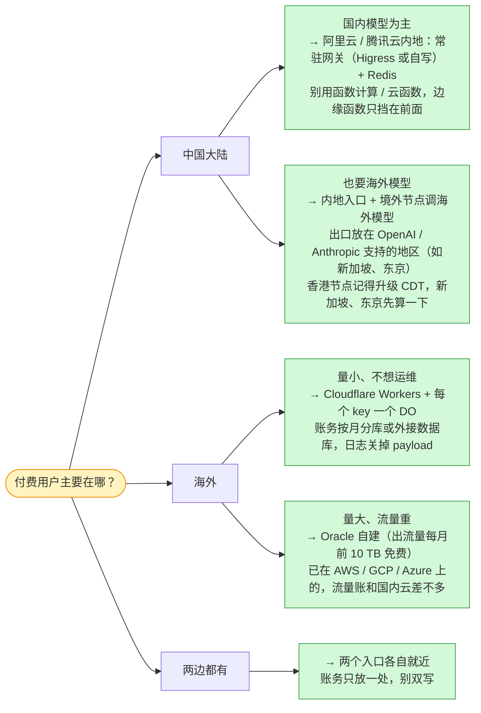

*这篇写给想把第一个应用放上线的人。前半篇讲怎么选、怎么估钱；后半篇拿一个模型网关从零搭一遍，把七家云的账单算到每一项。价格是 2026-10-09 查到的，怎么查的、完整的数字表都在文末[附录](#附录怎么查的和完整数字)。[^scope]*

---

## 先说结论（给赶时间的人）

1. **起步先用免费额度。** 个人网站放 Cloudflare Pages 或 GitHub Pages 不花钱；Cloudflare Workers 每天 10 万次请求以内免费；国内要一台服务器加一个数据库的话，阿里云各有 99 元一年的活动。多数应用起步时，每月几块到几十块就够了。
2. **别为「等」付钱。** 如果你的应用大部分时间在等别人（调大模型、调第三方接口），别用按运行时长计费的 Serverless，等多久它就收多久。
3. **量大以后，看你搬多少字节、记几笔账。** 这时候 CPU 反而是最便宜的一项。
4. **用户在中国大陆，就用国内云，并且先做 ICP 备案。**

后面每一句，都会讲清楚为什么。

---

## 这篇写给谁

- 你手上有一个想放上线的应用：个人网站、小程序或 App 的后端、一个调大模型的 AI 应用，或者一个处理图片视频的小工具。你没买过服务器，也说不太清 Serverless 和服务器有什么区别。
- 读完前半篇，你能看懂云厂商卖的几样东西，把自己的应用拆成三笔账，挑一个起步方案，估出每月大概多少钱，并且知道什么时候该换。
- 后半篇写给想看细节的人：拿一个模型网关做完整例子，假设你知道 LLM API 怎么调用、流式输出是一段一段推回来的（SSE）。看不懂可以先跳过，不影响前半篇的结论。
- 本文**不讨论**模型推理本身（GPU、推理引擎），合规只在影响选型的地方点到为止。

### 术语表

| 术语 | 一句话解释 |
|---|---|
| 请求 | 用户打开一个页面、点一下按钮，浏览器或 App 向你的服务发出的一次「问话」 |
| 云服务器 | 云厂商租给你的一台一直开着的电脑（阿里云叫 ECS，腾讯云叫 CVM，AWS 叫 EC2） |
| Serverless | 你只上传代码，有请求时平台临时替你开机跑一下，没请求不收机器钱（函数计算、云函数、Lambda、Cloud Run） |
| 边缘函数 | 代码放在全球很多机房里就近运行，Cloudflare Workers 最典型 |
| 挂钟时间 | 一个请求从进来到结束经过的真实时间，包括等别人的时间 |
| CPU 时间 | 程序真正在算的时间，等网络、等数据库的时间不算 |
| 出流量 | 从云里发出去的数据，比如网页、图片、接口的回复；大多数云按 GB 收钱 |
| 记账 / 状态 | 需要记下来、下次还要读的数据，比如用户余额、调用次数、登录状态 |
| ICP 备案 | 网站用中国大陆的服务器或节点对外服务前，必须完成的工信部登记 |

---

## 云厂商的货架上卖什么

第一次打开云厂商的官网，几十个产品看得人头晕。其实放代码的地方只有三种，外加一类替你管好的零件：

| 货架上的东西 | 是什么 | 像什么 | 怎么收钱 |
|---|---|---|---|
| 云服务器 | 租一台一直开着的电脑，系统、软件、安全更新都自己管 | 整租一套房 | 按月或按年付，空着也付 |
| 按时长计费的 Serverless | 只传代码，有请求时平台替你开机跑 | 住酒店，按晚付 | 从请求进来到结束，每一秒都算钱，等别人的时间也算 |
| 边缘函数（Cloudflare Workers） | 代码放在全球机房，就近运行 | 只按「真正干活的时间」计费的钟点工 | 按代码真正在算的毫秒收钱，等待不收 |
| 托管服务 | 数据库、文件存储、CDN 这些别人替你管好的零件 | 拎包入住 | 按规格或按用量收钱 |

这篇文章里有五个角色会反复出场，先认识一下：

```comic cols=2
> 一个普通的请求
[用户] 帮我问问大模型：明天要带伞吗？
[你的服务] 收到，我这就转给大模型。
---
> 二十秒后
[大模型] 明天……有……小雨……
[你的服务] 我只忙了 10 毫秒，剩下 20 秒都在等它一个字一个字说完。
---
[云厂商!] 那么问题来了：我该按什么收你的钱？
[你] 这正是这篇文章要算清楚的。
```

漫画里的「你的服务」，就是你放在云上的那段程序。它真正干活只要 10 毫秒，可每个请求都要等大模型说上 20 秒。云厂商收它的钱有三种办法，账单能差出好几倍：

```comic
> 按 CPU 时间收（Cloudflare Workers）
[云厂商] 你的服务真正干活的那 10 毫秒我才收钱，等的时候不算。
---
> 按运行时长收（Lambda、函数计算）
[云厂商] 从请求进来到结束，20 秒，一秒不落。
[你的服务] 可我大部分时间在发呆啊！
---
> 按机器收（云服务器）
[云厂商] 你租了几台机器，就付几台的钱，闲着也照付。
```

除了放代码，还有两笔钱别漏了：**出流量**（东西从云里发出去，大多数云按 GB 收钱，Cloudflare 不收）和**记账**（数据库、缓存，有的按台收，有的按读写次数收）。

---

## 学会拆：把你的应用拆成三笔账

```comic cols=2
> 第一次上线
[你] 我想上线一个小程序，该买服务器还是用 Serverless？
[云厂商] 先别急着掏钱。你的应用整天都在干嘛？
---
[云厂商] 在等别人、在自己算，还是在搬东西？要不要一笔一笔记账？
[你!] 原来得先把它拆开看。
```

拆账只需要回答三个问题，外加一个约束。每个问题都有办法自己查出答案：

**1. 时间花在等，还是花在算？**

看你的接口在干嘛：

- 要调大模型、调第三方接口（支付、地图、短信），或者查很慢的数据库，一次要等好几秒 → **等待型**。
- 要处理图片和视频、渲染 PDF、压缩、跑本地模型 → **计算型**。
- 读写一下数据库就返回，几十毫秒完事 → **轻量型**，等和算都不多。

**2. 每个请求搬多少字节？**

用浏览器打开你的应用，按 F12 打开开发者工具，切到「网络（Network）」面板，点一个请求就能看到它的大小。图片和视频看文件大小；AI 应用看 prompt 和回答有多长，一个汉字大约 3 个字节。几 KB 算轻，几百 KB 以上算重。

**3. 要不要一笔一笔记账？**

每个请求要不要读写数据库？要不要实时扣余额、数次数、限流？要的话，记账就是你的一笔固定开销，而各家收这笔钱的方式差别很大。

**外加一个约束：用户在哪？** 主要在中国大陆，就得用国内云，而且网站对外服务前要先做 ICP 备案；Cloudflare 这类境外平台在大陆没有节点，访问会慢。主要在海外，选择就多了。

拆完以后，再估一下量：**每月请求数 ≈ 日活用户 × 每人每天的请求数 × 30**。比如 1,000 个日活，每人每天点 50 下，就是每月 150 万次请求。

有了这几个数，月费大致是四项相加：

| | 云服务器 | 按时长计费的 Serverless | 边缘函数（Cloudflare） |
|---|---|---|---|
| 保底费（没人用也要付） | **高**：机器、数据库一直开着 | 低 | 低（Workers 付费版每月 $5） |
| 等待和计算 | 几乎不另收钱，但机器要按高峰买够 | **按挂钟时间收**，等待也算 | 只收计算的毫秒 |
| 出流量 | 按 GB 收（有的套餐不限流量） | 按 GB 收 | 不收 |
| 记账 | 自己的数据库，按台收 | 外接数据库，按台或按量收 | **按读写次数收** |

哪一列便宜，就看你的应用在哪一行花得多。

---

## 对号入座：四种常见应用怎么起步

先看四种应用怎么起步：

| 应用 | 拆出来的三笔账 | 用户主要在国内 | 用户主要在海外 |
|---|---|---|---|
| 个人网站、博客、作品集 | 几乎不算；行李看图片多少；不记账 | 对象存储加 CDN，按流量付钱，要备案 | Cloudflare Pages 或 GitHub Pages，免费 |
| 小程序、App 后端 | 轻量；行李轻；要记账（用户数据） | 一台小服务器加一个数据库；微信小程序也可以用腾讯云开发 | Cloudflare Workers 加 D1，免费额度起步 |
| 调大模型的 AI 应用 | 等；行李中等；要记账（用量、余额） | 一台常驻的小服务器，别用按时长计费的函数计算 | Cloudflare Workers，免费额度起步 |
| 图片、视频处理工具 | 算；行李重；不记账 | 偶发用函数计算，持续跑满用服务器；文件放对象存储 | 偶发用 Lambda 或 Cloud Run，持续用服务器；文件放 R2（出流量免费） |

起步阶段最该先用的，是各家的免费额度和新人价：[^free]

| 平台 | 免费额度或起步价 | 要注意 |
|---|---|---|
| Cloudflare Pages | 免费，静态请求不限量，每月 500 次构建 | |
| GitHub Pages | 免费，站点 1 GB 以内，每月流量软上限 100 GB | 不能用来做网上生意、电商或 SaaS |
| Vercel Hobby | 免费，每月 100 GB 流量 | 只限非商业的个人使用 |
| Cloudflare Workers | 每天 10 万次请求免费；付费版每月 $5，含 1,000 万次请求 | 免费版每次只给 10 毫秒 CPU |
| Cloudflare D1 / KV / R2 | D1 每天读 500 万行、写 10 万行；KV 每天读 10 万次、写 1,000 次；R2 每月 10 GB | R2 出流量免费 |
| 阿里云 ECS 99 | 2 核 2G、3M 带宽不限流量，99 元/年 | 每人同时只能有 1 台；续费同价，活动到 2029-03-31 |
| 阿里云 RDS 99 | MySQL 基础版，99 元/年 | 能和 ECS 99 同时买；活动到 2027-03-31；基础版是单节点 |
| 阿里云轻量服务器 | 官网写「低至 68 元 1 年」 | 页面没写规格和条件；活动机续费按正常价 |
| 阿里云函数计算 | 新用户每月 15 万 CU，连续 3 个月 | 没有长期免费额度 |
| 腾讯云轻量服务器 | 4 核 4G 3M，新用户首年 109 元 | 同一实名只能买一次，活动到 2026-12-30，续费按刊例价 |
| 腾讯云开发（小程序） | 免费体验版每月 3,000 资源点；个人版 19.9 元/月（限时） | 小程序一发布，免费环境 15 天后到期 |
| AWS | 新账户先给 $100，用指定服务最多再给 $100；Lambda 每月 100 万次请求长期免费 | 免费计划最长 6 个月，到期或额度用完就关闭账户 |
| Google Cloud | 新客户 $300，90 天内用完；Cloud Run 每月 200 万次请求免费；一台 e2-micro 长期免费 | e2-micro 只限美国三个地域 |
| Oracle Cloud | 长期免费：ARM 机每月约 2 核 12 GB、2 台小 AMD 机、每月 10 TB 出流量 | 闲置 7 天可能被回收 |

什么时候该换？看三笔账里哪一笔先涨上来：请求多了、等得久了，按时长计费的该换成常驻服务器或边缘函数；流量大了，看出流量单价（Cloudflare、Oracle 便宜）；记账多了，Cloudflare 按次收费会越来越贵，自己的数据库按台收钱。后半篇的模型网关例子，就是把这三笔账从每月 1,000 万次一路算到 10 亿次。

[^free]: 都是 2026-10-09 在官方页面核对的：[Cloudflare Workers](https://developers.cloudflare.com/workers/platform/pricing/)、[Pages](https://developers.cloudflare.com/pages/platform/limits/)、[D1](https://developers.cloudflare.com/d1/platform/pricing/)、[R2](https://developers.cloudflare.com/r2/pricing/)、[GitHub Pages](https://docs.github.com/en/pages/getting-started-with-github-pages/github-pages-limits)、[Vercel Hobby](https://vercel.com/docs/plans/hobby)、[阿里云 ECS 99](https://www.aliyun.com/daily-act/ecs/99program)、[RDS 99](https://www.aliyun.com/activity/database/bestoffers)、[阿里云轻量](https://www.aliyun.com/product/swas)、[函数计算试用](https://help.aliyun.com/zh/functioncompute/fc/product-overview/trial-quota-1)、[腾讯云轻量](https://cloud.tencent.com/act/pro/lighthouse)、[腾讯云开发](https://tcb.cloud.tencent.com/pricing)、[AWS Free Tier](https://aws.amazon.com/free/)、[Lambda](https://aws.amazon.com/lambda/pricing/)、[Google Cloud](https://docs.cloud.google.com/free/docs/free-cloud-features)、[Oracle Always Free](https://docs.oracle.com/en-us/iaas/Content/FreeTier/freetier_topic-Always_Free_Resources.htm)。活动价随时会变，阿里云、腾讯云轻量服务器的规格和续费价以购买页为准；RDS 99 的规格取自组合购页的规则说明。

还有几样常见的服务也顺手归一下类：

| 服务 | 时间花在 | 每个请求的字节 | 记账 | 适合放哪 |
|---|---|---|---|---|
| 个人网站、博客 | 几乎不算 | 看图片多少 | 不用 | 静态托管加 CDN |
| 小程序、App 后端 | 轻量 | 轻 | 要（用户数据） | 一台小服务器加数据库，或者托管后端 |
| 调大模型的 AI 应用 | 等 | 中 | 要（用量、余额） | 边缘函数或常驻进程，别用按时长计费的 Serverless |
| 实时推送、聊天（SSE、WebSocket） | 等（长连接） | 轻 | 在线状态、房间 | Workers + DO（WebSocket 休眠期间不收时长费），或常驻进程 + Redis |
| 慢接口代理、BFF、Webhook 中转 | 等 | 轻 | 没有或很少 | 边缘函数最省；量大以后常驻进程也划算 |
| 图片、PDF、视频处理 | 算 | 重 | 不用 | 偶发用按时长计费的 Serverless，持续用机器 |
| 文件和媒体下载 | 几乎不算 | 很重 | 不用 | 对象存储加 CDN；海外用户可以用出流量免费的 Cloudflare R2 |
| 高频短请求（鉴权、计数、限流服务） | 很少 | 轻 | 每个请求都要读，要求毫秒级 | 常驻进程加内存缓存（Unkey 从 Workers 迁走就是这个原因，见后文） |

*表：按三个问题给常见服务归类（本文的判断，不是官方建议）。*

**算得多的应用，比的是每 CPU 小时多少钱：**

```chart
{
 "type": "bars",
 "fmt": {"pre": "¥", "digits": 2},
 "legend": [
   {"color": "seal", "label": "按 CPU 毫秒计费"},
   {"color": "gold", "label": "按时长计费的 Serverless"},
   {"color": "gray", "label": "机器（满载时）"}
 ],
 "rows": [
   {"label": "腾讯云 CVM", "sub": "SA9 包月", "value": 0.1, "color": "gray"},
   {"label": "Oracle", "sub": "E6.Flex 按需", "value": 0.128, "color": "gray"},
   {"label": "阿里云 ECS", "sub": "c9i 包月", "value": 0.136, "color": "gray"},
   {"label": "Google Cloud", "sub": "c4 按需", "value": 0.286, "color": "gray"},
   {"label": "AWS EC2", "sub": "c8i 按需", "value": 0.315, "color": "gray"},
   {"label": "Azure", "sub": "F4als_v7 按需", "value": 0.406, "color": "gray"},
   {"label": "Cloudflare Workers", "sub": "按 CPU 毫秒", "value": 0.484, "color": "seal"},
   {"label": "AWS Lambda", "sub": "Arm，1,769 MB ≈ 1 vCPU", "value": 0.57, "color": "gold"},
   {"label": "AWS Lambda", "sub": "x86", "value": 0.713, "color": "gold"}
 ],
 "caption": "每 CPU 小时的价（人民币，2026-10-09）。机器按 4 vCPU 的月价折算，是 100% 用满时的价；平均只用三成，实际单价要乘以三左右。Lambda 按 1,769 MB 内存约等于 1 个 vCPU 折算。"
}
```

Workers 的 CPU 单价是阿里云包月机器的约 3.6 倍、AWS 按需机器的约 1.5 倍。[^cpu-price] 听着很贵？可机器得按高峰买，平时大半在闲着：和阿里云比，只要机器平均利用率低于约三成，按毫秒收反而便宜。按时长计费的 Lambda 单价最高，但对计算型应用一点不冤，因为它挂着的每一秒都在算。

所以**同一种 Serverless，对等待型是个坑，对偶发的计算活却是好东西**。持续跑满的计算，还是放机器最便宜。另外别忘了硬限制：Workers 一次最多 5 分钟 CPU、128 MB 内存，大图处理和长视频转码装不下。[^limits]

---

## 完整例子：从零搭一个模型网关

前半篇讲的是方法，这一节拿一个具体的应用，把三笔账算到每一项。挑模型网关，是因为它三笔账几乎占全了：等得多、算得少，每个请求拎着中到重的行李，还要一笔一笔记账。

先把这个例子的结论摆出来，三个规模下谁花多少（点上面的标签切换规模）：

```chart
{
 "type": "bars",
 "fmt": {"pre": "¥"},
 "legend": [
   {"color": "seal", "label": "Cloudflare"},
   {"color": "green", "label": "Oracle"},
   {"color": "gray", "label": "其他云自建"}
 ],
 "panels": [
   {
    "title": "每月 1,000 万次请求",
    "rows": [
      {"label": "Cloudflare", "sub": "常规写法", "value": 140, "color": "seal"},
      {"label": "Cloudflare", "sub": "优化写法", "value": 67, "color": "seal"},
      {"label": "阿里云 · 深圳", "value": 1625},
      {"label": "腾讯云 · 广州", "value": 1422},
      {"label": "AWS · 美东", "value": 2467},
      {"label": "Google Cloud · 美东", "value": 3056},
      {"label": "Azure · 美东", "value": 4794},
      {"label": "Oracle · 美东", "value": 1973, "color": "green"}
    ]
   },
   {
    "title": "每月 1 亿次",
    "rows": [
      {"label": "Cloudflare", "sub": "常规写法", "value": 2756, "color": "seal"},
      {"label": "Cloudflare", "sub": "优化写法", "value": 2115, "color": "seal"},
      {"label": "阿里云 · 深圳", "value": 5854},
      {"label": "腾讯云 · 广州", "value": 5359},
      {"label": "AWS · 美东", "value": 6646},
      {"label": "Google Cloud · 美东", "value": 7387},
      {"label": "Azure · 美东", "value": 9125},
      {"label": "Oracle · 美东", "value": 2388, "color": "green"}
    ]
   },
   {
    "title": "每月 10 亿次",
    "rows": [
      {"label": "Cloudflare", "sub": "常规写法", "value": 32574, "color": "seal"},
      {"label": "Cloudflare", "sub": "优化写法", "value": 25139, "color": "seal"},
      {"label": "阿里云 · 深圳", "value": 45696},
      {"label": "腾讯云 · 广州", "value": 45179},
      {"label": "AWS · 美东", "value": 47179},
      {"label": "Google Cloud · 美东", "value": 43798},
      {"label": "Azure · 美东", "value": 49848},
      {"label": "Oracle · 美东", "value": 8832, "color": "green"}
    ]
   }
 ],
 "caption": "每月账单，人民币目录价（2026-10-09）。自建 = 负载均衡 + 两个可用区的机器 + Redis + MySQL + 日志 + 出流量。香港、新加坡等地域，以及托管网关、Serverless 的完整数字在文末附录。"
}
```

1. **量小，选 Cloudflare。** 每月 1,000 万次请求，它一百多元，最便宜的自建也要一千四百元左右。云厂商收的是保底费：两台机器、一个高可用数据库、一个 Redis，没人用也得付。
2. **量大，看请求有多胖。** 到每月 10 亿次，阿里云、腾讯云和三大海外云的自建只比 Cloudflare 贵三成到一倍多。请求越小，自建越划算；请求越大（比如编码 Agent），Cloudflare 越便宜。
3. **Oracle 不按常理出牌。** 它每月前 10 TB 出流量免费，量大时美东自建比 Cloudflare 还便宜约三倍，代价是机器得自己管。

> [!NOTE]
> 这个例子的账单建立在一组示意假设上：每个请求挂 20 秒，网关只算 10 毫秒，来回搬 50 KB，机器规格没有压测。最敏感的是最后一个数，[第三步那张图](#第三步搬行李)能看出你的业务落在哪一边。

好，动手。假设你要上线一个模型网关：客户拿着 API key 来，你替他把请求转给大模型，按用量收他的钱。我们一个零件一个零件往上装，每装一个，看账单从哪冒出来。

拆到最小，网关只做六件事：


*图：一个模型网关请求的最小因果链（示意，不是某个产品的实现）。黄色几步要算，但每步只有几毫秒；蓝色那一步要等，一等就是十几秒到几分钟。*

这六步让模型网关和普通 API 网关有三点不同：

| 特征 | 本文取值（示意） | 为什么重要 |
|---|---|---|
| 挂钟时间很长 | 20 秒 | 大部分时间在等上游生成 token；推理模型会更长 |
| CPU 时间很短 | 10 毫秒 | 鉴权、选线、逐块转发 SSE、找 usage[^cpu-ms] |
| 出流量大 | 50 KB / 请求 | 30 KB 是把客户的 prompt 转给上游，20 KB 是把 SSE 回给客户端 |

10 毫秒除以 20 秒是 0.05%。网关 99.95% 的时间，都在等。

### 第一步：接住请求，然后等

先装最核心的零件：收请求，转给上游，把回答原样传回去。这一步的账，取决于你站在哪种平台上：

- **Workers**：只收那 10 毫秒的 CPU，等的 20 秒一分不收。[^cf-wall] 20 秒的流和 0.2 秒的流一个价。
- **按时长计费的 Lambda、函数计算、云函数**：20 秒全收，一秒不落，而且常常一个实例只能伺候一个请求。[^one-per-instance]
- **自建机器**：等待只占一个连接、不占 CPU；但机器要按峰值并发买，闲着也付钱。

差距有多大？到每月 10 亿次，按时长计费的几家，账单是 Cloudflare 的两倍到十倍：

```chart
{
 "type": "bars",
 "fmt": {"pre": "¥"},
 "ref": {"value": 45696, "label": "阿里云深圳自建"},
 "rows": [
   {"label": "Cloudflare Workers", "sub": "按 CPU 时间计费", "value": 32574, "color": "seal"},
   {"label": "Google Cloud Run", "sub": "单实例并发 250", "value": 59634},
   {"label": "阿里云 AI 网关", "sub": "托管", "value": 60518},
   {"label": "阿里云函数计算", "sub": "单实例并发 100", "value": 68877},
   {"label": "腾讯云云函数", "sub": "开请求多并发，估算", "value": 75903},
   {"label": "Azure Container Apps", "sub": "每副本 100 条流", "value": 79376},
   {"label": "Google Cloud Run", "sub": "单实例并发 80", "value": 107676},
   {"label": "OCI Functions", "sub": "Oracle", "value": 264894},
   {"label": "AWS Lambda", "sub": "128 MB Arm", "value": 278460},
   {"label": "腾讯云云函数", "sub": "默认一个实例一条流", "value": 321865}
 ],
 "caption": "每月 10 亿次请求的月费（人民币，含 Redis、数据库、日志和出流量）。虚线是阿里云深圳自建。按挂钟时间计费的方案要为等上游的 20 秒付钱；Cloudflare Workers 只按 CPU 时间计费。"
}
```

图里那几家比较便宜的按时长计费方案，都开了「一个实例同时接很多请求」。它们在量小的时候甚至比自建还便宜一点，因为省掉了常驻机器和负载均衡；可量一上去，就反过来了。

想看这一步落到代码上长什么样，下面是 Workers 版的伪代码，注释里标了哪行在等、哪行在算（示意，不是哪个平台的真实源码）：

```ts
// 伪代码（示意）：Workers 版模型网关的一次请求
export default {
  async fetch(req, env, ctx) {
    const key = await env.KEYS.get(apiKeyOf(req), "json");         // ① KV 读：等网络，不算 CPU
    if (!key) return new Response("invalid key", { status: 401 });

    const limiter = env.LIMITER.get(env.LIMITER.idFromName(key.id)); // 每个 API key 一个 DO
    const slot = await limiter.acquire(estimateCost(req));           // ② 占并发位 + 预扣余额（写 1 行）
    if (!slot.ok) return new Response("too many requests", { status: 429 });

    const upstream = await fetch(pickLine(key), forward(req));       // ③④ 等上游首包，可能好几秒，不算 CPU
    const { readable, writable } = new TransformStream();
    ctx.waitUntil(pipeAndFindUsage(upstream.body, writable, async (usage) => {
      await limiter.release(slot.id, usage);                         // ⑥ 释放并发位 + 结算（写 1 行）
      await env.USAGE.send({ key: key.id, usage });                  // ⑥ 用量消息，消费者按分钟聚合写 D1
    }));
    return new Response(readable, upstream);                         // ⑤ 20 秒的流，CPU 只花在逐块拷贝上
  },
};
```

同样六步换到阿里云或腾讯云，就是一个常驻进程（Higress 插件或者自己写的 Go 服务）加一个 Redis：查 key 走进程内存缓存，没命中再查 Redis；占并发位和预扣余额用 Redis 的 `INCR` / `DECR` 加一段 Lua 脚本；用量在进程里攒一批，再批量写数据库或者发到消息队列。

**架构是一样的，差的是每一步怎么收费。**

### 第二步：记账

网关要按用量收客户的钱，就得记账：每个请求进门时占一个并发位、预扣一点余额，出门时按实际用量结算，再留一条用量记录。

```comic cols=2
> 每个请求都要记两笔账
[用户] 我先付了钱，用多少扣多少。
[你的服务] 那我进门先预扣一点，答完再按实际用量结账。
---
> 在 Cloudflare
[云厂商!] 每记一笔，收一笔钱。十亿个请求，就是二十亿笔。
---
> 在自己的 Redis
[云厂商] Redis 按台收钱。你记一笔还是记一亿笔，一个价。
```

这一笔，两边的收法正好反过来。

**Cloudflare 每记一笔，收一笔钱。** 最大的一项是 DO 写行，每月 10 亿次时约 1.3 万元。并发位和余额必须写进 DO 自带的 SQLite，不能只放内存，因为 DO 闲下来就可能睡着，醒来时内存里的计数已经没了，而一条流要挂 20 秒。[^do] 改成「用量先在 DO 里攒着、每分钟落一次库，再去掉 Queues」的优化写法，月费能降两成多。还有三件事要提前想好：

- 一个 DO 是单线程的，每秒大约扛一千次请求。所以每个 API key 一个 DO，大客户的 key 再拆分片，别用一个 DO 做全局限速。
- KV 是最终一致的，改动要一分钟以上才传遍全球，吊销 key、改余额不能只靠它。[^kv]
- D1 单库最大 10 GB，而且不能提。按分钟聚合的用量表，一个多月就写满，得定期汇总、按月分库，冷数据挪去 R2。[^d1]

**自建的 Redis 按台收钱。** 一个 1 GB 双副本的 Redis 每月 77 元，标称每秒 10 万次操作，每月 10 亿次时峰值每秒只要约 4,600 次。[^redis] 查 key、计数、余额全压在它上面，**请求数翻十倍，它的价格纹丝不动**。

把每月 10 亿次时的账单拆成三块，记账这一笔压在谁身上，一眼就看出来了：

```chart
{
 "type": "stack",
 "fmt": {"pre": "¥"},
 "series": [
   {"key": "state", "label": "状态读写（查 key、计数、余额、用量库）", "color": "blue"},
   {"key": "egress", "label": "出流量", "color": "gold"},
   {"key": "rest", "label": "其余（机器、负载均衡、日志）", "color": "gray"}
 ],
 "rows": [
   {"label": "Cloudflare", "sub": "常规写法", "values": {"state": 27462.09, "egress": 0, "rest": 5111.91}},
   {"label": "Cloudflare", "sub": "优化写法", "values": {"state": 20027.24, "egress": 0, "rest": 5111.91}},
   {"label": "阿里云 · 深圳", "values": {"state": 1730.0, "egress": 37997.0, "rest": 5968.64}},
   {"label": "腾讯云 · 广州", "values": {"state": 2008.0, "egress": 40000.0, "rest": 3170.65}},
   {"label": "AWS · 美东", "values": {"state": 4625.9, "egress": 28826.77, "rest": 13726.01}},
   {"label": "Oracle · 美东", "values": {"state": 2954.46, "egress": 2269.5, "rest": 3607.73}}
 ],
 "caption": "每月 10 亿次请求时，月费拆成三块（人民币）。Cloudflare 的「状态」按次收费，自建方案的 Redis 和 MySQL 按台收费。"
}
```

**Cloudflare 的账单八成多是记账；阿里云、腾讯云、AWS 的账单六到九成是出流量；Oracle 三块差不多大。** 出流量，是下一步的事。

### 第三步：搬行李

网关不只是传话，它还拎着行李。每个请求平均 50 KB：30 KB 是客户的 prompt，网关得替他送到上游；20 KB 是模型的回答，要送回客户端。**对网关来说，替客户转发 prompt 也算出流量。**

```comic cols=2
> 你的服务不只是传话
[用户] 我的问题有 30 KB，回答还有 20 KB。
[你的服务] 我得把问题送到大模型，再把回答搬回给你。
---
> 在国内云和三大海外云
[云厂商] 每个字节出门都得买票。
[你的服务] 连我替用户转给大模型的问题也算？
[云厂商!] 也算。
---
> 在 Cloudflare 和 Oracle
[云厂商] 出门不要票。Oracle 是每月前 10 TB 不要。
```

Cloudflare 出门不要票，Worker 发出的子请求也不收钱，条款里也没有带宽上限。[^tos] 国内云每 GB 五毛到八毛，三大海外云差不多。Oracle 每月前 10 TB 免费，超出以后北美每 GB 不到一美分。

所以，每个请求搬多少字节，几乎决定了谁便宜：

```chart
{
 "type": "line",
 "fmt": {"pre": "¥"},
 "x": {"label": "每个请求的出流量（KB）", "min": 0, "max": 100, "ticks": [0, 20, 40, 60, 80, 100]},
 "y": {"label": "每月 10 亿次请求时的月费（人民币）", "max": 100000, "ticks": [0, 20000, 40000, 60000, 80000, 100000]},
 "series": [
   {"label": "阿里云 · 深圳自建", "color": "blue", "points": [[5, 9478], [10, 13723], [15, 17731], [20, 21726], [25, 25721], [30, 29716], [35, 33711], [40, 37706], [50, 45696], [60, 53247], [70, 60737], [80, 68227], [90, 75717], [100, 83207]]},
   {"label": "AWS · 美东自建", "color": "gray", "points": [[5, 18896], [10, 22186], [15, 25320], [20, 28443], [25, 31566], [30, 34688], [35, 37811], [40, 40933], [50, 47179], [60, 52548], [70, 57785], [80, 63023], [90, 68261], [100, 73499]]},
   {"label": "Oracle · 美东自建", "color": "green", "points": [[5, 6562], [10, 6562], [15, 6834], [20, 7119], [25, 7405], [30, 7690], [35, 7975], [40, 8261], [50, 8832], [60, 9402], [70, 9973], [80, 10544], [90, 11115], [100, 11686]]},
   {"label": "Cloudflare 常规写法", "color": "seal", "points": [[0, 32574], [100, 32574]]},
   {"label": "Cloudflare 优化写法", "color": "seal", "dash": true, "points": [[0, 25139], [100, 25139]]}
 ],
 "marks": [
   {"x": 33.6, "y": 32574, "label": "≈ 34 KB 时打平", "color": "seal", "side": "left"},
   {"x": 50, "y": 45696, "label": "本文假设 50 KB", "color": "blue"}
 ],
 "caption": "Cloudflare 不收出流量费，所以它的两条线一动不动。500 KB 的编码 Agent 请求在图外：阿里云自建 ¥365,488，AWS ¥236,506，Oracle ¥34,518。"
}
```

- **行李轻，自建便宜。** 每个请求的出流量低于约 34 KB 时，阿里云自建比 Cloudflare 便宜（对 Cloudflare 的优化写法是约 24 KB）。短问答只有 5 KB 左右，自建只要 Cloudflare 的三分之一。
- **行李重，Cloudflare 便宜。** 编码 Agent 的请求体动辄几百 KB，这时 Cloudflare 便宜好几倍。AWS 的打平点比阿里云还低。
- **Oracle 在整个范围里都最便宜**，要到三四百 KB 才和 Cloudflare 打平。
- **量越小，打平点越低。** 每月 1,000 万次时，云厂商的保底费已经比 Cloudflare 的全部账单还高，怎么都打不平。

所以「Cloudflare 便宜」这句话，**只在量小或者行李重的时候成立**。

国内云还有一个独门杠杆：**上游如果就在同一家云的内网里**（比如在阿里云上调百炼），转发 prompt 那部分可以不走公网。百炼的私网连接目前只开了北京和香港；网关和百炼同地域时，每月 10 亿次能把出流量这一项从约 3.8 万元降到约 1.9 万元（已算上私网连接费）。网关在深圳、跨地域连北京，就基本省不下来。

### 第四步：把量放大一百倍

零件装齐了。现在把流量从每月 1,000 万次拧到 10 亿次，也就是这一节开头那张图的三个标签。

- **量小的时候，比的是保底费。** Cloudflare 没有保底，云厂商有。所以 1,000 万次时它便宜一个数量级。
- **量大以后，比的是记账和行李。** Cloudflare 的钱花在记账上，其他云的钱花在出流量上，两边只差三成到一倍多。Oracle 的出流量几乎不要钱，所以它跑到了最前面。
- **CPU 几乎不影响账单。** 把网关的 CPU 时间从 5 毫秒翻到 20 毫秒，Cloudflare 的月费只变 6%；自建的话 4 台 8 核机器也装得下。按 CPU 收费时，等上游的 20 秒几乎不花钱。

再说一个让人松口气的事实：**网关的基础设施费，只是模型费的零头。** 摊到每个请求，Cloudflare 约 0.00003 元，阿里云自建约 0.000045 元；而一次 7,500 token 输入、300 token 输出的调用，按 DeepSeek V4.1-Flash 的高峰价约 0.017 元，网关只占 0.2–0.3%，换成便宜得多的通义 qwen-flash 也只占 2–3%。[^model]

所以选平台不能只盯着账单。延迟、可达性和稳定性，至少同样重要。

### 第五步：挪到用户身边

最后一个零件：入口放在哪，离用户多远。

```chart
{
 "type": "bars",
 "fmt": {"suf": " ms"},
 "rows": [
   {"label": "阿里云 · 深圳", "value": 7, "color": "gray"},
   {"label": "腾讯云 · 广州", "value": 8, "color": "gray"},
   {"label": "阿里云 · 香港", "value": 13, "color": "gray"},
   {"label": "腾讯云 · 香港", "value": 13, "color": "gray"},
   {"label": "阿里云 · 新加坡", "value": 57, "color": "gray"},
   {"label": "腾讯云 · 新加坡", "value": 89, "color": "gray"},
   {"label": "Cloudflare", "value": 162, "color": "seal", "sub": "任播，落在洛杉矶"},
   {"label": "AWS · 新加坡", "value": 203, "color": "gray"},
   {"label": "AWS · 美东", "value": 224, "color": "gray"},
   {"label": "Oracle · 新加坡", "value": 230, "color": "gray"},
   {"label": "阿里云 · 弗吉尼亚", "value": 231, "color": "gray"},
   {"label": "Oracle · 美东", "value": 236, "color": "gray"}
 ],
 "caption": "深圳电信家宽 ping 各家入口，2026-10-09，每个 20 次。国内地域和 Cloudflare 取 10:49 的中位数，境外地域取 11:55 的平均值。Azure 和 Google Cloud 的入口是全球任播地址，测不出某个地域，没列。"
}
```

从深圳电信访问国内云的深圳、广州、香港入口，都在 10 毫秒上下；Cloudflare 的包在电信骨干上一路出境，最后落在洛杉矶，162 毫秒。[^latency] 新加坡也不一定近：同样在新加坡，阿里云 57 毫秒，AWS 和 Oracle 要 200 多毫秒，和美东差不多。国内云的境外地域和国内运营商的互联，通常好得多。

这对首 token 意味着什么？新建 HTTPS 连接至少要 3 个往返（TCP、TLS 1.3、发出请求），162 毫秒一个往返，首 token 前就多了约 0.45 秒；复用连接时多约 0.15 秒。聊天能感觉到，Agent 的长任务基本无所谓。

还有三件事：

- **China Network 救不了这套架构。** 不开 China Network 时，大陆用户连的是境外机房。China Network 要 Enterprise 套餐、单独订阅、每个主域名的 ICP 备案或许可证，还要过京东云的内容审核；它的可用产品清单里有 Workers、KV、R2，**没有 DO、D1、Queues**（官方没说这几项在京东云节点上是不能用还是绕回境外）。`*.workers.dev` 在大陆被封，必须绑自己的域名。[^workers-dev]
- **海外模型的跨境那一跳躲不掉。** OpenAI 和 Anthropic 的 API 支持地区名单里，既没有中国大陆，也没有香港，所以网关调这两家，出口要放在新加坡、日本、美国这类支持地区，香港只能做中转。[^regions] 从大陆用户的角度看，长距离那一跳要么在「用户 → Cloudflare 洛杉矶」，要么在「境外网关 → 美国上游」，所以调海外模型时，Cloudflare 的延迟劣势小得多，差别主要在线路质量。
- **两边都出过大故障，形状不同。** Cloudflare 2025-06-12 因为 KV 依赖的第三方云宕机，AI Gateway 错误率峰值到 97%；2025-11-18 核心代理故障，KV 也大量报 5xx。每个请求都同步读 KV 或 DO 的网关，会跟着全球一起挂，没有「换个可用区」的退路。阿里云香港可用区 C 在 2022-12-18 因制冷故障中断十多个小时，但故障集中在一个可用区，跨可用区部署就有退路。

---

## 上线前要绕开的坑

账单之外，每朵云都埋了几个能让账单翻倍、或者让请求半路断掉的坑。

### Cloudflare 的三个坑

- **让 DO 陪着整条流一起醒着。** 比如让流经过 DO 转发，或者在 DO 里挂一个 `setTimeout` 做租约超时，DO 就会按挂钟时长计费，每月 10 亿次时最多多出约 21.5 万元。租约超时用 `setAlarm`。2026-10-01 起，DO 里没完成的出站调用和 `waitUntil` 也会让它保持清醒（最多 15 分钟），更容易踩到。
- **AI Gateway 默认把完整的 prompt 和回答记进日志。** 2026-09-24 以后新开 AI Gateway 的账号，日志按 Workers Logs 的价格计费，每月 10 亿次时约 9.4 万元。关掉 payload 记录，或者干脆关日志。另外，用 Cloudflare 统一付费（Unified Billing）时，每个 gateway 每分钟只允许 200 次请求，每月 1,000 万次的平均速率就超了，所以转售场景只能用自己的上游 key（BYOK）。
- **默认的日志配置。** 新建的 Worker 默认开日志，每次调用自动写一条，DO 的每次 RPC 按文档推断也写一条，一个请求就是约 4 条。按官方给的平均每条 4.84 KB 粗算，日志费会涨到原来的二十倍。给网关和 DO 所在的 Worker 关掉调用日志，或者采样。[^logs]

### 国内云的四个坑

- **境外节点的阶梯价要手动开。** 阿里云香港、新加坡、东京的流量单价比深圳低，所以每月 10 亿次时，香港自建反而比深圳便宜，虽然香港的机器贵近一倍。但 2024-12-12 起，ECS、EIP **不会自动按阶梯价**（阿里云叫 CDT）计费，要手动「升级至 CDT 计费」，免费，开了不能关；香港不升级，每月 10 亿次时要多付约 2.1 万元。新加坡、东京反过来：不升级时的原价比阶梯首档还低，流量在一定区间内不升级更省。
- **上游请求别走 NAT。** 阿里云 NAT 网关从 2025-09-26 起按处理的流量收费，上游请求走 NAT，会在流量费之外再加约 23%。给每台 ECS 直接挂按流量计费的公网 IP 更省。
- **长连接不贵，但会被超时掐断。** 阿里云 ALB 的容量费实际由处理的字节数决定，2.3 万条长连接只折合不到 8 个容量单位；腾讯云 CLB 共享型干脆不按容量收费。但 **ALB 的请求超时默认 60 秒**，推理模型的长流要先调大，否则会 504。
- **托管 AI 网关不便宜。** 阿里云的 AI 网关（内核是开源的 Higress）多模型路由、Fallback、消费者 API key、Token 限流都有，但最小规格每月约 4,000 元（文档价）；余额和用量库还得自己配 Redis 和数据库，所以量小时它比整套自建贵两倍多。2026-09-01 起收费的 Serverless 版没有动辄几千元的起步规格费（企业版每月约 176 元实例费），量小时和自建差不多，但公网流量进出都按 0.8 元/GB 收、不走阶梯价，量大以后更贵。

### 海外四家：三大云和国内云是同一本账，Oracle 是例外

三大云的流量价和国内云在同一量级，首档每 GB 约合六毛到八毛人民币，量大以后降到五毛多；机器、数据库、日志反而更贵，日志每 GB $0.50，是阿里云日志服务的 8 倍多。两边一抵，量大时三大云和国内云的账单差不多。量小时 AWS 美东比阿里云深圳贵一半，Azure 美东贵到近三倍。

如果客户端在中国大陆，Google Cloud 回给客户端的那部分流量要按价目表里「到中国内地」那一档计，每 GiB $0.20–0.23（官方没写按什么判定目的地）；全部出流量都按这个价算的话（上限），每月 10 亿次时美东会从约 4.4 万元涨到约 8.1 万元。

Oracle 的出流量几乎免费：每月前 10 TB 不要钱，超出后北美 $0.0085/GB、亚太 $0.025/GB；同地域内的流量、负载均衡转发的数据都不另收费，日志写入也免费。所以每月 10 亿次时，美东 50 TB 出流量只要约 2,300 元，阿里云深圳同样的流量要约 3.8 万元。代价藏在别处：

- 10 TB 免费额度按「来源大区」各算一份，美东和新加坡各 10 TB，同一大区的多个地域共用一份。[^oci-10tb]
- 新加坡只有一个可用域（Oracle 对可用区的叫法），做不到跨可用区，只能跨故障域。
- 按量付费账户默认每个可用域只有 6 个 OCPU、只能开一个地域，量大以后要先申请提额。
- NAT 网关对同一个目的地址和端口的并发连接有上限，美东这种有 3 个可用域的地域每个可用域约 2 万条，新加坡约 6.5 万条；2.3 万条流压在一个可用域、打同一个上游会撞上，所以机器最好挂公网 IP 直接出去（预留公网 IP 官方写明不收费）。
- 最小的 MySQL 高可用规格按 3 个实例收费，每月 $170，是量小时账单的大头。

**负载均衡的默认超时，是上线前最容易踩的坑：**

| | 默认 | 对 SSE 的影响 |
|---|---|---|
| 阿里云 ALB | 请求超时 60 秒，按 ALB 和后端多久没有数据往来算（WebSocket 文档的说法，SSE 没写） | 推理模型首 token 前思考超过 60 秒会 504，要先调大 |
| AWS ALB | 空闲超时 60 秒，可调到 4,000 秒 | 推理模型思考超过 60 秒还没吐首个 token 就会断；调大或发 SSE 心跳 |
| Google Cloud 外部应用负载均衡 | 后端服务超时 30 秒，**算的是整个响应的总时长** | 不是空闲超时，超过 30 秒的流直接被截断；全局负载均衡最多可调到 86,400 秒，上线前要调大 |
| Azure Application Gateway v2 | 请求超时 20 秒，按多久没收到数据算 | 官方排错文档写超时后会把请求再发给另一台后端，没说 POST 例外；如果 POST 也重试，首 token 超过 20 秒的请求**可能被转发两次、上游扣两次费**[^appgw]；跑 SSE 还要关掉默认开启的响应缓冲 |
| Oracle 灵活负载均衡 | 空闲超时 60 秒，可调到 7,200 秒 | 发送数据不会重置接收计时 |

### Serverless 和边缘函数：量大以后都别指望

各家按时长计费的产品，各有各的脾气：

- **阿里云函数计算**：规格费按配置收、不按实际用量收，等上游的 20 秒 vCPU 全额计费，也进不了 vCPU 免费的「浅休眠」。唯一的省钱办法是单实例多并发：并发为 1 时的计算费，是并发 100 时的约 95 倍。
- **腾讯云云函数**：默认一个实例同一时刻只处理一条 SSE 连接，量大时峰值还超出每个地域默认的并发配额。
- **AWS Lambda**：默认并发 1,000，量大要申请提额。
- **Google Cloud Run**：一个实例最多同时处理 1,000 个请求，是几家里最适合长连接的，但仍按实例的挂钟时间计费；它还会自动写请求日志、每 GiB 收 $0.50（可以用排除过滤器关掉），图里没算。
- **Azure**：Functions Flex 默认单实例并发 16，每月 10 亿次时要 1,447 个实例，超过 1,000 个的上限；Container Apps 把并发调到 100 后能跑。
- **OCI Functions**：一个实例一次只处理一个请求，同步调用最长 300 秒，而且要等函数执行完才返回结果，做不了流式。

边缘函数更干脆，**国内的边缘函数做不了通用模型网关**，卡在限制上，不在价格上：

| | Cloudflare Workers | 阿里云 ESA 函数 | 腾讯云 EdgeOne 边缘函数 |
|---|---|---|---|
| 怎么计费 | 请求 + CPU 时间 | 按次，¥5/百万次 | 请求 ¥1.7/百万次 + CPU ¥0.11/百万毫秒 |
| 单次总时长 | 不限（客户端连着就行） | **120 秒**（等待也算） | 文档没写上限；`fetch` 超时最大可配 300 秒 |
| 首包 | 文档没列限制 | **10 秒内不出数据就回 504** | 文档没列限制 |
| 请求体 | 100 MB 起（看域名套餐） | 函数文档没写；站点上传上限默认 300 MB | **1 MB** |
| 单次 CPU | 默认 30 秒，可配到 5 分钟 | 文档没写数值 | **200 毫秒** |
| 子请求 | 默认 1 万次 | **4 个**（中文文档写每次 4 个，英文写同时 4 个、可申请提额） | 64 次 |
| 强一致状态 | Durable Objects | 没有（KV 最终一致，最长 300 秒） | KV 内测，只对企业版，每个命名空间每天 100 万次读 |
| 中国大陆节点 | 只有 China Network（Enterprise + ICP） | 有，要 ICP 备案 | 有，要 ICP 备案 |

推理模型的首 token 常常超过 10 秒，长输出常常超过 120 秒，Agent 的长上下文请求也很容易超过 1 MB；两家也都没有 DO 这样的强一致状态，限速和余额还得回源到中心机房。海外的 CloudFront Functions 和 Lambda@Edge 一样转发不了 20 秒的 SSE，Azure Front Door 的文档写明不支持 SSE。**边缘函数可以站在网关前面做缓存、鉴权预检，替代不了网关。**

至于海外的托管 AI 网关，三大云有、Oracle 没有，而且都不是为「转售」设计的：

- **Azure API Management**：v2 的三个层级都能透传 SSE，有 `llm-token-limit` 这类按 token 限流的策略，量小时 Basic v2 每月约 $148（微软把它定位为开发测试用）。卡脖子的是每个上游主机最多 2,048 条并发后端连接，SSE 一条流占一条，每月 1 亿次的峰值就超了；经典层写明按单元算，v2 只写了 2,048，按单元算的话每月 10 亿次要 12 个单元、约 $1.8 万/月，按字面理解则要拆成 12 个实例再加一层分流。上游走 HTTP/2 在 v2 里还是预览。
- **AWS**：Bedrock AgentCore Gateway（2026-07 起支持推理目标）能代理 OpenAI、Anthropic 和兼容端点，SSE 原样透传，2026-08 起能按用户身份限 RPM、TPM 和并发；但内置鉴权只有 IAM、JWT 或不鉴权，自定义校验要另挂拦截器，而文档写拦截器暂不支持流式，也没有「每个客户一个 API key」、按客户的用量账单和预付费余额。API Gateway 的 REST API 2025-11 起支持流式响应，但读不到流里的用量。
- **Google**：Apigee 能透传 SSE，但按 token 限流的策略只能用在最贵的代理类型上，每月 10 亿次时光调用费就要约 $73,000。
- **Oracle**：没有通用的 LLM 网关，生成式 AI 服务只能调自己目录里的模型。

---

## 谁真的把模型网关放在 Workers 上

只采信一手证据：官方博客、官方文档、仓库里的部署配置、创始人署名文章。

| 平台 | 用了哪些 Cloudflare 组件 | 证据 | 强度 |
|---|---|---|---|
| **Cloudflare AI Gateway** | Workers；日志先放 D1，后挪 R2，再改成按「账户 + gateway」分片的 DO | [官方博客 2024-10-24](https://blog.cloudflare.com/billions-and-billions-of-logs-scaling-ai-gateway-with-the-cloudflare/) | 证实 |
| **Helicone**（托管代理和托管 AI Gateway） | Workers + DO（限速器，加每个组织一个钱包：开始按最坏成本冻结，结束按实际用量结算）+ KV + Queues；超过 20 MiB 的请求体转给 Containers；后端在 AWS | [`worker/wrangler.toml`](https://github.com/Helicone/helicone/blob/main/worker/wrangler.toml)、[钱包 DO](https://github.com/Helicone/helicone/blob/main/worker/src/lib/durable-objects/Wallet.ts)、[官方文档](https://docs.helicone.ai/references/availability) | 证实（边缘请求路径） |
| **OpenRouter** | 边缘层用 Workers，在边缘缓存用户和 API key 数据；余额很低时会多查数据库，延迟上升 | [官方文档](https://openrouter.ai/docs/guides/best-practices/latency-and-performance) | 证实（只到边缘层） |
| **Portkey** | 开源网关仓库自带生产环境的 `wrangler.toml`，官方文档说托管版跑在全球「edge workers」上 | [wrangler.toml](https://github.com/Portkey-AI/gateway/blob/main/wrangler.toml) | 间接证据 |
| **Unkey**（迁走了） | 曾用 Workers + DO 做 API key 校验和限速，2025-08 迁到 AWS 上的有状态 Go 服务 | [联合创始人文章 2025-08-01](https://www.unkey.com/blog/serverless-exit) | 证实 |
| **Braintrust**（迁走了） | 2023 年 AI Proxy 跑在 Workers 上；现在托管入口是 AWS 上的 Gateway，原因没公开 | [2023 年博客](https://www.braintrust.dev/blog/ai-proxy)、[现行文档](https://www.braintrust.dev/docs/deploy/gateway) | 证实「迁了」 |

从这张表能看出三件事：

1. **除了 Cloudflare 自己，没有一家是「全 Cloudflare」。** 最接近的是 Helicone：请求路径上的 Workers、DO、KV、Queues 全在 Cloudflare，分析库和账务后端在 AWS。本文 Cloudflare 一侧连账务都放在 D1 里，比现实中的做法更激进。
2. **大家踩的坑都在记账这一层，不在计算层。** AI Gateway 的日志存储、Helicone 的钱包预扣、OpenRouter 的低余额回源、Pydantic 网关的 KV 软额度，都是。
3. **Unkey 的离开有它的场景。** 它的理由是：缓存读要走网络，p99 超过 30 毫秒；为了绕开无状态，堆了 DO、Queues、Workflows 一串产品；数据导出麻烦；客户没法自托管。迁走后延迟降到原来的 1/6。但 Unkey 每个请求都要在 10 毫秒内完成 key 校验，而模型网关的一个请求本来就要挂 20 秒，几十毫秒的状态读取占比小得多，这个结论不能原样搬过来。

国内这边的主流做法是**常驻网关进程加 Redis**，不是边缘函数：

- **Higress**：阿里开源的网关，2026-03-15 进入 CNCF Sandbox，约 9,500 星。项目方说它支撑通义千问 APP、百炼大模型 API 和 PAI，但没有公开流量数字。它的 Token 限流用 Redis 做全局计数，和 Cloudflare 一侧用 DO 计数是同一个设计点。
- **阿里云 AI 网关**：官方客户案例里，国泰产险所有访问大模型的流量都走 AI 网关，日均近亿 token。
- **国内边缘函数**：没有找到点名的模型网关客户。

---

## 怎么选

**先按你的应用。** 拆完三笔账，大致这么走：

1. **用户主要在中国大陆？** 用国内云，网站对外服务前先做 ICP 备案。
2. **只有静态页面**（个人网站、博客、作品集）？用静态托管加 CDN，基本不花钱。
3. **等待型**（调大模型、调第三方接口）？海外用户用边缘函数，国内用户用一台常驻的小服务器；别用按时长计费的 Serverless。
4. **计算型**（图片、视频处理）？偶发的用按时长计费的 Serverless，持续跑满的用机器。
5. **轻量型**（普通的后端）？先用免费额度或者最便宜的服务器套餐跑起来，量大以后再按三笔账重算一遍。

**下面的决策树和清单，是模型网关这一类的。**



*图：按用户所在地选平台的决策树（本文的判断，不是官方建议）。*

**什么时候选 Cloudflare：**

- 用户主要在海外，或者是调用海外模型的开发者；
- 规模还小（每月千万次以内），想要几乎为零的保底费、不想运维机器，六家云厂商的自建都比不过；
- 请求体大（Agent、长上下文、多模态），流量费在云厂商那边会是账单大头；
- 团队能接受按 key 拆 DO、D1 定期归档这类「为记账而设计」的工作。

**什么时候别用 Cloudflare：**

- 用户主要在中国大陆，对首 token 延迟敏感（聊天产品）；
- 规模到每月 10 亿次量级、请求又很短（每个请求出流量低于约 30 KB），国内云或三大云自建会更便宜；
- 用户在海外、规模大，又愿意自己运维机器：Oracle 自建便宜约三倍；
- 需要强一致的全局状态（全局并发、跨 key 的额度池），又不想自己做分片；
- 需要在中国大陆有节点，又买不起 Enterprise，或者用了 DO、D1、Queues。

---

## 结语

回到漫画里的「你的服务」。它一天里真正干活的时间，加起来可能不到一分钟；剩下的时间，它在等大模型说完、在替用户搬数据、在一笔一笔记账。云厂商没有一家只按「干活」收它的钱，它们各自挑了等待、搬运和记账里的一两样来收。

所以第一次上线，先拆账，再用免费额度把应用跑起来；等量真的大了，你已经知道该盯哪一笔。换一类应用，三个问题的答案变了，结论也跟着变：模型网关是**等待密集、搬运密集、状态密集**型的，拿 CPU 价格去比两朵云，比的是它账单里最小的那一项。

> **铁律：先问三件事——谁为等待收钱，谁为搬运收钱，谁为状态收钱。再看你的用户离哪边近。**

---

## 附录：怎么查的和完整数字

正文里的数字都出自这里。表头的「1,000 万次 / 1 亿次 / 10 亿次」都是每月的请求数。

### 怎么查的

- **国内两家用官方命令行工具的询价接口。** 阿里云用 aliyun CLI 3.5.1（`DescribePrice`、`GetPayAsYouGoPrice`），腾讯云用 tccli 3.1.180.1（`InquiryPrice*`、`DescribeDBPrice`）。所有调用都是只读的询价接口，没有创建任何资源。
- **Cloudflare 全部来自官方价目页和限制页。** 它没有价格接口，wrangler 4.148.0 和 Cloudflare API 只能查自己账号的用量。
- **海外四家用不用登录的公开价格接口**（AWS Price List、Azure Retail Prices API、Oracle 价目 API）；Google Cloud 的价格接口要 API key，用的是官方价目页。查美东和新加坡两个地域，一律按需价、月按 720 小时。预留实例、Savings Plans 能再省三到五成，但只省机器，不省流量。
- **一律用目录价。** 阿里云的询价接口会同时返回账号折扣（比如我的账号负载均衡和 NAT 有 85 折），这类折扣不计入。查不到接口的用官方文档价并标出来，比如阿里云 AI 网关在计费系统里没有计价模块。
- **同一天做过两轮核实**：前两轮标为「未核实」的事项逐项查了官方原文，查实的已改进正文，仍查不实的（多半要账号、压测或真实账单）照旧标出。

<details>
<summary>几条代表性的询价命令（完整命令和原始输出都存了下来）</summary>

```bash open
# 阿里云：ECS 包月价（含 40 GB ESSD PL0 系统盘，不含带宽）
aliyun ecs DescribePrice --RegionId cn-shenzhen --ResourceType instance \
  --InstanceType ecs.c9i.xlarge --PriceUnit Month --Period 1 \
  --SystemDisk.Category cloud_essd --SystemDisk.PerformanceLevel PL0 --SystemDisk.Size 40

# 阿里云：50,000 GB 公网出流量走 CDT 阶梯的总价
aliyun bssopenapi GetPayAsYouGoPrice --region cn-hangzhou --ProductCode cdt \
  --ProductType cdt_DataTransfer_public_cn --SubscriptionType PayAsYouGo --Region cn-shenzhen \
  --ModuleList.1.ModuleCode internet_traffic --ModuleList.1.PriceType Usage \
  --ModuleList.1.Config 'Region:cn-shenzhen,internet_traffic:50000,charge_type:PayByTraffic,isp:BGP'

# 阿里云：Redis（Tair）、RDS 包月价
aliyun r-kvstore DescribePrice --RegionId cn-shenzhen --ZoneId cn-shenzhen-c \
  --InstanceClass redis.shard.large.ce --OrderType BUY --ChargeType PrePaid --Period 1 --NodeType MASTER_SLAVE
aliyun rds DescribePrice --RegionId cn-shenzhen --ZoneId cn-shenzhen-c --Engine MySQL --EngineVersion 8.0 \
  --DBInstanceClass mysql.n4.large.2c --DBInstanceStorage 100 --DBInstanceStorageType cloud_essd \
  --PayType Prepaid --UsedTime 1 --TimeType Month --Quantity 1 --OrderType BUY --CommodityCode rds

# 腾讯云：CVM 包月价（含 50 GB 通用型 SSD，带宽设 0）
TENCENTCLOUD_REGION=ap-guangzhou tccli cvm InquiryPriceRunInstances --cli-unfold-argument \
  --Placement.Zone ap-guangzhou-6 --ImageId img-mmytdhbn --InstanceType SA9.LARGE8 \
  --InstanceChargeType PREPAID --InstanceChargePrepaid.Period 1 \
  --SystemDisk.DiskType CLOUD_BSSD --SystemDisk.DiskSize 50 \
  --InternetAccessible.InternetChargeType TRAFFIC_POSTPAID_BY_HOUR \
  --InternetAccessible.InternetMaxBandwidthOut 0 --InstanceCount 1
```

```bash open
# AWS：us-east-1 到互联网的出流量阶梯（Price List 公开文件，AWSDataTransfer 服务）
curl -s https://pricing.us-east-1.amazonaws.com/offers/v1.0/aws/AWSDataTransfer/current/us-east-1/index.json

# Azure：eastus 的出流量阶梯（Retail Prices API）
curl -s "https://prices.azure.com/api/retail/prices?\$filter=serviceName%20eq%20'Bandwidth'%20and%20armRegionName%20eq%20'eastus'%20and%20meterName%20eq%20'Standard%20Data%20Transfer%20Out'"

# Oracle：北美出发的出流量（价目 API，B88327 = Outbound Data Transfer - Originating in North America, Europe, and UK）
curl -s "https://apexapps.oracle.com/pls/apex/cetools/api/v1/products/?currencyCode=USD&partNumber=B88327"
```

</details>

### 关键单价

<details>
<summary>Cloudflare、阿里云（深圳）、腾讯云（广州）</summary>

| | Cloudflare（美元） | 阿里云（深圳，人民币） | 腾讯云（广州，人民币） |
|---|---|---|---|
| 计算 | Workers $5/月，含 1,000 万请求和 3,000 万 CPU 毫秒；超出 $0.30/百万请求、$0.02/百万 CPU 毫秒；**挂钟时长不收费** | ECS c9i 包月：2c4g ¥205.91，4c8g ¥391.82，8c16g ¥763.64（含系统盘） | CVM SA9 包月：2c4g ¥156.2，4c8g ¥287.4，8c16g ¥549.8（含系统盘） |
| 负载均衡 | 不需要 | ALB 实例 ¥0.049/时 + 容量单位（LCU）¥0.049/个·时；LCU 按新建连接、并发连接、处理字节、规则次数四个维度取最大值 | CLB 共享型 ¥0.2/时，**不按容量收费** |
| 出流量 | **不收费** | CDT 阶梯：10 TB 内 ¥0.80/GB，10–50 TB ¥0.75，50–150 TB ¥0.70，再往上 ¥0.65；每月免费 20 GB | ¥0.80/GB，单一价，没有阶梯也没有免费额度 |
| 计数 / 余额 | DO：请求 $0.15/百万，SQLite 写 $1.00/百万行（含 5,000 万行） | Tair 双副本 1 GB ¥76.98/月，4 GB ¥360/月 | Redis 主从 1 GB ¥76/月，4 GB ¥304/月 |
| 查 key | KV 读 $0.50/百万（含 1,000 万） | 同上 Redis | 同上 Redis |
| 用量 / 账务库 | Queues $0.40/百万次操作（一条消息 3 次）；D1 写 $1.00/百万行，**单库最大 10 GB** | RDS MySQL 高可用：2c4g ¥660/月，4c16g ¥1,370/月 | MySQL 双节点：2c4g ¥480/月，4c16g ¥1,704/月 |
| 日志 | Workers Logs，**2026-12-01 起**按 $0.25/GB 写入 + $0.10/GB·月存储 | SLS ¥0.4/GB（含索引和 30 天存储） | CLS 按功能计费，每 GB 约 ¥0.83 |

</details>

<details>
<summary>AWS、Google Cloud、Azure、Oracle（美东，美元）</summary>

| | AWS | Google Cloud | Azure | Oracle |
|---|---|---|---|---|
| 出流量 | 每月免费 100 GB；10 TB 内 $0.09/GB，10–50 TB $0.085（新加坡首档 $0.12） | Premium 层到北美：1 TiB 内 $0.12/GiB，10 TiB 内 $0.11，再往上 $0.08（新加坡到亚洲首档 $0.12） | 每月免费 100 GB；10 TB 内 $0.087/GB，10–50 TB $0.083（新加坡首档 $0.12） | **每月前 10 TB 免费**，超出 $0.0085/GB（新加坡 $0.025） |
| 4 vCPU 8 GiB 机器（每月） | c8i.xlarge $134.94 | c4-highcpu-4 $122.47 | F4als_v7 $174.24 | E6.Flex 2 OCPU $54.72 |
| 负载均衡 | ALB $16.20/月 + LCU（处理字节约 $0.008/GB） | 转发规则 $18/月 + $0.008/GiB | Application Gateway v2 $0.20/时 + 容量单位 $0.008 | 灵活负载均衡每月 $9–41，转发的数据不另收费 |
| 约 1 GB 高可用 Redis（每月） | Valkey 主从 $36.86 | Memorystore 标准层 $46.08 | Azure Managed Redis B1 $46.08 | OCI Cache $55.87 |
| 约 2 核 MySQL 高可用（每月） | RDS Multi-AZ $115.88 | Cloud SQL HA $192.80 | Flexible Server 区域冗余 HA（最小 2 vCore 8 GiB）$272.84 | HeatWave HA $170.11 |
| 日志 | CloudWatch Logs 写入 $0.50/GB | Cloud Logging $0.50/GiB，每项目每月 50 GiB 免费 | Basic Logs $0.50/GB | 写入免费，存储 $0.05/GB·月 |

</details>

### 完整月费

<details>
<summary>自建网关和 Cloudflare（含香港、新加坡）</summary>

机器规模：国内两家每月 1,000 万次用 2 台 2 核 4G，1 亿次用 2 台 4 核 8G，10 亿次用 4 台 8 核 16G，双可用区，没有压测；数据库和 Redis 规格随规模放大。人民币目录价：

| 方案 | 1,000 万次 | 1 亿次 | 10 亿次 |
|---|---|---|---|
| Cloudflare 常规写法（Workers + KV + Durable Objects + Queues + D1） | 140 | 2,756 | 32,574 |
| Cloudflare 优化写法（用量在 Durable Object 里累加，去掉 Queues） | 67 | 2,115 | 25,139 |
| 阿里云 · 深圳 | 1,625 | 5,854 | 45,696 |
| 阿里云 · 香港（境外节点参考） | 1,981 | 6,114 | 40,426 |
| 腾讯云 · 广州 | 1,422 | 5,359 | 45,179 |
| AWS · 美东 / 新加坡 | 2,467 / 3,227 | 6,646 / 8,572 | 47,179 / 53,327 |
| Google Cloud · 美东 / 新加坡 | 3,056 / 4,031 | 7,387 / 8,583 | 43,798 / 48,564 |
| Azure · 美东 / 新加坡 | 4,794 / 6,215 | 9,125 / 11,934 | 49,848 / 57,957 |
| Oracle · 美东 / 新加坡 | 1,973 / 1,973 | 2,388 / 2,388 | 8,832 / 13,237 |

</details>

<details>
<summary>托管网关和 Serverless（同样含 Redis、数据库、日志和出流量）</summary>

| 方案 | 1,000 万次 | 1 亿次 | 10 亿次 |
|---|---|---|---|
| 阿里云 AI 网关（托管） | 5,428 | 10,195 | 60,518 |
| 阿里云函数计算（单实例并发 100） | 1,419 | 7,703 | 68,877 |
| 腾讯云云函数（默认单并发 / 开请求多并发*） | 3,756 / 1,296 | 32,543 / 7,947 | 321,865 / 75,903 |
| AWS Lambda（128 MB Arm，美东，含平台日志） | 4,142 | 28,874 | 278,460 |
| Google Cloud Run（单实例并发 80 / 250，美东，不含自动请求日志**） | 2,672 / 2,405 | 12,556 / 7,752 | 107,676 / 59,634 |
| Azure Container Apps（每副本 100 条流，美东） | 2,916 | 9,596 | 79,376 |
| OCI Functions（Oracle，美东） | 4,071 | 27,445 | 264,894 |

\* 腾讯云的 SSE 文档写「一个实例同一时刻只处理一条 SSE 连接」，多并发文档又把长连接列为主要用途，只举了 WebSocket 的例子；开多并发那组数按每实例 100 并发、装填率 70% 估算，没实测。\*\* Cloud Run 会自动写请求日志、按 $0.50/GiB 计费，可以用排除过滤器关掉；按每条 1 KB 算，10 亿次时两种并发分别多约 ¥3,100。

</details>

<details>
<summary>一个请求的账、每个规模下最大的几项</summary>

按每月 10 亿次时的超量单价，算每百万请求的边际成本：

| Cloudflare 每百万请求 | 美元 | 阿里云深圳每百万请求 | 人民币 |
|---|---|---|---|
| Workers 请求 | 0.30 | 出流量 50 GB × ¥0.75 | 37.5 |
| Workers CPU（10 ms） | 0.20 | ALB 容量单位（处理 50 GB） | 2.45 |
| KV 读 1 次 | 0.50 | SLS 日志 1 GB | 0.40 |
| DO 请求 2 次 | 0.30 | 机器 + Redis + RDS 摊到每百万请求 | 约 4.8 |
| **DO 写 2 行** | **2.00** | | |
| Queues 3 次操作 | 1.20 | | |
| 日志 1 KB | 约 0.27 | | |
| **合计** | **约 4.8（≈ ¥32）** | **合计** | **约 ¥45** |

海外几家按 10 亿次的总价摊到每个请求：AWS 美东约 ¥0.000047，Oracle 美东约 ¥0.000009。

| | 1,000 万次 | 1 亿次 | 10 亿次 |
|---|---|---|---|
| Cloudflare | Queues 55%、Workers 订阅 24% | DO 写行 37%、Queues 29%、KV 读 11% | DO 写行 40%、Queues 25%、KV 读 10% |
| 阿里云自建 · 深圳 | RDS 41%、ECS 25%、流量 24% | **流量 68%**、ECS 13% | **流量 83%**、ECS 7%、ALB 5% |
| 腾讯云自建 · 广州 | MySQL 34%、流量 28%、CVM 22% | **流量 75%** | **流量 89%** |
| AWS 自建 · 美东 | EC2 37%、RDS 32%、流量 10% | **流量 45%**、EC2 27%、RDS 12% | **流量 61%**、EC2 15%、RDS 7%、日志 7% |
| Oracle 自建 · 美东 | MySQL 58%、Redis 19%、机器 19% | MySQL 48%、机器 31% | 机器 33%、**流量 26%**、MySQL 25% |

</details>

<details>
<summary>每个请求的出流量：阿里云深圳的明细和各家的打平点</summary>

| 每请求出流量 | 1,000 万次 | 1 亿次 | 10 亿次 | 对照：Cloudflare 10 亿次（常规 / 优化） |
|---|---|---|---|---|
| 5 KB（短问答） | ¥1,243 | ¥2,033 | **¥9,478** | ¥32,574 / ¥25,139 |
| 20 KB | ¥1,371 | ¥3,307 | ¥21,726 | 同上 |
| 50 KB（本文口径） | ¥1,625 | ¥5,854 | ¥45,696 | 同上 |
| 200 KB（带长上下文的 Agent） | ¥2,899 | ¥18,102 | ¥155,788 | 同上 |
| 500 KB（编码 Agent 常见） | ¥5,446 | ¥42,072 | **¥365,488** | 同上 |

和 Cloudflare 打平的点（每请求出流量，对优化写法到常规写法）：

- **10 亿次**：深圳约 24–34 KB，香港约 24–37 KB；AWS 美东 15–27 KB，Google Cloud 美东 16–30 KB，Azure 美东 10–22 KB；新加坡出流量更贵，打平点更低。Oracle 美东 336–466 KB，它的账单从 5 KB 到 500 KB 只是 ¥6,562 到 ¥34,518，同样区间 AWS 美东是 ¥18,896 到 ¥236,506。
- **1 亿次**：深圳约 6–14 KB。
- **1,000 万次**：云厂商的保底费已经比 Cloudflare 的全部账单还高，没有打平点。

CPU 时间：Cloudflare 从 5 毫秒到 20 毫秒，10 亿次时的月费从 ¥31,902 变到 ¥33,917。日志按官方平均每条 4.84 KB 算，10 亿次时 Cloudflare 常规写法是 ¥39,622、优化写法 ¥32,188。

</details>

<details>
<summary>延迟原始数据</summary>

| 2026-10-09 10:49（北京时间），深圳电信家宽，ICMP 往返 20 次 | 中位数 | P90 |
|---|---|---|
| 阿里云 深圳（ECS API 入口） | 7 ms | 19 ms |
| 阿里云 香港 | 13 ms | 16 ms |
| 腾讯云 广州（CVM API 入口） | 8 ms | 9 ms |
| 腾讯云 香港 | 13 ms | 20 ms |
| Cloudflare 任播地址（博客的 Pages / Functions 入口） | 162–164 ms | 166–186 ms |

同一条线路，11:55 左右再测各家的境外地域（ICMP 20 次，平均值）：

| 新加坡 | 平均 | 美东 | 平均 |
|---|---|---|---|
| 阿里云 新加坡 | 57 ms | 阿里云 弗吉尼亚 | 231 ms |
| 腾讯云 新加坡 | 89 ms | AWS us-east-1（S3 入口） | 224 ms |
| AWS ap-southeast-1（S3 入口） | 203 ms | Oracle us-ashburn-1 | 236 ms |
| Oracle ap-singapore-1 | 230 ms | | |

</details>

---

## 来源与核对日期

全部在 2026-10-09 核对。

- Cloudflare 价格与限制：
  - [Workers 定价](https://developers.cloudflare.com/workers/platform/pricing/)、[Workers 限制](https://developers.cloudflare.com/workers/platform/limits/)
  - [Durable Objects 定价](https://developers.cloudflare.com/durable-objects/platform/pricing/)、[DO 设计规则](https://developers.cloudflare.com/durable-objects/best-practices/rules-of-durable-objects/)
  - [KV 工作原理](https://developers.cloudflare.com/kv/concepts/how-kv-works/)、[Queues 定价](https://developers.cloudflare.com/queues/platform/pricing/)
  - [D1 定价](https://developers.cloudflare.com/d1/platform/pricing/)、[D1 限制](https://developers.cloudflare.com/d1/platform/limits/)
  - [Observability 定价（2026-12-01 起）](https://developers.cloudflare.com/observability/pricing/)
  - [AI Gateway 定价](https://developers.cloudflare.com/ai-gateway/reference/pricing/)、[AI Gateway 限制](https://developers.cloudflare.com/ai-gateway/reference/limits/)
  - [China Network](https://developers.cloudflare.com/china-network/)、[China Network 可用产品](https://developers.cloudflare.com/china-network/reference/available-products/)
- 阿里云（价格来自 aliyun CLI 询价接口，规则来自文档）：
  - [CDT 公网流量](https://help.aliyun.com/zh/cdt/internet-data-transfers/)、[升级至 CDT 计费](https://help.aliyun.com/zh/cdt/user-guide/upgrade-to-cdt-billing)
  - [ALB 计费规则](https://help.aliyun.com/zh/slb/application-load-balancer/product-overview/alb-billing-rules)、[NAT 网关计费](https://help.aliyun.com/zh/nat-gateway/nat-gateway-billing)
  - [函数计算计费](https://help.aliyun.com/zh/functioncompute/fc/product-overview/billing-overview-of-fc)、[单实例多并发](https://help.aliyun.com/zh/functioncompute/fc/configure-the-concurrency-of-a-single-instance)
  - [AI 网关规格与价格](https://help.aliyun.com/zh/api-gateway/ai-gateway/product-overview/free-product-templates)
  - [ESA 函数和 Pages 限制](https://help.aliyun.com/zh/edge-security-acceleration/esa/user-guide/what-is-functions-and-pages)、[ESA 函数计费](https://help.aliyun.com/zh/edge-security-acceleration/esa/user-guide/functions-and-pages-billing)
  - [通过私网连接访问百炼](https://help.aliyun.com/zh/model-studio/access-model-studio-through-privatelink)、[私网连接计费](https://help.aliyun.com/zh/privatelink/private-link-billing-description)、[AI 网关 Serverless 计费](https://help.aliyun.com/zh/api-gateway/ai-gateway/product-overview/overview-of-billing-during-the-serverless-public-preview-of-the)
- 腾讯云（价格来自 tccli 询价接口，规则来自文档）：
  - [公网流量价格](https://cloud.tencent.com/document/product/213/113026)、[CLB LCU 计费](https://cloud.tencent.com/document/product/214/58387)
  - [云函数计费](https://cloud.tencent.com/document/product/583/12281)、[云函数 SSE](https://cloud.tencent.com/document/product/583/90617)、[Web 函数请求多并发](https://cloud.tencent.com/document/product/583/123888)
  - [EdgeOne 套餐](https://cloud.tencent.com/document/product/1552/94158)、[EdgeOne 超额单价](https://cloud.tencent.com/document/product/1552/94159)、[边缘函数限制](https://cloud.tencent.com/document/product/1552/81344)
- 案例与故障：
  - Cloudflare 故障复盘：[2025-06-12](https://blog.cloudflare.com/cloudflare-service-outage-june-12-2025/)、[2025-11-18](https://blog.cloudflare.com/18-november-2025-outage/)
  - [阿里云香港可用区 C 故障说明（2022-12）](https://www.alibabacloud.com/zh/notice/resolved_service_outage_in_zone_c_of_the_china_hong_kong_region_1ae)
  - [Higress](https://github.com/higress-group/higress)、[阿里云 AI 网关产品页](https://www.aliyun.com/product/apigateway)
  - [GreatFire：workers.dev](https://en.greatfire.org/domain/workers.dev)（第三方观测）、[Cloudflare 社区：workers.dev 在大陆被封](https://community.cloudflare.com/t/cloudflare-workers-suspected-of-being-blocked-in-china/382155)
  - [Cloudflare 条款更新（2023）](https://blog.cloudflare.com/updated-tos/)、[Cloudflare 日志数据集（平均条目大小）](https://developers.cloudflare.com/observability/logs/datasets/)
- 海外四家（价格来自公开价格接口或官方价目页，规则来自文档）：
  - AWS：[EC2 按需价（含出流量）](https://aws.amazon.com/ec2/pricing/on-demand/)、[Lambda 定价](https://aws.amazon.com/lambda/pricing/)、[Lambda 响应流式](https://docs.aws.amazon.com/lambda/latest/dg/configuration-response-streaming.html)、[ALB 空闲超时](https://docs.aws.amazon.com/elasticloadbalancing/latest/application/edit-load-balancer-attributes.html)、[AgentCore Gateway 推理目标](https://docs.aws.amazon.com/bedrock-agentcore/latest/devguide/gateway-targets-inference.html)
  - Google Cloud：[网络价格](https://cloud.google.com/vpc/network-pricing)、[Cloud Run 定价](https://cloud.google.com/run/pricing)、[负载均衡超时](https://cloud.google.com/load-balancing/docs/https/request-distribution#timeouts_and_retries)、[Apigee 定价](https://cloud.google.com/apigee/pricing)
  - Azure：[带宽价格](https://azure.microsoft.com/en-us/pricing/details/bandwidth/)、[Application Gateway 与 SSE](https://learn.microsoft.com/en-us/azure/application-gateway/use-server-sent-events)、[Application Gateway 502 排查（超时重试）](https://learn.microsoft.com/en-us/troubleshoot/azure/application-gateway/application-gateway-troubleshooting-502)、[API Management 的 AI 网关能力](https://learn.microsoft.com/en-us/azure/api-management/genai-gateway-capabilities)、[API Management 限制（并发后端连接）](https://learn.microsoft.com/en-us/azure/azure-resource-manager/management/azure-subscription-service-limits#api-management-limits)、[Front Door 与 WebSocket / SSE](https://learn.microsoft.com/en-us/azure/frontdoor/standard-premium/websocket)
  - Oracle：[价目表（网络）](https://www.oracle.com/cloud/price-list/#pricing-networking)、[VCN 价格](https://www.oracle.com/cloud/networking/virtual-cloud-network/pricing/)、[10 TB 按大区计的新闻稿（2021-11-10）](https://www.oracle.com/news/announcement/oracle-joins-cloudflare-bandwidth-alliance-2021-11-10/)
- 模型价格：[DeepSeek 定价](https://api-docs.deepseek.com/zh-cn/quick_start/pricing)、[通义 qwen-flash](https://help.aliyun.com/zh/model-studio/qwen-flash)
- 工具版本：aliyun CLI 3.5.1、tccli 3.1.180.1、wrangler 4.148.0（npm 上最新是 4.149.0）；海外四家没有用 CLI，用的是上文的公开价格接口。


[^scope]: 阿里云用 aliyun CLI 3.5.1 的询价接口，腾讯云用 tccli 3.1.180.1；Cloudflare 没有价格接口，用官方价目页和限制页；海外四家用不登录也能查的公开价格接口（AWS、Azure、Oracle）和 Google 的官方价目页。同一天做过两轮核实，仍查不实的在文中标出。汇率 1 美元 = 6.7153 元（open.er-api.com，2026-10-09）。
[^cpu-price]: 机器按 4 vCPU 的月价折算成每 vCPU 小时，是 100% 用满时的价；国内两家是包月价（含系统盘），海外是按需价。Lambda 按 AWS 文档「1,769 MB 内存约等于 1 个 vCPU」折算。比的是量级，不是精确单价。
[^limits]: Workers 每个 isolate 内存 128 MB，单次 CPU 默认 30 秒、最多可配 5 分钟；Lambda 单次最长 15 分钟、内存最大 10,240 MB；DO 的 WebSocket 休眠期间不收时长费；R2 出流量免费。均为 2026-10-09 在官方页面核对。
[^cpu-ms]: Cloudflare 限制页给的参考：平均每个 Worker 约 2.2 毫秒，做鉴权、解析大包体的重负载通常 10–20 毫秒。
[^cf-wall]: Cloudflare 定价页写明，Standard 计费模式下挂钟时长不收费、也不设上限；限制页说明，等 `fetch()`、KV、数据库的时间不计入 CPU 时间。
[^one-per-instance]: 腾讯云云函数的 SSE 文档写明默认一个实例同一时刻只处理一条 SSE 连接；Web 函数的「请求多并发」文档把长连接列为主要用途，但只举了 WebSocket 的例子，图里「开请求多并发」那组数按每实例 100 并发、装填率 70% 估算，没实测。AWS Lambda 一个执行环境同时只处理一个请求，流式响应要等整个流结束才停止计费，客户端断开也照扣。
[^do]: DO 空闲 10 秒左右就可能休眠。官方给单个对象的软上限约每秒 1,000 次请求，带存储写入时约 200–500 次；设计规则页明确反对用单个 DO 做全局限速。
[^kv]: KV 是最终一致的，其他机房要 60 秒以上才看得到改动。Pydantic 开源的 AI 网关在旧版 README 里承认，用 KV 缓存状态时额度控制只能做成「软上限」。
[^d1]: 按分钟聚合的用量表，每月 10 亿次时约 1.2 个月写满，1 亿次时约 4.6 个月；每个账号可以建 5 万个库。
[^redis]: 阿里云 Tair 双副本 1 GB 每月 ¥76.98；每秒约 4,600 次是按峰值为平均 3 倍估的，没有压测。
[^tos]: Cloudflare 2023 年改条款后，「不能大量传非网页内容」只约束 CDN，开发者平台不受此限（[条款更新说明](https://blog.cloudflare.com/updated-tos/)）。
[^model]: 模型价格取自 DeepSeek 和通义的官方价目页（2026-10-08 核对）。30 KB 的 prompt 约 7,500 token、回答 300 token 是粗估。
[^latency]: 2026-10-09 深圳电信家宽，每个入口 ICMP 20 次：国内地域和 Cloudflare 取 10:49 的中位数，境外地域取 11:55 的平均值。局域网把 TCP 都做了透明代理（任何地址握手都是 2–3 毫秒），所以用 ping；`mtr` 显示去 Cloudflare 的包在电信 163 骨干上从约 9 毫秒跳到约 160 毫秒。这只是一条线路、一个时段，两天前的晚上用 TCP 握手测 Cloudflare 是 193 毫秒。Azure 和 Google Cloud 的入口是全球任播地址，ping 测不出某个地域，没有列。
[^workers-dev]: Cloudflare 员工在[官方社区](https://community.cloudflare.com/t/cloudflare-workers-suspected-of-being-blocked-in-china/382155)确认过，GreatFire 的第三方观测到 10-07 仍是全部被封。
[^regions]: [OpenAI](https://developers.openai.com/api/docs/supported-countries)、[Anthropic](https://www.anthropic.com/supported-countries) 的支持地区名单，2026-10-09 核对。
[^logs]: Workers Logs 在 2026-12-01 从按条计费改成按 GB 计费（Cloudflare 2026-10-02 的博客公布），本文按新价算，每月 10 亿次时日志费约 $260（旧价 $588）。计量包含 Cloudflare 自动附加的字段，所以「每条 1 KB」只是下限；按平均每条 4.84 KB 算，常规写法每月 10 亿次的总价从约 3.3 万元涨到约 4 万元，日志费从约 $260 涨到约 $5,300。
[^oci-10tb]: Oracle 2021 年的[新闻稿](https://www.oracle.com/news/announcement/oracle-joins-cloudflare-bandwidth-alliance-2021-11-10/)和 2025 年的官方白皮书都写明是每个 regional zone 各一份。
[^appgw]: 这是按排错文档的推论，没有实测。
