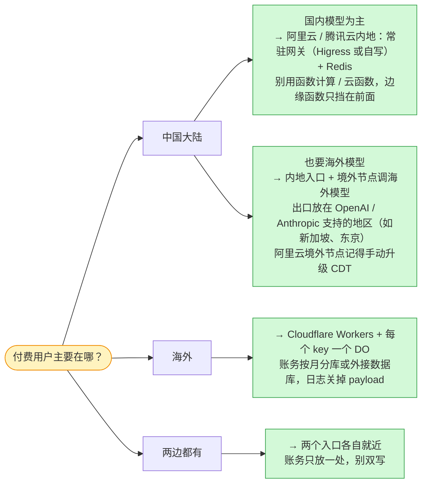

**版本范围**：价格是 2026-10-09 查到的公开目录价，不含商务折扣、新人价和活动价。阿里云用 aliyun CLI 3.5.1 的询价接口（`DescribePrice`、`GetPayAsYouGoPrice`），腾讯云用 tccli 3.1.180.1 的询价接口（`InquiryPrice*`、`DescribeDBPrice`）。Cloudflare 没有价格接口（wrangler 4.148.0 也没有），用的是 developers.cloudflare.com 当天的价目页和限制页。汇率 1 美元 = 6.7153 元（open.er-api.com，2026-10-09）。

> [!NOTE]
> **最重要的一句提醒：表里的月费建立在一组示意假设上**：每个请求挂 20 秒、网关 CPU 10 毫秒、出方向 50 KB，机器规格也没有压测过。这几个数一变，结论就会变，尤其是每个请求的出方向字节数。所以每张表我都给了敏感度，你可以换成自己的数。

---

## 先说结论

| 每月费用（人民币，目录价） | T1：1,000 万次请求 | T2：1 亿次 | T3：10 亿次 |
|---|---|---|---|
| Cloudflare（Workers + KV + Durable Objects + Queues + D1） | 140 | 2,756 | 32,574 |
| Cloudflare 优化版（用量在 Durable Object 里累加，去掉 Queues） | 67 | 2,115 | 25,139 |
| 阿里云自建 · 深圳（ALB + ECS + Redis + RDS + SLS） | 1,625 | 5,854 | 45,696 |
| 阿里云自建 · 香港（境外节点参考） | 1,981 | 6,114 | 40,426 |
| 腾讯云自建 · 广州（CLB + CVM + Redis + MySQL + CLS） | 1,422 | 5,359 | 45,179 |
| 阿里云 AI 网关（托管） | 5,428 | 10,195 | 60,518 |
| 阿里云函数计算（单实例并发 100） | 1,419 | 7,703 | 68,877 |
| 腾讯云云函数（官方文档：一个实例同时只服务一条 SSE） | 3,756 | 32,543 | 321,865 |

五条判断：

1. **小规模时 Cloudflare 便宜一个数量级。** 每月 1,000 万次请求，Cloudflare 是 ¥67–140，国内云自建最低也要 ¥1,400 左右。国内云的钱主要花在保底上：两台机器、一个数据库、一个 Redis，没有流量也要付。
2. **规模上去以后，差距缩到 1.4–1.8 倍。** 两边的大头完全不同：Cloudflare 的钱花在**状态**上，也就是每次读写 Durable Object、发队列消息、读 KV 都单独计费，T3 时这几项约占八成；阿里云的钱花在**流量**上，T3 时出方向流量占总价的 83%。
3. **真正决定胜负的是每个请求的出方向字节数。** T3 档每个请求出方向低于约 24–34 KB 时，阿里云自建反而比 Cloudflare 便宜；编码 Agent 这类请求体动辄几百 KB 的流量，Cloudflare 便宜 5 倍以上。
4. **按挂钟时间计费的 Serverless 是最差的选择。** 函数计算、云函数都要为等上游吐 token 的那 20 秒全额付钱。国内的边缘函数（阿里云 ESA、腾讯云 EdgeOne）虽然便宜，但有 10 秒首包、120 秒总时长、1 MB 请求体这类硬限制，做不了通用模型网关。
5. **账单之外还有一半：用户在哪。** 从深圳电信访问 Cloudflare 落在洛杉矶，往返约 162 毫秒；访问阿里云、腾讯云的深圳、广州、香港入口是 7–13 毫秒。Cloudflare 的中国大陆节点（China Network）要 Enterprise 套餐加 ICP 备案，可用产品清单里也没有 Durable Objects、D1 和 Queues。**用户主要在中国大陆，就放国内云（海外模型另走境外节点）；用户主要在海外，就放 Cloudflare。**

---

## 这篇写给谁

- 你知道 LLM API 怎么调用，知道流式输出是一段一段推回来的（SSE），写过或配过反向代理、API 网关。
- 你**不需要**用过 Cloudflare Workers 或阿里云负载均衡；用到的产品会在下面的术语表里先讲清楚。
- 本文**不讨论**模型推理本身（GPU、推理引擎），也不展开合规细节，只在影响架构的地方点到为止。

### 术语表

| 术语 | 一句话解释 |
|---|---|
| 挂钟时间 | 一个请求从进来到结束经过的真实时间，包括等别人的时间 |
| CPU 时间 | 程序真正在算的时间，等网络、等数据库的时间不算 |
| SSE（服务器推送事件） | 模型流式输出的格式：一个 HTTP 响应不断开，每生成一小段就推一行 `data: …` |
| Workers | Cloudflare 的边缘函数，跑在全球机房里，按请求数和 CPU 时间计费 |
| Durable Object（下文简称 DO） | Cloudflare 的「有名字的单线程小服务」：同一个名字全球只有一个实例，适合做每个 API key 的计数器和余额 |
| KV / Queues / D1 | Cloudflare 的全球键值缓存（最终一致）/ 消息队列 / SQLite 数据库 |
| LCU | 负载均衡的容量单位，按新建连接、并发连接、处理字节数、规则次数四个维度取最大值计费 |
| CDT（云数据传输） | 阿里云把各产品的公网出流量合在一起按阶梯计费的方式 |
| 边缘函数 | 阿里云 ESA 的「函数和 Pages」、腾讯云 EdgeOne 的边缘函数，都是国内版的「Workers」 |
| ICP 备案 | 网站用中国大陆的服务器或节点对外服务前，必须完成的工信部登记 |

---

## 从第一性原理推：一个模型网关请求长什么样

模型网关做的事，拆到最小只有六步：


*图：一个模型网关请求的最小因果链（示意，不是某个产品的实现）。黄色几步要算，但每步只有几毫秒；蓝色那一步要等，一等就是十几秒到几分钟。*

这六步决定了模型网关和普通 API 网关的三点不同：

| 特征 | 本文取值（示意） | 为什么重要 |
|---|---|---|
| 挂钟时间很长 | 20 秒 | 大部分时间在等上游生成 token；推理模型会更长 |
| CPU 时间很短 | 10 毫秒 | 鉴权、选线、逐块转发 SSE、找 usage。Cloudflare 限制页给的参考：平均每个 Worker 约 2.2 ms，做鉴权、解析大包体的重负载通常 10–20 ms |
| 出方向流量大 | 50 KB / 请求 | 30 KB 是把客户的 prompt 转给上游，20 KB 是把 SSE 回给客户端。**对网关来说，转发 prompt 也是出方向流量** |

10 毫秒除以 20 秒是 0.05%。也就是说，网关 99.95% 的时间都在等。

这就把三类平台的收费方式拉开了。打个比方，网关像电话接线员：接通只要几秒，但一通电话要聊二十秒。

- **按 CPU 时间收费（Workers）**：只为接线员动手的那几秒付钱。
- **按实例活跃时长收费（函数计算、云函数、DO）**：为整通电话付钱，接线员发呆也算。
- **按预留容量收费（云服务器、负载均衡）**：按雇了几个接线员付钱，忙闲都一样。

再加一项各家完全不同的东西：**流量**。Cloudflare 出方向流量不收费；阿里云、腾讯云每 GB 0.5–1 元。

下面这段伪代码把六步落到 Workers 上，注释里标出哪些行在「等」、哪些在「算」。它是示意，不是哪个平台的真实源码：

```ts
// 伪代码（示意）：Workers 版模型网关的一次请求
export default {
  async fetch(req, env, ctx) {
    const key = await env.KEYS.get(apiKeyOf(req), "json");         // ① KV 读：等网络，不算 CPU
    if (!key) return new Response("invalid key", { status: 401 });

    const limiter = env.LIMITER.get(env.LIMITER.idFromName(key.id)); // 每个 API key 一个 DO
    const slot = await limiter.acquire(estimateCost(req));           // ② 占并发位 + 预扣余额（写 1 行）
    if (!slot.ok) return new Response("too many requests", { status: 429 });

    const upstream = await fetch(pickLine(key), forward(req));       // ③④ 等上游首包，可能好几秒，不算 CPU
    const { readable, writable } = new TransformStream();
    ctx.waitUntil(pipeAndFindUsage(upstream.body, writable, async (usage) => {
      await limiter.release(slot.id, usage);                         // ⑥ 释放并发位 + 结算（写 1 行）
      await env.USAGE.send({ key: key.id, usage });                  // ⑥ 用量消息，消费者按分钟聚合写 D1
    }));
    return new Response(readable, upstream);                         // ⑤ 20 秒的流，CPU 只花在逐块拷贝上
  },
};
```

同样六步换到阿里云或腾讯云，就是一个常驻进程（Higress 插件或自己写的 Go 服务）加一个 Redis：

- ① 查 key：进程内存缓存，未命中再查 Redis；
- ② 占并发位、预扣余额：Redis 的 `INCR` / `DECR` 加一段 Lua 脚本；
- ⑥ 用量：进程里先攒一批，再批量写 RDS，或者发到消息队列。

**架构是一样的，差的是每一步怎么收费。**

---

## 价格是怎么查的

国内两家都有能直接返回价格的接口，下面是几条代表命令，完整命令和原始输出我都存了下来。所有调用都是只读的询价接口，没有创建任何资源。

```bash
# 阿里云：ECS 包月价（含 40 GB ESSD PL0 系统盘，不含带宽）
aliyun ecs DescribePrice --RegionId cn-shenzhen --ResourceType instance \
  --InstanceType ecs.c9i.xlarge --PriceUnit Month --Period 1 \
  --SystemDisk.Category cloud_essd --SystemDisk.PerformanceLevel PL0 --SystemDisk.Size 40

# 阿里云：50,000 GB 公网出流量走 CDT 阶梯的总价
aliyun bssopenapi GetPayAsYouGoPrice --region cn-hangzhou --ProductCode cdt \
  --ProductType cdt_DataTransfer_public_cn --SubscriptionType PayAsYouGo --Region cn-shenzhen \
  --ModuleList.1.ModuleCode internet_traffic --ModuleList.1.PriceType Usage \
  --ModuleList.1.Config 'Region:cn-shenzhen,internet_traffic:50000,charge_type:PayByTraffic,isp:BGP'

# 阿里云：Redis（Tair）、RDS 包月价
aliyun r-kvstore DescribePrice --RegionId cn-shenzhen --ZoneId cn-shenzhen-c \
  --InstanceClass redis.shard.large.ce --OrderType BUY --ChargeType PrePaid --Period 1 --NodeType MASTER_SLAVE
aliyun rds DescribePrice --RegionId cn-shenzhen --ZoneId cn-shenzhen-c --Engine MySQL --EngineVersion 8.0 \
  --DBInstanceClass mysql.n4.large.2c --DBInstanceStorage 100 --DBInstanceStorageType cloud_essd \
  --PayType Prepaid --UsedTime 1 --TimeType Month --Quantity 1 --OrderType BUY --CommodityCode rds

# 腾讯云：CVM 包月价（含 50 GB 通用型 SSD，带宽设 0）
TENCENTCLOUD_REGION=ap-guangzhou tccli cvm InquiryPriceRunInstances --cli-unfold-argument \
  --Placement.Zone ap-guangzhou-6 --ImageId img-mmytdhbn --InstanceType SA9.LARGE8 \
  --InstanceChargeType PREPAID --InstanceChargePrepaid.Period 1 \
  --SystemDisk.DiskType CLOUD_BSSD --SystemDisk.DiskSize 50 \
  --InternetAccessible.InternetChargeType TRAFFIC_POSTPAID_BY_HOUR \
  --InternetAccessible.InternetMaxBandwidthOut 0 --InstanceCount 1
```

几个口径要先说清：

- **一律用目录价。** 阿里云的询价接口会同时返回账号折扣，比如我的账号负载均衡和 NAT 有 85 折，这类折扣不计入。
- **查不到接口的用官方文档价，并标出来。** 阿里云 AI 网关的询价接口报错、腾讯云 AI 网关没有询价接口，这两项都用的文档价。
- **Cloudflare 全部来自官方价目页。** wrangler 和 Cloudflare API 只能查自己账号的用量，查不到价格表。

### 关键单价

| | Cloudflare（美元） | 阿里云（深圳，人民币） | 腾讯云（广州，人民币） |
|---|---|---|---|
| 计算 | Workers $5/月，含 1,000 万请求和 3,000 万 CPU 毫秒；超出 $0.30/百万请求、$0.02/百万 CPU 毫秒；**挂钟时长不收费** | ECS c9i 包月：2c4g ¥205.91，4c8g ¥391.82，8c16g ¥763.64（含系统盘） | CVM SA9 包月：2c4g ¥156.2，4c8g ¥287.4，8c16g ¥549.8（含系统盘） |
| 负载均衡 | 不需要 | ALB 实例 ¥0.049/时 + LCU ¥0.049/LCU·时 | CLB 共享型 ¥0.2/时，**不收 LCU** |
| 出方向流量 | **不收费** | CDT 阶梯：10 TB 内 ¥0.80/GB，10–50 TB ¥0.75，50–150 TB ¥0.70，再往上 ¥0.65；每月免费 20 GB | ¥0.80/GB，单一价，没有阶梯也没有免费额度 |
| 计数 / 余额 | DO：请求 $0.15/百万，SQLite 写 $1.00/百万行（含 5,000 万行） | Tair 双副本 1 GB ¥76.98/月，4 GB ¥360/月 | Redis 主从 1 GB ¥76/月，4 GB ¥304/月 |
| 查 key | KV 读 $0.50/百万（含 1,000 万） | 同上 Redis | 同上 Redis |
| 用量 / 账务库 | Queues $0.40/百万次操作（一条消息 3 次）；D1 写 $1.00/百万行，**单库最大 10 GB** | RDS MySQL 高可用：2c4g ¥660/月，4c16g ¥1,370/月 | MySQL 双节点：2c4g ¥480/月，4c16g ¥1,704/月 |
| 日志 | Workers Logs，**2026-12-01 起**按 $0.25/GB 写入 + $0.10/GB·月存储 | SLS ¥0.4/GB（含索引和 30 天存储） | CLS 按功能计费，每 GB 约 ¥0.83 |

---

## 三档账单：钱都花在哪

测算口径（全部是示意假设）：

- **三档规模**：每月 1,000 万 / 1 亿 / 10 亿次请求，峰值按平均的 3 倍算，T3 峰值约 2.3 万条并发流。
- **每个请求的调用**：查 1 次 key，计数和余额 2 次（开始、结束），1 条用量消息，1 条约 1 KB 的日志。
- **机器规模**：国内两家用 T1 2×2 核 4G、T2 2×4 核 8G、T3 4×8 核 16G，双可用区，没有压测；数据库和 Redis 规格随档位放大。

### 一个请求的账

先看单个请求的边际成本，按 T3 档的超量单价算。

| Cloudflare 每百万请求 | 美元 | 阿里云深圳每百万请求 | 人民币 |
|---|---|---|---|
| Workers 请求 | 0.30 | 出方向流量 50 GB × ¥0.75 | 37.5 |
| Workers CPU（10 ms） | 0.20 | ALB LCU（处理 50 GB） | 2.45 |
| KV 读 1 次 | 0.50 | SLS 日志 1 GB | 0.40 |
| DO 请求 2 次 | 0.30 | 机器 + Redis + RDS 摊到每百万请求 | 约 4.8 |
| **DO 写 2 行** | **2.00** | | |
| Queues 3 次操作 | 1.20 | | |
| 日志 1 KB | 约 0.27 | | |
| **合计** | **约 4.8（≈ ¥32）** | **合计** | **约 ¥45** |

**Cloudflare 一个请求约 ¥0.00003，阿里云约 ¥0.000045。** 拿模型费对照一下（粗估：30 KB 的 prompt 约 7,500 token，回答 300 token）：

- DeepSeek V4.1-Flash 高峰价（输入 ¥2、输出 ¥8 每百万 token）下，一次调用约 ¥0.017，网关只占 0.2–0.3%；
- 通义 qwen-flash（输入 ¥0.15、输出 ¥1.5）下，一次调用约 ¥0.0016，网关占 2–3%。

模型价格取自两家官方价目页（2026-10-08 核对）。**网关的基础设施费只是模型费的零头**，所以选平台不能只看账单，延迟、可达性和稳定性至少同样重要。

### 每档的最大几项

| | T1 | T2 | T3 |
|---|---|---|---|
| Cloudflare | Queues 55%、Workers 订阅 24% | DO 写行 37%、Queues 29%、KV 读 11% | DO 写行 40%、Queues 25%、KV 读 10% |
| 阿里云自建 · 深圳 | RDS 41%、ECS 25%、流量 24% | **流量 68%**、ECS 13% | **流量 83%**、ECS 7%、ALB 5% |
| 腾讯云自建 · 广州 | MySQL 34%、流量 28%、CVM 22% | **流量 75%** | **流量 89%** |

### 敏感度一：每个请求的出方向字节数

Cloudflare 的账单和字节数无关，国内云几乎和字节数成正比。把阿里云深圳自建的出方向流量从 5 KB 调到 500 KB：

| 每请求出方向 | T1 | T2 | T3 | 对照：Cloudflare（朴素 / 优化） |
|---|---|---|---|---|
| 5 KB（短问答） | ¥1,243 | ¥2,033 | **¥9,478** | T3：¥32,574 / ¥25,139 |
| 20 KB | ¥1,371 | ¥3,307 | ¥21,726 | 同上 |
| 50 KB（本文口径） | ¥1,625 | ¥5,854 | ¥45,696 | 同上 |
| 200 KB（带长上下文的 Agent） | ¥2,899 | ¥18,102 | ¥155,788 | 同上 |
| 500 KB（编码 Agent 常见） | ¥5,446 | ¥42,072 | **¥365,488** | 同上 |

两边打平的点：

- **T3**：深圳每请求出方向约 24 KB（对 Cloudflare 优化版）到 34 KB（对朴素版），香港约 24–37 KB。
- **T2**：深圳约 6–14 KB。
- **T1**：国内云的保底费已经比 Cloudflare 的全部账单还高，没有打平点。

所以「Cloudflare 便宜」这句话**只在流量大或规模小时成立**。如果你的业务是海量短问答（每请求出方向约 5 KB），规模到每月 10 亿次时，国内云自建比 Cloudflare 便宜约 3 倍。

还有一个只有国内云才有的杠杆：**上游如果在同一家云的内网里**（比如在阿里云上调用百炼），转发 prompt 的那 30 KB 可以不走公网。这条路要配私网连接，私网连接的费用我没有查。

### 敏感度二：网关 CPU 时间

Cloudflare 的 CPU 时间从 5 毫秒翻到 20 毫秒，T3 月费从 ¥31,902 变到 ¥33,917，只差 6%。**按 CPU 计费时，「等上游的 20 秒」几乎不花钱。** 国内云自建对 CPU 也不敏感：按每请求 20 毫秒算，T3 峰值也只要约 23 个 vCPU，4 台 8 核机器装得下。

---

## Cloudflare 这边：流量免费，状态按次收费

**省钱的原因有两条，都写在官方定价页上。** 第一，Standard 计费模式下挂钟时长不收费，也不设上限；限制页专门说明，等 `fetch()`、KV、数据库的时间不计入 CPU 时间。第二，出方向流量和带宽不收费，Worker 发出的子请求也不收费。所以 20 秒的流和 0.2 秒的流价格一样，转发 30 KB prompt 给上游也不花钱。

**贵在哪：每次读写状态都单独计费。**

1. **DO 写行是最大的一项**（T3 约 ¥13,095/月）。并发位和余额必须写进 DO 自带的 SQLite，不能只放内存：DO 空闲 10 秒左右就可能休眠，休眠后内存里的计数会丢，而一条流要挂 20 秒。可以优化：用量先在 DO 里累加，每分钟落一次库，再去掉 Queues，T3 能降到约 ¥25,139。
2. **一个 DO 是单线程的。** 官方给单个对象的软上限约每秒 1,000 次请求，带存储写入时约 200–500 次。官方的设计规则页明确反对用单个 DO 做全局限速。正确做法是每个 API key 一个 DO，大客户的 key 再拆分片。
3. **KV 是最终一致的。** 其他机房要 60 秒以上才看得到改动，所以吊销 key、改余额不能只靠 KV。Pydantic 开源的 AI 网关在旧版 README 里就承认，用 KV 缓存状态时额度控制只能做成「软上限」。
4. **D1 单库最大 10 GB，而且不能提。** 按分钟聚合的用量表，T3 约 1.2 个月写满、T2 约 4.6 个月写满。所以要定期汇总、按月分库（每账号可建 5 万个库），冷数据归档到 R2。

**两个能把账单放大十倍的坑：**

- **让 DO 在整条流期间保持活跃。** 比如让流经过 DO 转发，或者在 DO 里挂一个 `setTimeout` 做租约超时，DO 就会按挂钟时长计费。T3 一个月最多会多出 **$32,000（约 ¥21.5 万）**。租约超时要用 `setAlarm`。
- **AI Gateway 默认把完整的 prompt 和 response 存进日志。** 2026-09-24 以后新开 AI Gateway 的账号，日志按 Workers Logs 的价格计费；按 12-01 起的新价，T3 一个月约 **$13,927（约 ¥9.4 万）**。要么关掉 payload 记录，要么关日志。另外，用 Cloudflare 统一付费（Unified Billing）时，每个 gateway 每分钟只允许 200 次请求，T1 的平均速率就超了，转售场景只能用自己的上游 key（BYOK）。

**一个时间点要注意**：Workers Logs 在 2026-12-01 从按条计费改成按 GB 计费（Cloudflare 2026-10-02 的博客公布）。本文按新价算，T3 日志费约 $260；按旧价是 $588。

---

## 国内云这边：状态几乎免费，流量按字节收费

**省钱的原因：状态是按台付钱的。** 一个 1 GB 双副本的 Redis 每月 ¥77，标称每秒 10 万次操作；T3 峰值每秒只要约 4,600 次。查 key、计数、余额全压在它上面，**请求数翻十倍，它的价格不变**。

**贵在哪：出方向流量。**

1. **转发 prompt 也算出方向流量。** 每个请求 50 KB 里有 30 KB 是网关替客户送给上游的，T3 时阿里云深圳这一项就是 ¥37,997/月。
2. **境外节点的流量阶梯更便宜，但要手动开 CDT。** 以香港为例（新加坡、东京没有查），阿里云香港 10 TB 以上 ¥0.54/GB，比深圳的 ¥0.75 低。所以 T3 档香港总价（¥40,426）反而低于深圳（¥45,696），尽管香港 ECS 是深圳的 1.9 倍。但从 2024-12-12 起，ECS、EIP **不会自动按 CDT 阶梯计费**，要手动「升级至 CDT 计费」（免费，开了不能关）。不升级的话香港按 ¥1.00/GB 算，T3 要多付 ¥21,470。
3. **上游请求别走 NAT。** 阿里云 NAT 网关从 2025-09-26 起按处理流量收费（1 CU = 1 GiB），上游请求走 NAT 会在流量费之外再加约 23%，T3 多 ¥8,665。给每台 ECS 直接挂按流量计费的公网 IP 更省。
4. **长连接不会让负载均衡变贵，但会被超时掐断。** ALB 的 1 个 LCU 能容纳 3,000 个并发连接，T3 峰值 2.3 万条流只折合 7.7 个 LCU；真正决定 LCU 的是处理的字节数，每 GB 相当于 ¥0.049。腾讯云 CLB 共享型干脆不收 LCU。但 **ALB 的请求超时默认 60 秒**，推理模型的长流要先调大，否则会 504。

**托管 AI 网关**（阿里云云原生 API 网关的 AI 网关，内核是开源的 Higress）：多模型路由、Fallback、消费者 API key、Token 限流都有，计费项里看不到为这些功能单独收的钱，但最小规格每月 ¥3,997.5（文档价）。按客户计费需要的余额、用量库还得自己配 Redis 和 RDS，所以 T1 时它比整套自建贵两倍多。它适合 T2 以上、不想自己写网关的团队。

**Serverless 是最差的选择：**

- **阿里云函数计算**按实例活跃时长计费。规格费按配置收、不按实际用量收，所以等上游的 20 秒 vCPU 全额计费，也进不了 vCPU 免费的「浅休眠」。唯一的省钱办法是单实例多并发：并发开到 100 时，T3 的计算费是 ¥28,750；并发为 1 时，计算费是它的约 95 倍。
- **腾讯云云函数**的 SSE 文档写明，一个函数实例同一时刻只处理一条 SSE 连接。这样算 T3 是 ¥321,865/月，而且 T2、T3 的峰值都超出了每个地域默认的并发配额。

**国内边缘函数做不了通用模型网关**，问题出在限制上，不在价格：

| | Cloudflare Workers | 阿里云 ESA 函数 | 腾讯云 EdgeOne 边缘函数 |
|---|---|---|---|
| 怎么计费 | 请求 + CPU 时间 | 按次，¥5/百万次 | 请求 ¥1.7/百万次 + CPU ¥0.11/百万毫秒 |
| 单次总时长 | 不限（客户端连着就行） | **120 秒**（等待也算） | 文档没写上限；`fetch` 超时最大可配 300 秒 |
| 首包 | 文档没列限制 | **10 秒内不出数据就回 504** | 文档没列限制 |
| 请求体 | 100 MB 起（看域名套餐） | 未查到 | **1 MB** |
| 单次 CPU | 默认 30 秒，可配到 5 分钟 | 文档没写数值 | **200 毫秒** |
| 子请求 | 默认 1 万次 | **4 次** | 64 次 |
| 强一致状态 | Durable Objects | 没有（KV 最终一致，最长 300 秒） | KV 内测，只对企业版，每个命名空间每天 100 万次读 |
| 中国大陆节点 | 只有 China Network（Enterprise + ICP） | 有，要 ICP 备案 | 有，要 ICP 备案 |

推理模型的首 token 常常超过 10 秒，长输出常常超过 120 秒，Agent 的长上下文请求也很容易超过 1 MB。而且两家都没有 DO 这样的强一致状态，限速和余额还得回源到中心机房。**它们可以挡在网关前面做缓存、鉴权预检，替代不了网关。**

---

## 账单之外：延迟和可达性

| 2026-10-09 10:49（北京时间），深圳电信家宽，ICMP 往返 20 次 | 中位数 | P90 |
|---|---|---|
| 阿里云 深圳（ECS API 入口） | 7 ms | 19 ms |
| 阿里云 香港 | 13 ms | 16 ms |
| 腾讯云 广州（CVM API 入口） | 8 ms | 9 ms |
| 腾讯云 香港 | 13 ms | 20 ms |
| Cloudflare 任播地址（博客的 Pages / Functions 入口） | 162–164 ms | 166–186 ms |

几点说明：

- **测法**：我所在的局域网把 TCP 连接都做了透明代理，任何地址握手都是 2–3 毫秒，所以改用 ping。
- **路由**：`mtr` 显示，去 Cloudflare 的包在电信 163 骨干上从约 9 毫秒跳到约 160 毫秒，也就是在这里出境，最后落在 Cloudflare 洛杉矶的地址上。
- **局限**：这只是一条线路、一个时段。两天前的晚上，我在同一个网络用 TCP 握手测过一次，是 193 毫秒。

**对首 token 的影响**：新建 HTTPS 连接至少要 3 个往返（TCP、TLS 1.3、发出请求），在 162 毫秒的往返下，首 token 前就多了约 0.45 秒；复用连接时多约 0.15 秒。对聊天来说能感觉到，对 Agent 的长任务影响不大。

**另外三件事：**

- **China Network 搬不进这套架构。** Cloudflare 官方说明，不开 China Network 时，中国大陆用户连的是境外机房。China Network 要 Enterprise 套餐、单独订阅、每个主域名的 ICP 备案或许可证，还要过京东云的内容审核；它的可用产品清单里有 Workers、KV、R2，**没有 DO、D1、Queues**。另据 GreatFire 的第三方观测，`*.workers.dev` 在大陆被封，必须绑自己的域名。
- **海外模型的跨境那一跳躲不掉。** OpenAI 和 Anthropic 的 API 支持地区名单里，既没有中国大陆，也没有香港（[OpenAI](https://developers.openai.com/api/docs/supported-countries)、[Anthropic](https://www.anthropic.com/supported-countries)，2026-10-09 核对）。所以网关调这两家，出口要放在新加坡、日本、美国这类支持地区；香港节点只能做中转。从大陆用户的角度看，长距离的那一跳要么发生在「用户 → Cloudflare 洛杉矶」，要么发生在「境外网关 → 美国上游」。所以调用海外模型时，Cloudflare 的延迟劣势会小很多，差别主要在线路质量。
- **两边都出过大故障，形态不同。** Cloudflare 2025-06-12 因 KV 依赖的第三方云宕机，AI Gateway 错误率峰值到 97%；2025-11-18 核心代理故障，KV 也大量报 5xx。每个请求都同步读 KV 或 DO 的网关，会跟着全球一起挂，没有「换个可用区」的退路。阿里云香港可用区 C 在 2022-12-18 因制冷故障中断十多个小时，但故障集中在一个可用区，跨可用区部署就有退路。

---

## 谁真的把模型网关放在 Workers 上

我只采信一手证据：官方博客、官方文档、仓库里的部署配置、创始人署名文章。

| 平台 | 用了哪些 Cloudflare 组件 | 证据 | 强度 |
|---|---|---|---|
| **Cloudflare AI Gateway** | Workers；日志先放 D1，后挪 R2，再改成按「账户 + gateway」分片的 DO | [官方博客 2024-10-24](https://blog.cloudflare.com/billions-and-billions-of-logs-scaling-ai-gateway-with-the-cloudflare/) | 证实 |
| **Helicone**（托管代理和托管 AI Gateway） | Workers + DO（限速器，加每个组织一个钱包：开始按最坏成本冻结，结束按实际用量结算）+ KV + Queues；超过 20 MiB 的请求体转给 Containers；后端在 AWS | [`worker/wrangler.toml`](https://github.com/Helicone/helicone/blob/main/worker/wrangler.toml)、[钱包 DO](https://github.com/Helicone/helicone/blob/main/worker/src/lib/durable-objects/Wallet.ts)、[官方文档](https://docs.helicone.ai/references/availability) | 证实（边缘请求路径） |
| **OpenRouter** | 边缘层用 Workers，在边缘缓存用户和 API key 数据；余额很低时会多查数据库，延迟上升 | [官方文档](https://openrouter.ai/docs/guides/best-practices/latency-and-performance) | 证实（只到边缘层） |
| **Portkey** | 开源网关仓库自带生产环境的 `wrangler.toml`，官方文档说托管版跑在全球「edge workers」上 | [wrangler.toml](https://github.com/Portkey-AI/gateway/blob/main/wrangler.toml) | 间接证据 |
| **Unkey**（迁走了） | 曾用 Workers + DO 做 API key 校验和限速，2025-08 迁到 AWS 上的有状态 Go 服务 | [联合创始人文章 2025-08-01](https://www.unkey.com/blog/serverless-exit) | 证实 |
| **Braintrust**（迁走了） | 2023 年 AI Proxy 跑在 Workers 上；现在托管入口是 AWS 上的 Gateway，原因没公开 | [2023 年博客](https://www.braintrust.dev/blog/ai-proxy)、[现行文档](https://www.braintrust.dev/docs/deploy/gateway) | 证实「迁了」 |

从这张表能看出三件事：

1. **除了 Cloudflare 自己，没有一家是「全 Cloudflare」。** 最接近的是 Helicone：请求路径上的 Workers、DO、KV、Queues 全在 Cloudflare，分析库和账务后端在 AWS。本文 Cloudflare 一侧连账务都放在 D1 里，比现实中的做法更激进。
2. **大家踩的坑都在状态层，不在计算层。** 包括 AI Gateway 的日志存储、Helicone 的钱包预扣、OpenRouter 的低余额回源、Pydantic 网关的 KV 软额度。
3. **Unkey 的离开有它的场景。** 它的原因是：缓存读要走网络，p99 超过 30 毫秒；为了绕开无状态，堆了 DO、Queues、Workflows 一串产品；数据导出麻烦；客户没法自托管。迁走后延迟降到原来的 1/6。但 Unkey 每个请求都要在 10 毫秒内完成 key 校验，模型网关的一个请求本来就要挂 20 秒，几十毫秒的状态读取占比小得多，这个结论不能原样搬过来。

国内侧的主流做法是**常驻网关进程加 Redis**，不是边缘函数：

- **Higress**：阿里开源的网关，2026-03-15 进入 CNCF Sandbox，约 9,500 星。项目方说它支撑通义千问 APP、百炼大模型 API 和 PAI，但没有公开流量数字。它的 Token 限流用 Redis 做全局计数，和 Cloudflare 一侧用 DO 计数是同一个设计点。
- **阿里云 AI 网关**：官方客户案例里，国泰产险所有访问大模型的流量都走 AI 网关，日均近亿 token。
- **国内边缘函数**：没有找到点名的模型网关客户。

---

## 怎么选



*图：按用户所在地选平台的决策树（本文的判断，不是官方建议）。*

**什么时候选 Cloudflare：**

- 用户主要在海外，或者是调用海外模型的开发者；
- 规模还小（每月千万次以内），想要几乎为零的保底费、不想运维机器；
- 请求体大（Agent、长上下文、多模态），流量费在国内云会是账单大头；
- 团队能接受按 key 拆 DO、D1 定期归档这类「为状态而设计」的工作。

**什么时候别用 Cloudflare：**

- 用户主要在中国大陆，对首 token 延迟敏感（聊天产品）；
- 规模到每月 10 亿次量级、请求又很短（每个请求出方向低于约 30 KB），国内云自建会更便宜；
- 需要强一致的全局状态（全局并发、跨 key 的额度池），又不想自己做分片；
- 需要在中国大陆有节点，又买不起 Enterprise，或者用了 DO、D1、Queues。

---

## 结语

模型网关不是计算密集型服务，而是**等待密集、搬运密集、状态密集**型服务。拿 CPU 价格去比两朵云，比的是账单里最小的那一项。

> **铁律：先问三件事——谁为等待收钱，谁为搬运收钱，谁为状态收钱。再看你的用户离哪边近。**

---

## 来源与核对日期

全部在 2026-10-09 核对。

- Cloudflare 价格与限制：
  - [Workers 定价](https://developers.cloudflare.com/workers/platform/pricing/)、[Workers 限制](https://developers.cloudflare.com/workers/platform/limits/)
  - [Durable Objects 定价](https://developers.cloudflare.com/durable-objects/platform/pricing/)、[DO 设计规则](https://developers.cloudflare.com/durable-objects/best-practices/rules-of-durable-objects/)
  - [KV 工作原理](https://developers.cloudflare.com/kv/concepts/how-kv-works/)、[Queues 定价](https://developers.cloudflare.com/queues/platform/pricing/)
  - [D1 定价](https://developers.cloudflare.com/d1/platform/pricing/)、[D1 限制](https://developers.cloudflare.com/d1/platform/limits/)
  - [Observability 定价（2026-12-01 起）](https://developers.cloudflare.com/observability/pricing/)
  - [AI Gateway 定价](https://developers.cloudflare.com/ai-gateway/reference/pricing/)、[AI Gateway 限制](https://developers.cloudflare.com/ai-gateway/reference/limits/)
  - [China Network](https://developers.cloudflare.com/china-network/)、[China Network 可用产品](https://developers.cloudflare.com/china-network/reference/available-products/)
- 阿里云（价格来自 aliyun CLI 询价接口，规则来自文档）：
  - [CDT 公网流量](https://help.aliyun.com/zh/cdt/internet-data-transfers/)、[升级至 CDT 计费](https://help.aliyun.com/zh/cdt/user-guide/upgrade-to-cdt-billing)
  - [ALB 计费规则](https://help.aliyun.com/zh/slb/application-load-balancer/product-overview/alb-billing-rules)、[NAT 网关计费](https://help.aliyun.com/zh/nat-gateway/nat-gateway-billing)
  - [函数计算计费](https://help.aliyun.com/zh/functioncompute/fc/product-overview/billing-overview-of-fc)、[单实例多并发](https://help.aliyun.com/zh/functioncompute/fc/configure-the-concurrency-of-a-single-instance)
  - [AI 网关规格与价格](https://help.aliyun.com/zh/api-gateway/ai-gateway/product-overview/free-product-templates)
  - [ESA 函数和 Pages 限制](https://help.aliyun.com/zh/edge-security-acceleration/esa/user-guide/what-is-functions-and-pages)、[ESA 函数计费](https://help.aliyun.com/zh/edge-security-acceleration/esa/user-guide/functions-and-pages-billing)
- 腾讯云（价格来自 tccli 询价接口，规则来自文档）：
  - [公网流量价格](https://cloud.tencent.com/document/product/213/113026)、[CLB LCU 计费](https://cloud.tencent.com/document/product/214/58387)
  - [云函数计费](https://cloud.tencent.com/document/product/583/12281)、[云函数 SSE](https://cloud.tencent.com/document/product/583/90617)
  - [EdgeOne 套餐](https://cloud.tencent.com/document/product/1552/94158)、[EdgeOne 超额单价](https://cloud.tencent.com/document/product/1552/94159)、[边缘函数限制](https://cloud.tencent.com/document/product/1552/81344)
- 案例与故障：
  - Cloudflare 故障复盘：[2025-06-12](https://blog.cloudflare.com/cloudflare-service-outage-june-12-2025/)、[2025-11-18](https://blog.cloudflare.com/18-november-2025-outage/)
  - [阿里云香港可用区 C 故障说明（2022-12）](https://www.alibabacloud.com/zh/notice/resolved_service_outage_in_zone_c_of_the_china_hong_kong_region_1ae)
  - [Higress](https://github.com/higress-group/higress)、[阿里云 AI 网关产品页](https://www.aliyun.com/product/apigateway)
  - [GreatFire：workers.dev](https://en.greatfire.org/domain/workers.dev)（第三方观测）
- 模型价格：[DeepSeek 定价](https://api-docs.deepseek.com/zh-cn/quick_start/pricing)、[通义 qwen-flash](https://help.aliyun.com/zh/model-studio/qwen-flash)
- 工具版本：aliyun CLI 3.5.1、tccli 3.1.180.1、wrangler 4.148.0（npm 上最新是 4.149.0）。
