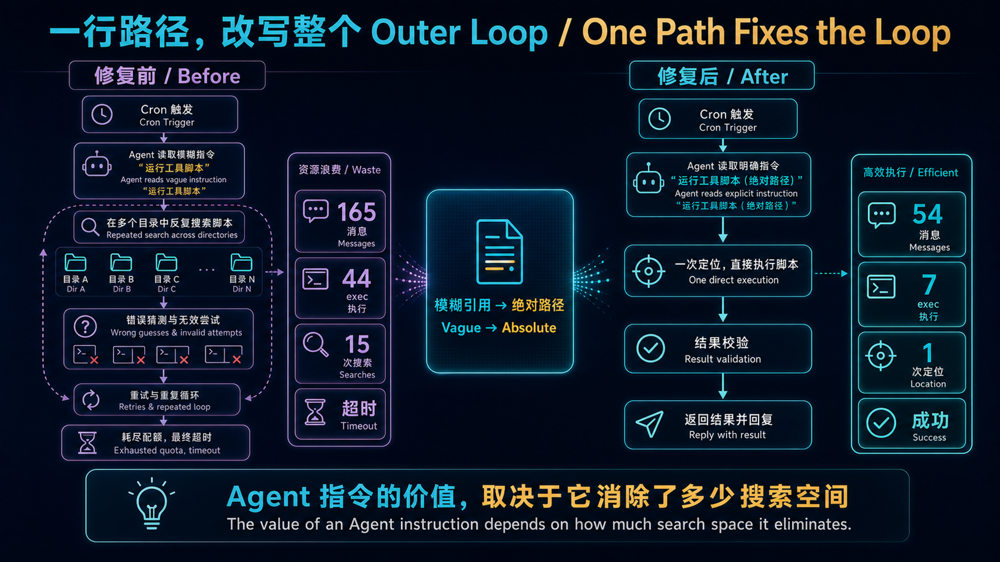

> [!NOTE]
> 这是 [OpenClaw 生产实战](/series/openclaw-生产实战/) 系列的第三篇。[第一篇](/posts/openclaw-pitfalls/) 讲 compaction 静默吞回复，[第二篇](/posts/openclaw-memory-text-to-vector/) 讲记忆系统从“向量搜索挂了也能跑”到用 NVIDIA 免费 API 补全。这篇讲一个更朴素但影响更大的问题：**当你的 AI Agent 不知道工具在哪，它会怎么做？**

这张前后对比图先给出事故的完整因果链。左侧不是模型“笨”，而是模糊指令迫使它反复探索目录；右侧的一行绝对路径直接缩小了动作空间，因此消息数、搜索次数和执行调用同时下降。



## 现象：定时任务连续超时

OpenClaw 有一个每天 21:05 执行的 cron job——`daily-ai-news`，功能是抓取当日 AI 领域新闻、生成摘要、配一张 banner 图、发到飞书群。

某天我注意到这个任务连续失败。看日志：

```
Status: error
Duration: 1200s+ (timeout)
Tokens: in=2,800,000+ out=15,000+
```

20 分钟超时，消耗了 280 万 input token。一个日报任务。

## 排障：从日志反推 Agent 行为

OpenClaw 的 cron 执行会留完整的对话日志。我拉出最近一次失败的日志，统计关键指标：

| 指标 | 失败运行 |
|------|---------|
| 总消息数 | 165 |
| exec 工具调用 | 44 次 |
| tool_result 总大小 | 1,122 KB |
| 运行时间 | 1200s+（超时） |

165 条消息？44 次 exec？一个"抓新闻 → 写摘要 → 生图 → 发飞书"的流程，正常情况下不该超过 60 条消息和 10 次工具调用。

逐条翻日志，发现了罪魁祸首。

## 根因：Agent 不知道工具在哪

`daily-ai-news` 的 SKILL.md（skill 的指令文件）里有一行：

```markdown
生成 banner 图片时使用 create-img / gpt-image-2 生成。
```

就这么一句。没有路径，没有调用方式，没有参数。

Agent 拿到这个指令后，它知道要调用 `create-img`，但不知道这个东西在哪。于是它开始**搜索**：

```bash
# Agent 的第 1 次尝试
find /home/openclaw -name "create-img" -type d

# 没找到想要的，继续
grep -r "create-img" /home/openclaw/.openclaw/

# 找到了一些引用，但不确定是不是可执行的
ls -la /home/openclaw/.openclaw/plugin-skills/

# 没看到，换个目录
ls -la /home/openclaw/.agents/skills/

# 找到了！但不确定怎么调用
cat /home/openclaw/.agents/skills/create-img/SKILL.md

# 读完了，但还要确认脚本路径
find /home/openclaw/.agents/skills/create-img -name "*.py"

# 确认了脚本，但不确定 Python 环境
which python3
python3 --version

# 确认了 Python，但不知道虚拟环境在哪
ls /home/openclaw/workspace/.venv*/

# 找到了虚拟环境，开始拼命令...
```

**15 次 exec 调用**，只是为了找到一个工具的位置和调用方式。

更要命的是，这个搜索过程产生的 `tool_result` 体积巨大——每次 `find`、`grep`、`ls` 的输出都会被塞进对话上下文。44 次 exec 调用累计产出 1.1MB 的工具结果，直接把上下文撑爆，触发 compaction，进一步拖慢执行。

### 恶性循环

这是一个经典的**上下文膨胀恶性循环**：

```
SKILL.md 缺路径
    → Agent 搜索工具位置（15 次 exec）
    → 搜索结果塞满上下文（+900KB）
    → 触发 compaction（压缩耗时 + 可能丢信息）
    → 压缩后 Agent 忘记之前搜到的路径
    → 再搜一遍（又 15 次 exec）
    → 上下文再次膨胀
    → 超时
```

没错——**compaction 压缩掉的恰恰是 Agent 好不容易搜到的工具路径**，于是下一轮它又从头搜。这就是 165 条消息的来源：Agent 至少做了 2-3 轮完整的"搜索 → 找到 → 被压缩 → 再搜"循环。

## 修复：一行绝对路径

修复方法极其简单。在 `ai-news-digest` 的 SKILL.md 末尾加一段，告诉 Agent 工具的完整调用方式：

> **create-img 调用方式（直接使用，不要搜索）**
>
> 1. 先读取 skill 规范：`/home/openclaw/.openclaw/plugin-skills/create-img/SKILL.md`
> 2. 调用脚本（命令见下方）
> 3. 生成后用 `lark-cli im images create --file <图片路径>` 上传飞书取得 `image_key`

```bash
source /home/openclaw/.bashrc
/home/openclaw/workspace/.venv314/bin/python \
  /home/openclaw/.openclaw/plugin-skills/create-img/scripts/omniroute_image_batch.py \
  --prompt "<图片描述>" \
  --size 1536x864 \
  --quality high \
  --format png \
  --out-dir /home/openclaw/.openclaw/workspace/tmp/ai-news-banner
```

就这些。给 Agent 一个**可以直接复制粘贴的完整命令**，包括：
- Python 解释器的绝对路径（虚拟环境的）
- 脚本的绝对路径
- 所有必要参数
- 输出目录

## 修复效果

修复后的第一次运行：

| 指标 | 修复前 | 修复后 | 变化 |
|------|--------|--------|------|
| 总消息数 | 165 | 54 | -67% |
| exec 工具调用 | 44 | 7 | -84% |
| tool_result 大小 | 1,122 KB | 204 KB | -82% |
| 运行时间 | 1200s+（超时） | 317s | 从超时到 5 分钟完成 |

消息数砍掉三分之二，exec 调用砍掉 84%，工具结果体积砍掉 82%。

**一行路径，比任何算法调优都管用。**

## 为什么这个问题这么隐蔽

这个 bug 有三个让它难以发现的特征：

### 1. 不是每次都失败

如果 Agent 第一轮搜索就找到了工具路径，且没有触发 compaction，任务就能正常完成——只是慢一点。只有当上下文刚好在搜索过程中触及 compaction 阈值时，才会进入恶性循环。这意味着它是一个**概率性超时**，不是确定性失败，让排障方向很容易跑偏到"是不是上游 API 慢了"。

### 2. Agent 的搜索行为看起来很"合理"

翻日志时，Agent 的每一步操作都是合理的：不知道路径 → 搜索文件系统 → 读文件确认 → 检查环境。这是一个"聪明但低效"的行为模式。你不会觉得 Agent 做错了什么，只是觉得"怎么这么慢"。

### 3. SKILL.md 的"模糊引用"不会报错

写 `使用 create-img 生成图片` 这种指令，从语法上完全合法——SKILL.md 没有类型检查，不会告诉你"create-img 路径未解析"。Agent 接到指令后也不会说"我找不到 create-img"然后停下来——它会自己去找。这种**静默降级到搜索模式**是最难发现的问题。

## 深层教训：给 AI Agent 写指令的原则

这个 bug 让我意识到一个更基本的问题：**我们给 AI Agent 写的指令，精度要求远高于给人写的文档。**

### 给人 vs 给 Agent

给人写文档时，你可以写"使用 create-img 生成图片"——人类开发者会去问同事、搜 wiki、翻目录结构，这些探索行为的成本几乎为零（不消耗 token，不占上下文）。

给 Agent 写指令时，同样的模糊引用触发的探索行为**每一步都有成本**：
- 每次 `find` / `grep` 消耗一次工具调用
- 每个工具结果占用上下文空间
- 上下文膨胀触发 compaction
- compaction 可能丢掉已经找到的信息

**Agent 的"好奇心"是有代价的，而且代价按上下文空间计算。**

### SKILL.md 写作规则

基于这次教训，我给自己定了几条 SKILL.md 的写作规则：

**1. 所有外部工具引用必须包含绝对路径。** 不是"使用 create-img"，而是 `/home/openclaw/.openclaw/plugin-skills/create-img/scripts/omniroute_image_batch.py`。宁可 SKILL.md 多 5 行，也不要让 Agent 搜索。

**2. 可执行命令必须可直接复制。** 包括解释器路径、虚拟环境激活、所有参数。Agent 应该能直接把命令粘贴到 `exec` 里执行，不需要任何额外的路径解析。

**3. 明确写"不要搜索"。** 在提供完整路径的同时，显式告诉 Agent"直接使用以下路径，不要搜索文件系统"。这看起来多余，但 Agent 有时会"验证"你给的路径是否存在——一句"不要搜索"能省掉这个验证步骤。

**4. 环境依赖写死。** Python 虚拟环境路径、Node.js 版本、需要 source 的配置文件——全部写死。不要假设 Agent 知道运行环境。

### 一个类比

这很像写 Dockerfile 和写 README 的区别：

- **README**（给人看）："先安装 Python 3.14，然后在虚拟环境里 pip install -r requirements.txt"
- **Dockerfile**（给机器跑）：`RUN /usr/local/bin/python3.14 -m venv /app/.venv && /app/.venv/bin/pip install -r /app/requirements.txt`

SKILL.md 是给 Agent 执行的指令，不是给人阅读的文档。它的精度要求更接近 Dockerfile，而不是 README。

## 更广的视角：Outer Loop 的性能瓶颈在哪

回顾这个系列的三篇文章，有一个清晰的模式：

| 问题 | 根因 | 修复 |
|------|------|------|
| Compaction 静默吞回复 | harness 的压缩策略没有保护关键信息 | 加 safety margin + 结构化 prompt |
| 向量搜索挂了没人发现 | 配置缺失导致静默降级 | 补 embedding provider 配置 |
| Cron job 超时 | SKILL.md 缺路径导致搜索膨胀 | 加一行绝对路径 |

三个问题的共同特征：**都不是模型能力的问题，都是 Outer Loop 的配置/指令精度不够。**

这验证了第一篇的核心论点：在 harness 时代，**系统质量的瓶颈从来不在模型推理，而在模型之外的一切**——上下文管理、工具调用规范、指令精度、降级路径、监控告警。

一行路径省掉 84% 的工具调用，一个 embedding provider 配置让向量检索复活，一个 safety margin 参数防止 compaction 吞回复。这些修复没有一个需要换更强的模型——它们需要的是**更好的 harness 维护**。

当你的 Agent 表现不好时，先别想着换模型。打开日志，数一数工具调用次数，看看上下文是怎么膨胀的。答案大概率在 SKILL.md 的某一行里。

---

> 这是 OpenClaw 生产实战系列的第三篇。如果你也在运维 AI Agent 的 cron job，希望这个"一行路径"的教训能帮你少走弯路。系列会持续更新——下一个话题可能是 Agent 的工具调用成本控制和上下文预算管理。
