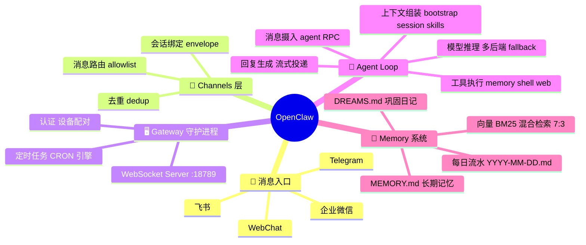
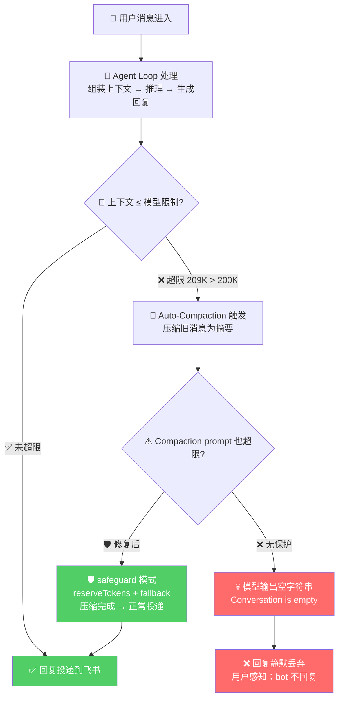
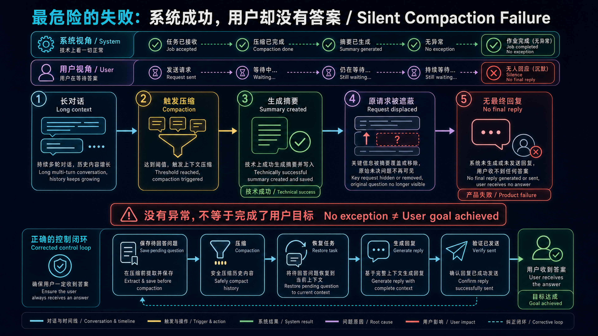
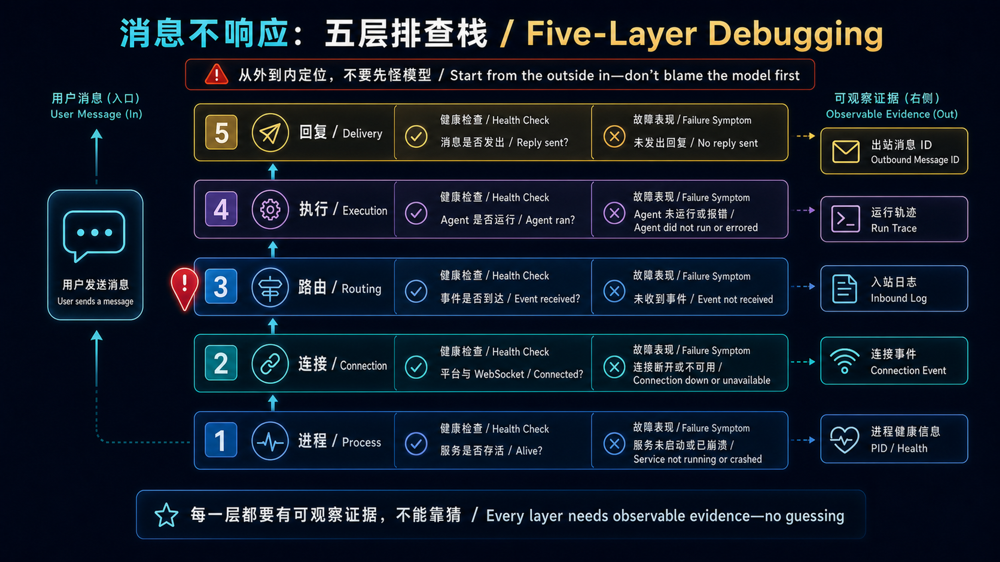
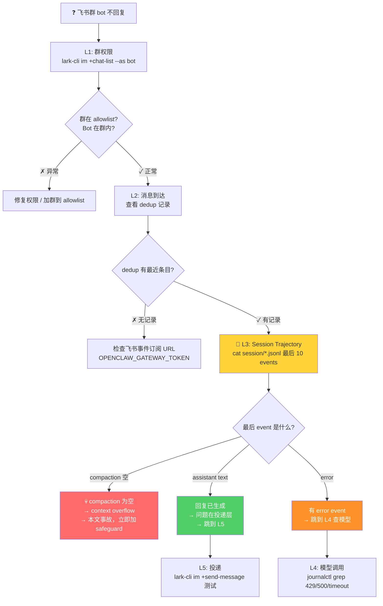
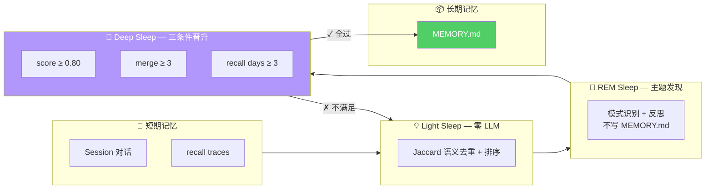

## 为什么是 OpenClaw

> 编程 Agent 的能力跃迁不只是"更强"——每次范式转移改变的是**验证循环的归属权**。提示词工程时代（Copilot, 2021）：人类写 prompt、AI 补全、人类验证——验证完全在人手里。上下文工程时代（Cursor, 2023）：AI 生成代码块、人类审查 diff——验证仍以人为主，但 AI 开始做 lint/fix 的轻量自检。驾驭工程/harness 时代（Claude Code / Codex CLI / OpenClaw, 2025）：AI 写代码、AI 跑测试、AI 看报错、AI 修——验证循环从人转移到 harness，**人不再逐条审查输出，而是设计和维护验证系统的规则**。整个 Outer Loop（模型外的一切：上下文管理、工具调用、验证、记忆巩固）开始比模型推理本身更决定系统质量。OpenClaw 是这个趋势里记忆侧最激进、但 harness 稳定性最不足的一个。
>
> 同一代内还有一条关键分岔：**Vibe Coding**（Bolt.new、Lovable、Replit）把验证也扔给用户--"生成即交付"；**Engineering Rigor**（Claude Code、Aider、OpenClaw）则把验证编码进 harness--测试跑不过就重试。两者的差距不在模型，在 outer loop 的设计哲学。

先看一眼 OpenClaw 的整体架构——用思维导图展示组件层级，后面所有踩坑都跟这些模块有关：




OpenClaw 是驾驭工程时代的自治编程 Agent，跨模型 CLI，支持 DeepSeek / Anthropic / OpenAI 多后端。它最吸引我的一点是**记忆系统**——在当前所有生产可用的编程 Agent 中，它的记忆架构是最激进的：

- **PPO 认知权重自适应**：唯一的在生产工具中用强化学习调整记忆检索权重的系统。检索信号五维加权（recency 0.35 + frequency 0.25 + semantic 0.25 + saliency 0.15 + procedural 按需），随时间动态衰减
- **三重睡眠巩固**：Light Sleep（Jaccard 去重，零 LLM 成本）→ REM Sleep（置信度评分）→ Deep Sleep（三条件晋升门：score≥0.80 + merge≥3 + recall≥3），自动将短期经验固化为长期记忆
- **向量 + BM25 混合检索**（7:3）：比纯向量检索更鲁棒

但拉上生产环境跑了三周后，我的结论是：**记忆系统有多先进，踩的坑就有多深**。下面按时间线记录从部署到稳定全过程中真正折腾过的问题。

## 第一坑：启动失败三重奏

第一次在 VPS 上启动 OpenClaw Gateway，连续三种报错，每种原因都不一样。

**`gateway token missing`** — 最容易被忽略。OpenClaw 的 Gateway 模式需要独立的 `OPENCLAW_GATEWAY_TOKEN` 环境变量，不是飞书的 App Secret。systemd unit 文件里漏写一个 `Environment=` 就直接 401。

**`No credentials for provider`** — `auth-profiles.json` 里的 `keyRef` 必须和环境变量名精确匹配。一个字符对不上就报这个错，而且错误信息不会告诉你是哪个 keyRef 没匹配到，只能肉眼对。

**`400 InvalidParameter` / 模型不存在** — Omniroute 的模型名必须是 `<provider>/<model>` 格式。写成 `gpt-5.5` 会报 400，必须写 `codex/gpt-5.5`。再加上 OpenClaw 自己的 provider 前缀，最终是 `omniroute/codex/gpt-5.5`。三层前缀嵌套，少一层都不行。

```bash
# 排查时这三步最省时间
systemctl cat openclaw-gateway.service | grep Environment  # 检查环境变量
python3 -c "import json; json.load(open('/home/openclaw/.openclaw/openclaw.json'))"  # JSON 语法
journalctl -u openclaw-gateway.service -n 50 --no-pager | grep -iE "error|unauth"  # 看错误
```

## 第二坑：日志去哪了

OpenClaw 运行时日志**全部走 journald**，不写文件。`/tmp/openclaw/openclaw-*.log` 只在启动阶段有几行，运行时的错误全在 journald 里。我被这个坑了半小时——盯着文件日志 tail 了半天，什么都没看到，最后才意识到：

```bash
# 这才是正确的看日志方式
journalctl -u openclaw-gateway.service -f
```

## 第三坑（最严重）：Compaction 静默吞回复

这是这三周里最严重的一次事故。在说具体时间线之前，先看图理解 Compaction 在 Agent Loop 中的位置和失败路径：



上面的 Mermaid 保留了事故分支；下面的系统图换一个观察角度，把**系统状态**和**用户状态**拆开。真正危险之处是：作业在系统看来“完成且无异常”，用户却始终没有收到最终回复。



一条正常的用户消息，Agent 已经生成了完整回复，但**用户什么都没收到**，bot 像死了一样安静。

### 时间线

- `01:43:40` 飞书新闻群用户发消息："失败请求占用到我们账户的请求资源的，麻烦方便的时候检修下程序中错误的请求参数"
- `01:43:57` Agent 生成了完整文本回复（session trajectory 里能看到 `message` event with assistant response）
- `01:44:00` Auto-compaction 触发：session context 已经到了 209K tokens，超过 primary model 的 200K 限制
- `01:44:00` **回复消失**：compaction 输出空摘要 `"Conversation is empty"`，session 结束，回复未投递到飞书
- 用户侧完全感知为"bot 不回复"

### 根因

Compaction 是一个**隐式中间层**。正常情况下它压缩上下文；但当上下文本身已经超过模型限制（209K > 200K），compaction prompt 也装不下完整上下文时，**模型输出空字符串**。OpenClaw 默认没有对此做保护——不报错、不降级、不通知，只是悄悄地把已生成的回复扔掉了。

这是 `middleware-semantic-leak` 的教科书级案例：中间层在极端情况下从"压缩上下文"变成了"丢弃回复"，语义完全翻转，且没有任何信号。

翻开源码可以清晰地看到这个静默失败路径的完整链路。OpenClaw 的 `compaction.ts` 中定义了一个看起来无害的常量：

```typescript
// src/agents/compaction.ts
const DEFAULT_SUMMARY_FALLBACK = "No prior history.";
```

当 `summarizeChunks()` 收到空消息列表时，直接返回这个字符串——不抛错、不告警、不走降级。

而发给模型的 compaction prompt 本身也完全没有防御性指令。这是 system prompt：

```text
// packages/agent-core/src/harness/compaction/compaction.ts
SUMMARIZATION_SYSTEM_PROMPT:
"You are a context summarization assistant. Your task is to read a conversation
between a user and an AI coding assistant, then produce a structured summary
following the exact format specified.

Do NOT continue the conversation. Do NOT respond to any questions in the
conversation. ONLY output the structured summary."
```

user prompt 的模板是：

```text
// packages/agent-core/src/harness/compaction/compaction.ts
SUMMARIZATION_PROMPT:
"<conversation>
[这里塞入完整的对话历史, 209K tokens 时已经是十几万字的原始消息]
</conversation>

The messages above are a conversation to summarize. Create a structured context
checkpoint summary that another LLM will use to continue the work."
```

关键设计缺陷就在这个 `<conversation>` 标签里：**prompt 的指令部分（"summarize the conversation"）在对话历史之后**. 当对话历史超过模型上下文窗口时，模型看到的不是"一堆对话" + "请总结"，而是一个被截断的 `<conversation>` 开头，后面什么都没有——既看不到 `</conversation>` 闭合标签，也看不到总结指令。system prompt 只是说"你是总结助手，只输出结构化摘要"，没有告诉模型"如果对话内容被截断了该怎么办"。

于是模型面对的是：一个残缺的 XML 片段 + 一个只说"输出摘要"的 system prompt。在多数模型的默认行为下，这意味着一个极短的空输出——恰好对应 trajectory 里看到的 "Conversation is empty"。

更致命的是 `summarizeWithFallback()` 的最后兜底路径：当全文摘要和部分摘要先后失败（chunk 超限、模型 5xx、token 溢出），回退到：

```typescript
// src/agents/compaction.ts — summarizeWithFallback 最终 fallback
return (
  `Context contained ${messages.length} messages ` +
  `(${oversizedNotes.length} oversized). ` +
  `Summary unavailable due to size limits.`
);
```

这几个字就是你在 session trajectory 里看到的 "Conversation is empty" 的源头——**compaction pipeline 的设计假设"摘要失败后还有原始上下文可用"**，但 209K > 200K 的极端情况正好击穿了这个假设：原始上下文塞不进 prompt，摘要模型也返回空，唯一的输出是一条"摘要不可用"的自然语言通知——而 OpenClaw 把它当成正常的 compaction 结果继续执行，已生成的回复就静默丢弃了。

两个常数的叠加也值得注意：

```typescript
// src/agents/compaction.ts
const SAFETY_MARGIN = 1.2;       // 20% buffer for estimateTokens inaccuracy
const SUMMARIZATION_OVERHEAD_TOKENS = 4096;  // prompt/system prompt overhead
```

`SAFETY_MARGIN` 是 token 估算的 20% buffer——`estimateTokens()` 用的是字符数/4 的粗略估算，对多字节字符、特殊 token、代码 token 会有系统性低估。这意味着"看起来还有 10K 余量"时，实际已经撞墙了。`SUMMARIZATION_OVERHEAD_TOKENS` 是 compaction prompt + system prompt + 序列化包装的固定开销——但不包括 previous summary 的体积。**当 session 精炼多轮后 previous summary 本身已经有几十 KB，这个 4096 的固定预留是不够的**。

而确认这是默认行为而非配置错误的证据在类型定义中：

```typescript
// src/config/types.agent-defaults.ts
export type AgentCompactionConfig = {
  mode?: AgentCompactionMode;  // 可选字段——不设就是无 safeguard 的默认模式
  reserveTokens?: number;
  keepRecentTokens?: number;
  // ...
};
```

`mode` 是 optional，不显式配置 `"safeguard"` 就不会启用 `reserveTokens` 和 `maxHistoryShare` 保护。生产环境的默认行为，就是让 compaction 裸跑。

### 修复

两步，缺一不可：

```json
// openclaw.json
"compaction": {
  "mode": "safeguard",
  "reserveTokens": 20000,
  "keepRecentTokens": 16000
},
"model": {
  "fallbacks": ["deepseek/deepseek-v4-flash"]
}
```

`safeguard` 模式为 compaction 后的总结保留 token 预算，防止占用满窗口。而 fallback 到 `deepseek-v4-flash`（1M context window）则保证了即使主模型窗口不够，compaction 任务本身永不会超限。

### 通用教训

这不是 OpenClaw 专属的问题。任何带自动上下文压缩的 Agent 系统，都面临同样的风险：**compaction 的失败模式是静默的**。如果你的 Agent 突然不回复了，第三个要检查的就是 compaction——在 session trajectory 里找 compaction event 的 content 是否为空。

## 飞书消息不响应：五层排查法

这次事故之后，我沉淀了一套从外到内、按概率排序的排查链路。下次 bot 不回复，按这个顺序查：

这张图把五层与每层的**可观察证据**放在一起。排障不是从模型开始猜，而是沿“进程 → 连接 → 路由 → 执行 → 回复”逐层证明消息走到了哪里。



| 层 | 检查点 | 怎么看 |
|---|---|---|
| L1 飞书应用层 | Bot 是否收到消息 | `lark-cli im +chat-list --as bot` 确认群在 allowlist |
| L2 事件接收层 | 消息是否到达 Gateway | 检查 dedup 记录是否有最近条目 |
| **L3 Session 层** | Agent 是否处理了消息 | **看 session trajectory 的最后 event**——这步最关键 |
| L4 模型调用层 | 模型是否正常响应 | journalctl grep 429/401/500/timeout |
| L5 投递层 | 飞书发送是否成功 | 用 CLI 直接发一条测试消息验证权限 |

以后再遇到消息不响应，按下面这个决策树走，先看 trajectory 的最后 10 行——八成问题在第三步就能定位：



## Outer Loop：为什么框架比模型更决定成败

[SWE-bench Pro](https://www.swebench.com/) 是目前最受认可的企业级编程 benchmark（Princeton 维护，独立评审），它有一个极具说服力的数据：**同一个模型 Claude Opus 4.5，在不同 harness 下的得分可以差 9.5 个百分点**——SEAL 标准化脚手架 45.9%，Cursor 50.2%，Auggie 51.8%，Claude Code 55.4%。模型完全一样，换一个 harness 就是 5 到 10 个百分点的差距。而 Anthropic 在 2025 年 11 月的工程博客 *Effective harnesses for long-running agents* 里也确认了同一个结论：把"干活"和"评估"拆到不同 Agent 里，用硬性 pass/fail 门禁取代模型自评，单 Agent 跑 20 分钟崩溃的任务，三 Agent harness 跑了 6 小时产出了完整可用的应用。OpenClaw 甚至没有出现在任何主流 benchmark 的榜单上——不是模型能力的问题，是它的 harness 质量还不足以支撑 benchmark 级别的稳定表现。

这不是偶然。2025 年行业里一个收敛的认知是：**"Structure around the model matters more than cleverness inside the model."** 模型只负责生成，而**生成是便宜的**——真正决定系统质量的是 Outer Loop 里的三件事：

| Outer Loop 组件 | 做什么 | 失败时发生什么 |
|---|---|---|
| **验证（Verification）** | 编译器、测试套件、linter 检查输出 | AI 生成错误代码没人发现 |
| **上下文管理（Context Engineering）** | Compaction、pruning、memory flush | 就是本文的事故——静默丢回复 |
| **工具定义（ACI）** | Tool schema、参数约束、防呆设计 | 参数传错、文件写错路径、静默重试 |

这三层都**不在模型里面**——它们是你部署和维护的系统。Compaction 事故的根因不是模型不够聪明，是你没告诉 harness "当压缩失败时，不要扔回复，要报错"。

这也解释了为什么 Anthropic 观察到"最成功的 Agent 实现很少用复杂框架"——框架是别人写的 Outer Loop，你没法控制它的失败模式。OpenClaw 的多后端支持看起来是优势，但每个模型的 context window 不同、reasoning profile 不同、API 行为不同——**每多一个模型，compaction 的边界条件就多一组组合**，outer loop 的测试矩阵指数增长。

这引向一个更根本的结构性问题——记忆系统的路线分歧。

## OpenClaw vs Claude Code：记忆系统的路线分歧

OpenClaw 记忆系统最独特的机制是 **Dreaming 后台巩固**——它不是简单的"记下来"，而是有一个三阶段自动流水线：



跑了一段时间后，两个系统可以并排对比：

| 维度 | OpenClaw | Claude Code |
|---|---|---|
| 检索机制 | 向量+BM25 混合 (7:3) | LLM 语义判断 (Sonnet) |
| 权重进化 | **PPO 自适应** | 人工固定分类 |
| 巩固机制 | 三重睡眠 | 三门四阶段 AutoDream |
| 模型锁定 | 多模型 | 仅 Claude |
| 记忆分类 | 按时间（长期蒸馏/短期流水） | 按类型（user/feedback/project/reference） |
| 生产成熟度 | 早期 | 百万级 Agent 验证 |

OpenClaw 的记忆架构更"学术正确"——PPO 自适应权重、三重睡眠、混合检索，每一层都接近记忆系统前沿论文。Claude Code 看上去"更土"：记忆就是四类 Markdown 文件（user/feedback/project/reference），检索靠 Sonnet 语义判断，没有 PPO 也没有 BM25。

但这里有一个反直觉的结构事实：**文件记忆 > 向量记忆**。不是量化的"好一点"，是质的差异。工业界从 Claude Code、Codex CLI 到 Cursor，全部选择 Markdown 文件作为主记忆介质，向量只做辅助索引。为什么？因为编程场景下**确定性 > 概率检索**——你不能让 PPO 权重决定"要不要记住 API key 泄漏过"。

更大的问题在于：**记忆系统的先进程度和 Outer Loop 的稳定性是乘积关系，不是加法**。你的记忆检索算法再精准，如果 compaction 中间层悄悄把回复扔了，用户感知的不是"记忆不够好"，是"bot 死了"。OpenClaw 把 80% 的创新预算花在记忆侧（PPO、Dreaming、混合检索），但 Outer Loop 的防御侧（compaction safeguard、故障信号、降级路径）投入不足。Claude Code 反过来——记忆侧保守，但 harness 花了几百万 Agent 的实战验证。

这是选型时需要警惕的陷阱：**看 benchmark 时看的是模型+记忆的能力上限，但生产系统活在 Outer Loop 的下限里**。

## Compaction 设计的结构性差异：从 prompt 学到的

前面从源代码看了 OpenClaw 的 compaction prompt 为什么在溢出时会静默失败——`<conversation>` 标签在前、指令在后，上下文溢出时模型看不到指令。那做得更好的长什么样？

2026 年 3 月 Anthropic 的 npm `.map` 文件意外泄露了 Claude Code 的完整 system prompt，[Piebald-AI/claude-code-system-prompts](https://github.com/Piebald-AI/claude-code-system-prompts) 从编译 JS 中提取并整理了所有 prompt。对比两个 compaction prompt，差距不在模型本身——都在用类似的 LLM 做摘要——而在 **prompt 的结构性防御**：

**摘要格式：9 段式 vs 5 段式。** Claude Code 要求 9 个结构化节：

1. Primary Request and Intent — 用户核心诉求
2. Key Technical Concepts — 技术概念
3. Files and Code Sections — 文件 + 完整代码片段 + 为什么重要
4. Errors and fixes — 所有错误 + 修复方式 + 用户反馈
5. Problem Solving — 已解决和排查中的问题
6. **All user messages** — 所有用户消息（非工具结果）
7. Pending Tasks — 待处理任务
8. Current Work — 当前正在做的事（含文件名+代码片段）
9. Optional Next Step — 下一步 + **对话原文引用**

OpenClaw 只有 5 个（Decisions / TODOs / Constraints / Asks / Identifiers），缺失的恰好是 compaction 事故中最致命的部分：错误修复记录、用户消息的完整保存、当前工作的精确描述。

**安全指令逐字保留。** Claude Code 的 prompt 明确要求：*"Note any security-relevant instructions or constraints the user stated... These MUST be preserved verbatim in the summary so they continue to apply after compaction."* 这意味着"不要读 .env 文件"、"不要提交密钥"、"必须用 HTTPS 而非 HTTP"这类指令在 compaction 后仍然生效。OpenClaw 只做标识符保留（identifier policy），不做安全指令保留。

**用户反馈不会被压缩掉。** Section 6 要求列出 ALL user messages，Section 4 要求记录用户对每个错误的反馈。两个设计合在一起的效果是：用户说过"不要那样做，要这样做"——这件事经过 compaction 后不会消失。对比本文事故：一条用户消息触发 compaction → 已生成的回复静默丢弃 → 用户侧只看到 bot 不回复。如果 compaction 摘要里强制保留了"用户说了什么"，至少排障时一眼能看到触发源。

**下一步必须引用原文。** Section 9 要求：*"Include direct quotes from the most recent conversation showing exactly what task you were working on and where you left off. This should be verbatim to ensure there's no drift in task interpretation."* 这个设计防止了"摘要模型用自己的话重述任务"导致的语义漂移——重述过的任务，下一代 Agent 可能理解成完全不同的东西。

**分析先于输出。** Claude Code 的 prompt 要求先 `<analysis>` 标签内逐消息分析，再输出 `<summary>`。这不是装饰——它是把思考过程嵌入质量控制：如果 analysis 里没提到某个错误修复，summary 就不会有它。OpenClaw 的 prompt 没有这个内置的完整性检查。

**断路器。** 连续 3 次 auto-compact 失败后停止。OpenClaw 无此机制，理论上可以无限 compaction → 失败 → 再 compaction。

**部分压缩。** Claude Code 支持只压缩前半段、保留后半段原文。独立 prompt 告诉模型："this summary will be placed at the start of a continuing session; newer messages will follow"——模型清楚自己输出的是前缀，不会试图假装有全文视野。

把这些差异放一张表里：

| 设计维度 | Claude Code | OpenClaw |
|---|---|---|
| 摘要格式 | 9 段式，含错误修复+用户消息 | 5 段式 |
| 安全指令保留 | verbatim 逐字保留 | 仅标识符保留 |
| 用户反馈保护 | ALL user messages + 原文引用 | 无 |
| 输出前分析 | `<analysis>` → `<summary>` 两步 | 直接输出 |
| Circuit breaker | 3 次连续失败停止 | 无 |
| Prompt 架构 | 指令在前，对话在后 | 对话在前，指令在后 |
| 失败信号 | 显式错误消息 | 静默 fallback |
| 部分压缩 | 独立 prompt，"前缀心态" | 不支持 |
| 文件引用追踪 | post-compaction 提醒重读 | post-compaction 读 AGENTS.md |

这里有一个值得停下来想的结构性观察：**Claude Code 的 9 段格式不是"更聪明"，是"更不容易丢东西"**。每一个设计决策——安全指令 verbatim、用户消息逐条列出、下一步引用原文——都在防御同一个风险：compaction 是信息损失的天然节点，prompt 的唯一职责是把这个损失降到最低。OpenClaw 在 compaction 上投入的 prompt engineering 明显不足——不是在模型能力上不够，是在"什么东西绝对不能丢"这个问题上没有做足够的防御性设计。

这也回到了本文的核心论点：**Outer Loop 的质量不取决于你用了多强的模型，取决于你写的 prompt 在极端情况下会不会漏东西**。本事故中的 `SAFETY_MARGIN = 1.2`、`SUMMARIZATION_OVERHEAD_TOKENS = 4096`、`<conversation>` 在指令之前的排列——这些都不是模型的问题，是 prompt 没考虑溢出场景。而 Claude Code 的 prompt 即使溢出，至少也会留下错误修复记录、用户消息、原文引用——排障所需的上下文不会全部蒸发。

## 总结：三个比踩坑更底层的判断

**1. Outer Loop 是新的护城河，不是模型。** 2025 年后，模型能力在快速趋同——Gemini 2.5 Pro 有 1M context、DeepSeek-V4 有 1M、GPT-5.5 有 200K。模型之间的差距在收敛，但 harness 质量（compaction safeguard、验证循环、降级路径、故障信号）的差距在拉大。本文的 compaction 事故就是证据——它不是"模型不够好"的问题，是 harness 少了一行配置。Claude Code 2026年1月 ARR 到 ~$2B，不是因为它用的 Claude 模型比别人聪明，是它的 outer loop 经过了百万级 Agent 的实战验证。

**2. 确定性优于概率性——在记忆、在路由、在故障处理。** OpenClaw 的 PPO 自适应权重和混合检索在论文上是对的，但当 compaction 静默失败时，用户不关心你的检索 recall 提高了多少。在系统边界上（compaction、fallback、错误处理），**确定性规则（rule-based）比概率规则（RL-based）更安全**。Claude Code 选"土"的分类法不是因为它不会做 PPO，是因为手工规则在"不丢东西"这件事上更可预期。

**3. 2025-2026 的行业趋势是 BYOK 和 harness 开源化。** 大量用户从 Cursor 迁移到 Claude Code CLI、Aider、OpenCode——不是因为这些工具功能更多，是因为 BYOK（Bring Your Own Key）让你**掌控 outer loop**。SaaS 工具的 compaction 策略、缓存策略、重试策略全是黑盒，出问题你只能等厂商修。而 OpenClaw 的 `openclaw.json` 里每一行配置你都能看到、能改、能版本控制。这也是 OpenClaw 真正的长期价值——不是记忆系统多先进，而是 **harness 完全透明**。
