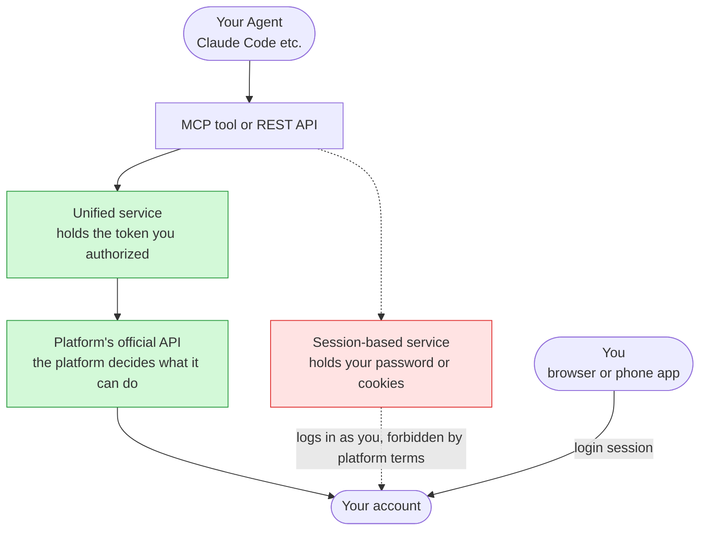
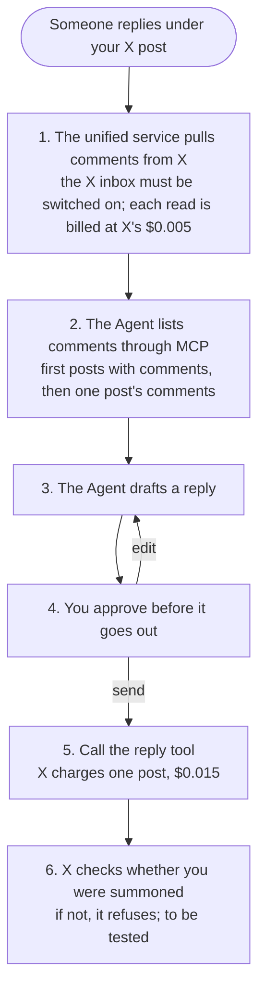
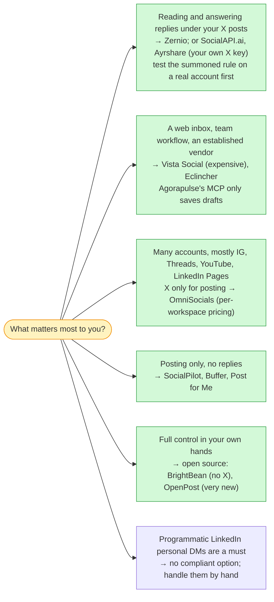

**Version scope**: every product capability, price and platform rule was checked on 2026-10-09 against official documentation, pricing pages and API references. Prices are list prices in US dollars, without discounts or promotions. GitHub stars, last commits and licences were queried with `gh api` the same day. This field moves fast: X changed its API rules twice in 2026, Reddit's public API closes in March 2027, and several of the MCP servers only appeared in September.

> [!NOTE]
> **What I tested: this article is mostly documentation reading.** Only Zernio was tested (2026-10-09): its read-only REST endpoints, the MCP handshake and tool list, connecting it to Claude Code, and, with my own X account, publishing a post and then replying to a comment I left under it myself (section 7). **Whether replying to someone else's comment is blocked by X's "summoned" rule is not tested yet**; everything about the other vendors comes from documentation. No vendor sponsored this and there are no referral links.

---

## The short version

1. **The platform decides what is possible.** Since 2026-02-23 X only lets a program reply to someone who mentioned or quoted you, and AI-generated replies posted automatically need X's approval first. A LinkedIn personal profile can post, but its comments and DMs are open only to legal entities and partners. A Facebook personal profile cannot post through the API. Instagram needs a professional account. Threads and YouTube have no DM API at all. **No tool gets around any of this.**
2. **Developer-facing unified APIs (19 vendors)**: Zernio is first with 35.3. Without your own X developer key it reads and answers replies under your X posts and X DMs (tested: reading needs a background switch that bills continuously), connects all 17 accounts in the example, exposes comment and DM tools in its MCP server, and pushes new messages by webhook. Ayrshare (29.3) covers almost as much, but needs your own X key, needs a separate profile for each extra account on the same platform, and costs four times as much. SocialAPI.ai (29.5) is cheap, but posts only plain text to X and has no Reddit. OmniSocials (23.8) is the cheapest thanks to per-workspace pricing, but cannot read replies under your X posts.
3. **Established social media suites (23 vendors)**: only Vista Social (about $217–257 a month for the example accounts) and Eclincher ($134–149 a month, no Bluesky, some features unverified) can post, read the inbox and reply through MCP. Agorapulse's MCP server can only save drafts. Hootsuite's can only save drafts and read, and while it is switched on it blocks X, LinkedIn, Reddit and YouTube data. Metricool's REST API can answer comments and DMs, but its MCP server cannot.
4. **Open source, self-hosted**: none is complete. Postiz is the most popular but has no inbox. BrightBean Studio has the most complete inbox tools but no X. OpenPost handles X comments and DMs but is seven months old.
5. **Session-based APIs** (they take your password or cookies) add only things the platforms forbid in writing: LinkedIn personal DMs, a way around X's reply limit, a way around Instagram's 24-hour DM window.
6. **Whatever you pick, test one X reply on a real account first.** X's documentation doesn't say whether a reply under your own post counts as "mentioning you", and that limit applies to every vendor.

---

## Who this is for

Engineers who already use an Agent (Claude Code, Cursor or their own) and want it to take over social posting and replies too. You don't need to know any platform's API beforehand; you should know roughly what MCP is (the protocol an Agent uses to call external tools).

**Seven terms first**:

| Term | Meaning in this article |
|---|---|
| Official API | The interface a platform publishes for developers; the platform decides what it can do and what it costs |
| Authorization token (OAuth token) | The key a third-party service receives after you click "Allow" on the platform's consent page. It can only do what you approved, and you can revoke it any time in the platform's settings |
| Unified API | A service that wraps a dozen platforms' official APIs into one interface, so you integrate with it alone |
| Inbox | Comments, mentions and DMs: the three kinds of messages where someone reaches out to you |
| Session-based API | A service that logs in as you with your password or browser cookies, bypassing the official API |
| Summoned | X's rule: a program may reply to a post only if its author mentioned or quoted you |
| P / C / M / D | Table shorthand: post / read and answer comments / read and answer mentions / read and send DMs |

---

## The minimal causal chain: tools are only carriers

Whichever tool you use, a call travels this chain:



*Schematic: it shows call paths, not any vendor's internals. Solid lines are the official route; dashed lines are the route session-based APIs take.*

Three consequences follow, and the rest of the article rests on them:

1. **A unified service can never do more than the platform's official API allows.** Tools compete on how much of the official capability they carry, and how reliably.
2. **Anything beyond the official API means taking the dashed route**, handing over your password or cookies. That route does unlock more, but platform terms forbid it in writing.
3. **A service calling the official API is not you logging in.** In a platform's security settings, "connected apps" and "devices / sessions" are two separate lists. A unified service calls the API from its own servers; that does not count as you logging in from another IP.

---

## 1. What the platforms give you: check the ceiling first

| Platform | Post (P) | Read and answer comments (C) | DMs (D) | Requirements / catches |
|---|---|---|---|---|
| X | Yes | Read yes; **reply only to people who mentioned or quoted you** | Yes; DMs moved to encrypted X Chat can't be read by the API | Pay per use, no free tier; automatic AI replies need X's prior approval |
| YouTube | Videos only | Yes; each reply costs 50 quota units, 10,000 units a day by default | The platform has no DMs | Whether uploads from unaudited projects are locked to private: two official pages disagree |
| Instagram | Yes | Yes | Yes, but the other person must write first and you must answer within 24 hours | Needs a creator or business account (free to switch) |
| Threads | Yes | Yes | The platform API has none | — |
| Facebook | Pages only | Pages yes | Pages yes | Personal profiles never |
| LinkedIn personal profile | Yes | **Cannot read**: the permission to read comments is for "select developers" only | **No**: the Messages API is partners only | Company Pages can read comments |
| TikTok | An app you register yourself won't pass the audit, and an unaudited app can only post privately; you need an already-audited service | Business accounts | Business accounts; not in the EU, UK or Switzerland | The audit rules explicitly reject "tools that upload for your own or your team's accounts" |
| Reddit | Yes | Yes | Yes | **New API applications close on 2026-10-31; the public Data API shuts down in March 2027** |
| Bluesky / Mastodon | Yes | Yes | Yes | Free, no review; on Bluesky, reply only to people who mention you first |

X is the only platform here that charges per call (official pricing page, 2026-10-09):

| Operation | Unit price |
|---|---|
| Create a post | $0.015 |
| Create a post containing a link | **$0.20** |
| Read a post | $0.005 |
| Read your own data (such as your own mentions) | $0.001 |
| Read a DM / send a DM | $0.010 / $0.015 |

Saving your first card gives $20 of credit, and reads are capped at 3 million posts a month. For 30 posts a month (10 with a link), 500 replies read and 50 answered, the X part comes to about $3–6, mostly from the link posts.

---

## 2. How I scored

To compare like with like I fixed an **example setup**: one person with a personal and a brand account on each of 9 platforms, 17 accounts in total (two each on X, YouTube, Instagram, Threads, TikTok, Bluesky and Reddit; a personal profile plus a Company Page on LinkedIn; only the brand Page on Facebook, because personal profiles can't be connected).

| Item | Max | How it's scored |
|---|---|---|
| Posting coverage | 10 | Accounts it can connect and post to / 17 × 10; text-only X counts as half an account |
| Read and answer replies under your X posts | 4 | Weighted separately; X engagement depends on it most |
| X DMs | 2 | |
| Comments on the other 8 platforms | 8 | 1 point per platform |
| Other DMs | 5 | 1 point each for Instagram, Facebook, TikTok, Bluesky, Reddit |
| Mentions | 3 | 0.5 for each of 6 platforms |
| MCP | 3 | Dedicated tools for comments and DMs 3; comments only 2; one generic execute tool 1 |
| Webhooks for new messages | 2 | New comments and new DMs 2; one kind only 1 |
| Several accounts per platform together | 1 | No point if extra workspaces are needed |

Features limited to posts published through the tool, read-only, beta, or with self-contradicting docs get half a point. **These weights are mine**; cutting "replies under your X posts" from 4 points to 1 leaves the top three unchanged.

---

## 3. Developer-facing unified APIs (19 vendors)

| Rank | Product | Score | Replies under your X posts | X DMs | Accounts (/17) | MCP has comment + DM tools | Monthly price for 17 accounts (second sort key) |
|---|---|---|---|---|---|---|---|
| 1 | Zernio (formerly Late) | **35.3** | Yes, including posts not made through it | Yes | 17 | Yes | $69 + X passed through at official rates |
| 2 | SocialAPI.ai | 29.5 | Yes (your own X key) | Yes | 15 (X text only) | Yes | $29 + your own X costs |
| 3 | Ayrshare | 29.3 | Yes (your own X key) | Yes | 17 | Yes (no mentions) | $299 ($249 yearly) + $0.09 per DM conversation |
| 4 | OmniSocials | 23.8 | **No** | Yes | 15 (no Reddit) | Yes | Two workspaces, $20–24 |
| 4 | Aidelly | 23.8 | Docs contradict | Partly | 15 | Yes | $29–39 |
| 6 | Postproxy | 23.3 | No | No | 15 | Yes | $49 |
| 7 | RelayAPI | 22.0 | Docs unclear | Docs unclear | 17 | Generic execute tool only | From $5 |
| 8 | Outstand | 21.0 | Only posts made through it | No | 17 | Comments only | $19 + your own X key |
| 9 | Upload-Post | 20.8 | Docs conflict | No | 15 (Reddit posting returns 503) | Yes | $16–24 |
| 10 | bundle.social | 19.0 | Docs contradict themselves | No | 17 | Comments only | $90–100 |

Ranks 11–19 are UniPost, Mallary, Postqued, PostFast, Blotato, Post for Me, Post Bridge, Unipile and Typefully: they either only post, or only see comments on posts published through them.

The leaders platform by platform (P post, C comments, M mentions, D DMs; ½ partial, ? docs unclear):

| Product | X | LinkedIn personal | LinkedIn Page | YouTube | Instagram | Facebook Page | Threads | TikTok | Bluesky | Reddit |
|---|---|---|---|---|---|---|---|---|---|---|
| Zernio | P C D M½ | P | P C M½ | P C | P C D M½ | P C D | P C | P C D½ | P C D | P C D |
| SocialAPI.ai | P½ C D M½ | P | P C½ | P C | P C D M½ | P C D M | P C M½ | P | P C D M | — |
| Ayrshare | P C D M½ | P C? | P C | P C½ | P C D M½ | P C D | P C? | P C | P C½ | P C¼ |
| OmniSocials | P D | P | P C M | P C | P C D M | P C D M | P C M | P C | P | — |
| Postproxy | P | P | P | P C | P C D | P C D | P C | P C | P C½ D | — |

Easy things to miss:

- **"Your own X key" is a different way of paying.** Zernio and bundle.social use their own X app and pass X's price through. Ayrshare (mandatory since 2026-03-31), SocialAPI.ai and Outstand make you create an app in X's developer console, add a card and pay X yourself. With your own key, reading your own mentions costs $0.001; Zernio passes reads through at $0.005 each.
- **OmniSocials prices differently**: $10–12 a month per workspace with unlimited accounts, but only one account per platform per workspace; it pays for X posts without links itself. Its inbox documentation says outright that comments and mentions on X are not part of the inbox.
- **Newer vendors often contradict their own docs**: Aidelly, bundle.social and Upload-Post all have features that the marketing page lists and the API docs do not. RelayAPI's documented MCP install command installs an unrelated maintainer's npm package of the same name, a supply-chain risk. SocialAPI.ai is a one-engineer personal company with no public changelog.
- **Zernio has catches too**: every X read is off by default and needs a background switch that bills continuously (tested in section 7); the X comment list returns only the first page, reply threads are cached for 2 minutes, and the comment list can lag by up to 10 minutes; Threads has no new-comment webhook; TikTok DMs can be answered but not started.

---

## 4. Established social media suites (23 vendors)

These have mature web inboxes. The question is whether a program can drive the inbox:

| Product | How Claude Code connects | Posting | Comments read / reply | DMs read / reply | Monthly for the 17 accounts (monthly / yearly) |
|---|---|---|---|---|---|
| Vista Social | Official MCP | Publishes directly | Yes / yes | Yes / to be confirmed (the reply endpoint says "public reply") | $257 / $217 |
| Eclincher | Official MCP | Publishes directly | Yes / yes | Yes / yes (X DMs unverified) | $149 / $134 (no Bluesky) |
| Agorapulse | Official MCP (beta) | **Drafts only** | Yes / yes | Yes / yes | $282 / $247 (X needs a $69 add-on per account) |
| Metricool | Posting via MCP, inbox via REST | Yes | REST yes (replies under X posts are not in the inbox) | REST yes (X DMs included) | $87 / $73 |
| Statusbrew | MCP | Drafts only | Read only | Read only | $429 / $359 |
| Hootsuite | MCP + REST | REST publishes, MCP saves drafts | MCP read-only, **and it blocks X, LinkedIn, YouTube and Reddit** | Same | From $199 (per seat, yearly) |
| Sprout Social | REST (enabled by sales); MCP for ChatGPT only | Drafts only | API read-only | API read-only | About $399 |
| SocialPilot | Official MCP | Publishes directly | No | No | $50 / $42.5 (cheapest posting-only option) |
| Buffer / Publer / Zoho Social | MCP or REST | Yes | No (web only) | No | $59–98 |

Later, Loomly, SocialBee and Sendible have neither a public API nor MCP and are out. Brandwatch, Khoros, Emplifi, Sociality.io and NapoleonCat need an enterprise contract for API access.

> [!WARNING]
> Vista Social and Metricool both say they bring **LinkedIn personal-profile comments** into the inbox. That conflicts with LinkedIn's official documentation, which gives the permission to read personal-post comments to "select developers" only. They may be approved partners, but I found no evidence, so I treat this as a vendor claim, unverified.

---

## 5. Open source, self-hosted, and new vendors in MCP directories

| Project | State (2026-10-09) | Inbox | Inbox tools in MCP | Catch |
|---|---|---|---|---|
| Postiz | 36,914★, AGPL-3.0, latest v2.25.0 | **None**; its MCP docs say it cannot read or answer comments | None | 18 security advisories in 2026, several critical and exploitable without authentication |
| Mixpost Pro | Closed source, $299 one-off | Yes (comments and mentions on FB, IG, Threads, X) | None; replies only in the web app | — |
| BrightBean Studio | 2,421★, AGPL-3.0, free hosted version | Yes: comments, mentions, DMs | **Most complete**: list, draft and send are separate permissions | **No X** |
| OpenPost | 659★, created March 2026 | Yes, including X comments and DMs | Comments only; DMs only in the HTTP API | Its hosted version says it "hasn't finished final live checks" |
| Chatwoot | 37,646★ | DMs only; the X channel isn't merged yet | Community servers only | Doesn't post |

In the official MCP Registry, Smithery, Glama and Anthropic's connector directory I also found a few vendors with inbox tools that appeared around September: Ignix (174 tools, about $121 a month for the 17 example accounts; its help page and landing page disagree on which platforms have DMs), PostLake (the cleanest inbox API, but X, Instagram, Facebook and Threads aren't open to the public yet), Pinlyx (DMs only) and SocialClaw (Instagram only). None covers as much as the leaders in section 3.

---

## 6. Session-based APIs: the extra capability is exactly the forbidden part

Unipile, Linked API, Beeper, twitterapi.io and similar services ask you to log in to your account on their page or hand over your browser cookies. They add only four things over the official route:

| Extra capability | What the platform says |
|---|---|
| LinkedIn personal DMs and personal-post comments | User Agreement 8.2 prohibits "bots or other unauthorized automated methods" |
| Instagram DMs without the "they write first, 24 hours" limit | The Terms of Use prohibit unauthorized automated access |
| X replies without the "summoned" limit, at about 1/10 of the official price | Automation rules: non-API automation may lead to permanent suspension |

Unipile's own documentation admits some endpoints are non-public and that account restrictions are an "expected failure"; Beeper's warns that sending too many messages can get accounts suspended. **If the account matters to you, stay away from this category.**

---

## 7. One comment end to end (Zernio as the example)

Take the top-ranked Zernio and follow what happens between someone replying under your X post and your reply going out.



*Schematic: the steps come from Zernio's documentation and X's pricing page. Step 4 is my addition, a human approval that satisfies X's rule that automatic AI replies need prior approval. Only the existence of the tools in step 2 has been tested.*

**The tested part** (2026-10-09, free): I created an API key in the Zernio dashboard and connected the MCP server to Claude Code with one command:

```bash
claude mcp add --transport http -s user zernio https://mcp.zernio.com/mcp --header "Authorization: Bearer <your Zernio API key>"
```

`claude mcp list` showed it connected, but **the tools did not appear in the current session; they only show up in a new one**. Rather than wait for a new session, I spoke MCP directly: first `initialize`, then list the tools:

```http
POST https://mcp.zernio.com/mcp
Authorization: Bearer <your Zernio API key>
Content-Type: application/json
Accept: application/json, text/event-stream

{"jsonrpc":"2.0","id":2,"method":"tools/list"}
```

What came back (a summary, not the raw response):

| Observation | Detail |
|---|---|
| 52 tools listed directly | 13 posting tools (`posts_create`, `posts_cross_post`, `posts_publish_now` and others), plus accounts, scheduling and analytics |
| Comment tools are in the list | `comments_list_inbox_comments`, `comments_get_inbox_post_comments`, `comments_reply_to_inbox_post` |
| Mention tools are in the list, but narrow | `mentions_list_inbox_mentions` currently returns LinkedIn Company Pages only; `mentions_reply_to_mention` supports Instagram only |
| **DM tools are not in the list** | You first call `search_tools`, then `call_tool`; the search finds `messages_list_inbox_conversations`, `messages_send_inbox_message` and `messages_create_inbox_conversation` |

The documentation doesn't mention that last point: an Agent that only reads the tool list will conclude Zernio has no DM support.

### A run with a real account (evening of 2026-10-09)

I connected my own X account to Zernio, published a test post, left a comment under it from the same account, and had the Agent reply to that comment:

| Step | How | Result |
|---|---|---|
| Connect the X account | Authorize in the Zernio dashboard | The docs say a card is required before the first X account (X bills per call and Zernio passes it on); once connected, the account is healthy and can post |
| Check before posting | `validate_post` | Free, no issues |
| Publish a text-only post | `posts_create`, publish now | Success, about $0.015 |
| Read the comments under it | `comments_get_inbox_post_comments` | **403**, `X_INBOX_NOT_ENABLED` |
| Try search or lookup by ID instead | `twitter_engagement_search_tweets`, `twitter_engagement_get_tweet` | **403**, `X_ANALYTICS_NOT_ENABLED` |
| Reply to a specific comment | REST `POST /v1/posts` with the comment's ID in `platformSpecificData.replyToTweetId` | Success, about $0.015; checked through X's public embed endpoint, the reply is attached to that comment |

Four things came out of this run:

- **Every X read on Zernio is off by default.** An X account has two switches: inbox (syncing replies under your posts and polling DMs) and analytics (periodic reads of post data). With both off you can only post and delete; reading comments, searching and looking up a post by ID all return 403. Once switched on, Zernio calls X's API in the background and each call is billed at X's price, and **the documentation doesn't say how often it polls**. If you want to watch X comments through it long term, budget for that ongoing cost; the dashboard lets you set a monthly X spending cap.
- **The MCP posting tool can't target a specific post to reply to.** `posts_create` has no such parameter; use the REST API, or the full tool found through `search_tools`.
- **Replying to my own comment was not blocked.** Whether replying to someone else's comment counts as "summoned" was not tested in this run.
- After both posts, the usage endpoint still showed $0, possibly a delay; the end-of-month invoice is the final word.

**The same flow carries over to other services**, because an inbox has these four steps and only the names differ:

| Step | Zernio | OmniSocials | Ayrshare |
|---|---|---|---|
| List what's pending | `comments_list_inbox_comments` | `get_next_unanswered` (hands you the next unanswered item) | `get_comments` |
| Read the context | `comments_get_inbox_post_comments` | `get_inbox_conversation` (includes the original post) | `get_comments` |
| Reply | `comments_reply_to_inbox_post` (supports an idempotency key, so a retry never posts twice) | `reply_to_inbox` | `reply_comment` |
| Send a DM | `messages_send_inbox_message` | `reply_to_inbox` | `send_message` |

If you build it yourself, keep three things: record what you have handled (polling will fetch the same comment twice); send replies with an idempotency key; keep a human approval step before anything goes out.

---

## 8. Will it get you banned?

- **A unified service calling the official API is not you logging in from elsewhere.** Ban risk comes from behaviour, not from the tool. X forbids several accounts posting the same or very similar content (translations into another language are allowed), automatic replies to people who didn't mention you, automatic likes and bulk following. LinkedIn rejects duplicate posts outright, and Meta treats repeated content as a spam signal.
- **Multiple IPs affect your own logins.** Logging in through proxy exits that keep changing country makes X ask for verification or lock the account temporarily, Facebook and Instagram show security checks, and LinkedIn restricts the account temporarily. The platforms don't publish the details; this comes from third-party sources. Sticking to one exit and turning on two-factor authentication avoids most of the trouble.
- **One person, several accounts, has limits**: X allows up to 10 accounts per person, each with a distinct purpose, and a violation may mean keeping one and losing the rest. LinkedIn's User Agreement allows one account per person, so the brand needs a Company Page. Facebook also allows one personal account; the brand uses a Page.
- **When you drop a service, revoke its access in the platform's connected-apps settings.** One user reported that disconnecting inside a service did not actually revoke its access.

---

## 9. How the pricing works (second priority)

| Pricing model | Example | For the 17 accounts |
|---|---|---|
| Graduated per connected account | Zernio: first 2 free, accounts 3–10 at $6 each, 11–100 at $3 | $69 |
| Per workspace, unlimited accounts, one per platform | OmniSocials: $10–12 per workspace | Two workspaces (personal, brand): $20–24 |
| Per profile tier | Ayrshare: Launch | $249–299 |
| Per plan or per seat | Vista Social, Hootsuite, Sprout | $200–400 |

Almost every vendor charges for X separately: passed through at X's price, paid by you with your own key, or converted into credits. SocialPilot and Upload-Post include it in the plan; the cost at Upload-Post is that links are stripped from posts by default.

---

## 10. Which kind to pick when



*Schematic: compiled from the documentation of 2026-10-09, not a tested ranking.*

---

## Facts, inference and what isn't verified

- **Tested**: Zernio's read-only REST endpoints return 200; after the MCP handshake it lists 52 tools, and the DM tools have to be found through `search_tools`; after connecting it to Claude Code the tools appear only in a new session; with a real account, publishing and replying to a specific comment work, and every X read returns 403 while both switches are off.
- **Official documentation**: each platform's limits, X's prices and "summoned" rule, every vendor's prices, the MCP tool names.
- **My inference**: Vista Social and Metricool may read LinkedIn personal comments through partner permissions; the scoring weights.
- **Not verified, to be tested**:
  - whether a reply under your own post counts as "summoned" (replying to your own comment works);
  - how often Zernio calls X once the inbox or analytics switch is on, and what that costs a month;
  - whether Vista Social can answer DMs;
  - Eclincher's X DMs;
  - Ignix's and Aidelly's contradictory docs;
  - whether YouTube uploads from unaudited projects are locked to private.

---

**The platform sets the ceiling; tools compete on how much of it they carry. The extra bit a session-based API offers is exactly the part the platform won't let you use.**

---

## Sources (checked 2026-10-09)

- X: [pricing](https://docs.x.com/x-api/getting-started/pricing) · [changelog](https://docs.x.com/changelog.md) · [creating posts and the reply limit](https://docs.x.com/x-api/posts/manage-tweets/introduction.md) · [platform manipulation and multiple accounts policy (archived)](https://archive.ph/Ga9ef)
- LinkedIn: [User Agreement](https://www.linkedin.com/legal/user-agreement) · [Comments API](https://learn.microsoft.com/en-us/linkedin/marketing/community-management/shares/comments-api) · [Messages API](https://learn.microsoft.com/en-us/linkedin/shared/integrations/communications/messages) · [prohibited software](https://www.linkedin.com/help/linkedin/answer/a1341387)
- Meta: [Instagram comment moderation](https://developers.facebook.com/docs/instagram-platform/comment-moderation) · [Instagram Messaging API](https://developers.facebook.com/docs/instagram-platform/instagram-api-with-instagram-login/messaging-api) · [Threads API](https://developers.facebook.com/docs/threads/overview) · [Meta Terms of Service](https://www.facebook.com/terms/)
- YouTube: [quota costs](https://developers.google.com/youtube/v3/determine_quota_cost) · [videos.insert](https://developers.google.com/youtube/v3/docs/videos/insert)
- TikTok: [content sharing guidelines](https://developers.tiktok.com/doc/content-sharing-guidelines)
- Reddit: [Responsible Builder Policy](https://support.reddithelp.com/hc/en-us/articles/42728983564564-Responsible-Builder-Policy) · [Data API shutdown timeline (PPC Land)](https://ppc.land/reddit-to-halt-public-data-api-access-in-march-2027-as-14-000-apps-register/)
- Bluesky: [bot guidelines](https://docs.bsky.app/docs/starter-templates/bots)
- Zernio: [pricing](https://zernio.com/pricing.md) · [llms.txt](https://zernio.com/llms.txt) · [X inbox](https://docs.zernio.com/platforms/twitter/inbox) · [terms](https://zernio.com/tos)
- OmniSocials: [pricing](https://omnisocials.com/pricing) · [inbox](https://docs.omnisocials.com/inbox) · [X](https://docs.omnisocials.com/platforms/x)
- Ayrshare: [pricing](https://www.ayrshare.com/pricing/) · [Comments API](https://www.ayrshare.com/docs/apis/comments/overview)
- SocialAPI.ai: [pricing](https://social-api.ai/pricing) · [docs](https://social-api.ai/llms-full.txt)
- Suites such as Vista Social, Hootsuite, Agorapulse and Metricool: [Hootsuite MCP](https://www.hootsuite.com/integrations/mcp) · [Metricool MCP](https://help.metricool.com/how-to-connect-metricools-mcp-with-claude-0l84v.md)
- Open source: [Postiz](https://github.com/gitroomhq/postiz-app) · [Postiz MCP](https://docs.postiz.com/mcp/introduction) · [BrightBean Studio](https://github.com/brightbeanxyz/brightbean-studio) · [OpenPost](https://github.com/getopenpost/openpost)
- MCP: [security best practices](https://modelcontextprotocol.io/docs/tutorials/security/security_best_practices)
