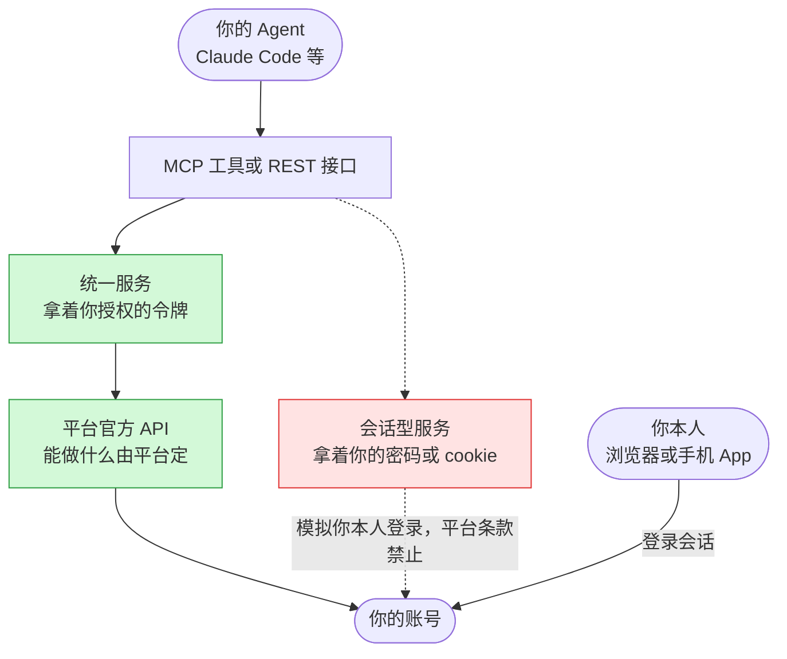
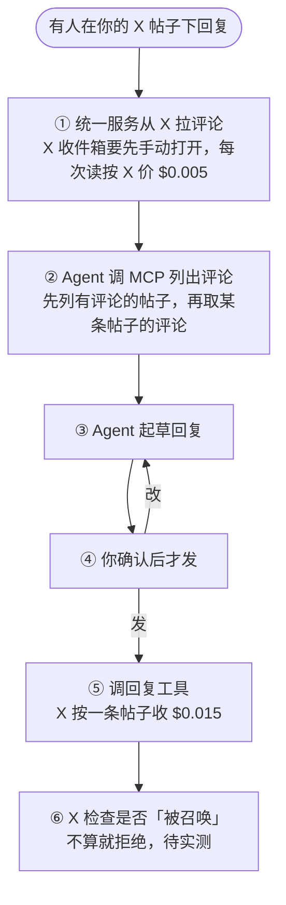
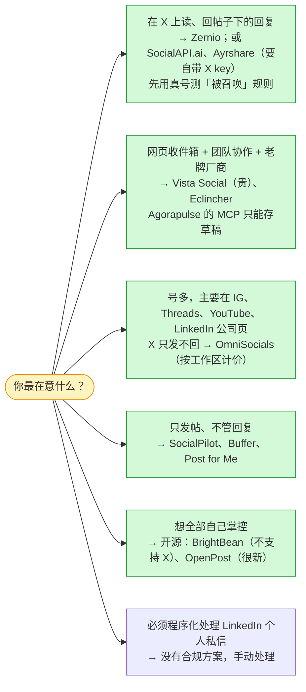

**版本范围**：所有产品能力、价格和平台规则都是 2026-10-09 在官方文档、价目页和 API 参考上核对的，价格是美元目录价，不含折扣和活动价。GitHub 项目的星数、最后提交和许可证用 `gh api` 当天实查。这一行变化很快：X 的 API 在 2026 年改了两次规则，Reddit 公开 API 2027-03 关闭，好几家 MCP 是 9 月才上架的。

> [!NOTE]
> **实测边界：这篇主要是读文档。** 实测过的只有两件，都不花钱：一是 Zernio 的 REST 只读接口和 MCP 握手、工具列表（第七节有原始请求）；二是用 Claude Code 接上它的 MCP。**连接真实社媒账号去发帖、读评论、回复，这一步还没做**，相关结论都来自文档，等我实测后补进本文。没有任何厂商赞助，文中也没有推荐链接。

---

## 先说结论

1. **能做什么由平台决定。** X 只允许程序回复 @ 了你或引用了你的人（2026-02-23 起），AI 自动生成并发出的回复要先经 X 批准；LinkedIn 个人号能发帖，但评论和私信只开放给法人和合作伙伴；Facebook 个人主页不能用 API 发；Instagram 要切成专业号；Threads、YouTube 平台本身没有私信接口。**换哪家工具都绕不过这些。**
2. **面向开发者的统一 API（19 家）**：Zernio 35.3 分第一：不用自带 X 开发者 key 就能读、回 X 帖子下的回复和 X 私信，示例的 17 个号全能接，MCP 里有评论和私信工具，有新消息推送。Ayrshare（29.3）覆盖面接近，但要自带 X key、同平台多个号要开多个 profile、价格高 4 倍；SocialAPI.ai（29.5）便宜，但 X 只能发纯文字、没有 Reddit；OmniSocials（23.8）按工作区计价最便宜，但读不到 X 帖子下的回复。
3. **老牌社媒管理套件（23 家）**：能经 MCP 发帖、读收件箱、回复的只有 Vista Social（示例账号约 $217–257/月）和 Eclincher（$134–149/月，不支持 Bluesky，部分能力未核实）；Agorapulse 的 MCP 发帖只能存草稿；Hootsuite 的 MCP 只能存草稿和只读，而且开着时屏蔽 X、LinkedIn、Reddit、YouTube 的数据；Metricool 的 REST 能回评论和私信，MCP 却没有。
4. **开源自托管**：没有一个做全。Postiz 最流行但没有收件箱；BrightBean Studio 的收件箱工具最全，但不支持 X；OpenPost 支持 X 评论和私信，但才 7 个月大。
5. **会话型接口**（要你的密码或 cookie）能多给的几样，恰好是平台明文禁止的：LinkedIn 个人私信、绕过 X 回复限制、绕过 Instagram 私信 24 小时窗口。
6. **不管选谁，先用真号测一条 X 回复。** 别人在你帖子下的回复算不算「@ 了你」，X 文档没写清，所有厂商都受这条限制。

---

## 这篇写给谁

写给已经在用 Agent（Claude Code、Cursor 或自己写的）做事、想让它顺手接管社媒发帖和回复的工程师。不需要你事先了解各平台的 API；需要知道 MCP 大概是什么（Agent 调外部工具的协议）。

**七个词先说清楚**：

| 词 | 在本文里的意思 |
|---|---|
| 官方 API | 平台公开给开发者的接口，能做什么、收多少钱都由平台定 |
| 授权令牌（OAuth token） | 你在平台授权页点「同意」后，第三方服务拿到的一把钥匙，只能做你授权过的事，随时能在平台设置里撤销 |
| 统一 API | 一家服务把十几个平台的官方 API 包成一套接口，你只对接它一家 |
| 收件箱 | 评论、@ 提及、私信这三类「别人找你」的消息合在一起 |
| 会话型接口 | 拿你的密码或浏览器 cookie 模拟你本人登录，绕过官方 API |
| 被召唤 | X 的规则：只有原帖作者 @ 了你或引用了你，程序才能回复那条帖子 |
| P / C / M / D | 表格里的缩写：发帖 / 读并回评论 / 读并回 @ 提及 / 读并发私信 |

---

## 最小因果链：工具只是搬运工

不管哪家工具，调用都要走这条链：



*示意图：画的是调用路径，不是某家厂商的内部实现。实线是官方路线，虚线是会话型接口走的路。*

从这条链能推出三件事，后面整篇都建立在它们上面：

1. **统一服务能做的，一定不超过平台官方 API 给的。** 工具之间比的是「把官方能力搬进来了多少」，以及搬得稳不稳。
2. **想要超出官方的能力，只能走虚线**，也就是交出密码或 cookie。这条路的能力确实多一些，但平台条款明文禁止。
3. **服务调官方 API 和你本人登录是两回事。** 平台安全设置里，「已连接的应用」和「登录设备 / 会话」是两张表。统一服务从它自己的服务器调 API，不算你从别的 IP 登录。

---

## 一、平台给了什么：先查上限

| 平台 | 发帖（P） | 读并回评论（C） | 私信（D） | 前提 / 坑 |
|---|---|---|---|---|
| X | 能 | 能读；**只能回 @ 了你或引用你的人** | 能；已换成加密 X Chat 的私信 API 读不到 | 按量付费，没有免费档；AI 自动回复要 X 事先批准 |
| YouTube | 只能发视频 | 能，每条回复耗 50 配额单位，每天默认 1 万单位 | 平台没有私信 | 未审计项目上传的视频会不会被锁成私享，官方两处写法冲突 |
| Instagram | 能 | 能 | 能，但要对方先发、24 小时内回 | 要切成创作者或商业号（免费） |
| Threads | 能 | 能 | 平台 API 没有 | — |
| Facebook | 只能发主页 | 主页能 | 主页能 | 个人主页一律不行 |
| LinkedIn 个人号 | 能 | **读不到**：读评论的权限只给「选定开发者」 | **不行**：私信 API 只给合作伙伴 | 公司页能读评论 |
| TikTok | 自己申请的应用过不了审计，未审计只能发私密内容；要走已过审的服务 | 商业号 | 商业号；欧盟、英国、瑞士不可用 | 审计规则明说不接受「帮自己或团队账号上传的工具」 |
| Reddit | 能 | 能 | 能 | **新 API 申请 2026-10-31 截止，公开 Data API 2027-03 关闭** |
| Bluesky / Mastodon | 能 | 能 | 能 | 免费、不用审核；Bluesky 只能回先 @ 你的人 |

X 是这里唯一按次收钱的平台（官方价目页，2026-10-09）：

| 操作 | 单价 |
|---|---|
| 发一条帖子 | $0.015 |
| 发一条带链接的帖子 | **$0.20** |
| 读一条帖子 | $0.005 |
| 读自己的数据（如自己的 @ 提及） | $0.001 |
| 读一条私信 / 发一条私信 | $0.010 / $0.015 |

首次绑卡送 $20 额度，每月最多读 300 万条帖子。以每月发 30 条（10 条带链接）、读 500 条回复、回 50 条估算，X 部分约 $3–6，带链接的帖子是大头。

---

## 二、怎么打分

为了让比较有个统一口径，我设了一个**示例场景**：一个人在 9 个平台上各有一个个人号和一个品牌号，共 17 个号（X、YouTube、Instagram、Threads、TikTok、Bluesky、Reddit 各 2 个，LinkedIn 是个人号 + 公司页，Facebook 只有品牌主页，因为个人主页接不了）。

| 项 | 满分 | 怎么给 |
|---|---|---|
| 发帖覆盖 | 10 | 能接上并发帖的号 / 17 × 10；X 只能发纯文字的按半个号算 |
| X 帖子下的回复能读能回 | 4 | 单独加权，X 上的互动最依赖它 |
| X 私信 | 2 | |
| 其余 8 个平台的评论 | 8 | 每个平台 1 分 |
| 其余私信 | 5 | Instagram、Facebook、TikTok、Bluesky、Reddit 各 1 分 |
| @ 提及 | 3 | 6 个平台各 0.5 分 |
| MCP | 3 | 评论和私信都有专用工具 3 分；只有评论 2 分；只有一个通用执行工具 1 分 |
| 新消息推送（webhook） | 2 | 新评论、新私信都推 2 分，只推一类 1 分 |
| 同平台多号放在一起 | 1 | 要开多个工作区才能接的不给分 |

只限「经本工具发出的帖子」、只读、beta、文档自相矛盾的，记半分。**这套权重是我定的**；把「X 帖子下的回复」从 4 分降到 1 分，排名前三不变。

---

## 三、面向开发者的统一 API（19 家）

| 名次 | 产品 | 得分 | X 帖子下的回复 | X 私信 | 能接的号（/17） | MCP 有评论 + 私信工具 | 17 个号的月费（第二排序） |
|---|---|---|---|---|---|---|---|
| 1 | Zernio（原 Late） | **35.3** | 能，含不是经它发的帖 | 能 | 17 | 有 | $69 + X 按官方价转嫁 |
| 2 | SocialAPI.ai | 29.5 | 能（自带 X key） | 能 | 15（X 只能发纯文字） | 有 | $29 + 自付 X |
| 3 | Ayrshare | 29.3 | 能（自带 X key） | 能 | 17 | 有（没有 @ 提及） | $299（年付 $249）+ 私信每会话 $0.09 |
| 4 | OmniSocials | 23.8 | **不能** | 能 | 15（没有 Reddit） | 有 | 2 个工作区 $20–24 |
| 4 | Aidelly | 23.8 | 文档矛盾 | 部分 | 15 | 有 | $29–39 |
| 6 | Postproxy | 23.3 | 不能 | 不能 | 15 | 有 | $49 |
| 7 | RelayAPI | 22.0 | 文档不清 | 文档不清 | 17 | 只有通用执行工具 | $5 起 |
| 8 | Outstand | 21.0 | 只限经它发的帖 | 不能 | 17 | 只有评论 | $19 + 自带 X key |
| 9 | Upload-Post | 20.8 | 文档冲突 | 不能 | 15（Reddit 发帖返回 503） | 有 | $16–24 |
| 10 | bundle.social | 19.0 | 文档自相矛盾 | 不能 | 17 | 只有评论 | $90–100 |

第 11–19 名是 UniPost、Mallary、Postqued、PostFast、Blotato、Post for Me、Post Bridge、Unipile、Typefully：要么只做发帖，要么评论只限经它发出的帖子。

前几名逐个平台看（P 发帖、C 评论、M @ 提及、D 私信；½ 是部分支持，? 是文档不清）：

| 产品 | X | LinkedIn 个人 | LinkedIn 公司页 | YouTube | Instagram | Facebook 主页 | Threads | TikTok | Bluesky | Reddit |
|---|---|---|---|---|---|---|---|---|---|---|
| Zernio | P C D M½ | P | P C M½ | P C | P C D M½ | P C D | P C | P C D½ | P C D | P C D |
| SocialAPI.ai | P½ C D M½ | P | P C½ | P C | P C D M½ | P C D M | P C M½ | P | P C D M | — |
| Ayrshare | P C D M½ | P C? | P C | P C½ | P C D M½ | P C D | P C? | P C | P C½ | P C¼ |
| OmniSocials | P D | P | P C M | P C | P C D M | P C D M | P C M | P C | P | — |
| Postproxy | P | P | P | P C | P C D | P C D | P C | P C | P C½ D | — |

几个容易漏看的地方：

- **「自带 X key」是两种计费方式**：Zernio、bundle.social 用它们自己的 X 应用，按 X 原价转嫁；Ayrshare（2026-03-31 起强制）、SocialAPI.ai、Outstand 要你自己去 X 开发者后台开应用、绑卡、自付。自带 key 读自己的 @ 提及能拿到 $0.001 的价，Zernio 转嫁的读取是 $0.005/次。
- **OmniSocials 的定价方式不一样**：一个工作区 $10–12/月、账号数不限，但每个工作区每个平台只能接 1 个号；X 不带链接的帖子它替你付了。它的收件箱明确写着「X 上的评论和 @ 提及不在收件箱里」。
- **新厂商的文档一致性普遍偏弱**：Aidelly、bundle.social、Upload-Post 都有营销页说有、接口文档说没有的情况；RelayAPI 文档里的 MCP 安装命令，装到的是别人发布的同名 npm 包，有供应链风险。SocialAPI.ai 是一个工程师的个人公司，没有公开的更新日志。
- **Zernio 也有坑**：X 收件箱要手动打开；X 评论列表只翻第一页，回复线程缓存 2 分钟，评论列表最长延迟 10 分钟；Threads 没有新评论推送；TikTok 私信只能回、不能发起。

---

## 四、老牌社媒管理套件（23 家）

这一类有成熟的网页收件箱，问题在于收件箱能不能被程序驱动：

| 产品 | Claude Code 怎么接 | 发帖 | 评论 读 / 回 | 私信 读 / 回 | 示例 17 个号的月费（月付 / 年付） |
|---|---|---|---|---|---|
| Vista Social | 官方 MCP | 能直接发 | 能 / 能 | 能 / 待确认（回复接口写的是「公开回复」） | $257 / $217 |
| Eclincher | 官方 MCP | 能直接发 | 能 / 能 | 能 / 能（X 私信未核实） | $149 / $134（不支持 Bluesky） |
| Agorapulse | 官方 MCP（beta） | **只能存草稿** | 能 / 能 | 能 / 能 | $282 / $247（X 每号要 $69 的附加包） |
| Metricool | 发帖走 MCP，收件箱走 REST | 能 | REST 能（X 帖子下的回复不进收件箱） | REST 能（含 X 私信） | $87 / $73 |
| Statusbrew | MCP | 只能存草稿 | 只读 | 只读 | $429 / $359 |
| Hootsuite | MCP + REST | REST 能发，MCP 只存草稿 | MCP 只读，**且屏蔽 X、LinkedIn、YouTube、Reddit** | 同左 | $199 起（按人头，年付） |
| Sprout Social | REST（要找销售开）；MCP 只给 ChatGPT | 只能存草稿 | API 只读 | API 只读 | 约 $399 |
| SocialPilot | 官方 MCP | 能直接发 | 不能 | 不能 | $50 / $42.5（最便宜的纯发帖） |
| Buffer / Publer / Zoho Social | MCP 或 REST | 能 | 不能（只在网页里） | 不能 | $59–98 |

Later、Loomly、SocialBee、Sendible 没有公开 API 也没有 MCP，直接淘汰；Brandwatch、Khoros、Emplifi、Sociality.io、NapoleonCat 的 API 要签企业合同。

> [!WARNING]
> Vista Social 和 Metricool 都说能把 **LinkedIn 个人号的评论**收进收件箱，这和 LinkedIn 官方文档（读个人帖评论的权限只给「选定开发者」）冲突。可能它们是获批的合作伙伴，但我没查到证据，按「厂商说法、未核实」处理。

---

## 五、开源自托管与 MCP 目录里的新厂商

| 项目 | 现状（2026-10-09） | 收件箱 | MCP 里的收件箱工具 | 坑 |
|---|---|---|---|---|
| Postiz | 36,914★，AGPL-3.0，最新 v2.25.0 | **没有**，MCP 文档明说不能读、回评论 | 无 | 2026 年 18 个安全公告，含多个无需认证的严重漏洞 |
| Mixpost Pro | 闭源，$299 一次性 | 有（FB、IG、Threads、X 的评论和 @ 提及） | 无，只能在网页里回 | — |
| BrightBean Studio | 2,421★，AGPL-3.0，有免费托管版 | 有，评论、@ 提及、私信 | **最全**：列消息、起草、发送分开授权 | **不支持 X** |
| OpenPost | 659★，2026-03 才建 | 有，含 X 评论和私信 | 只有评论，私信只在 HTTP 接口里 | 托管版自己写着「还没完成最终实测」 |
| Chatwoot | 37,646★ | 只有私信，X 渠道还没合并 | 只有社区版 | 不发帖 |

在官方 MCP 注册表、Smithery、Glama 和 Anthropic 连接器目录里，还找到几家 9 月前后才上架、带收件箱工具的：Ignix（174 个工具，示例 17 个号约 $121/月，私信支持哪些平台它的帮助页和落地页说法矛盾）、PostLake（收件箱接口最规整，但 X、Instagram、Facebook、Threads 还没对公众开放）、Pinlyx（只有私信）、SocialClaw（只有 Instagram）。覆盖面都不如第三节的前几名。

---

## 六、会话型接口：多出来的能力，正好是违规的那部分

Unipile、Linked API、Beeper、twitterapi.io 这一类，要你在它们的页面上登录账号，或交出浏览器 cookie。能比官方多拿到的只有四样：

| 多出来的能力 | 平台怎么说 |
|---|---|
| LinkedIn 个人号私信、个人帖评论 | 用户协议 8.2 禁止「机器人或其他未经授权的自动化方式」 |
| Instagram 私信不受「对方先发、24 小时」限制 | 使用条款禁止未经授权的自动化访问 |
| X 回复不受「被召唤」限制，价格约为官方的 1/10 | 自动化规则：非 API 的自动化可能永久封号 |

Unipile 文档自己承认部分接口是非公开的、账号受限是「预期中的失败」；Beeper 文档提醒发消息太多可能被封号。**如果账号对你重要，这一类别碰。**

---

## 七、一条评论的完整路径（以 Zernio 为例）

拿排名第一的 Zernio 走一遍：有人在你的 X 帖子下回复，到你的回复发出去，中间发生了什么。



*示意图：步骤来自 Zernio 文档和 X 价目页；第 ④ 步是我加的人工确认，用来满足 X「AI 自动回复要事先批准」的规则。只有 ② 里的工具存在性是实测过的。*

**实测过的部分**（2026-10-09，免费）：先在 Zernio 后台建 API key，再用一行命令把 MCP 接进 Claude Code：

```bash
claude mcp add --transport http -s user zernio https://mcp.zernio.com/mcp --header "Authorization: Bearer <你的 Zernio API key>"
```

`claude mcp list` 显示已连接，但**当前会话里看不到这些工具，要开新会话才出现**。为了不等新会话，我直接按 MCP 协议握手，先 `initialize`，再列工具：

```http
POST https://mcp.zernio.com/mcp
Authorization: Bearer <你的 Zernio API key>
Content-Type: application/json
Accept: application/json, text/event-stream

{"jsonrpc":"2.0","id":2,"method":"tools/list"}
```

返回结果（摘要，不是原文）：

| 观察 | 说明 |
|---|---|
| 直接列出 52 个工具 | 发帖 13 个（`posts_create`、`posts_cross_post`、`posts_publish_now` 等）、账号、排期、数据分析 |
| 评论工具在列表里 | `comments_list_inbox_comments`、`comments_get_inbox_post_comments`、`comments_reply_to_inbox_post` |
| @ 提及工具在列表里，但范围窄 | `mentions_list_inbox_mentions` 目前只返回 LinkedIn 公司页；`mentions_reply_to_mention` 只支持 Instagram |
| **私信工具不在列表里** | 要先调 `search_tools` 搜，再用 `call_tool` 调；搜到 `messages_list_inbox_conversations`、`messages_send_inbox_message`、`messages_create_inbox_conversation` |

最后这条在文档里没写：如果 Agent 只看工具列表，会以为 Zernio 没有私信功能。

**这套流程换到别的服务上一样成立**，因为收件箱的操作就这四步，各家只是名字不同：

| 步骤 | Zernio | OmniSocials | Ayrshare |
|---|---|---|---|
| 列出待处理 | `comments_list_inbox_comments` | `get_next_unanswered`（直接给下一条没回的） | `get_comments` |
| 读上下文 | `comments_get_inbox_post_comments` | `get_inbox_conversation`（带原帖） | `get_comments` |
| 回复 | `comments_reply_to_inbox_post`（支持幂等键，重试不会发两次） | `reply_to_inbox` | `reply_comment` |
| 发私信 | `messages_send_inbox_message` | `reply_to_inbox` | `send_message` |

自己写的话，记住三点：列表要有「已处理」记录（轮询会把同一条评论拉到两次）；回复要带幂等键；发出前留一步人工确认。

---

## 八、会不会封号

- **统一服务调官方 API，不算你异地登录。** 封号风险来自行为，不来自工具本身：X 禁止多个账号发相同或高度相似的内容（翻译成另一种语言的可以）、禁止自动回复没 @ 你的人、禁止自动点赞和批量关注；LinkedIn 对重复内容直接拒发；Meta 把重复内容当垃圾信号。
- **多 IP 影响的是你本人登录。** 频繁换国家的代理节点登录，X 会要求验证或临时锁号，Facebook / Instagram 会弹安全验证，LinkedIn 会临时限制账号。这部分平台官方没写细节，来自第三方资料。固定一个出口节点、开两步验证就能避开大部分麻烦。
- **一人多号有上限**：X 一个人最多 10 个号，每个号用途要不同，违规可能被要求只留一个、其余封掉；LinkedIn 用户协议写明一个人只能有一个账号，品牌那个要用公司页；Facebook 个人账号也只能有一个，品牌用主页。
- **停用一家服务时，去平台的「已连接应用」里手动撤销授权。** 有用户反馈在服务里断开后，授权并没有收回。

---

## 九、费用怎么算（放在第二位）

| 计价方式 | 代表 | 示例 17 个号 |
|---|---|---|
| 按连接的号数累进 | Zernio：前 2 个免费，第 3–10 个每个 $6，第 11–100 个每个 $3 | $69 |
| 按工作区，账号数不限，每个平台只能接 1 个号 | OmniSocials：每个工作区 $10–12 | 个人、品牌两个工作区 $20–24 |
| 按 profile 档位 | Ayrshare：Launch 档 | $249–299 |
| 按套餐或人头 | Vista Social、Hootsuite、Sprout | $200–400 |

X 的接口费几乎每家都另算：要么按原价转嫁，要么要你自带 key 自己付，要么按积分折算；SocialPilot 和 Upload-Post 把它包进套餐，Upload-Post 的代价是默认删掉帖子里的链接。

---

## 十、什么时候选哪一类



*示意图：按 2026-10-09 的文档整理，不是实测排名。*

---

## 事实、推断和没核实的

- **实测过**：Zernio REST 只读接口返回 200；MCP 握手后列出 52 个工具，私信工具要经 `search_tools` 找；Claude Code 接上后要开新会话才看到工具。
- **官方文档原文**：各平台的能力上限、X 的价格和「被召唤」规则、各家的价格、MCP 工具名。
- **我的推断**：Vista Social、Metricool 能读 LinkedIn 个人评论，可能是因为合作伙伴权限；评分权重。
- **没核实、要实测的**：
  - 别人在你帖子下的回复算不算「被召唤」；
  - Vista Social 能不能回私信；
  - Eclincher 的 X 私信；
  - Ignix、Aidelly 互相矛盾的文档；
  - YouTube 未审计项目上传会不会被锁私享。

---

**平台给的是天花板，工具比的是搬了多少；会话型接口多给你的那一截，恰好是平台不让你用的。**

---

## 来源（2026-10-09 查）

- X：[价目页](https://docs.x.com/x-api/getting-started/pricing) · [更新日志](https://docs.x.com/changelog.md) · [发帖接口与回复限制](https://docs.x.com/x-api/posts/manage-tweets/introduction.md) · [平台操纵与多账号政策（存档）](https://archive.ph/Ga9ef)
- LinkedIn：[用户协议](https://www.linkedin.com/legal/user-agreement) · [评论 API](https://learn.microsoft.com/en-us/linkedin/marketing/community-management/shares/comments-api) · [消息 API](https://learn.microsoft.com/en-us/linkedin/shared/integrations/communications/messages) · [禁用的第三方软件](https://www.linkedin.com/help/linkedin/answer/a1341387)
- Meta：[Instagram 评论管理](https://developers.facebook.com/docs/instagram-platform/comment-moderation) · [Instagram 私信 API](https://developers.facebook.com/docs/instagram-platform/instagram-api-with-instagram-login/messaging-api) · [Threads API](https://developers.facebook.com/docs/threads/overview) · [Meta 服务条款](https://www.facebook.com/terms/)
- YouTube：[配额](https://developers.google.com/youtube/v3/determine_quota_cost) · [videos.insert](https://developers.google.com/youtube/v3/docs/videos/insert)
- TikTok：[内容分享审计规则](https://developers.tiktok.com/doc/content-sharing-guidelines)
- Reddit：[Responsible Builder Policy](https://support.reddithelp.com/hc/en-us/articles/42728983564564-Responsible-Builder-Policy) · [Data API 关闭时间表（PPC Land）](https://ppc.land/reddit-to-halt-public-data-api-access-in-march-2027-as-14-000-apps-register/)
- Bluesky：[机器人指南](https://docs.bsky.app/docs/starter-templates/bots)
- Zernio：[价目](https://zernio.com/pricing.md) · [llms.txt](https://zernio.com/llms.txt) · [X 收件箱](https://docs.zernio.com/platforms/twitter/inbox) · [服务条款](https://zernio.com/tos)
- OmniSocials：[价格](https://omnisocials.com/pricing) · [收件箱](https://docs.omnisocials.com/inbox) · [X 说明](https://docs.omnisocials.com/platforms/x)
- Ayrshare：[价格](https://www.ayrshare.com/pricing/) · [评论 API](https://www.ayrshare.com/docs/apis/comments/overview)
- SocialAPI.ai：[价格](https://social-api.ai/pricing) · [文档](https://social-api.ai/llms-full.txt)
- Vista Social、Hootsuite、Agorapulse、Metricool 等套件：[Hootsuite MCP](https://www.hootsuite.com/integrations/mcp) · [Metricool MCP](https://help.metricool.com/how-to-connect-metricools-mcp-with-claude-0l84v.md)
- 开源：[Postiz](https://github.com/gitroomhq/postiz-app) · [Postiz MCP](https://docs.postiz.com/mcp/introduction) · [BrightBean Studio](https://github.com/brightbeanxyz/brightbean-studio) · [OpenPost](https://github.com/getopenpost/openpost)
- MCP：[安全最佳实践](https://modelcontextprotocol.io/docs/tutorials/security/security_best_practices)
