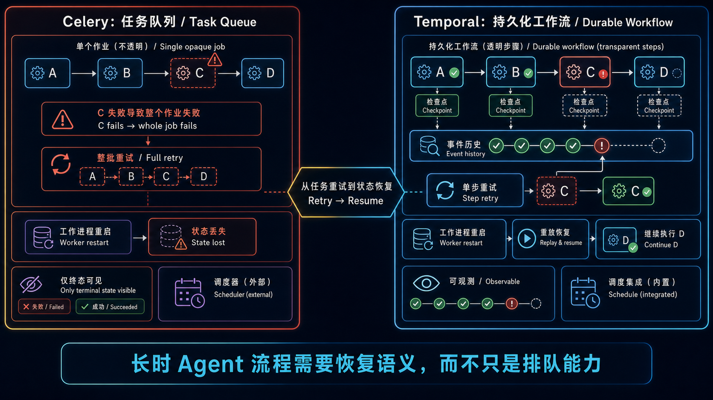

The most common question afterward: **why not just keep using Celery? If it's already running, what's the point?**

This article is the answer. It doesn't come from documentation comparisons. It comes from production bugs we hit running Agent pipelines at scale.

The diagram first separates the **problem layers**. Celery hands work to workers; Temporal also records event history so a multi-stage workflow can recover from the failure point. The migration was not about replacing a queue with a faster queue. It was about gaining a replayable state machine.



---

## When Celery Works — and When It Doesn't

Let's be clear: **Celery is a good tool**. For standard async workloads — sending an email, resizing an image, pushing a notification — it handles the job perfectly, and has for over a decade.

Our workload, however, looks like this:

```
One Run contains N longtail articles
Each longtail goes through 4 Agent stages: A → B → C → D
Each stage calls one or more AI APIs
Per-article latency: 60–180 seconds
Every intermediate result must be persisted
Any failure must answer: "where did it stop, why, and can I retry only this one step?"
```

This is a **stateful, long-running, multi-stage business process**. The line between a task queue and a workflow engine runs right through here.

---

## Crack #1: Task State Is Binary — Success or Failure

Celery's task model: enqueue → worker picks up → execute → success or failure. The entire middle is a black box.

When Agent D times out while generating SEO metadata, Celery tells you: "task failed, state=FAILURE." What you actually need to know:

- Did Agent A (keyword analysis) complete? What was its output?
- Did Agent B (outline generation) finish?
- Did Agent C (article generation) persist its HTML to the database?
- Which model was Agent D calling when it timed out? Should retry start from D, or from C?

Celery's answer to all of these: "track it yourself." You can write state to Redis or a database, but you're essentially **hand-rolling a state machine on top of a task queue** — which is exactly what a Temporal workflow provides natively.

In Temporal, your workflow code *is* the business logic. Every step's position, return value, and exception is automatically persisted. If the worker restarts, the workflow resumes from the last completed step with zero checkpoint code.

```python
# Celery: you manage state yourself
@app.task(bind=True, max_retries=3)
def run_pipeline(self, longtail_id):
    try:
        result_a = agent_a(longtail_id)        # succeeds
        save_checkpoint("step_a_done", result_a)
        result_b = agent_b(result_a)           # fails here
        # On retry — where do you resume? You figure it out.
    except Exception:
        self.retry()

# Temporal: the workflow *is* the state machine
@workflow.defn
class PipelineWorkflow:
    @workflow.run
    async def run(self, longtail_id: str) -> dict:
        result_a = await workflow.execute_activity(agent_a, longtail_id)
        result_b = await workflow.execute_activity(agent_b, result_a)
        result_c = await workflow.execute_activity(agent_c, result_b)
        result_d = await workflow.execute_activity(agent_d, result_c)
        return result_d
```

No checkpoint management. If `agent_c` times out, retry picks up from `agent_c` — the return values of `agent_a` and `agent_b` are already persisted in the workflow history.

---

## Crack #2: Batch Rollback — "One Timeout Sinks All Eight"

This was a real production incident.

Our batch pipeline ran N longtails inside a single task loop, each going through A→B→C→D. The database commit sat *outside* the loop:

```python
# Anti-pattern: single transaction for the entire batch
async with unit_of_work(autocommit=False) as uow:
    for longtail in batch:
        await run_pipeline(longtail)
    await uow.commit()  # commit all at once
```

Then it happened: longtail #3's Agent C timed out → the SQLAlchemy session went `invalid` → every subsequent `get`/`save`/`commit` for #4–#8 threw `PendingRollbackError` → all 8 articles vanished.

The fix was shrinking the transaction boundary to a single longtail: each iteration commits independently, and failed iterations *also* commit their failure status. With Temporal, this pattern becomes the natural default — **each longtail is an independent workflow execution with native idempotency and replayability**.

In the Celery model, task failure = entire task rolled back = you control retry granularity by hand. In Temporal, one workflow's failure doesn't touch other workflows. Operations sees "1 failed / 7 succeeded" instead of "8 vanished."

---

## Crack #3: Long-Running Tasks vs. Worker Restarts

Our Agent pipeline runs 60–180 seconds per article. Celery workers restarting (deployments, OOM kills, node recycling) will kill in-flight tasks and re-queue them from scratch.

For sub-5-second tasks, this barely matters. For a task that's been running 120 seconds, has already burned a hundred thousand tokens, and has one step left — **restarting from zero means all that token cost goes up in smoke.**

Temporal's durable execution model works differently: even if the worker dies, workflow state lives in the Temporal Server. A new worker picks up the workflow history and resumes from the last completed activity. This directly impacts AI pipeline cost control.

---

## Crack #4: Debugging Without Visibility

When an Agent pipeline fails in production, here's the Celery debugging path:

1. Find the task ID
2. Open Flower (if you installed it) to check task state
3. grep through application logs for the trace_id
4. Manually reconstruct: "what did A produce → what did B produce → where did C get stuck"
5. If there were retries, the picture gets muddier

Here's the Temporal debugging path:

1. Open the Temporal Web UI
2. Click into the workflow execution
3. **Every step's input, output, duration, and exception is visualized on a single timeline**
4. You see exactly: "Activity `generate_article` in Agent C timed out at 47 seconds, retried twice — expand to view the prompt and returned HTML for each attempt"

This isn't "Temporal has a nice UI." It's an **order-of-magnitude difference in debugging efficiency**. For multi-Agent pipelines — long call chains, abundant state, critical intermediate artifacts — visual workflow history is a requirement, not a luxury.

---

## Crack #5: Reliable Scheduling

Celery Beat is a standalone process started with `celery beat`. Known failure modes:

- Beat goes down → scheduled tasks stop, no failover
- Beat restarts → may double-trigger tasks at the same timestamp
- Scheduling window missed → no automatic backfill, manual intervention required
- Schedule changes → restart required

Our Agent project has a real business requirement: generate a batch of articles per site every day. If the scheduler goes down or misses a window, we need to **automatically detect missing dates and backfill**.

Celery's solution is "write a script to compare date gaps, manually dispatch." Temporal Schedule provides this natively:

- **Overlap Policy**: what happens when the next trigger fires before the previous workflow finishes
- **Catch-up Window**: auto-trigger missed executions within a configurable lookback
- **Pause/Resume**: pause a schedule without editing cron expressions

For content production — where missing a day means you have to catch up — Schedule's backfill semantics are a hard requirement.

---

## Decision Matrix

| Dimension | Celery | Temporal | Winner for Agent Pipelines |
|-----------|--------|----------|---------------------------|
| **Task model** | Stateless task | Stateful workflow | Temporal (Agent pipelines are inherently stateful) |
| **State persistence** | DIY (Redis/DB) | Automatic workflow history | Temporal (zero extra code) |
| **Retry semantics** | Task-level, restart from scratch | Activity-level, resume from breakpoint | Temporal (long AI calls have real token cost) |
| **Failure visibility** | Log grep + Flower | Web UI timeline + per-step I/O | Temporal (order-of-magnitude debugging efficiency) |
| **Scheduling** | Beat process, no failover | Schedule, built-in catch-up | Temporal (content backfill is a hard requirement) |
| **Batch failure radius** | Depends on your commit strategy | Each workflow naturally isolated | Temporal (independent idempotent units) |
| **Worker restart impact** | In-flight tasks lost, restart from zero | Workflow resumes from breakpoint | Temporal (120s AI calls aren't wasted) |
| **Operational complexity** | Worker + Beat + Flower + Broker (Redis/RabbitMQ) | Worker + Server (Web UI included) | Comparable (Temporal Server adds deployment cost but removes Flower + Beat overhead) |
| **Learning curve** | Low (Python-native ecosystem) | Medium (determinism constraints require understanding) | Celery wins for onboarding speed |
| **Best for** | Short, stateless, low-cost-of-failure tasks | Long-running, stateful, auditable, intermediate-artifact-heavy processes | Depends on workload |

---

## When You *Don't* Need Temporal

Celery remains the better choice if:

- Task latency is under 10 seconds; restarting from scratch is negligible
- You don't need visibility into intermediate step I/O (e.g., sending email)
- You don't need step-level retry (whole task succeeds or fails)
- Your team has no bandwidth for learning Temporal's determinism constraints
- Your existing Celery system runs reliably; migration cost > migration benefit

Our decision wasn't "Temporal is better than Celery." It was: **"the characteristics of Agent pipelines happen to land squarely on Celery's weak spots and Temporal's core strengths."**

---

## Architecture Patterns Post-Migration

The migration crystallized several architectural decisions:

**1. One longtail = one workflow = one transaction boundary**

Batch processing becomes: "dispatch N workflows externally, each workflow manages its own transaction internally." This is the natural marriage of per-iteration transaction boundaries (from `concepts/backend`) and Temporal's execution model.

**2. Dual UoW semantics**

FastAPI routes use `autocommit=True` (short request-scoped transactions). Temporal workers use `autocommit=False` (workflow-scoped, explicit commit/rollback control). Same UoW abstraction, different lifecycle semantics.

**3. Blue-green deployment**

Containers went from a single `worker` instance to `temporal_worker_blue` + `temporal_worker_green`. Deploy by routing new workflows to the fresh color; drain the old color once in-flight workflows complete. Temporal Task Queue routing makes this zero-downtime.

**4. Replay is free**

Every workflow execution's history lives in the Temporal Server. When something breaks, you can replay the entire workflow locally — same inputs, same code path, database calls mocked out — to pinpoint exactly which activity, which invocation, which return value caused the error. In the Celery era, this was hours of manual labor.

---

## Summary

Framing Temporal as "a more powerful Celery" misunderstands both. They solve problems at **different layers**:

- Celery answers: *"run this code on another machine"*
- Temporal answers: *"guarantee this multi-step business process reaches completion, and make every step auditable"*

Agent pipelines happen to be multi-step, long-running, intermediate-artifact-rich business processes with high failure costs. Using a task queue to emulate a workflow engine isn't using the wrong tool — it's using the right tool's predecessor, then hand-building the features the successor already ships.

---

*Based on production experience from [seo-project](https://github.com/zhuoqidev/ai-seo-pipeline). Migration records in LLM Wiki → `log.md` (2026-04-10) and `concepts/backend.md`.*
